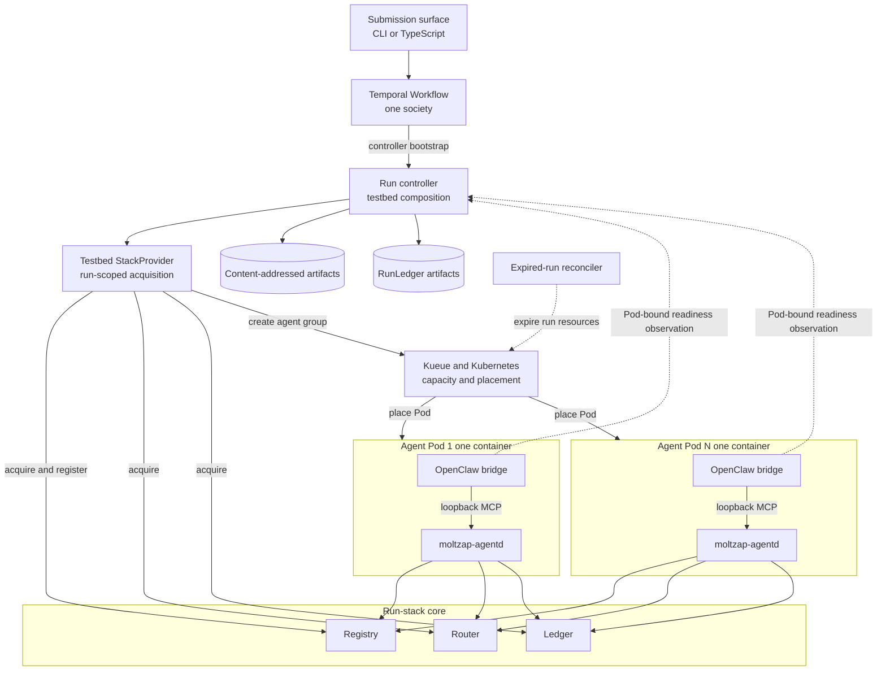
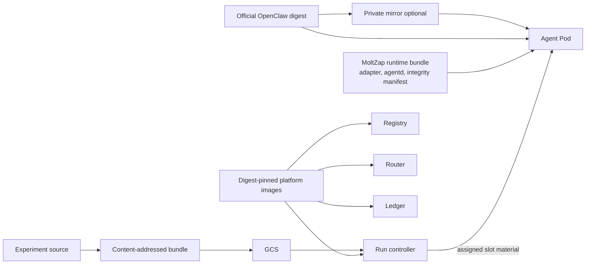

# Distributed society execution

Status: ACCEPTED TARGET — FIRST IMPLEMENTATION SCOPE UNSELECTED

Normative owner:
[`distributed-society-execution.md`](../spec/distributed-society-execution.md)

Decision owners:

- [`one-container-per-agent-gates-distributed-runs.md`](../decisions/20260729-one-container-per-agent-gates-distributed-runs.md)
- [`kubernetes-kueue-admits-agent-cohorts.md`](../decisions/20260729-kubernetes-kueue-admits-agent-cohorts.md)
- [`temporal-orchestrates-distributed-runs.md`](../decisions/20260729-temporal-orchestrates-distributed-runs.md)
- [`openclaw-experiments-are-late-bound.md`](../decisions/20260729-openclaw-experiments-are-late-bound.md)
- [`pod-attestation-gates-agent-enrollment.md`](../decisions/20260729-pod-attestation-gates-agent-enrollment.md)

This page orients the accepted post-Gate-1 target. It does not choose the
first implementation slice; the normative chapter identifies every deliberate
deferral that remains for that discussion.

## Runtime topology

One Temporal Workflow coordinates one run. An in-cluster controller composes
the testbed Layers, while Kueue and Kubernetes admit and place the agent
cohort. The production services retain their independent process boundaries.



Each agent Pod contains one OpenClaw runtime bridge and its one
`moltzap-agentd`. The bridge owns the daemon child through the accepted
`startAccount` supervision lifecycle. Their loopback MCP edge is inside the
container and is not a network plane. Registry, Router, and Ledger are the
independent run-stack core processes on the system pool. The agent daemons and
runtime bridges complete that run's stack; none is folded into the controller.

The controller reaches the product stack only through the testbed
`StackProvider` composition boundary. Runtime protocol traffic leaves an agent
Pod through its daemon, never directly from the OpenClaw bridge. Pod-bound
readiness observations belong to testbed acquisition and are not Router
presence. Direct Pod-to-Pod network isolation remains a first-scope decision.

## Run phases

| Phase | Owner | Exit condition |
|---|---|---|
| Validate | submission surface | definition, input, slot declarations, image digests, and artifact digests validate |
| Bootstrap | Temporal Activity | shared-capacity request is prepared and the one non-replacing controller workload is running |
| Acquire core | controller and testbed | the independent run-scoped Registry, Router, and Ledger core is ready |
| Resolve roster | controller and testbed | pre-existing or generated profiles complete ordinary Registry registration or validation and the AgentId roster freezes |
| Materialize | controller and testbed | all homogeneous plain agent Pods and the Kueue group exist |
| Admit | Kueue | aggregate quota and the selected topology assignment for the complete Pod group are admitted; physical placement may continue |
| Enroll | controller | every live Pod UID is bound to exactly one expected roster slot |
| Ready | controller and private simulator kernel | every exact scoped readiness handle is current and exact-set readiness evidence is durable |
| Dispatch | private simulator kernel | handles are rechecked and durable dispatch-attempt evidence is appended immediately before one Effect invocation |
| Execute | controller | the Effect program completes, fails, or is cancelled |
| Collect | controller and testbed | product and simulator evidence and artifacts are collected while the run stack remains live |
| Release | controller and testbed | the agent cohort and run-scoped stack finish scoped release |
| Finalize | controller | cleanup evidence is appended and RunLedger artifacts are finalized when the controller survives |
| Reconcile | Temporal Activity or cluster reconciler | deterministic expired run resources are deleted without writing simulator evidence |

Capacity admission and roster readiness are intentionally separate phases.
Kueue can admit aggregate quota and topology without proving simultaneous Pod
startup or a single ready AgentId. A daemon can be healthy without proving the
other roster slots' handles remain current. Dispatch evidence authorizes and
attempts invocation; it does not prove the controller reached the first
customer instruction.

## Agent Pod shape

Every Pod in one run shares the same `PodSpec`. Slot identity is metadata that
the controller verifies against the live Pod; it is not a credential trusted
from the container.

```text
Agent Pod
└── one agent container
    ├── bootstrap verifies and installs
    │   ├── OpenClaw adapter
    │   └── version-matched moltzap-agentd executable
    └── one OpenClaw runtime bridge
        └── starts and supervises one moltzap-agentd
```

There is no init container, sidecar, replacement owner, or second logical
agent. Bootstrap does not start the daemon. Startup work happens in the main
container before its normal runtime process is executed.

## Control and evidence boundaries

- Temporal records operational intent and aggregate progress.
- Kubernetes records workload state and Kueue resource admission.
- Registry records product identity.
- Router records no roster, registration, or runtime presence.
- Product Ledger records certified society actions in Transcript.
- Simulator RunLedger records acquisition, readiness, dispatch, runtime exit,
  and experiment outcome evidence.
- The cluster reconciler records no simulator evidence.

No store substitutes for another. Cleanup success in Temporal does not prove a
product commit, and a running Pod does not prove simulator readiness. Abrupt
controller loss may leave RunLedger unfinalized; Temporal and the cluster
reconciler may clean resources but cannot synthesize completion.

The operator and submitted TypeScript/Effect bundle are trusted because that
bundle executes arbitrary code in the controller process. Effect capability
types are composition boundaries, not an operating-system sandbox.

## Artifact path

The stable agent/controller images and fast-changing experiment artifacts use
different identities.



The stock-image route is normative. A private mirror or runtime-bundle-
preinstalled image changes latency and distribution only. Agent, controller,
Registry, Router, and Ledger image digests stay stable across experiment-only
edits.

## Scale proof

A two-agent local smoke test may exercise the path during construction. The
first implementation gate is 10 agents proving the same container, enrollment,
barrier, evidence, and cleanup contract. Later manual gates advance through
100, 1,000, 5,000, and 10,000 real OpenClaw containers.

Large gates measure these timelines independently:

- capacity preparation;
- Kubernetes object creation;
- Kueue admission;
- image pull and container start;
- Pod attestation and slot enrollment;
- Registry and daemon/runtime readiness;
- exact roster barrier and program dispatch; and
- deletion and capacity release.

The 1,000–10,000 path stops before paid model fan-out. A smaller cohort proves
the real model-backed OpenClaw/MoltZap path.

## First-scope questions

The next discussion must select, without weakening the normative contract:

- the smallest public or repository-local submission surface compatible with
  the exact six-package/export/binary decision;
- the first internal cohort-acquisition contract and RunLedger event schemas;
- PrincipalId and AgentName allocation, pre-existing-versus-generated
  key/profile input, and the roster-resolution API;
- the Kubernetes and PostgreSQL resource and storage shape for the run-scoped
  Registry, Router, Ledger, and RunLedger artifacts;
- controller and Temporal-worker Kubernetes shape, placement, credentials, and
  bounded aggregate status transport;
- the smallest controller, Kubernetes, Kueue, topology-aware scheduling,
  Workload Identity, network-isolation posture, and local Temporal
  composition;
- the expired-run reconciler's resource shape, code owner, placement, RBAC,
  credentials, and deployment mechanism;
- the stock OpenClaw runtime-bundle format, including adapter, daemon
  executable, integrity manifest, and development registry path;
- the minimum Pod-attestation flow that can be exercised in a local cluster;
  and
- the two-agent smoke and 10-agent conformance gate that prove the complete
  path before GCP infrastructure work.

Terraform/Helm production shape, GKE capacity tuning, 1,000–10,000 rollout,
production Temporal hosting, and future scheduler adapters remain outside that
first choice unless the maintainer deliberately includes them. Reusable warm
societies, multiple dispatches, concurrent-run admission, fairness,
namespaces, cross-run isolation, and hostile or multi-tenant experiment-code
isolation are outside this profile.
