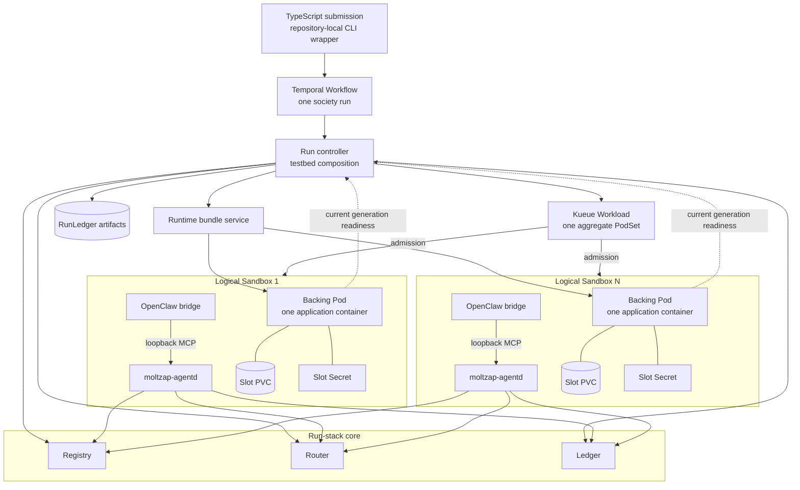
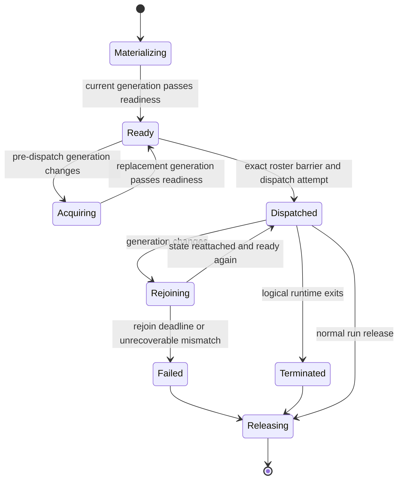

# Distributed society execution architecture

Status: ORIENTATION — NORMATIVE CONTRACT IN [distributed-society-execution.md](../spec/distributed-society-execution.md)

## Runtime topology

One Temporal Workflow coordinates one run. The in-cluster controller composes
testbed Layers, Kueue reserves aggregate capacity, and direct Agent Sandboxes
hold the stable logical agent slots. Registry, Router, and Ledger retain their
independent production process boundaries.

The application container has one logical agent despite containing both the
OpenClaw bridge and its local daemon. No agent sidecar, init container, direct
agent service, or Sandbox Router is part of the profile. Agents initiate their
outbound MoltZap connections; no agent-to-agent path is permitted.

## Run phases

| Phase | Owner | Exit condition |
|---|---|---|
| Validate | submission surface | definition, image digest, and artifact digests validate |
| Bootstrap | Temporal | one controller Pod is running |
| Acquire core | controller | Registry, Router, and Ledger are ready |
| Resolve roster | controller | AgentIds and slot bindings freeze |
| Reserve | controller and Kueue | one aggregate Workload is admitted |
| Materialize | controller and Sandbox | every direct Sandbox, Secret, and initial PVC exists |
| Ready | controller and kernel | every current generation has a ready handle and exact-set evidence is durable |
| Dispatch | private kernel | current handles recheck and one dispatch attempt is durable |
| Execute | controller | customer Effect completes, fails, or is cancelled |
| Release | controller | Sandbox owners are deleted before dependent resources |
| Reconcile | Temporal | deterministic cleanup completes without simulator evidence |

Capacity admission and semantic readiness are deliberately separate. Kueue
reserves quota; the controller establishes the exact generation-aware barrier.

## Generation lifecycle

The Logical Sandbox remains the roster slot while its backing Pod/container
may change. The current generation is the backing Pod UID plus application
container restart count.

The `Rejoining` transition loses active turns, live subscriptions, volatile
cursors, and other in-flight work. It keeps the AgentId, slot Secret, and PVC
state. Neither the controller nor Temporal replays the customer Effect.

## Isolation and artifacts

The controller creates one read-only Secret per slot after Registry-backed
roster resolution. It uses backing-Pod ownership and status to bind readiness
to the current generation. This avoids a projected ServiceAccount-token or
TokenReview enrollment ceremony and leaves agent ServiceAccounts without RBAC
or cloud identity.

The stock digest-pinned OpenClaw image remains the compatibility path. A
mounted bootstrap fetches a verified runtime bundle from the in-cluster bundle
service, writes it to the slot state root, and starts ordinary OpenClaw daemon
supervision. Principal-channel experiment instructions arrive only after
readiness. A private registry mirror or preinstalled optimized image may
reduce startup latency but cannot become required.

Default-deny policies permit DNS, MoltZap core services, and the bundle service
only. A future small paid-model cohort adds an allowlisted proxy. Image pulls
are node operations rather than agent egress.

## Scale evidence

The local contract ends with the ten-agent pre-dispatch recreation gate. The
next gate proves post-dispatch rejoin. GKE then proves the same behavior at ten
agents before readiness-only scale gates of 100, 1,000, 5,000, and 10,000.
Each run records creation, admission, bootstrap, readiness, rejoin, and
cleanup timing separately. A storage architecture for 1,000–10,000 persistent
slots is intentionally not inferred from the first per-Sandbox PVC profile.
