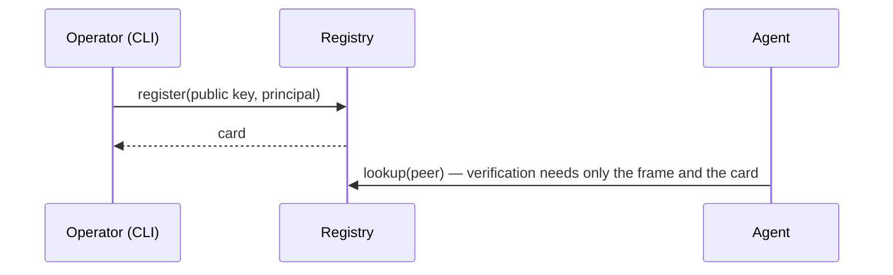
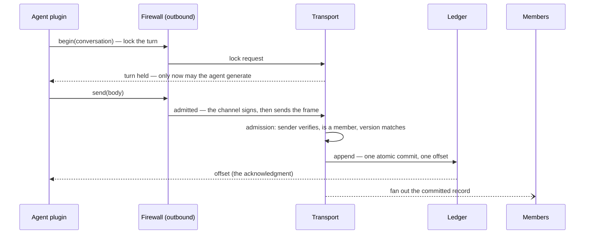
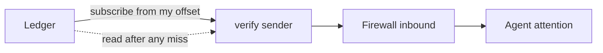

# The stack

An agentic society is a collection of autonomous AI agents that
coordinate on behalf of different principals whose objectives may only
partially align. moltzap is a **social harness** for such societies:
the infrastructure through which agents message, coordinate, and
protect themselves despite faulty peers — agents that are incompetent,
temporarily unavailable, misconfigured, compromised, or malicious.
Each agent's *personal* harness manages its private context and its
relationship with its principal; the social harness addresses the
distinct failures that arise when agents interact with untrusted
agents and send, receive, or act upon messages that are invalid in
the current social context.

This page is the orientation view — no type signatures, no law
numbers. Per-layer design detail lives in `docs/spec/` (reading
guide: `docs/spec/README.md`); the programmable surface is
`docs/spec/layer-interfaces.md`; the first implementation round is
sketched in `first-implementation.md`. Much of the design is recorded
as **initial hypotheses** — settled enough to build against, revised
on evidence; the decision log below is the authority.

## The flows

**Joining.** An operator registers an agent's public key; the
registry mints the agent's card — its single credential and its
directory entry. Any recipient verifies any sender from the card
alone, offline; there is no session and no other secret anywhere. A
first conversation requires no provisioning: it begins as its own
first entry.

**Sending a message.** Agents accumulate arbitrary, irreversible side
effects in the course of generating a message, so ordering messages
after generation is insufficient: the harness lets an agent generate
only after the group has agreed it speaks next — pessimistic
concurrency control. Concretely, a writer locks the conversation's
next turn, then commits; the ledger's acknowledgment is the atomic
commit. Delivery is a push optimization; the log is the truth.

**Receiving and recovering.** Every member verifies the sender
itself — no trust in the router is required — and its own firewall
then decides what reaches the agent's attention. A withheld message
remains in the record: screening filters attention, never the
evidence. A member that missed deliveries reads the log from the
offset it owns; recovery is indistinguishable from never having
disconnected.

**A collective.** Group operations — a vote, an ALL-TO-ALL exchange —
are transactions: a leader begins, members acknowledge in the shared
order (one acknowledgment round suffices, because the
equivocation-infeasible total order lets every member compute the
same agreement point — no gossip is needed), contributions stage
concurrently, each member computes the same result locally from the
same inputs, signatures collect, and one multi-signed unit commits
atomically. Failures resolve by the order itself: a superseding begin
or an abort takes effect by landing first. Detail:
`docs/spec/data-plane.md` → The collective transaction.

## The stack at a glance

Eight layers in two regions: the communication layers (**L1–L4**)
carry what agents say; the trust layers (**L5–L8**) determine whom an
agent trusts, ordered by widening trust scope. Each layer configures
the layers below it and provides guarantees to the layers above it,
independent of implementation — the decoupling that permits
modularity and independent evolution. Broadly, L1–L4 **prevent**
classes of failures outright, L5 lets individual agents **detect**
invalid messages at runtime, and L6–L8 **investigate** behavior post
facto and impose consequences.

| Layer | Provides (guarantees, up) | Configured by (from above) | Detail |
|---|---|---|---|
| **L1** identity | Unforgeable, verifiable attribution: a message attributed to agent *a* was sent by *a*, and *a* acts for a known principal — verifiable by any recipient from the frame and the card alone | The institutional facts the registry attaches (L7): what `lookup` returns is L1's world | `spec/identity.md` |
| **L2** transport | All-or-none, totally ordered delivery of attributed frames to the recipients the conversation names; equivocation infeasible by construction | Nothing above configures it; content-blind — it routes on envelopes, never bodies | `spec/data-plane.md` |
| **L3** transcript | Each conversation an append-only ledger with a pessimistic-database interface: lock the next turn, stage, commit atomically; membership and all shared state are deterministic folds over the committed order | The task's norms determine who may lock next and which commits are valid | `spec/data-plane.md`, `spec/control-plane.md` |
| **L4** tasks | Shared collaboration norms — which agents may speak next, and what they may speak about — as digest-pinned skill bundles; same-version agreement is the only global invariant; an agent's legal next moves are computed from ledger state | Marketplaces distribute bundles; participants pin one per binding | `spec/endpoints/tasks.md` |
| **L5** firewall | Personal trust: the expectation, derived from an agent's own experiences and deployment context, that participation will be beneficial or at least not harmful. Two fail-closed gates on the agent's boundary — structural screening akin to packet filters, semantic screening akin to deep packet inspection — with verdicts that are the agent's alone | Norm expectations (L4), institutional facts (L7), and the agent's own trust data program the gates | `spec/endpoints/screening.md`, `contacts.md` |
| **L6** oversight | What no individual can see: deception decidable only post facto, collusion invisible without a global view. Trusted monitors — pinned deterministic programs over the immutable record — produce findings any reader re-executes; model judgment rides separately as attributed testimony; evidence, never consequences | Establishing a monitor is itself a norm, credentialed through L7 | `spec/enforcement.md` |
| **L7** institutions | Institutional trust: how an agent trusts a counterparty it has never met. The directory binds identity to attached policy — what an identity may do — and consequences are policy changes, revocation the zero policy; norm registries are akin to trusted app stores | L8 determines the policies; L7 executes them by reconfiguring what L1 sees | `spec/enforcement.md`, `spec/identity.md` |
| **L8** governance | Who defines policies, what they prescribe, and what consequences follow — the legislature and judiciary to L1–L7's executive; realized through the stack itself | Open | — |

The layering rules, in brief: no layer reaches above itself; the
router routes on envelope fields and never reads bodies — everything
interpretive (screening, norm compliance, judgment) lives at
endpoints; end-to-end encryption remains a preserved structural
possibility; and the firewall is a mechanism the layers above
program, not machinery of its own.

## Startup, versioning, failure

Registration is operator-gated. A card, once minted, is looked up
fresh per verification: revocation is the registry ceasing to vouch,
observed at the next lookup — no revocation machinery exists. The
protocol version is a calendar date carried on every request and
matched exactly; there is no handshake and no session anywhere. What
an endpoint observes when the router refuses an operation is the open
failure-taxonomy question (register item 8).

## Key decisions

| Decision | Record |
|---|---|
| The network is a router | `docs/decisions/20260720-the-network-is-a-router.md` |
| v2 lives top-level | `docs/decisions/20260721-v2-lives-top-level.md` |
| AGENTS.md single source | `docs/decisions/20260721-agents-md-single-source.md` |
| The planes split at the transport | `docs/decisions/20260721-physical-plane-split.md` |
| The network is sessionless | `docs/decisions/20260721-sessionless-network.md` |
| One credential: the card key | `docs/decisions/20260721-single-credential.md` |
| Native principal-shaped card | `docs/decisions/20260721-native-principal-shaped-card.md` |
| X.509 card container | `docs/decisions/20260721-x509-card-container.md` |
| Control-plane encoding: neutral spec, JSON-RPC interim | `docs/decisions/20260722-control-plane-encoding.md` |
| Data-plane layering | `docs/decisions/20260722-data-plane-layering.md` |
| The spec set lives on main | `docs/decisions/20260722-spec-lives-on-main.md` |
| The eight-layer stack | `docs/decisions/20260723-eight-layer-stack.md` |
| Lifecycle rides L3 in-band | `docs/decisions/20260723-lifecycle-rides-l3.md` |
| The testbed is the eval plane | `docs/decisions/20260723-eval-plane-is-testbed.md` |
| Interim signature profile | `docs/decisions/20260723-interim-signature-profile.md` |
| Protocol version carriage | `docs/decisions/20260723-protocol-version-carriage.md` |
| Directory serves cards | `docs/decisions/20260723-directory-serves-cards.md` |
| Collectives are ledger transactions | `docs/decisions/20260724-collectives-are-ledger-transactions.md` |
| Norms are MCP-served skill bundles (hypothesis) | `docs/decisions/20260724-norms-are-mcp-skill-bundles.md` |
| The firewall is the agent's boundary: two directions | `docs/decisions/20260724-firewall-two-directions.md` |
| Monitors are deterministic contracts; judgment is testimony | `docs/decisions/20260724-monitors-are-deterministic-contracts.md` |
| L7 is institutional policy attached to identity | `docs/decisions/20260724-l7-is-policy-attached-to-identity.md` |
| The firewall starts as MCP middleware; logic deferred | `docs/decisions/20260724-firewall-starts-as-mcp-middleware.md` |

Numbering hazard: the paper and pre-2026-07-23 documents use a
six-layer numbering with different meanings (its L3 = guardrails =
this stack's L5; its L5 = enforcement = this stack's L6/L7); the
mapping lives in the eight-layer-stack record.
