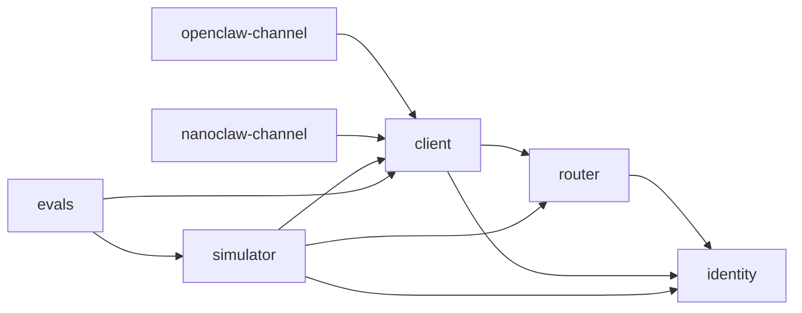

# Seven-package cutover handoff

Status: **PACKAGE INVENTORY — NON-NORMATIVE**

This handoff maps the current repository into the approved seven-package
cutover. Current ADRs and specifications authorize code movement. Release
policy remains a separate decision; this handoff does not create authority.

## Target product graph

The smallest dependency graph consistent with current ownership is:

In package terms:

| Package | Production dependencies |
|---|---|
| `@moltzap/identity` | none |
| `@moltzap/router` | `@moltzap/identity` |
| `@moltzap/client` | `@moltzap/identity`, `@moltzap/router` |
| `@moltzap/openclaw-channel` | `@moltzap/client` |
| `@moltzap/nanoclaw-channel` | `@moltzap/client` |
| `@moltzap/simulator` | `@moltzap/identity`, `@moltzap/router`, `@moltzap/client` |
| `@moltzap/evals` | `@moltzap/client`, `@moltzap/simulator` |

Production packages do not depend on simulator or evals. Runtime adapters do
not import Identity, Router, client internals, or each other. The client root
owns the identity-shaped application values adapters need.

Image and deployment assembly are a separate artifact graph. Root workspace
tooling may pack several products without adding runtime package dependencies.
In particular, controller-image assembly must not create a hidden
`simulator -> evals` edge, and copying NanoClaw source files must not create a
hidden `simulator -> nanoclaw-channel` edge.

The current replacement authority freezes this edge table. This handoff
orients the move; the normative package graph lives in
[`../spec/layer-interfaces.md`](../spec/layer-interfaces.md).

## Migration matrix

| Final owner | Current source | Cutover action | Public boundary |
|---|---|---|---|
| `packages/identity` | Implemented `v2/identity` | Move the complete package, including migrations, tests, configs, and Registry binary. Rename package imports and service-tag strings. | Preserve the admitted Identity root and Registry server/process capabilities. Final export subpaths and publication status must be frozen. |
| `packages/router` | Implemented `v2/router` | Move the complete package and rename `@moltzap/v2-*` imports and tags. | Preserve Router value types, closed client errors, server composition, and `moltzap-router`. |
| `packages/client` | Transitional production client plus empty `v2/harness` scaffold | Replace wholesale behind the reduced public shell. Implement endpoint history, proofs, catch-up, re-anchor, trust/tasks, daemon, and MCP here. | Exactly `.` and `./server`, plus `moltzapd`. Root exposes `ConversationId` creation, endpoint acquisition, `HarnessClient`, content and verified identity values, and closed typed errors. No compatibility subpaths, proof results, or management methods. |
| `packages/openclaw-channel` | Existing production adapter | Retain host integration; rewrite against injected or MCP-backed `HarnessClient`. Remove profile, protocol, and client-internal dependencies. | Retain the OpenClaw host loader/plugin entry point where compatible. No profile compatibility promise. |
| `packages/nanoclaw-channel` | Existing production adapter | Retain host integration; rewrite against `HarnessClient`. Remove `fromProfile`, profile environment, protocol, channel-base, and authentication imports. | Retain the NanoClaw host adapter entry point where compatible. |
| `packages/simulator` | Latest production simulator | Keep the package and rewire production-stack acquisition, types, and internals. Its direct Router dependency owns local/GKE Router process composition after testbed deletion; root tooling owns only image/artifact assembly. | Preserve `.`, `./network`, `./ledger`, `./agents`, `Run.execute(RunSpec)`, clusters, Temporal, fault layers, and lifecycle-only simulation `RunLedger`, except for the five admitted removals below. |
| `packages/evals` | Existing private eval application | Keep evaluation/report behavior; replace protocol/raw-client use with client and simulator values. | Preserve Nx targets, CLI modes, artifacts/reports, and container-consumed deep entry points until their final ownership is made explicit. |

Delete without aliases or shims:

- `packages/protocol`;
- `packages/server`;
- `v2/transcript`;
- `v2/harness`;
- `v2/simulator`;
- `v2/testbed`; and
- the old `v2/identity` and `v2/router` roots after their moves.

The `v2` authority documents and historical inputs are not implementation
scaffolds and are not deleted by that rule.

Protocol code is split by ownership rather than moved as one new package:

- identity and authentication values move to Identity;
- Router envelope and cursor values move to Router;
- conversations, records, proofs, tasks, trust, and daemon values move to
  Client; and
- raw v1 RPC, socket, CLI, server-store, and compatibility surfaces disappear
  unless a final owner proves a current need.

## Current graph being retired

The current executable graph contains these relevant edges:

- `packages/server -> packages/protocol`;
- `packages/client -> packages/protocol`, with server in tests;
- each adapter -> client and protocol;
- simulator -> client, OpenClaw, protocol, and server;
- evals -> protocol and simulator;
- v2 Router -> v2 Identity; and
- the other v2 package roots follow the six-package configuration graph but
  are implementation stubs.

There are also undeclared artifact edges: simulator build scripts read
NanoClaw source and pack evals. They move to declared root orchestration rather
than surviving as package dependencies.

The root TypeScript references currently omit evals. The final reference graph
must include all seven products and equal the manifest and architecture-check
graphs.

## Simulator cutover decision

At the pinned latest-`main` merge, the package exported exactly four facades
with 196 named declarations counting intentional cross-facade duplicates: 70
at the root, 41 from `./network`, 40 from `./ledger`, and 45 from `./agents`.
The admitted removals yield a final census of 181 declarations: 61 at the
root, 35 from `./network`, 40 from `./ledger`, and 45 from `./agents`.

Compatible Simulator structure remains:

- `RouterProvider` and `Router` remain simulator-owned run-fixture
  abstractions even if acquisition now composes Registry, Router, and endpoint
  daemons.
- The complete `./ledger` facade remains simulation evidence and is unrelated
  to the retired product Ledger.
- `CredentialName` remains a container secret reference, not an institutional
  credential layer, and simulator event tags ending in `/v1` remain persisted
  event-schema versions rather than product-v1 compatibility.

The reduced Client exposes `conversationId`, verified author and peers,
content, and a bound reply on each current-conversation turn. START and bound
reply return `void`; neither exposes `MessageId`, `TxnId`, `ActionHash`,
`RecordHash`, a certificate, or a proof. Simulator and evals do not widen that
surface or import endpoint/Router internals to reconstruct hidden correlation.

The five incompatible families are removed, not adapted behind unchanged
syntax:

1. Delete `Endpoint.open`, `EndpointTransport.openConversation`, and
   `OpenedConversation`. Creation mints a `ConversationId` and calls
   `HarnessClient.start` with nonempty initial content.
2. Delete `ConversationSocket.send`, `EndpointTransport.send`, and generic
   endpoint-bound socket output. Established output exists only through the
   bound reply on the originating turn.
3. Replace `Message`, `ReceivedMessage`, `EndpointTransport.received`,
   `ConversationSocket.receive`, `Endpoint.messages`, and proof-shaped
   operation results with public semantic `HarnessTurn` input and resultless
   completion facts. Simulator evidence records only lifecycle and public
   semantic effects.
4. Remove `AgentConnection.key`, `AgentConnection.routerUrl`,
   `Router.attachAgent`, `Router.attachEndpoint`, and raw
   `AgentRuntimeInput.connection`. Application runtimes receive only an
   injected `HarnessClient` or loopback `MOLTZAP_MCP_URL`.
5. Delete `CommittedRouterMessage`, `RouterMessageCommitted`,
   `RouterSequence`, and `RouterStopped.committedMessages`. They are not
   renamed or reinterpreted; the final Router has no durable commit/order
   event.

Retained directed link faults interpose privately after Router polling and
before recipient Client consumption. With no active fault, the interposition
preserves exact message bytes and recipient Router order. An explicit scope
may drop, delay, hold, or reorder a selected sender-to-recipient
delivery. The run controller owns policy evaluation; application containers
receive no fault controls or credentials, and Router and Client expose no
production hook. The perturbed recipient observation is endpoint
fault-tolerance evidence, never Router-conformance evidence.

One run owns one Registry and one Router. Every agent Sandbox Pod has a
restartable `moltzapd` sidecar, per-agent persistent volume, and private
key/admission mounts. Registration completes before application startup. The
application sees only
`MOLTZAP_MCP_URL=http://127.0.0.1:<port>/mcp`, never network origins, signing
material, or endpoint-store paths.

All sixteen evaluation definitions execute through the daemon-backed Client.
Client and Simulator inject no automatic cross-conversation context, so the
six cases that require it may fail until the host supplies native memory.

Before simulator changes, freeze baseline evidence for all four emitted
facades, not only a few hand-selected exports:

- root;
- `./network`;
- `./ledger`; and
- `./agents`.

Use the existing packed-tarball probe as the driver:

1. Keep the exact four-key manifest export-map assertion.
2. Use the TypeScript compiler API over the extracted `dist/index.d.ts`,
   `network.d.ts`, `ledger.d.ts`, and `agents.d.ts` to compare a checked-in,
   sorted `{ name, typeSpace, valueSpace }` census. The expected delta is the
   five removals above; every other addition, removal, or namespace drift is a
   regression. Because the facades re-export aliases, follow each symbol
   through `checker.getAliasedSymbol` before inspecting its Type and Value
   flags.
3. Compile one downstream `*.types-check.ts` consumer against the packed
   package exports in an isolated temporary consumer whose module resolution
   cannot fall back to workspace source. Pin package-owned fields and method
   retained signatures across all four facades, including `Run.execute`
   inference, network operations, ledger artifacts, and runtime options/gateway
   errors.
   Do not compare whole inherited Effect Schema class types.
4. Dynamically import all four packed facades and compare complete sorted
   runtime keys. Runtime keys cover emitted JavaScript; the compiler census
   covers type-only exports.

Also pin cross-owner assignability for retained `AgentId`, `AgentName`,
`ConversationId`, and `ServerBaseUrl` values that gain final owners. They may
appear inside public signatures even when they are not direct facade exports,
so the symbol census cannot detect drift. `Message`, `MessageParts`,
`MessageId`, and `AgentKey` are not forced through fake-compatible types to
avoid the admitted removals.

Preserve behavior with the existing unit, integration, local, GKE, Temporal,
cluster, fault, packaging, and eval-facing suites for retained contracts. Add
daemon-sidecar, secret-isolation, persistence, loopback-only runtime, and all-
sixteen-eval coverage. Fault coverage separately proves inactive byte/order
transparency, every activated post-Router perturbation, and runtime isolation
from fault controls. Type canaries pin what remains; architecture and export
checks, rather than negative type canaries, prove retired APIs are absent.

## Workspace and architecture changes

The atomic graph change includes:

- `pnpm-workspace.yaml` containing only final `packages/*` projects;
- exactly seven root TypeScript project references, including evals;
- manifest dependencies, TypeScript references, Nx dependencies, and allowed
  imports agreeing with the frozen edge table;
- removal of protocol/server and private transport aliases from
  `vitest.workspace-aliases.ts`;
- package-wide production inputs replacing v2-specific Identity/Router inputs;
- packages-only architecture configuration generation and drift checks;
- an exact, non-vacuous architecture check for directory names, package names,
  export maps, binaries, dependencies, forbidden imports, retired profiles,
  v2 package names, and deleted roots;
- a regenerated lockfile after the graph and ACG upgrade; and
- root-owned image/build orchestration with declared inputs and target
  dependencies.

Repository absence checks apply to executable code, current normative and
orientation docs, configs, generated docs, and package metadata. They must not
rewrite immutable historical ADRs or source-faithful evidence merely to erase
old package names.

## Tooling and documentation ownership

Generic module-doc and Mermaid tooling currently lives under the protocol
package being deleted. Move it to root `scripts/docs` before deleting that
package. Update Typedoc entry points, generated module navigation, constant
generation, doc-import checks, and fixtures to the final owners.

The final user documentation describes explicit Registry, Router, and daemon
startup plus one daemon `/mcp` lifecycle. It contains no bespoke CLI, Unix
socket, profile selection, second MCP process, central Ledger, transcript
service, or testbed.

Each retained package receives an updated `AGENTS.md`, README, export map,
package check, generated module surface where applicable, and ownership rules.
Identity and Router instructions move with their packages; protocol/server
instructions retire.

## Tests, CI, and release

- Move Identity and Router tests, migrations, type canaries, and process probes
  with their implementations and rename only paths/package identities first.
- Replace v1 server/protocol conformance with Registry, Router, endpoint/MCP,
  proof, recovery, adapter, and fault conformance.
- Preserve simulator and eval suites for retained contracts, then add
  four-facade checks for the exact admitted removals and daemon-backed
  replacements.
- Update CI project floors, changed-path triggers, artifact paths, package
  packing, install probes, and conformance scripts to the exact graph.
- Replace the old publish-package list and release-order comments. Publish
  dependencies before consumers.
- Stop using protocol as the version-computation fixture.

Publication remains an explicit authority choice. Identity and Router are
currently private clean-slate packages, the production packages use CalVer,
and evals/NanoClaw are private. Before final manifests and release automation
can be frozen, decide which of the seven products publish and whether they use
one compatibility version or independently versioned releases.

## Safe implementation order

1. Use the accepted four-layer DAG, reduced Client interface, and admitted
   Simulator removals; publication/release policy remains the named gate.
2. Move generic documentation tooling out of protocol and freeze simulator
   and eval compatibility evidence.
3. Move and rename Identity, then pass its complete existing target floor.
4. Move and rename Router, then pass its complete existing target floor.
5. Establish the final Client public shell, then implement local history,
   certificates, catch-up, re-anchor, MCP, and daemon behind it.
6. Rewrite both adapters against Client only.
7. Rewire simulator internals and move image orchestration to root tooling;
   prove every retained facade and behavior contract plus the five admitted
   removals, daemon-backed replacements, and private post-Router fault
   boundary.
8. Rewire evals while preserving reports, CLI modes, and image entry points.
9. Delete v1 packages, profiles, CLI/socket machinery, central Ledger, and all
   obsolete implementation scaffolds.
10. Atomically rewrite Nx, TypeScript, Knip, aliases, architecture, lockfile,
    CI, release, and docs to the exact graph.
11. Upgrade ACG to `0.0.21`, enable all three vertical-readability rules as
    errors, perform altitude/step-down passes, and run all full-workspace and
    package-install gates.
