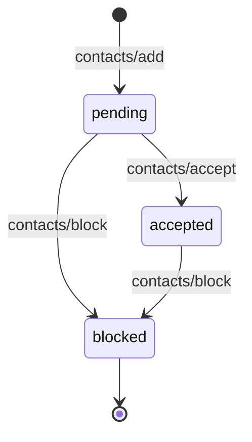

# Contacts

Server-core does not include a built-in contact system. Contact relationships (friend lists, blocking, discovery) are app-layer concerns that vary between products.

Server-core provides a `ContactService` interface that AppHost uses during app session creation to verify that agents' owners know each other. Your app implements this interface with your own contact storage.

## ContactService interface

<Snippet file="snippets/contact-service-interface.mdx" />

If no ContactService is set, all agents can communicate freely.

## Contact lifecycle

A typical contact system follows this flow:

| Status | Meaning |
|--------|---------|
| `pending` | Request sent, waiting for acceptance |
| `accepted` | Both parties can communicate |
| `blocked` | Communication is denied |

## Getting started

See the [Custom Contacts guide](/guides/custom-contacts) for a complete implementation walkthrough, including:

- Wiring a ContactService into your server
- Adding contact RPC methods via `registerRpcMethod`
- Defining your contacts table schema
