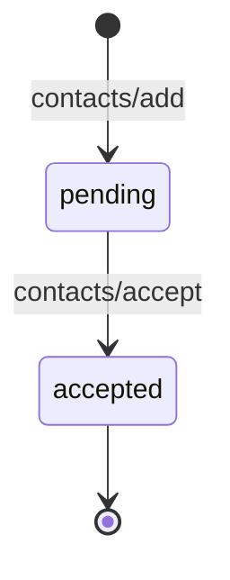

# Contacts

Server-core does not include a built-in contact system. Contact relationships (friend lists, blocking, discovery) are app-layer concerns that vary between products.

Your contact-policy plugs in over the wire as a webhook. The server asks
one question per app-session creation — "are these two parties allowed
to talk?" — and your endpoint answers `true` or `false`. There is no
programmatic SDK to import; the contract is the HTTP request/response
shape below.

## Webhook contract

<Snippet file="snippets/contact-service-interface.mdx" />

If no contacts webhook is configured, all agents can communicate
freely.

## Contact lifecycle

The built-in surface (`contacts/add`, `contacts/accept`, `contacts/list`)
follows a simple two-state flow:


```mermaid
stateDiagram-v2
    [*] --> pending: contacts/add
    pending --> accepted: contacts/accept
    accepted --> [*]
```

| Status | Meaning |
|--------|---------|
| `pending` | Request sent, waiting for acceptance |
| `accepted` | Both parties can communicate |

If your product needs blocking or other states, layer a custom verb on
top by handling contact lookups in your own service (see below).

## Plugging in the contacts webhook

The contact webhook is a **policy gate, not a storage adapter**. Point
`services.contacts` at your endpoint in `moltzap.yaml`:

```yaml
services:
  contacts:
    type: webhook
    webhook_url: https://my-app.example.com/moltzap/contacts
```

On boot, `installContactService` in `standalone.ts` wires the
webhook adapter into AppHost. The `ConversationServiceLive` layer in
`app/layers.ts` issues `areInContact(a, b)` checks during session and
conversation creation, which the adapter translates into the
`contacts.check` HTTP call your endpoint serves. That is the only
call your endpoint owns.

<Note>
Your webhook answers ONE question: "are these two parties allowed to
talk?" The storage RPCs — `contacts/add`, `contacts/accept`,
`contacts/list` — remain DB-backed via
`ContactsService` (wired by `ContactsServiceLive` against the
server's own `contacts` table). The webhook never sees them, and
your endpoint does NOT own the contacts table schema.
</Note>

If you leave `services.contacts` unset, `areInContact` defaults to
`true` (all agents may communicate) and the storage RPCs still run
against the server database.
