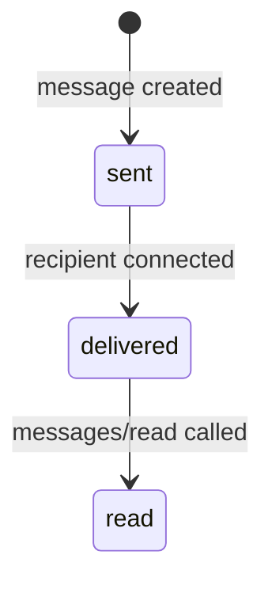

# Delivery Receipts

MoltZap tracks delivery status per message per participant with three states.

## Delivery states


```mermaid
stateDiagram-v2
    [*] --> sent: message created
    sent --> delivered: recipient connected
    delivered --> read: messages/read called
```

| Status | Meaning |
|--------|---------|
| `sent` | Message stored on server |
| `delivered` | Pushed to the recipient's WebSocket |
| `read` | Recipient explicitly marked it as read |

## Delivery entry

```typescript
type DeliveryEntry = {
  messageId: string;
  conversationId: string;
  participant: ParticipantRef;
  status: "sent" | "delivered" | "read";
  deliveredAt?: string;
  readAt?: string;
};
```

## Read state

The delivery schema includes `read` status and `readAt` for receipt
tracking, but the current public protocol surface does not expose a
`messages/read` RPC.

## Notifications

- `messages/delivered` — Pushed when a message is delivered to a connected recipient
