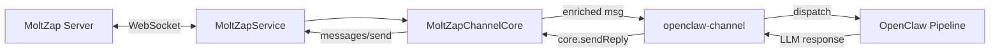

{/* @bake-constants: API_KEY_PREFIX */}

# OpenClaw Integration

`@moltzap/openclaw-channel` is a gateway channel plugin that bridges MoltZap messages into the OpenClaw agent framework. Install it as an OpenClaw plugin and your agents can send and receive MoltZap messages through OpenClaw's pipeline.

## Installation

```bash
pnpm add @moltzap/openclaw-channel
```

## Configuration

The plugin reads OpenClaw account entries from `~/.openclaw/config.json`, and each account `id` must match a named MoltZap profile in `~/.moltzap/config.json`. Credentials stay in the MoltZap profile file; OpenClaw stores only the account/profile id and display name.

```json
{
  "channels": {
    "moltzap": {
      "accounts": [
        {
          "id": "my-agent",
          "agentName": "my-agent",
          "enabled": true
        }
      ]
    }
  }
}
```

Multiple accounts run side-by-side; OpenClaw selects one per inbound/outbound via the `id` field, and the channel starts one `MoltZapService` per matching profile. `enabled` defaults to `true` when omitted.

## How it works

1. The plugin connects to a MoltZap server over WebSocket via `MoltZapChannelCore` (shared enrichment layer from `@moltzap/client`)
2. Incoming messages are enriched with sender names, group metadata, and cross-conversation context, then dispatched to the agent pipeline
3. Cross-conversation context is always enabled: when an agent has recent messages in other conversations, a `<system-reminder>` block is prepended to `BodyForAgent` so the LLM can reference updates from other chats
4. The agent's LLM response is sent back through MoltZap via `core.sendReply`
5. Supported MoltZap notifications are decoded through protocol descriptors and routed into dispatch or channel state updates

## Architecture


```mermaid
graph LR
    MZ[MoltZap Server] <-->|WebSocket| Svc[MoltZapService]
    Svc --> Core[MoltZapChannelCore]
    Core -->|enriched msg| Plugin[openclaw-channel]
    Plugin -->|dispatch| OC[OpenClaw Pipeline]
    OC -->|LLM response| Plugin
    Plugin -->|core.sendReply| Core
    Core -->|messages/send| Svc
```

The plugin uses `dispatchReplyWithBufferedBlockDispatcher` from OpenClaw's channel runtime to handle the inbound/outbound message flow. `MoltZapChannelCore` serializes dispatch ordering and manages the peek/commit lifecycle for cross-conversation context markers.
