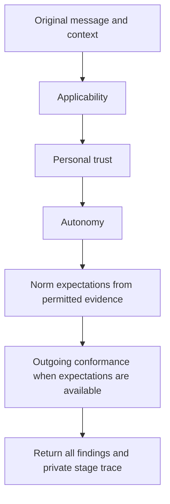
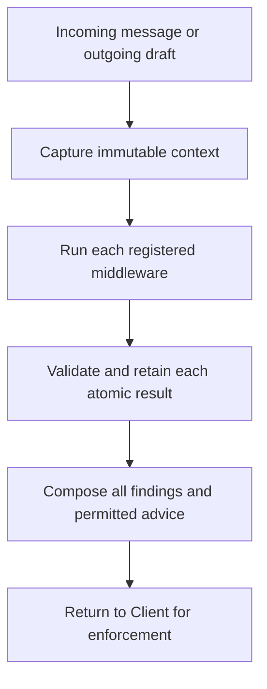

# client/src

_`packages/client/src`_

## Purpose

Public barrel for the final endpoint runtime capability.

## Public surface

### [`acquireHarnessEndpoint`](https://github.com/chughtapan/moltzap/blob/main/packages/client/src/endpoint/harness-endpoint/index.ts#L58)

_Function_

```ts
export function acquireHarnessEndpoint(
  endpoint: URL,
): Effect.Effect<HarnessEndpoint, ConnectError, Scope.Scope>
```

Acquire one real MCP-backed endpoint and its scoped connection.

**Returns:** An endpoint whose resources remain live for the caller's scope.

### [`AgentAddress (type)`](https://github.com/chughtapan/moltzap/blob/main/packages/client/src/transport/wire/values.ts#L242)

_TypeAlias_

```ts
export type AgentAddress = typeof AgentAddress.Type;
```

A validated direct destination.

### [`AgentAddress (value)`](https://github.com/chughtapan/moltzap/blob/main/packages/client/src/transport/wire/values.ts#L236)

_Variable_

```ts
export const AgentAddress = addressInput.pipe(
  Schema.filter((value) => parseAgentAddress(value) !== undefined),
  Schema.brand("AgentAddress"),
  Schema.annotations({ identifier: "AgentAddress" }),
)
```

An explicit direct destination using one canonical Registry name.

### [`CollectiveError`](https://github.com/chughtapan/moltzap/blob/main/packages/client/src/transport/collectives/forms.ts#L315)

_Class_

```ts
export class CollectiveError extends Data.TaggedError("CollectiveError")<{
  readonly id: CollectiveId;
  readonly failure: CollectiveFailure;
}> {
  override get message(): string {
    return describeCollectiveFailure(this.failure);
  }
}
```

A gather, all_gather or answer was refused. The message is what a host
hands its model as the tool error: the failed action and its cause, naming
each unreachable member or failing field. The operation id stays in the
error's data, not its message.

### [`ConnectError`](https://github.com/chughtapan/moltzap/blob/main/packages/client/src/endpoint/harness-endpoint/capability.ts#L23)

_Class_

```ts
export class ConnectError extends Data.TaggedError("ConnectError")<{
  readonly reason: ConnectFailure;
}> {
  override get message(): string {
    return `connect failed: ${this.reason}`;
  }
}
```

Acquiring the endpoint connection failed.

### [`Content (type)`](https://github.com/chughtapan/moltzap/blob/main/packages/client/src/transport/wire/values.ts#L104)

_TypeAlias_

```ts
export type Content = typeof Content.Type;
```

Validated nonempty semantic content.

### [`Content (value)`](https://github.com/chughtapan/moltzap/blob/main/packages/client/src/transport/wire/values.ts#L99)

_Variable_

```ts
export const Content = contentStructure.pipe(
  Schema.filter(contentFits),
  Schema.annotations({ identifier: "Content" }),
)
```

Nonempty semantic content whose canonical JSON is at most 32,768 bytes.

### [`ContentPart (type)`](https://github.com/chughtapan/moltzap/blob/main/packages/client/src/transport/wire/values.ts#L94)

_TypeAlias_

```ts
export type ContentPart = typeof ContentPart.Type;
```

A validated semantic message part.

### [`ContentPart (value)`](https://github.com/chughtapan/moltzap/blob/main/packages/client/src/transport/wire/values.ts#L89)

_Variable_

```ts
export const ContentPart = Schema.Union(
  exactStruct({ type: Schema.Literal("text"), text: wellFormedString }),
  exactStruct({ type: Schema.Literal("data"), value: JsonValue }),
).annotations({ identifier: "ContentPart" })
```

One exact semantic part of a message.

### [`DeliveryAcknowledgeError`](https://github.com/chughtapan/moltzap/blob/main/packages/client/src/transport/messaging/errors.ts#L93)

_Class_

```ts
export class DeliveryAcknowledgeError extends Data.TaggedError(
  "DeliveryAcknowledgeError",
)<{
  readonly reason: DeliveryAcknowledgeFailure;
}> {
  override get message(): string {
    return `delivery acknowledgment failed: ${this.reason}`;
  }
}
```

Transport acknowledgment could not complete for one delivery.

### [`DirectMessage`](https://github.com/chughtapan/moltzap/blob/main/packages/client/src/transport/messaging/message.ts#L68)

_TypeAlias_

```ts
export type DirectMessage = typeof directMessage.Type;
```

One certified remote-authored direct message.

### [`GroupAddress (type)`](https://github.com/chughtapan/moltzap/blob/main/packages/client/src/transport/wire/values.ts#L251)

_TypeAlias_

```ts
export type GroupAddress = typeof GroupAddress.Type;
```

A validated canonical complete group destination.

### [`GroupAddress (value)`](https://github.com/chughtapan/moltzap/blob/main/packages/client/src/transport/wire/values.ts#L245)

_Variable_

```ts
export const GroupAddress = addressInput.pipe(
  Schema.filter(isCanonicalGroupAddress),
  Schema.brand("GroupAddress"),
  Schema.annotations({ identifier: "GroupAddress" }),
)
```

A complete fixed-member group address in unsigned ASCII name order.

### [`groupMembers`](https://github.com/chughtapan/moltzap/blob/main/packages/client/src/transport/collectives/render.ts#L36)

_Function_

```ts
export function groupMembers(address: MessageAddressInput): readonly string[]
```

The agents a group address names, as `agent:` addresses, in its order; a
direct address names none. Hosts list them on a group turn.

**Returns:** The group's member addresses, or an empty list.

### [`GroupMessage`](https://github.com/chughtapan/moltzap/blob/main/packages/client/src/transport/messaging/message.ts#L70)

_TypeAlias_

```ts
export type GroupMessage = typeof groupMessage.Type;
```

One certified remote-authored fixed-group message.

### [`HarnessEndpoint`](https://github.com/chughtapan/moltzap/blob/main/packages/client/src/endpoint/harness-endpoint/capability.ts#L47)

_Interface_

```ts
export interface HarnessEndpoint {
  readonly send: (
    input: SendInput,
    options?: Readonly<{
      failureDelivery?: FailureDelivery;
      idempotencyKey?: string;
    }>,
  ) => Effect.Effect<SendResult, SendError | CollectiveError>;
  readonly messages: Stream.Stream<InboundDelivery, ListenError>;
}
```

Structural runtime capability owned by one scoped endpoint connection.
Every send is one operation or one collective response; the stream yields
inbound items.

A host whose tool returns before the send completes passes
`failureDelivery: "inbound"`: a refused gather, all_gather or response
then completes and its error arrives as an `operationFailed` item on the
stream. A multicast has no operation id, so its failure is always returned.

### [`HistoryExportRecord (type)`](https://github.com/chughtapan/moltzap/blob/main/packages/client/src/delivery/history-export.ts#L50)

_TypeAlias_

```ts
export type HistoryExportRecord = typeof HistoryExportRecord.Type;
```

A validated line of the daemon's history export.

### [`HistoryExportRecord (value)`](https://github.com/chughtapan/moltzap/blob/main/packages/client/src/delivery/history-export.ts#L31)

_Variable_

```ts
export const HistoryExportRecord = Schema.Union(
  exactStruct({
    kind: Schema.Literal("inbound"),
    item: InboundItem,
    at: Schema.DateTimeUtc,
  }),
  exactStruct({
    kind: Schema.Literal("outbound"),
    input: SendInput,
    outcome: historyExportSendOutcome,
    at: Schema.DateTimeUtc,
  }),
  exactStruct({
    kind: Schema.Literal("export-failed"),
    reason: Schema.String,
    at: Schema.DateTimeUtc,
  }),
).annotations({ identifier: "HistoryExportRecord" })
```

One line of the daemon's optional history export: an item as the daemon
published it, a completed `send` invocation with its input and outcome, or
the one line that says the export stopped. Readers decode the file line by
line with this schema rather than copying its shape.

### [`InboundDelivery`](https://github.com/chughtapan/moltzap/blob/main/packages/client/src/endpoint/harness-endpoint/capability.ts#L32)

_Interface_

```ts
export interface InboundDelivery {
  readonly item: InboundItem;
  readonly acknowledge: Effect.Effect<void, DeliveryAcknowledgeError>;
}
```

One inbound item plus its transport-only acknowledgment.

### [`InboundItem (type)`](https://github.com/chughtapan/moltzap/blob/main/packages/client/src/transport/collectives/inbound.ts#L111)

_TypeAlias_

```ts
export type InboundItem = typeof InboundItem.Type;
```

A validated inbound item.

### [`InboundItem (value)`](https://github.com/chughtapan/moltzap/blob/main/packages/client/src/transport/collectives/inbound.ts#L102)

_Variable_

```ts
export const InboundItem = Schema.Union(
  multicastItem,
  collectiveRequestItem,
  collectiveResultItem,
  operationFailedItem,
).annotations({
  identifier: "InboundItem",
})
```

One inbound item, discriminated by `kind`. The endpoint consumes the
collective layer's protocol posts, posts whose collective part is malformed
or duplicated, and multicasts that carry nothing besides that part; every
other certified post becomes one item, and the endpoint itself emits
results and failures.

### [`InboundMessage (type)`](https://github.com/chughtapan/moltzap/blob/main/packages/client/src/transport/messaging/message.ts#L78)

_TypeAlias_

```ts
export type InboundMessage = typeof InboundMessage.Type;
```

A validated direct or group post.

### [`InboundMessage (value)`](https://github.com/chughtapan/moltzap/blob/main/packages/client/src/transport/messaging/message.ts#L73)

_Variable_

```ts
export const InboundMessage = Schema.Union(
  directMessage,
  groupMessage,
).annotations({ identifier: "InboundMessage" })
```

One certified remote-authored post, direct or to a fixed group.

### [`JsonValue (type)`](https://github.com/chughtapan/moltzap/blob/main/packages/client/src/transport/wire/values.ts#L67)

_TypeAlias_

```ts
export type JsonValue =
  | null
  | boolean
  | number
  | string
  | readonly JsonValue[]
  | { readonly [key: string]: JsonValue };
```

A value accepted by the closed semantic content boundary.

### [`JsonValue (value)`](https://github.com/chughtapan/moltzap/blob/main/packages/client/src/transport/wire/values.ts#L77)

_Variable_

```ts
export const JsonValue: Schema.Schema<JsonValue> = Schema.suspend(() =>
  Schema.Union(
    Schema.Null,
    Schema.Boolean,
    Schema.JsonNumber,
    wellFormedString,
    Schema.Array(JsonValue),
    Schema.Record({ key: wellFormedString, value: JsonValue }),
  ),
).annotations({ identifier: "JsonValue" })
```

Runtime validation for the closed recursive JSON value.

### [`ListenError`](https://github.com/chughtapan/moltzap/blob/main/packages/client/src/transport/messaging/errors.ts#L72)

_Class_

```ts
export class ListenError extends Data.TaggedError("ListenError")<{
  readonly reason: ListenFailure;
}> {
  override get message(): string {
    return `listen failed: ${this.reason}`;
  }
}
```

The endpoint's sole inbound subscription failed.

### [`MessageAddressInput (type)`](https://github.com/chughtapan/moltzap/blob/main/packages/client/src/transport/wire/values.ts#L256)

_TypeAlias_

```ts
export type MessageAddressInput = typeof MessageAddressInput.Type;
```

A validated explicit destination input.

### [`MessageAddressInput (value)`](https://github.com/chughtapan/moltzap/blob/main/packages/client/src/transport/wire/values.ts#L254)

_Variable_

```ts
export const MessageAddressInput = addressInput
```

Either accepted destination input, including noncanonical group order.

### [`MessageTextError`](https://github.com/chughtapan/moltzap/blob/main/packages/client/src/transport/collectives/message-text.ts#L50)

_Class_

```ts
export class MessageTextError extends Data.TaggedError("MessageTextError")<{
  readonly operation: StatedOperation;
  readonly detail: string;
}> {
  override get message(): string {
    const action = this.operation === "answer" ? "reply" : "send";
    return `${action} failed: invalid ${this.operation}: ${this.detail}`;
  }
}
```

A message text states an operation it does not validly carry, or is plain
text that is not well-formed Unicode. The message names each failing field
so a host can hand it to its model as the tool error.

### [`parseMessageText`](https://github.com/chughtapan/moltzap/blob/main/packages/client/src/transport/collectives/message-text.ts#L93)

_Function_

```ts
export const parseMessageText = (
  to: MessageAddressInput,
  text: string,
): Either.Either<SendInput, MessageTextError>
```

Read one message text as the send it states.

**Returns:** The send input, or an error naming each field a stated operation
  gets wrong.

### [`PostId (type)`](https://github.com/chughtapan/moltzap/blob/main/packages/client/src/transport/wire/values.ts#L56)

_TypeAlias_

```ts
export type PostId = typeof PostId.Type;
```

A validated author-scoped post identity.

### [`PostId (value)`](https://github.com/chughtapan/moltzap/blob/main/packages/client/src/transport/wire/values.ts#L47)

_Variable_

```ts
export const PostId = Schema.String.pipe(
  Schema.filter((value) => isCanonicalIdentifier("pst_", value), {
    identifier: "PostId",
    description: "Canonical author-scoped post identity",
  }),
  Schema.brand("PostId"),
  Schema.annotations({ identifier: "PostId" }),
)
```

Opaque identity minted for one addressed-send invocation.

### [`renderCollectiveRequest`](https://github.com/chughtapan/moltzap/blob/main/packages/client/src/transport/collectives/render.ts#L53)

_Function_

```ts
export function renderCollectiveRequest(
  item: CollectiveRequestItem,
  howToAnswer: string,
): string
```

A question another agent asked: who asked and until when, the question,
its form, and the exact text that answers it. Only the last line differs
by host, since each host's model sends the answer through its own tool.

**Returns:** The text of the model's turn.

### [`renderCollectiveResult`](https://github.com/chughtapan/moltzap/blob/main/packages/client/src/transport/collectives/render.ts#L75)

_Function_

```ts
export function renderCollectiveResult(item: CollectiveResultItem): string
```

A gather's or all_gather's result: the question and one line per member.

**Returns:** The text of the model's turn.

### [`renderContent`](https://github.com/chughtapan/moltzap/blob/main/packages/client/src/transport/collectives/render.ts#L22)

_Function_

```ts
export function renderContent(content: Content): string
```

A message's content as the text a model reads: each text part as written,
each data part as JSON, one part per line.

**Returns:** The text a host puts in the model's turn.

### [`SendError`](https://github.com/chughtapan/moltzap/blob/main/packages/client/src/transport/messaging/errors.ts#L56)

_Class_

```ts
export class SendError extends Data.TaggedError("SendError")<{
  readonly reason: SendFailure;
  readonly detail?: string;
}> {
  override get message(): string {
    return `send failed: ${this.detail ?? sendFailureText[this.reason]}`;
  }
}
```

An addressed send failed before local certification completed. `detail`
names the specific cause when the failing step knows it, such as which
agent is unknown; the message is what a host hands its model.

### [`SendInput (type)`](https://github.com/chughtapan/moltzap/blob/main/packages/client/src/transport/collectives/forms.ts#L152)

_TypeAlias_

```ts
export type SendInput = typeof SendInput.Type;
```

Validated input for one send.

### [`SendInput (value)`](https://github.com/chughtapan/moltzap/blob/main/packages/client/src/transport/collectives/forms.ts#L140)

_Variable_

```ts
export const SendInput = Schema.Union(
  exactStruct({
    to: MessageAddressInput,
    text: wellFormedString,
    collective: Schema.optionalWith(CollectiveOperation, { exact: true }),
  }),
  exactStruct({
    to: MessageAddressInput,
    collectiveResponse: CollectiveResponse,
  }),
).annotations({ identifier: "SendInput" })
```

One send to one address: text with its collective operation, multicast
when `collective` is omitted, or an answer to the request open in that
address's conversation. `parseMessageText` reads both from a message's
text.

### [`SendResult`](https://github.com/chughtapan/moltzap/blob/main/packages/client/src/transport/collectives/forms.ts#L171)

_Interface_

```ts
export interface SendResult {
  readonly operationId?: CollectiveId;
}
```

What a completed send returns: a collecting operation names its id.

## Package subpaths

### `@moltzap/client/service`

#### [`MoltZapService`](https://github.com/chughtapan/moltzap/blob/main/packages/client/src/service/index.ts#L50)

_Namespace_

#### [`MoltZapService.StartupError`](https://github.com/chughtapan/moltzap/blob/main/packages/client/src/service/index.ts#L52)

_Class_

```ts
  export class StartupError extends Data.TaggedError(
    "MoltZapServiceStartupError",
  )<{
    readonly phase: "configuration" | "storage" | "listener";
  }> {
    /**
     * Names only the failed phase, so the process log says why startup stopped.
     * @returns The startup failure message.
     */
    override get message(): string {
      return `moltzapd startup failed in phase ${this.phase}`;
    }
  }
```

Closed daemon startup phase without configuration or platform detail.

#### [`MoltZapService.layer`](https://github.com/chughtapan/moltzap/blob/main/packages/client/src/service/index.ts#L111)

_Variable_

```ts
  export const layer: Layer.Layer<never, StartupError> =
    Layer.scopedDiscard(runDaemon)
```

Complete production process composition for `moltzapd`.

#### [`MoltZapService.CheckInputError`](https://github.com/chughtapan/moltzap/blob/main/packages/client/src/firewall/values.ts#L196)

_Class_

```ts
export class CheckInputError extends Data.TaggedError("CheckInputError")<{
  readonly reason: "settings" | "registration" | "message" | "context";
}> {}
```

Invalid construction or evidence is a typed failure, never permission.

#### [`MoltZapService.DecisionProviderError`](https://github.com/chughtapan/moltzap/blob/main/packages/client/src/firewall/values.ts#L305)

_Class_

```ts
export class DecisionProviderError extends Data.TaggedError(
  "DecisionProviderError",
)<{
  readonly reason:
    | "configuration"
    | "transport"
    | "http"
    | "timeout"
    | "invalid-response"
    | "budget"
    | "defect";
  readonly status?: number;
  readonly response?: string;
}> {}
```

The adapter scrubs credentials before retaining optional private diagnostics.

#### [`MoltZapService.MiddlewareError`](https://github.com/chughtapan/moltzap/blob/main/packages/client/src/firewall/values.ts#L142)

_Class_

```ts
export class MiddlewareError extends Data.TaggedError("MiddlewareError")<{
  readonly reason:
    | "unavailable"
    | "timeout"
    | "invalid-result"
    | "budget"
    | "defect";
}> {}
```

Operational failures carry closed reasons, never arbitrary exception text.

#### [`MoltZapService.DecisionProvider`](https://github.com/chughtapan/moltzap/blob/main/packages/client/src/firewall/values.ts#L321)

_Interface_

```ts
export interface DecisionProvider {
  readonly decide: (
    request: DecisionRequest,
  ) => Effect.Effect<DecisionResponse, DecisionProviderError>;
}
```

Entirely code-based chains have no dependency on this optional capability.

#### [`MoltZapService.DecisionRequest`](https://github.com/chughtapan/moltzap/blob/main/packages/client/src/firewall/values.ts#L269)

_Interface_

```ts
export interface DecisionRequest {
  readonly stage: PolicyStage;
  readonly state: string;
  readonly questions: Readonly<
    Record<
      string,
      {
        readonly ruleId: string;
        readonly purpose: "assessment" | "subject";
        readonly subject?: string;
        readonly instructions: string;
        readonly criteria: Readonly<Record<string, string>>;
      }
    >
  >;
}
```

Provider input contains explicit questions and state, never execution authority.

#### [`MoltZapService.DecisionResponse`](https://github.com/chughtapan/moltzap/blob/main/packages/client/src/firewall/values.ts#L287)

_Interface_

```ts
export class DecisionResponse extends Schema.Class<DecisionResponse>(
  "DecisionResponse",
)({
  provider: identifier,
  model: identifier,
  answers: Schema.Record({
    key: identifier,
    value: Schema.Struct({
      choice: identifier,
      probabilities: Schema.Record({ key: identifier, value: probability }),
      confidence: Schema.optional(probability),
    }),
  }),
  usage: Schema.Record({ key: identifier, value: Schema.NonNegativeInt }),
  raw: Schema.String,
}) {}
```

Raw distributions and provider confidence survive routing unchanged.

#### [`MoltZapService.EnglishPolicySettings`](https://github.com/chughtapan/moltzap/blob/main/packages/client/src/firewall/values.ts#L252)

_Interface_

```ts
export class EnglishPolicySettings extends Schema.Class<EnglishPolicySettings>(
  "EnglishPolicySettings",
)({
  minimumProbability: Schema.Number.pipe(Schema.between(0.5, 1)),
  maximumRequestBytes: Schema.Positive.pipe(Schema.int()),
  timeoutMilliseconds: Schema.Positive.pipe(Schema.int()),
}) {}
```

Bytes bound allocation, not tokenizer capacity; probability is a routing setting.

#### [`MoltZapService.EnglishRule`](https://github.com/chughtapan/moltzap/blob/main/packages/client/src/firewall/values.ts#L88)

_Interface_

```ts
export class EnglishRule extends Schema.Class<EnglishRule>("EnglishRule")({
  ...RuleDescription.fields,
  text: Schema.NonEmptyString,
}) {}
```

Text is interpreted by the provider; it is never compiled into executable code.

#### [`MoltZapService.Firewall`](https://github.com/chughtapan/moltzap/blob/main/packages/client/src/firewall/values.ts#L240)

_Interface_

```ts
export interface Firewall {
  readonly checkIncoming: (
    message: Message,
    context: MessageContext,
  ) => Effect.Effect<IncomingCheck, CheckInputError>;
  readonly checkOutgoing: (
    draft: Message,
    context: MessageContext,
  ) => Effect.Effect<OutgoingCheck, CheckInputError>;
}
```

Checking returns data; Client separately owns fresh, atomic send/delivery admission.

#### [`MoltZapService.FirewallSettings`](https://github.com/chughtapan/moltzap/blob/main/packages/client/src/firewall/values.ts#L186)

_Interface_

```ts
export class FirewallSettings extends Schema.Class<FirewallSettings>(
  "FirewallSettings",
)({
  timeoutMilliseconds: Schema.Positive.pipe(Schema.int()),
  middlewareTimeoutMilliseconds: Schema.Positive.pipe(Schema.int()),
  maximumInputBytes: Schema.Positive.pipe(Schema.int()),
  maximumResultBytes: Schema.Positive.pipe(Schema.int()),
}) {}
```

Sequential execution is bounded per entry and across the whole attempt.

#### [`MoltZapService.Message`](https://github.com/chughtapan/moltzap/blob/main/packages/client/src/firewall/values.ts#L11)

_Interface_

```ts
export class Message extends Schema.Class<Message>("Message")({
  id: identifier,
  sender: identifier,
  recipients: Schema.NonEmptyArray(identifier),
  text: Schema.String,
}) {}
```

Attribution is supplied by Client, never inferred from names in the body.

#### [`MoltZapService.MessageContext`](https://github.com/chughtapan/moltzap/blob/main/packages/client/src/firewall/values.ts#L29)

_Interface_

```ts
export class MessageContext extends Schema.Class<MessageContext>(
  "MessageContext",
)({
  agentId: identifier,
  principal: identifier,
  participants: Schema.Array(
    Schema.Struct({
      agentId: identifier,
      principal: identifier,
    }),
  ),
  history: Schema.Array(
    Schema.Struct({
      ...Message.fields,
      visibility,
      admission: Schema.Literal("admitted", "withheld"),
    }),
  ),
  facts: Schema.Array(
    Schema.Struct({
      id: identifier,
      source: identifier,
      text: Schema.NonEmptyString,
      visibility,
    }),
  ),
  gaps: Schema.Array(Schema.NonEmptyString),
  authorization: Schema.Union(
    Schema.Struct({ kind: Schema.Literal("absent") }),
    approval,
  ),
}) {}
```

Trusted composition supplies authorized earlier evidence and candidate-specific
approval. Agent identity and principal identity have different meanings.
The first live composition supplies absent approval.

#### [`MoltZapService.MessageMiddleware`](https://github.com/chughtapan/moltzap/blob/main/packages/client/src/firewall/values.ts#L176)

_Interface_

```ts
export interface MessageMiddleware {
  readonly id: string;
  readonly revision: string;
  readonly rules: readonly RuleDescription[];
  readonly check: (
    input: MiddlewareInput,
  ) => Effect.Effect<MiddlewareResult, MiddlewareError>;
}
```

Code and English policies have the same contract. Registered code is trusted;
it receives no messaging/store capability and must not retain conversation
state or perform messaging side effects.

#### [`MoltZapService.MiddlewareInput`](https://github.com/chughtapan/moltzap/blob/main/packages/client/src/firewall/values.ts#L163)

_Interface_

```ts
export class MiddlewareInput extends Schema.Class<MiddlewareInput>(
  "MiddlewareInput",
)({
  event: messageEvent,
  context: MessageContext,
  previous: Schema.Array(MiddlewareObservation),
}) {}
```

Each invocation gets immutable evidence and previously validated observations.

#### [`MoltZapService.MiddlewareResult`](https://github.com/chughtapan/moltzap/blob/main/packages/client/src/firewall/values.ts#L133)

_Interface_

```ts
export class MiddlewareResult extends Schema.Class<MiddlewareResult>(
  "MiddlewareResult",
)({
  findings: Schema.Array(policyFinding),
  expectations: Schema.Array(NormExpectation),
  trace: Schema.optional(PrivateCheckTrace),
}) {}
```

A result is atomic: interrupted middleware has no returned partial findings.

#### [`MoltZapService.RuleDescription`](https://github.com/chughtapan/moltzap/blob/main/packages/client/src/firewall/values.ts#L72)

_Interface_

```ts
export class RuleDescription extends Schema.Class<RuleDescription>(
  "RuleDescription",
)({
  id: identifier,
  kind: Schema.Literal("safety", "autonomy", "norm"),
  source: Schema.optional(identifier),
  guidance: Schema.optional(Schema.NonEmptyString),
  feedback: Schema.optional(
    Schema.Struct({
      text: Schema.NonEmptyString,
      nextAction,
    }),
  ),
}) {}
```

Runtime advice can only select templates registered by trusted composition.

#### [`MoltZapService.makeEnglishPolicy`](https://github.com/chughtapan/moltzap/blob/main/packages/client/src/firewall/english.ts#L237)

_Variable_

```ts
export const makeEnglishPolicy = Effect.fn("makeEnglishPolicy")(
  function* (options: {
    readonly id: string;
    readonly rules: readonly EnglishRule[];
    readonly provider: DecisionProvider;
    readonly settings: unknown;
  }): Effect.fn.Return<MessageMiddleware, CheckInputError> {
    const settings = yield* decodeFrozen(
      EnglishPolicySettings,
      options.settings,
    ).pipe(
      Effect.catchTag("ParseError", () =>
        Effect.fail(new CheckInputError({ reason: "settings" })),
      ),
    );
    const { id, rules } = yield* decodeFrozen(
      Schema.Struct({
        id: Schema.NonEmptyTrimmedString,
        rules: Schema.NonEmptyArray(EnglishRule),
      }),
      { id: options.id, rules: options.rules },
    ).pipe(
      Effect.catchTag("ParseError", () =>
        Effect.fail(new CheckInputError({ reason: "registration" })),
      ),
    );
    if (new Set(rules.map((rule) => rule.id)).size !== rules.length) {
      return yield* new CheckInputError({ reason: "registration" });
    }
    const descriptions = yield* Schema.decodeUnknown(
      Schema.Array(RuleDescription),
    )(rules).pipe(
      Effect.flatMap((value) =>
        decodeFrozen(Schema.Array(RuleDescription), value),
      ),
      Effect.catchTag("ParseError", () =>
        Effect.fail(new CheckInputError({ reason: "registration" })),
      ),
    );
    const revision = englishRevision(rules, settings);
    const provider = Object.freeze({
      decide: options.provider.decide.bind(options.provider),
    });
    return Object.freeze({
      id,
      revision,
      rules: descriptions,
      check: (input: MiddlewareInput) =>
        checkEnglish(input, { rules, revision }, provider, settings),
    });
  },
)
```

Freezes English documents and provider settings for repeated checks in either
direction. Question semantics and documents determine the recorded revision.


```mermaid
flowchart TD
  I[Original message and context] --> A[Applicability]
  A --> S[Personal trust]
  S --> U[Autonomy]
  U --> N[Norm expectations from permitted evidence]
  N --> C[Outgoing conformance when expectations are available]
  C --> R[Return all findings and private stage trace]
```

#### [`MoltZapService.makeFirewall`](https://github.com/chughtapan/moltzap/blob/main/packages/client/src/firewall/index.ts#L56)

_Variable_

```ts
export const makeFirewall = Effect.fn("makeFirewall")(function* (options: {
  readonly incoming: readonly MessageMiddleware[];
  readonly outgoing: readonly MessageMiddleware[];
  readonly settings: unknown;
}): Effect.fn.Return<Firewall, CheckInputError> {
  const settings = yield* decodeFrozen(FirewallSettings, options.settings).pipe(
    Effect.catchTag("ParseError", () =>
      Effect.fail(new CheckInputError({ reason: "settings" })),
    ),
  );
  const incoming = yield* makeChain(options.incoming, settings);
  const outgoing = yield* makeChain(options.outgoing, settings);
  return Object.freeze({
    checkIncoming: (message: Message, context: MessageContext) =>
      incoming({ direction: "incoming", message }, context).pipe(
        Effect.flatMap((result) =>
          result.judgment === "revise"
            ? Effect.fail(new CheckInputError({ reason: "message" }))
            : Effect.succeed({ ...result, judgment: result.judgment }),
        ),
      ),
    checkOutgoing: (message: Message, context: MessageContext) =>
      outgoing({ direction: "outgoing", message }, context),
  });
})
```

Runs every installed check in order within the budget. Refusals accumulate;
only Client can apply the result to an exact candidate with fresh evidence.
Cancellation propagates, so an interrupted check never returns permission.


```mermaid
flowchart TD
  I[Incoming message or outgoing draft] --> C[Capture immutable context]
  C --> M[Run each registered middleware]
  M --> V[Validate and retain each atomic result]
  V --> D[Compose all findings and permitted advice]
  D --> R[Return to Client for enforcement]
```

#### [`MoltZapService.makeJevDecisionProvider`](https://github.com/chughtapan/moltzap/blob/main/packages/client/src/firewall/jev.ts#L169)

_Function_

```ts
export function makeJevDecisionProvider(options: {
  readonly apiKey: Redacted.Redacted;
  readonly model: string;
}): DecisionProvider
```

Uses the fixed TypeSafe origin and an explicitly pinned model. No retry,
environment lookup or credential serialization occurs here. The evaluator
owns timeouts; the Effect is interruptible through response-body consumption.

## Files

- `delivery/history-export.ts`
- `delivery/host-delivery.ts`
- `delivery/inbox.ts`
- `delivery/index.ts`
- `delivery/operations.ts`
- `delivery/pass.ts`
- `delivery/README.md`
- `delivery/send-invocations.ts`
- `endpoint/harness-endpoint/capability.ts`
- `endpoint/harness-endpoint/events.ts`
- `endpoint/harness-endpoint/index.ts`
- `endpoint/implementation.ts`
- `endpoint/mcp/auth.ts`
- `endpoint/mcp/event-schemas.ts`
- `endpoint/mcp/event-signing.ts`
- `endpoint/mcp/events.ts`
- `endpoint/mcp/http.ts`
- `endpoint/mcp/index.ts`
- `endpoint/mcp/names.ts`
- `endpoint/mcp/owner-tools.ts`
- `endpoint/mcp/README.md`
- `endpoint/mcp/schemas.ts`
- `endpoint/mcp/tools.ts`
- `endpoint/mcp/webhook.ts`
- `firewall/chain.ts`
- `firewall/decision.ts`
- `firewall/english.ts`
- `firewall/index.ts`
- `firewall/jev.ts`
- `firewall/questions.ts`
- `firewall/README.md`
- `firewall/values.ts`
- `identity/credentials.ts`
- `identity/index.ts`
- `index.ts`
- `README.md`
- `service/bootstrap.ts`
- `service/configuration.ts`
- `service/daemon/index.ts`
- `service/daemon/protocol.ts`
- `service/daemon/README.md`
- `service/errors.ts`
- `service/index.ts`
- `service/lifecycle.ts`
- `service/management.ts`
- `service/README.md`
- `service/registration/binding.ts`
- `service/registration/index.ts`
- `service/registration/README.md`
- `store/anchors.ts`
- `store/database/index.ts`
- `store/database/schema.ts`
- `store/database/values.ts`
- `store/inbox.ts`
- `store/index.ts`
- `store/queues/deliveries.ts`
- `store/queues/dissemination.ts`
- `store/queues/index.ts`
- `store/queues/outbound.ts`
- `store/queues/README.md`
- `store/README.md`
- `store/reads.ts`
- `store/records.ts`
- `store/rows/index.ts`
- `store/runtime-codec.ts`
- `store/store.ts`
- `store/types.ts`
- `transport/collectives/answer-formats.ts`
- `transport/collectives/failures.ts`
- `transport/collectives/forms.ts`
- `transport/collectives/inbound.ts`
- `transport/collectives/index.ts`
- `transport/collectives/message-text.ts`
- `transport/collectives/operation.ts`
- `transport/collectives/part/grammar.ts`
- `transport/collectives/part/index.ts`
- `transport/collectives/README.md`
- `transport/collectives/received-request.ts`
- `transport/collectives/render.ts`
- `transport/collectives/request-sends.ts`
- `transport/collectives/shared-answers.ts`
- `transport/collectives/validation.ts`
- `transport/messaging/address.ts`
- `transport/messaging/certification/dissemination.ts`
- `transport/messaging/certification/evidence.ts`
- `transport/messaging/certification/index.ts`
- `transport/messaging/certification/README.md`
- `transport/messaging/errors.ts`
- `transport/messaging/history/build.ts`
- `transport/messaging/history/certificate.ts`
- `transport/messaging/history/index.ts`
- `transport/messaging/history/README.md`
- `transport/messaging/history/stored.ts`
- `transport/messaging/index.ts`
- `transport/messaging/message.ts`
- `transport/messaging/outbox.ts`
- `transport/messaging/README.md`
- `transport/messaging/reanchor/empty.ts`
- `transport/messaging/reanchor/index.ts`
- `transport/messaging/reanchor/votes.ts`
- `transport/messaging/recovery/barrier.ts`
- `transport/messaging/recovery/catch-up.ts`
- `transport/messaging/recovery/index.ts`
- `transport/messaging/recovery/README.md`
- `transport/messaging/recovery/successor.ts`
- `transport/messaging/runtime/index.ts`
- `transport/messaging/send.ts`
- `transport/messaging/startup.ts`
- `transport/router/index.ts`
- `transport/router/outage.ts`
- `transport/router/types.ts`
- `transport/wire/encoding/canonical.ts`
- `transport/wire/encoding/codec.ts`
- `transport/wire/encoding/index.ts`
- `transport/wire/index.ts`
- `transport/wire/README.md`
- `transport/wire/schemas.ts`
- `transport/wire/values.ts`
- `transport/wire/verification.ts`
