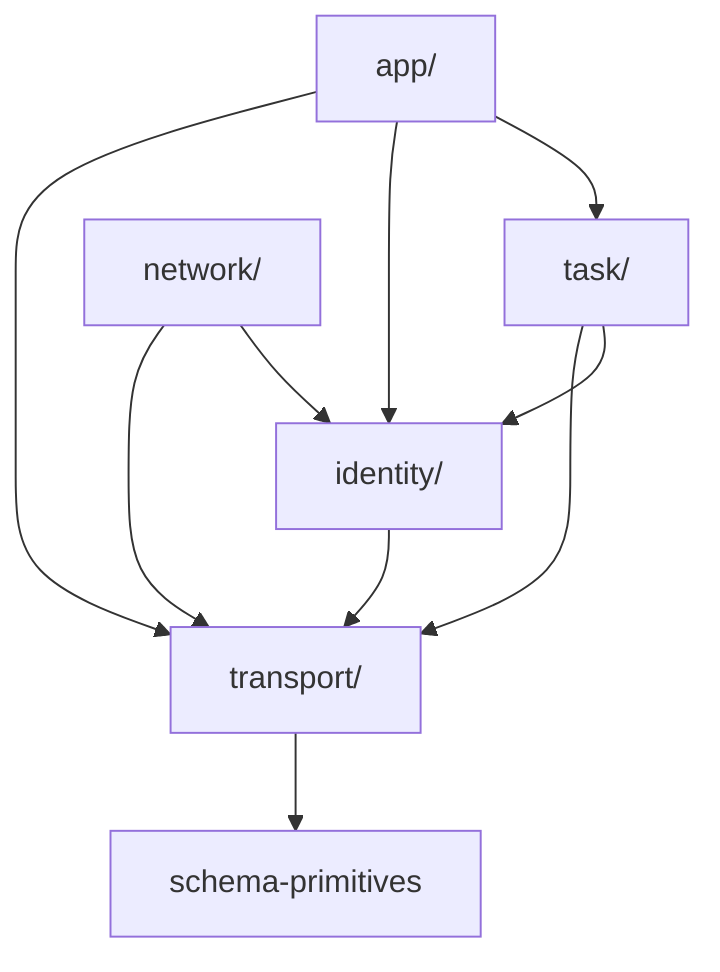
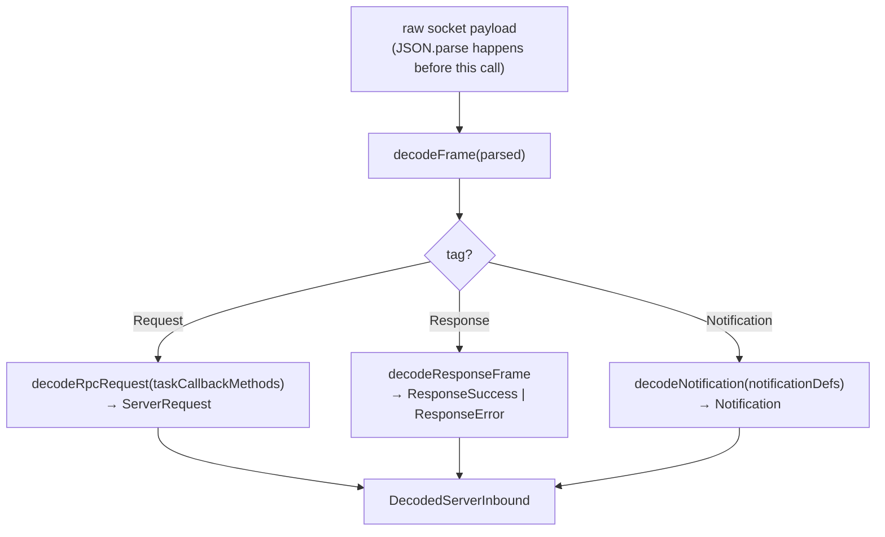

# protocol/src

_`packages/protocol/src`_

## Purpose

Public barrel — protocol layer DAG.

The protocol package is the leaf in the workspace dependency
graph, and internally it is split into five layers with their own
one-way dependency order. Re-exports below are arranged in DAG
order so the file itself is the manifest.



A `task/*` method may reference `identity/*` types (e.g.
`AgentId`); the reverse import is forbidden. The server's
Tag-allowlist hierarchy in `@moltzap/server-core` mirrors this
DAG: a handler may pull services only from layers at-or-below its
own home layer.

## Public surface

### [`agentClientRpcMethods`](https://github.com/chughtapan/moltzap/blob/main/packages/protocol/src/rpc-registry.ts#L100)

_Variable_

```ts
export const agentClientRpcMethods = [
  ...identityRpcMethods,
  ...networkRpcMethods,
  ...agentCallableTaskRpcMethods,
  ...appRpcMethods,
] as const
```

### [`AnyAgentClientRpcDefinition`](https://github.com/chughtapan/moltzap/blob/main/packages/protocol/src/rpc-registry.ts#L128)

_TypeAlias_

```ts
export type AnyAgentClientRpcDefinition =
  (typeof agentClientRpcMethods)[number] & RpcDefinition<string, any, any>;
```

### [`AnyNotificationDefinition`](https://github.com/chughtapan/moltzap/blob/main/packages/protocol/src/rpc-registry.ts#L135)

_TypeAlias_

```ts
export type AnyNotificationDefinition =
  (typeof notificationDefinitions)[number];
```

### [`AnyServerRpcDefinition`](https://github.com/chughtapan/moltzap/blob/main/packages/protocol/src/rpc-registry.ts#L126)

_TypeAlias_

```ts
export type AnyServerRpcDefinition = (typeof serverRpcMethods)[number] &
```

### [`AnyTaskCallbackRpcDefinition`](https://github.com/chughtapan/moltzap/blob/main/packages/protocol/src/rpc-registry.ts#L133)

_TypeAlias_

```ts
export type AnyTaskCallbackRpcDefinition = (typeof taskCallbackMethods)[number];
```

### [`AnyTaskMasterRpcDefinition`](https://github.com/chughtapan/moltzap/blob/main/packages/protocol/src/rpc-registry.ts#L130)

_TypeAlias_

```ts
export type AnyTaskMasterRpcDefinition = (typeof taskMasterRpcMethods)[number] &
```

### [`brandedId`](https://github.com/chughtapan/moltzap/blob/main/packages/protocol/src/schema-primitives.ts#L178)

_Function_

```ts
export function brandedId<const BrandName extends string>(brand: BrandName)
```

Convenience over brandedString that adds the `uuid` format. The
canonical way to define wire id types in this package
(`AgentId = brandedId("AgentId")`, `TaskId = brandedId("TaskId")`, etc.).
The format check runs the `UUID_RE` regex at decode time and annotates the
schema so `JSONSchema.make` emits `format:"uuid"` for the docs walker.

### [`brandedNumber`](https://github.com/chughtapan/moltzap/blob/main/packages/protocol/src/schema-primitives.ts#L152)

_Function_

```ts
export function brandedNumber<const BrandName extends string>(
  brand: BrandName,
  options: BrandedNumberOptions = {},
): Schema.Schema<BrandedNumber<BrandName>, number>
```

Effect `Schema` whose decoded type is `BrandedNumber&lt;BrandName>`. Same
shape as brandedString for the numeric case.

### [`BrandedNumber`](https://github.com/chughtapan/moltzap/blob/main/packages/protocol/src/schema-primitives.ts#L21)

_TypeAlias_

```ts
export type BrandedNumber<BrandName extends string> = number &
```

A `number` carrying a nominal `Brand.Brand&lt;BrandName>` tag.

### [`BrandedNumberOptions`](https://github.com/chughtapan/moltzap/blob/main/packages/protocol/src/schema-primitives.ts#L37)

_Interface_

```ts
export interface BrandedNumberOptions {
  readonly minimum?: number;
  readonly maximum?: number;
  readonly description?: string;
}
```

Refinement options accepted by brandedNumber.

### [`brandedString`](https://github.com/chughtapan/moltzap/blob/main/packages/protocol/src/schema-primitives.ts#L57)

_Function_

```ts
export function brandedString<const BrandName extends string>(
  brand: BrandName,
  options: BrandedStringOptions = {},
): Schema.Schema<BrandedString<BrandName>, string>
```

Effect `Schema` whose decoded type is `BrandedString&lt;BrandName>`. The
brand exists only at the type level — decode runs against the underlying
string with the requested refinements (`minLength`, `maxLength`,
`pattern`, and the three wire `format` checkers below). Replaces the
former TypeBox `Type.String` + AJV `format` registry: the regex/finiteness
checks are now `Schema.pattern` / `Schema.filter` refinements that run
inside the same `Schema.decode*` engine as everything else.

`format` annotates the schema with `{ jsonSchema: { format } }` so
`JSONSchema.make` re-emits the draft-07 `format` keyword the docs walker
reads (`scripts/docs/schema.ts → getStringTypeName`). The `pattern`/`filter`
refinement still runs at decode time regardless of the annotation.

### [`BrandedString`](https://github.com/chughtapan/moltzap/blob/main/packages/protocol/src/schema-primitives.ts#L17)

_TypeAlias_

```ts
export type BrandedString<BrandName extends string> = string &
```

A `string` carrying a nominal `Brand.Brand&lt;BrandName>` tag. Prevents
a `string` from accidentally type-fitting a slot expecting the brand.

`Schema.brand` produces `string & Brand.Brand&lt;BrandName>`, identical to
this alias, so a `brandedString("Foo")` schema's `Schema.Schema.Type` is
assignable both ways with `BrandedString&lt;"Foo">`.

### [`BrandedStringOptions`](https://github.com/chughtapan/moltzap/blob/main/packages/protocol/src/schema-primitives.ts#L28)

_Interface_

```ts
export interface BrandedStringOptions {
  readonly minLength?: number;
  readonly maxLength?: number;
  readonly pattern?: string;
  readonly format?: WireStringFormat;
  readonly description?: string;
}
```

Refinement options accepted by brandedString.

### [`checkProtocolRange`](https://github.com/chughtapan/moltzap/blob/main/packages/protocol/src/version.ts#L155)

_Function_

```ts
export function checkProtocolRange(
  params: { readonly minProtocol: string; readonly maxProtocol: string },
  serverVersion: string,
): Effect.Effect<void, ProtocolMismatchError | InvalidProtocolVersionError>
```

Range-check the client's protocol-version interval against an
injected server version. Raised by `network/connect` BEFORE auth
resolution; the server-side handler in
`@moltzap/server-core/identity/handlers/connect.handlers.ts`
yields this Effect as the FIRST step of `handleConnect`.

**Architect plan #706 v10 (codex r9 P2 #1) — relocated from
`connect.handlers.ts` to here.** v9 made the function's signature
testable (parameterized over `serverVersion`); v10 makes the
function itself importable from `@moltzap/protocol` so regression
tests can call it without an illegal test seam through the
server-internal handler module.

**Two error channels, both typed (codex PR review #1 P2).**

- `ProtocolMismatchError` — versions are well-formed, just outside
  the supported range. Two `reason` discriminants in the wire
  error's `data` field:
  - `server-above-client-max` —
    `compareProtocolVersion(serverVersion, params.maxProtocol) > 0`.
    The server is newer than the client knows how to talk to.
  - `server-below-client-min` —
    `compareProtocolVersion(serverVersion, params.minProtocol) < 0`.
    The client is newer than the server supports.
- `InvalidProtocolVersionError` — `params.minProtocol` or
  `params.maxProtocol` is not a well-formed numeric version
  string. Untrusted client input crosses the boundary here, so
  the sync throw in compareProtocolVersion is wrapped in
  `Effect.try` and surfaces as a typed channel error. Callers
  (the `network/connect` handler) catch this and map to
  `InvalidParamsError` (JSON-RPC `-32602`).

Production callers (`handleConnect`) pass the live
`PROTOCOL_VERSION` constant; tests inject future-version values
to exercise rejection paths against an unbumped branch.

Example test usage: `Effect.runSync(Effect.either(checkProtocolRange({
minProtocol: "2026.526.0", maxProtocol: "2026.526.0" },
"2026.527.0")))` resolves to a `Left` carrying a
`ProtocolMismatchError` whose `data.reason` is
`"server-above-client-max"`.

### [`closedStructGuard`](https://github.com/chughtapan/moltzap/blob/main/packages/protocol/src/schema-primitives.ts#L298)

_Function_

```ts
export function closedStructGuard<A, I>(
  schema: Schema.Schema<A, I>,
): (value: unknown)
```

Build a boolean type-guard from a `Schema` that REJECTS excess keys,
matching the former `ajv.compile(schema)` strict type guards. A bare
`Schema.is(schema)` ACCEPTS excess (loosening the trust boundary), so the
standalone validators (`validateAgent`, `validateMessage`, …) wrap a
strict `decodeUnknownEither` instead.

### [`compareProtocolVersion`](https://github.com/chughtapan/moltzap/blob/main/packages/protocol/src/version.ts#L81)

_Function_

```ts
export function compareProtocolVersion(a: string, b: string): -1 | 0 | 1
```

Numeric comparator for `PROTOCOL_VERSION` strings, ordered by their
dotted numeric segments (NOT lexicographically).

Architect plan #706 v5 (codex r4 P2 #1) — required because CalVer
values of the form `YYYY.NNNN.M` carry variable-digit middle
components and `"2026.1001.0".localeCompare("2026.527.0") === -1`
(lex: `1001 < 527`), opposite of the chronological/numeric truth.
The v4 plan's `checkProtocolRange` originally compared
`client.maxProtocol < PROTOCOL_VERSION` via raw string ordering;
v5 routes it through this helper so the "old client rejected at
network/connect" gate stays correct as the publish workflow rolls
the middle component past `999`.

Returns `-1 | 0 | 1` with conventional semantics:

    compareProtocolVersion("2026.527.0",  "2026.527.0")  →  0
    compareProtocolVersion("2026.526.0",  "2026.527.0")  → -1
    compareProtocolVersion("2026.1001.0", "2026.527.0")  →  1   // numeric, NOT lex
    compareProtocolVersion("2025.999.0",  "2026.1.0")    → -1   // year boundary
    compareProtocolVersion("2026.527.0",  "2026.527.1")  → -1

Each input MUST be a dotted `n.n.n` (or wider) numeric string. The
function is intentionally strict — it does NOT accept SemVer
pre-release suffixes (`2026.527.0-rc.1`) or build metadata
(`2026.527.0+abc`). Empty segments (e.g., `"2026..0"`) and
non-digit characters (`"abc"`) also reject — `Number("") === 0`
would otherwise silently coerce, contradicting the
"strict / fail-closed" JSDoc claim (review-senior P3 #2).

**Synchronous throw shape.** Throws
InvalidProtocolVersionError (a `Data.TaggedError`) on any
malformed segment. Untrusted client input MUST be funnelled
through checkProtocolRange, which wraps this call in
`Effect.try` so the parse error flows through the Effect channel
— never as a sync throw escaping into the JSON-RPC handler
(codex PR review #1 P2).

### [`dateTimeStringSchema`](https://github.com/chughtapan/moltzap/blob/main/packages/protocol/src/schema-primitives.ts#L226)

_Function_

```ts
export function dateTimeStringSchema(): typeof DateTimeStringSchema
```

Returns the shared `DateTimeStringSchema` singleton. Functioned so callers
can keep `as const` references stable while the schema body is owned here.

### [`decodeClientInbound`](https://github.com/chughtapan/moltzap/blob/main/packages/protocol/src/rpc-registry.ts#L280)

_Function_

```ts
export function decodeClientInbound(
  parsed: unknown,
): Effect.Effect<DecodedClientInbound, MalformedFrameError>
```

Typed entry point for server-inbound frames (used by the server to
decode what a client sends). Same shape as
decodeServerInbound but admits the FULL `rpcMethods` set
on the request arm.

Fails closed with `MalformedFrameError` on any mismatch, including
a response frame whose `id` is `null` (no pending call to settle).

### [`DecodedClientInbound`](https://github.com/chughtapan/moltzap/blob/main/packages/protocol/src/rpc-registry.ts#L178)

_TypeAlias_

```ts
export type DecodedClientInbound =
  | ({
      readonly _tag: "ClientRequest";
    } & DecodedRpcRequest<AnyServerRpcDefinition>)
```

Decoded shape of a frame inbound to the server (from client):
a client RPC request, a response (success XOR error) to a
server-initiated callback, or a notification.

### [`DecodedResponseError`](https://github.com/chughtapan/moltzap/blob/main/packages/protocol/src/rpc-registry.ts#L152)

_Class_

```ts
export class DecodedResponseError extends Data.TaggedClass("ResponseError")<{
  readonly frame: ResponseFrame;
  readonly id: JsonRpcId;
  readonly error: Extract<ResponseFrame, { error: unknown }>["error"];
}> {}
```

Discriminated error arm of a decoded JSON-RPC response — wire-frame
decoder discriminator, not an Effect tagged error (the wire `error`
sub-object carries `code`/`message`/`data`, no Effect machinery).

### [`DecodedResponseSuccess`](https://github.com/chughtapan/moltzap/blob/main/packages/protocol/src/rpc-registry.ts#L139)

_Class_

```ts
export class DecodedResponseSuccess extends Data.TaggedClass(
  "ResponseSuccess",
)<{
  readonly frame: ResponseFrame;
  readonly id: JsonRpcId;
  readonly result: unknown;
}> {}
```

Discriminated success arm of a decoded JSON-RPC response.

### [`DecodedServerInbound`](https://github.com/chughtapan/moltzap/blob/main/packages/protocol/src/rpc-registry.ts#L163)

_TypeAlias_

```ts
export type DecodedServerInbound =
  | DecodedResponseSuccess
  | DecodedResponseError
  | ({
      readonly _tag: "ServerRequest";
    } & DecodedRpcRequest<AnyTaskCallbackRpcDefinition>)
```

Decoded shape of a frame inbound to the client (from server):
a response (success XOR error), a server-initiated task-callback
request, or a notification.

### [`decodeServerInbound`](https://github.com/chughtapan/moltzap/blob/main/packages/protocol/src/rpc-registry.ts#L246)

_Function_

```ts
export function decodeServerInbound(
  parsed: unknown,
): Effect.Effect<DecodedServerInbound, MalformedFrameError>
```

Typed entry point for client-inbound frames (used by the client to
decode what the server sends). Fails closed with
`MalformedFrameError` on any wire-level mismatch.



Client-inbound `Request` frames are restricted to
`taskCallbackMethods` (the subset the server is allowed to call
back into the client — `dispatch/authorize`, etc.). Response
frames with `id === null` fail closed since a null id has no
pending call to resolve.

Sibling: decodeClientInbound — same pipeline, but admits
the full `rpcMethods` set on the request arm (server-side use).

### [`decodesStrictly`](https://github.com/chughtapan/moltzap/blob/main/packages/protocol/src/schema-primitives.ts#L281)

_Function_

```ts
export function decodesStrictly<A, I>(
  schema: Schema.Schema<A, I>,
  value: unknown,
): boolean
```

Whether `value` decodes cleanly against `schema` with excess-key rejection
(the strict AJV-parity check). The canonical boolean form used by the wire
frame validators, the standalone struct guards, and the conformance ports —
built on `Either.match` (the repo's required Either discriminant).

### [`DEFAULT_PAGE_LIMIT`](https://github.com/chughtapan/moltzap/blob/main/packages/protocol/src/pagination.ts#L14)

_Variable_

```ts
export const DEFAULT_PAGE_LIMIT = 50
```

### [`formatString`](https://github.com/chughtapan/moltzap/blob/main/packages/protocol/src/schema-primitives.ts#L192)

_Function_

```ts
export function formatString(format: WireStringFormat): Schema.Schema<string>
```

Unbranded `Schema.String` carrying one of the three wire `format` checkers
(the former AJV `FormatRegistry` formats). Use for `result`/nested string
fields that need a `format` but no brand (e.g. a `claimUrl` `uri`, a raw
`uuid`-shaped id field). Emits the draft-07 `format` keyword for the docs
walker and runs the regex/finiteness refinement at decode time.

### [`InvalidProtocolVersionError`](https://github.com/chughtapan/moltzap/blob/main/packages/protocol/src/version.ts#L35)

_Class_

```ts
export class InvalidProtocolVersionError extends Data.TaggedError(
  "InvalidProtocolVersionError",
)<{ readonly version: string; readonly segment: string }> {
  override get message(): string {
    return `compareProtocolVersion: invalid segment ${JSON.stringify(this.segment)} in ${JSON.stringify(this.version)}`;
  }
}
```

Raised by compareProtocolVersion (and surfaced through the
Effect channel of checkProtocolRange) when an input string
carries a non-numeric or empty segment — e.g., SemVer pre-release
suffixes like `2026.527.0-rc.1`, leading/trailing dots like
`"2026..0"`, or non-digit characters like `"abc.def"`.

**`Data.TaggedError` shape (codex PR review P2 + review-senior P3
convergence).** Was a plain `Error` subclass in the first
impl-staff drop; switched to `Data.TaggedError` so:

- The error flows through Effect's typed `E` channel cleanly
  (`Effect.catchTag("InvalidProtocolVersionError", ...)` works in
  checkProtocolRange's caller).
- It matches the sibling ProtocolMismatchError convention
  in `network/methods.ts` (both tagged, both registered if a wire
  code is needed).

This error is NOT a wire-protocol error — it is INPUT-VALIDATION
for untrusted client-supplied version strings. The
`network/connect` handler catches it and maps to
`InvalidParamsError` (JSON-RPC -32602) so the client gets a typed
malformed-input response, not a defect.

### [`JsonValue`](https://github.com/chughtapan/moltzap/blob/main/packages/protocol/src/schema-primitives.ts#L251)

_TypeAlias_

```ts
export type JsonValue =
  | null
  | boolean
  | number
  | string
  | ReadonlyArray<JsonValue>
```

### [`ListCursor`](https://github.com/chughtapan/moltzap/blob/main/packages/protocol/src/schema-primitives.ts#L233)

_TypeAlias_

```ts
export type ListCursor = BrandedString<"ListCursor">;
```

### [`listCursorSchema`](https://github.com/chughtapan/moltzap/blob/main/packages/protocol/src/schema-primitives.ts#L242)

_Function_

```ts
export function listCursorSchema(): typeof ListCursorSchema
```

### [`ListLimitSchema`](https://github.com/chughtapan/moltzap/blob/main/packages/protocol/src/pagination.ts#L23)

_Variable_

```ts
export const ListLimitSchema = Schema.optional(
  Schema.Number.pipe(
    Schema.int(),
    Schema.greaterThanOrEqualTo(1),
    Schema.lessThanOrEqualTo(MAX_PAGE_LIMIT),
  ),
)
```

### [`MAX_PAGE_LIMIT`](https://github.com/chughtapan/moltzap/blob/main/packages/protocol/src/pagination.ts#L18)

_Variable_

```ts
export const MAX_PAGE_LIMIT = 200
```

### [`notificationDefinitions`](https://github.com/chughtapan/moltzap/blob/main/packages/protocol/src/rpc-registry.ts#L119)

_Variable_

```ts
export const notificationDefinitions = [
  ...networkNotifications,
  ...identityNotifications,
  ...taskNotifications,
  ...appNotifications,
] as const
```

### [`PROTOCOL_VERSION`](https://github.com/chughtapan/moltzap/blob/main/packages/protocol/src/version.ts#L9)

_Variable_

```ts
export const PROTOCOL_VERSION = "2026.529.0"
```

### [`RegisteredTaggedError`](https://github.com/chughtapan/moltzap/blob/main/packages/protocol/src/rpc-registry.ts#L90)

_TypeAlias_

```ts
export type RegisteredTaggedError = InstanceType<
  (typeof registeredTaggedErrorClasses)[number]
>;
```

Closed union of every wire-registered tagged-error class instance.
Drives `RpcCallError` so consumers can `Effect.catchTag(...)` against
concrete tags (e.g. "Forbidden", "NotInContacts"). Derived from
registeredTaggedErrorClasses — the single source of truth.

### [`serverRpcMethods`](https://github.com/chughtapan/moltzap/blob/main/packages/protocol/src/rpc-registry.ts#L112)

_Variable_

```ts
export const serverRpcMethods = [
  ...identityRpcMethods,
  ...networkRpcMethods,
  ...taskRpcMethods,
  ...appRpcMethods,
] as const
```

### [`STRICT_DECODE`](https://github.com/chughtapan/moltzap/blob/main/packages/protocol/src/schema-primitives.ts#L273)

_Variable_

```ts
export const STRICT_DECODE =
```

Decode-time option that makes a `Schema.Struct` REJECT extra keys.

Effect's `Schema.Struct` STRIPS excess keys by default
(`onExcessProperty:"ignore"`) — `Schema.decodeUnknownEither(S)({a,extra})`
returns `Right` with `extra` silently dropped, and `Schema.is(S)` returns
`true`. The former wire engine was `new Ajv({ strict: true })` +
`additionalProperties:false`, which REJECTED excess at every boundary, and
the conformance `extra-property` / `oversized` mutators assert frames with
an extra key still FAIL. So every ported decode boundary MUST pass this
option (or use closedStructGuard) to preserve that rejection.

### [`stringEnum`](https://github.com/chughtapan/moltzap/blob/main/packages/protocol/src/schema-primitives.ts#L204)

_Function_

```ts
export function stringEnum<T extends string[]>(
  values: [...T],
): Schema.Schema<T[number]>
```

`Schema.Literal(...values)` typed as the union of the literal values. Use
instead of `Schema.Union(Schema.Literal("a"), Schema.Literal("b"))` —
same wire shape, simpler schema. Replaces the former TypeBox
`Type.String({ enum })`; `JSONSchema.make` renders a literal union as
`{ "enum": [...] }` (string-valued), which the docs walker reads off
`.enum`.

### [`taskMasterRpcMethods`](https://github.com/chughtapan/moltzap/blob/main/packages/protocol/src/rpc-registry.ts#L107)

_Variable_

```ts
export const taskMasterRpcMethods = [
  ...agentClientRpcMethods,
  ...appCallableTaskRpcMethods,
] as const
```

### [`WireStringFormat`](https://github.com/chughtapan/moltzap/blob/main/packages/protocol/src/schema-primitives.ts#L25)

_TypeAlias_

```ts
export type WireStringFormat = "uuid" | "uri" | "date-time";

/** Refinement options accepted by {@link brandedString}. */
export interface BrandedStringOptions {
  readonly minLength?: number;
  readonly maxLength?: number;
  readonly pattern?: string;
  readonly format?: WireStringFormat;
  readonly description?: string;
}
```

The three wire string formats (former AJV `FormatRegistry` entries).

## Files

- `pagination.ts`
- `rpc-registry.ts`
- `schema-primitives.ts`
- `version.ts`
