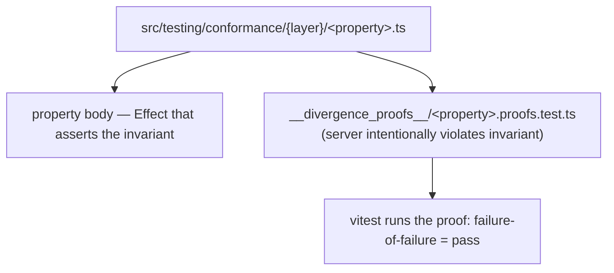

# protocol/testing/conformance/client

_`packages/protocol/src/testing/conformance/client`_

## Purpose

Public barrel for client-side conformance runners and property registrars.

Client-side conformance barrel.

Re-exports every client-side registrar plus the client-runner
primitives. Consumed by the extended `runConformanceSuite` in
`../suite.ts` (implement-staff scope) and by the stub entry
`runClientConformanceSuite` in `./suite.ts`.

## Public surface

### [`acquireClientRunContext`](https://github.com/chughtapan/moltzap/blob/main/packages/protocol/src/testing/conformance/client/runner.ts#L313)

_Function_

```ts
export function acquireClientRunContext(
  opts: ClientConformanceRunOptions,
): Effect.Effect<
  ClientConformanceRunContext,
  ToxicControlError | RealServerAcquireError | RealClientLifecycleError,
  Scope.Scope
>
```

Acquire the full client-side context under one Scope. Returns a
live TestServer, a real-client factory ready to call, and a
handshake-noise guard window.

The TestServer binds on an ephemeral port. Optional Toxiproxy is
acquired when `manageToxiproxy` is set or `toxiproxyUrl` is provided
alongside tier "D".

Errors are typed; no raw throws.

### [`acquireFixture`](https://github.com/chughtapan/moltzap/blob/main/packages/protocol/src/testing/conformance/client/_fixtures.ts#L64)

_Function_

```ts
export function acquireFixture(
  ctx: ClientConformanceRunContext,
  category: PropertyCategory,
  propertyName: string,
): Effect.Effect<ClientFixture, PropertyUnavailable, Scope.Scope>
```

Acquire a live real-client + TestServer connection + handshake window
under a nested Scope. Property bodies wrap their assertion in
`Effect.scoped(acquireFixture(ctx, ...).pipe(Effect.flatMap(...)))`.

Errors are surfaced as `PropertyUnavailable` so a factory fault doesn't
masquerade as a property violation.

### [`awaitConnection`](https://github.com/chughtapan/moltzap/blob/main/packages/protocol/src/testing/conformance/client/runner.ts#L553)

_Function_

```ts
export function awaitConnection(
  testServer: TestServer,
  timeoutMs = DEFAULT_ACCEPT_TIMEOUT_MS,
): Effect.Effect<TestServerConnection, TransportIoError>
```

Fiber-safe helper to await a TestServer connection. Times out so a
never-connecting real client doesn't block the property body
indefinitely.

### [`ClientConformanceRunContext`](https://github.com/chughtapan/moltzap/blob/main/packages/protocol/src/testing/conformance/client/runner.ts#L271)

_Interface_

```ts
export interface ClientConformanceRunContext {
  readonly testServer: TestServer;
  readonly realClientFactory: (
    args: RealClientFactoryArgs,
  ) => Effect.Effect<RealClientHandle, RealClientLifecycleError, Scope.Scope>;
  readonly handshakeWindow: ClientHandshakeWindow;
  readonly toxiproxy: ToxiproxyClient | null;
  readonly opts: ClientConformanceRunOptions;
  readonly seed: number;
  readonly artifacts: Ref.Ref<ReadonlyArray<ConformanceArtifact>>;
}
```

### [`ClientConformanceRunOptions`](https://github.com/chughtapan/moltzap/blob/main/packages/protocol/src/testing/conformance/client/runner.ts#L283)

_Interface_

```ts
export interface ClientConformanceRunOptions {
  readonly tiers: ReadonlyArray<"A" | "B" | "C" | "D" | "E">;
  readonly realClient: (
    args: RealClientFactoryArgs,
  ) => Effect.Effect<RealClientHandle, RealClientLifecycleError, Scope.Scope>;
  readonly replaySeed?: number;
  readonly numRuns?: number;
  readonly manageToxiproxy?: boolean;
  readonly toxiproxyUrl?: string;
  readonly artifactDir?: string;

  /**
   * If `true`, TestServer binds behind a Toxiproxy upstream matching the
   * adversity-tier `downstream` port; otherwise a direct bind. Default:
   * `true` when `tiers` includes `"D"`.
   */
  readonly bindThroughToxiproxy?: boolean;
}
```

### [`ClientConformanceSuiteOptions`](https://github.com/chughtapan/moltzap/blob/main/packages/protocol/src/testing/conformance/client/suite.ts#L71)

_Interface_

```ts
export interface ClientConformanceSuiteOptions {
  /**
   * Factory for the real MoltZap client under test, owned by the
   * suite's Scope. Receives `testServerUrl` from the suite so the real
   * client can point its WS socket at the bound TestServer substrate.
   */
  readonly realClient: (args: {
    readonly testServerUrl: string;
  }) => Effect.Effect<RealClientHandle, RealClientLifecycleError, Scope.Scope>;

  /**
   * Toxiproxy control-plane URL. When `null`, adversity properties are
   * registered and surface `PropertyUnavailable`. Mirrors server-side
   * behavior.
   */
  readonly toxiproxyUrl?: string | null;
  readonly replaySeed?: number;
  readonly numRuns?: number;
  readonly artifactDir?: string;

  /**
   * Default `true`. When `true`, TestServer binds behind Toxiproxy so
   * adversity toxics shape the wire between TestServer and the real
   * client. Set to `false` only for debugging.
   */
  readonly bindThroughToxiproxy?: boolean;
}
```

Consumer-facing options. Mirror of `ConformanceSuiteOptions` on the
server side; only the factory name differs.

### [`ClientFixture`](https://github.com/chughtapan/moltzap/blob/main/packages/protocol/src/testing/conformance/client/_fixtures.ts#L50)

_Interface_

```ts
export interface ClientFixture {
  readonly handle: RealClientHandle;
  readonly connection: TestServerConnection;
  readonly window: ClientHandshakeWindow;
}
```

Fixture returned to every property body after the prologue runs.
Every field below is safe to use inside `fc.asyncProperty` bodies.

### [`ClientHandshakeWindow`](https://github.com/chughtapan/moltzap/blob/main/packages/protocol/src/testing/conformance/client/runner.ts#L234)

_Interface_

```ts
export interface ClientHandshakeWindow {
  readonly freshEmissionTag: Effect.Effect<string>;
  readonly emitTaggedNotification: (opts: {
    readonly connection: TestServerConnection;
    readonly base: NotificationFrame;
    readonly emissionTag: string;
  }) => Effect.Effect<string>;
  readonly emitTaggedResponse: (opts: {
    readonly connection: TestServerConnection;
    readonly base: ResponseFrame;
    readonly emissionTag: string;
  }) => Effect.Effect<string>;
  readonly awaitHandshakeComplete: Effect.Effect<
    void,
    RealClientLifecycleError
  >;
}
```

Handshake-noise guard window.

When a real client connects to TestServer, `packages/client` and the
channel packages emit hello + subscribe + presence frames **before**
the property's first scripted emission. Those frames must not be
accepted as satisfying a later sampled predicate.

Every client-side property that observes frames requests a
`ClientHandshakeWindow` on its fixture and emits via
`emitTaggedNotification` / `emitTaggedResponse`. The window stamps each
emission with a property-authored `emissionTag`; the
`RealClientNotificationSubscriber` filter drops untagged notifications.

adversity-slow-close is the only client-side property exempt (observes
lifecycle signals, not frames).

### [`ClientHandshakeWindow`](https://github.com/chughtapan/moltzap/blob/main/packages/protocol/src/testing/conformance/client/runner.ts#L234)

_Variable_

```ts
export interface ClientHandshakeWindow
```

### [`collectTagged`](https://github.com/chughtapan/moltzap/blob/main/packages/protocol/src/testing/conformance/client/_fixtures.ts#L163)

_Function_

```ts
export function collectTagged(
  handle: RealClientHandle,
  predicate: (tag: string) => boolean,
  opts: { readonly expected: number; readonly budgetMs: number },
): Effect.Effect<ReadonlyArray<TaggedObservation>>
```

### [`freshTag`](https://github.com/chughtapan/moltzap/blob/main/packages/protocol/src/testing/conformance/client/runner.ts#L544)

_Function_

```ts
export function freshTag(window: ClientHandshakeWindow): Effect.Effect<string>
```

Utility: resolve a fresh tag from a handshake window in synchronous-
friendly Effect code. Property bodies call this at the top of each
fast-check iteration.

### [`invariant`](https://github.com/chughtapan/moltzap/blob/main/packages/protocol/src/testing/conformance/client/_fixtures.ts#L186)

_Function_

```ts
export function invariant(
  category: PropertyCategory,
  name: string,
  reason: string,
): PropertyInvariantViolation
```

Build a `PropertyInvariantViolation` for the current property.
Convenience so property bodies don't repeat the tagged-error
construction.

### [`JointConformanceSuiteOptions`](https://github.com/chughtapan/moltzap/blob/main/packages/protocol/src/testing/conformance/client/suite.ts#L469)

_Interface_

```ts
export interface JointConformanceSuiteOptions {
  readonly realServer?: ClientConformanceSuiteOptions["realClient"] extends never
    ? never
    : unknown;
  readonly realClient?: ClientConformanceSuiteOptions["realClient"];
  readonly toxiproxyUrl?: string | null;
  readonly replaySeed?: number;
  readonly numRuns?: number;
  readonly artifactDir?: string;
  readonly bindThroughToxiproxy?: boolean;
}
```

Joint-run option shape — both `realServer?` and `realClient?` supplied,
so the suite exercises a real client against a real server in one run.
The merged `runConformanceSuite` in `../suite.ts` accepts these fields
as an extension of `ConformanceSuiteOptions`.

### [`lookupTagForRawBytes`](https://github.com/chughtapan/moltzap/blob/main/packages/protocol/src/testing/conformance/client/runner.ts#L439)

_Function_

```ts
export function lookupTagForRawBytes(rawBytes: Uint8Array): string | null
```

Look up the tag the runner stamped on the wire-frame whose serialized
bytes match `rawBytes`. Returns `null` when the bytes were not produced
by `emitTaggedNotificationDefault` (handshake-noise frames, server-side
pings, etc.).

Exported for `_fixtures.ts`'s `filterTagged` helper.

### [`makeClientHandshakeWindow`](https://github.com/chughtapan/moltzap/blob/main/packages/protocol/src/testing/conformance/client/runner.ts#L465)

_Function_

```ts
export function makeClientHandshakeWindow(
  handle: RealClientHandle,
): Effect.Effect<ClientHandshakeWindow, never, Scope.Scope>
```

Build a `ClientHandshakeWindow` from a real-client handle. Returns a
window whose `awaitHandshakeComplete` resolves when `handle.ready`
does; emissions are passed through to the connection the property
body chooses (TestServer may have multiple connections).

### [`notificationParamsRecord`](https://github.com/chughtapan/moltzap/blob/main/packages/protocol/src/testing/conformance/client/_fixtures.ts#L120)

_Function_

```ts
export function notificationParamsRecord(
  params: unknown,
): Readonly<Record<string, unknown>>
```

### [`ObservedNotification`](https://github.com/chughtapan/moltzap/blob/main/packages/protocol/src/testing/conformance/client/runner.ts#L161)

_Interface_

```ts
export interface ObservedNotification {
  readonly emissionTag: string | null;
  readonly decoded: unknown;
  readonly rawBytes: Uint8Array;
  readonly observedAtMs: number;
}
```

Observed notification after the real client has surfaced it on its public
subscriber API. `rawBytes` carries the payload byte-for-byte;
`decoded` is unknown because divergence proofs intentionally model clients
that surface malformed notifications.

### [`RealClientCloseEvent`](https://github.com/chughtapan/moltzap/blob/main/packages/protocol/src/testing/conformance/client/runner.ts#L211)

_Interface_

```ts
export interface RealClientCloseEvent {
  readonly code: number;
  readonly reason: string;
  readonly observedAtMs: number;
}
```

Close-event shape surfaced by `RealClientHandle.closeSignal`.

### [`RealClientFactoryArgs`](https://github.com/chughtapan/moltzap/blob/main/packages/protocol/src/testing/conformance/client/runner.ts#L267)

_Interface_

```ts
export interface RealClientFactoryArgs {
  readonly testServerUrl: string;
}
```

Factory arguments the suite passes to every `realClient()` invocation.
The factory uses `testServerUrl` to point its WS client at the bound
TestServer substrate.

### [`RealClientHandle`](https://github.com/chughtapan/moltzap/blob/main/packages/protocol/src/testing/conformance/client/runner.ts#L80)

_Interface_

```ts
export interface RealClientHandle {
  /**
   * Stable identifier emitted in the connect frame's `agentId` field.
   * Used to correlate TestServer-observed inbound frames to this client.
   */
  readonly agentId: string;

  /**
   * Fully-connected promise — resolves after the handshake completes and
   * the client is ready to receive notifications. Property bodies await this
   * before scripting TestServer emissions so the handshake-noise guard
   * window is closed (see `ClientHandshakeWindow`).
   */
  readonly ready: Effect.Effect<void, RealClientLifecycleError>;

  /**
   * Real client's public notification-subscriber surface. Every captured notification
   * is tagged with the property-authored `emissionId` when the property
   * uses `ClientHandshakeWindow.emitTaggedNotification`; predicates filter by
   * that tag to exclude handshake-noise frames.
   */
  readonly notifications: RealClientNotificationSubscriber;

  /**
   * Real client's documented RPC caller. The model-equivalence,
   * request-id-uniqueness, and adversity-timeout predicates invoke this
   * and assert on the returned promise's resolution / rejection.
   */
  readonly call: RealClientRpcCaller;

  /**
   * Real client's documented close / disconnect lifecycle signal. The
   * adversity-slow-close predicate awaits this on slow-close and asserts
   * it resolves within the reap deadline.
   */
  readonly closeSignal: Effect.Effect<RealClientCloseEvent>;

  /**
   * Scope-release hook. The runner's Scope calls this on teardown; a
   * close that throws surfaces as `RealClientLifecycleError`.
   */
  readonly close: Effect.Effect<void, RealClientLifecycleError>;
}
```

Opaque handle to a live real MoltZap client connected to `TestServer`.
The consumer's factory returns this under a `Scope`; scope release runs
`close()`.

Every field below is a **public** observable surface on the real
client — no private reads, no monkey-patching, no log scraping. When a
channel package's client is private, the consumer exposes it via a
test-support subpath export.

### [`RealClientLifecycleError`](https://github.com/chughtapan/moltzap/blob/main/packages/protocol/src/testing/conformance/client/runner.ts#L188)

_Class_

```ts
export class RealClientLifecycleError extends Data.TaggedError(
  "RealClientLifecycleError",
)<{
  readonly cause: unknown;
}> {}
```

Real-client lifecycle error tag. All three cover the Principle 3 error
channel; no raw throws escape the factory's Scope.

### [`RealClientNotificationFilter`](https://github.com/chughtapan/moltzap/blob/main/packages/protocol/src/testing/conformance/client/runner.ts#L151)

_TypeAlias_

```ts
export type RealClientNotificationFilter = (
  notification: DecodedNotification<AnyNotificationDefinition>,
) => boolean;
```

Predicate over a decoded notification frame. The conformance adapter
plumbs this directly to `MoltZapAgentClient.subscribeAll(refinement)` —
no inline grammar reconstruction. Absent = match-all.

### [`RealClientNotificationSubscriber`](https://github.com/chughtapan/moltzap/blob/main/packages/protocol/src/testing/conformance/client/runner.ts#L134)

_Interface_

```ts
export interface RealClientNotificationSubscriber {
  readonly subscribe: (
    filter?: RealClientNotificationFilter,
  ) => Effect.Effect<RealClientSubscription, RealClientLifecycleError>;
  readonly snapshot: Effect.Effect<ReadonlyArray<ObservedNotification>>;
}
```

Real client's public notification-subscriber surface. Property bodies
`subscribe` once per fixture and drain via `snapshot`. Concrete shape
is per-consumer (`packages/client`'s `subscribe`/`subscribeAll` Stream
surface, channel packages' native event pipe); the wrapper adapts it
to this interface.

`filter` is a predicate over `DecodedNotification`. Pass `undefined`
(or omit) for match-all.

### [`RealClientRpcCaller`](https://github.com/chughtapan/moltzap/blob/main/packages/protocol/src/testing/conformance/client/runner.ts#L177)

_Interface_

```ts
export interface RealClientRpcCaller {
  readonly call: (
    method: string,
    params: unknown,
  ) => Effect.Effect<ResponseFrame | NotificationFrame, RealClientRpcError>;
}
```

Real client's RPC caller. Takes the raw JSON-RPC method + params;
returns the decoded response or a typed error. Contract: the real client
itself generates request IDs — the property does not mint them and does
not see them. Tests that need to verify id-correlation discriminate
via the `result` content of the response: spurious responses carry a
marker payload that the matching response does not, so a correctly
correlating client returns the matching payload.

### [`RealClientRpcError`](https://github.com/chughtapan/moltzap/blob/main/packages/protocol/src/testing/conformance/client/runner.ts#L199)

_Class_

```ts
export class RealClientRpcError extends Data.TaggedError("RealClientRpcError")<{
  readonly cause: unknown;
  readonly documentedErrorTag: string | null;
  readonly kind:
    | "timeout"
    | "server-error"
    | "malformed-response"
    | "disconnected";
  readonly method: string;
}> {}
```

Typed error surface for real-client RPC calls.

### [`RealClientSubscription`](https://github.com/chughtapan/moltzap/blob/main/packages/protocol/src/testing/conformance/client/runner.ts#L141)

_Interface_

```ts
export interface RealClientSubscription {
  readonly id: string;
  readonly unsubscribe: Effect.Effect<void>;
}
```

### [`registerAllClientProperties`](https://github.com/chughtapan/moltzap/blob/main/packages/protocol/src/testing/conformance/client/suite.ts#L129)

_Function_

```ts
export function registerAllClientProperties(
  ctx: ClientConformanceRunContext,
): void
```

Register every client-side property (14 total) against `ctx`. Property
files in `conformance/client/*.ts` each export one `registerXxxClient`
registrar; this helper is the single call site.

### [`registerArchiveLifecycleClient`](https://github.com/chughtapan/moltzap/blob/main/packages/protocol/src/testing/conformance/client/delivery.ts#L437)

_Function_

```ts
export function registerArchiveLifecycleClient(
  ctx: ClientConformanceRunContext,
): void
```

Archive lifecycle client — TestServer emits archive then unarchive
lifecycle events. The real client subscriber must surface both in
emission order.

### [`registerEmittedFrameTag`](https://github.com/chughtapan/moltzap/blob/main/packages/protocol/src/testing/conformance/client/runner.ts#L427)

_Function_

```ts
export function registerEmittedFrameTag(raw: string, tag: string): void
```

Synchronous tag-record entry point. Exposed so divergence-proof
harnesses (and any other test scaffold that wraps notification
emission outside `emitTaggedNotificationDefault`) share the same
registry as the real adapter.

### [`registerFanOutCardinalityClient`](https://github.com/chughtapan/moltzap/blob/main/packages/protocol/src/testing/conformance/client/delivery.ts#L89)

_Function_

```ts
export function registerFanOutCardinalityClient(
  ctx: ClientConformanceRunContext,
): void
```

Client-side `fan-out-cardinality` — TestServer emits N fan-out
`NotificationFrame`s (one per conversation participant position) to a
real client subscribed to the conversation. All N carry the same
`emissionTag` campaign; each carries a per-position `positionIndex` in
the payload.

Predicate (conjunction):
  - `observedByCampaign.length === N`
  - every `positionIndex` in `[0..N)` appears exactly once
  - observation order matches emission order

Discriminates: a client that coalesces duplicate fan-out frames,
drops one, or reorders the sequence fails.

### [`registerLatencyResilienceClient`](https://github.com/chughtapan/moltzap/blob/main/packages/protocol/src/testing/conformance/client/adversity.ts#L65)

_Function_

```ts
export function registerLatencyResilienceClient(
  ctx: ClientConformanceRunContext,
): void
```

Client half of `adversity-latency` — re-run the fan-out cardinality
property client-side under latency. When Toxiproxy is absent, emit the
N events without induced latency but assert the same cardinality
invariant — the predicate remains discriminating against drops/dups.

### [`registerMalformedFrameHandlingClient`](https://github.com/chughtapan/moltzap/blob/main/packages/protocol/src/testing/conformance/client/schema-conformance.ts#L85)

_Function_

```ts
export function registerMalformedFrameHandlingClient(
  ctx: ClientConformanceRunContext,
): void
```

Client half of `malformed-frame-handling` — TestServer emits a
bit-flipped / truncated / oversized frame; real client drops it
silently. A subsequent tagged valid notification still surfaces
(liveness proof). A client that crashes on the malformed frame
disconnects, preventing the liveness probe from surfacing within the
deadline.

Predicate: liveness — next tagged notification surfaces within deadline.

### [`registerModelEquivalenceClient`](https://github.com/chughtapan/moltzap/blob/main/packages/protocol/src/testing/conformance/client/rpc-semantics.ts#L40)

_Function_

```ts
export function registerModelEquivalenceClient(
  ctx: ClientConformanceRunContext,
): void
```

Client half of `model-equivalence` — property issues
`realClient.call("agents/list", {})`; TestServer captures the inbound
request id and emits a well-shaped response; the client's pending call
resolves with that result.

Discriminates: a client that routes the response to the wrong
pending call (id-to-deferred mis-match) fails — the promise will
never resolve within the budget.

### [`registerNotificationWellFormednessClient`](https://github.com/chughtapan/moltzap/blob/main/packages/protocol/src/testing/conformance/client/schema-conformance.ts#L61)

_Function_

```ts
export function registerNotificationWellFormednessClient(
  ctx: ClientConformanceRunContext,
): void
```

Client-side `notification-well-formedness` — TestServer emits a
property-sampled valid `NotificationFrame` with a property-authored
`emissionTag`; real client's subscriber surfaces a notification whose
payload schema-matches within deadline.

Predicate: `Value.Check(NotificationFrameSchema, observed.decoded)` passes
AND `params.__emissionTag === emissionTag`.

Discriminates: a client that strips or reorders required schema
fields when surfacing notifications fails.

### [`registerPayloadOpacityClient`](https://github.com/chughtapan/moltzap/blob/main/packages/protocol/src/testing/conformance/client/delivery.ts#L230)

_Function_

```ts
export function registerPayloadOpacityClient(
  ctx: ClientConformanceRunContext,
): void
```

Client-side `payload-opacity` — TestServer emits a single
`NotificationFrame` whose payload contains a distinct byte-sequence
token; real client's subscriber surfaces a frame whose raw bytes still
contain that token.

Predicate (strict): the raw-bytes view of the surfaced notification
includes the emitted token byte-for-byte. A client that routes
payloads through a lossy re-serialization (e.g., key-reorder JSON
stringify) fails.

### [`registerRequestIdUniquenessClient`](https://github.com/chughtapan/moltzap/blob/main/packages/protocol/src/testing/conformance/client/rpc-semantics.ts#L87)

_Function_

```ts
export function registerRequestIdUniquenessClient(
  ctx: ClientConformanceRunContext,
): void
```

Client half of `request-id-uniqueness` — TestServer emits a spurious
response with marker payload `{ __spurious: true }`, then a matching-id
response with `{ agents: [] }`.
A correctly correlating client returns the matching payload.

### [`registerResetPeerRecoveryClient`](https://github.com/chughtapan/moltzap/blob/main/packages/protocol/src/testing/conformance/client/adversity.ts#L203)

_Function_

```ts
export function registerResetPeerRecoveryClient(
  ctx: ClientConformanceRunContext,
): void
```

Client half of `adversity-reset-peer` — `reset_peer` mid-flight,
post-reconnect exactly-once delivery. Live-delivery-only.

### [`registerSchemaExhaustiveFuzzClient`](https://github.com/chughtapan/moltzap/blob/main/packages/protocol/src/testing/conformance/client/boundary.ts#L35)

_Function_

```ts
export function registerSchemaExhaustiveFuzzClient(
  ctx: ClientConformanceRunContext,
): void
```

Client half of `schema-exhaustive-fuzz` — TestServer emits arbitrary
`NotificationFrame`s across many shapes to a real client. Properties
interleave with a tagged liveness probe and a task-boundary assertion.

Predicate (both must hold):
  1. No crash — real client stays `ready`; no spurious closeSignal.
  2. Liveness probe — a valid tagged notification emitted post-fuzz surfaces.

### [`registerSlicerFramingClient`](https://github.com/chughtapan/moltzap/blob/main/packages/protocol/src/testing/conformance/client/adversity.ts#L180)

_Function_

```ts
export function registerSlicerFramingClient(
  ctx: ClientConformanceRunContext,
): void
```

Client half of `adversity-slicer` — partial-frame splitting under
slicer. Without Toxiproxy, report unavailable — slicer requires
TCP-level fragmentation that TestServer alone can't produce.

### [`registerSlowCloseCleanupClient`](https://github.com/chughtapan/moltzap/blob/main/packages/protocol/src/testing/conformance/client/adversity.ts#L319)

_Function_

```ts
export function registerSlowCloseCleanupClient(
  ctx: ClientConformanceRunContext,
): void
```

Client half of `adversity-slow-close` — TestServer initiates a slow
close; real client's documented close-signal resolves within the reap
deadline; suite Scope releases cleanly.

Predicate: `closeSignal` resolves within budget; Scope teardown
completes.

### [`registerTaskBoundaryIsolationClient`](https://github.com/chughtapan/moltzap/blob/main/packages/protocol/src/testing/conformance/client/delivery.ts#L330)

_Function_

```ts
export function registerTaskBoundaryIsolationClient(
  ctx: ClientConformanceRunContext,
): void
```

Client half of `task-boundary-isolation` — TestServer emits N task-A
notifications (tagged campaignA) and M task-B notifications (tagged
campaignB) to a real client subscribed with a `conversationId` filter
set to task-A. The client's task-A subscriber surfaces zero campaignB
events.

Predicate: `observedCampaignB.length === 0`.

### [`registerTimeoutSurfaceClient`](https://github.com/chughtapan/moltzap/blob/main/packages/protocol/src/testing/conformance/client/adversity.ts#L231)

_Function_

```ts
export function registerTimeoutSurfaceClient(
  ctx: ClientConformanceRunContext,
): void
```

Client half of `adversity-timeout` — TestServer accepts a sampled RPC
but never responds; real client's documented typed-error surface
(`RpcTimeoutError`) fires within its own timeout budget.

Predicate (strict):
  - `RealClientRpcError.documentedErrorTag === "RpcTimeoutError"`
  - `RealClientRpcError.kind === "timeout"`

### [`runAutoHandshakeResponder`](https://github.com/chughtapan/moltzap/blob/main/packages/protocol/src/testing/conformance/client/runner.ts#L495)

_Function_

```ts
export function runAutoHandshakeResponder(
  connection: TestServerConnection,
  agentId: string,
): Effect.Effect<void, never, Scope.Scope>
```

Auto-handshake responder. Spawned as a background fiber by property
bodies; watches a TestServer connection's inbound capture buffer for
`network/connect` RPC requests and responds with a minimal valid
`HelloOkSchema`. Required because `MoltZapAgentClient.connect()` blocks
on the network/connect response before `ready` resolves.

Exposed as a helper so each property body can choose whether to run
the auto-responder or assert directly against the raw inbound stream
(e.g., the request-id-uniqueness test wants to observe the inbound ids).

### [`runClientConformanceSuite`](https://github.com/chughtapan/moltzap/blob/main/packages/protocol/src/testing/conformance/client/suite.ts#L171)

_Function_

```ts
export function runClientConformanceSuite(
  opts: ClientConformanceSuiteOptions,
): Effect.Effect<
  SuiteResult,
  ToxicControlError | RealServerAcquireError | RealClientLifecycleError
>
```

End-to-end client-side library entry. Acquires context, registers
every client-side property, runs them, closes Scope. Returns a
typed `SuiteResult` (reused from server-side — same failure shape).

The conformance suite defines properties any compliant
client/server pair must satisfy. Each property ships an
**executable** (a divergence proof) that intentionally fails the
property to prove the assertion has teeth.



External consumers (e.g. `moltzap-arena`) drop a ~20-line vitest
wrapper matching the AC22 template (see
`packages/protocol/CLAUDE.md`) and the suite runs against their
real WS client.

### [`subscribeAll`](https://github.com/chughtapan/moltzap/blob/main/packages/protocol/src/testing/conformance/client/_fixtures.ts#L199)

_Function_

```ts
export function subscribeAll(
  handle: RealClientHandle,
): Effect.Effect<void, PropertyUnavailable, Scope.Scope>
```

Subscribe the fixture's real client to all notifications (no filter) so the
property body can observe every tagged emission. Returns the
subscription so the Scope teardown can call `unsubscribe`.

### [`TaggedObservation`](https://github.com/chughtapan/moltzap/blob/main/packages/protocol/src/testing/conformance/client/_fixtures.ts#L112)

_Interface_

```ts
export interface TaggedObservation {
  readonly tag: string;
  readonly raw: Uint8Array;
  readonly decoded: NotificationFrame;
  readonly params: Readonly<Record<string, unknown>>;
  readonly notificationName: NotificationFrame["method"];
}
```

Poll a real client's observation stream for notifications whose
`params.__emissionTag` matches `tag`. Returns the accumulated tagged
observations (possibly empty) after `budgetMs` has elapsed or
`expected` matches have arrived, whichever comes first.

Used by predicates that need to discriminate real emissions from
handshake-window noise.

## Files

- `_fixtures.ts`
- `adversity.ts`
- `boundary.ts`
- `delivery.ts`
- `rpc-semantics.ts`
- `runner.ts`
- `schema-conformance.ts`
- `suite.ts`
