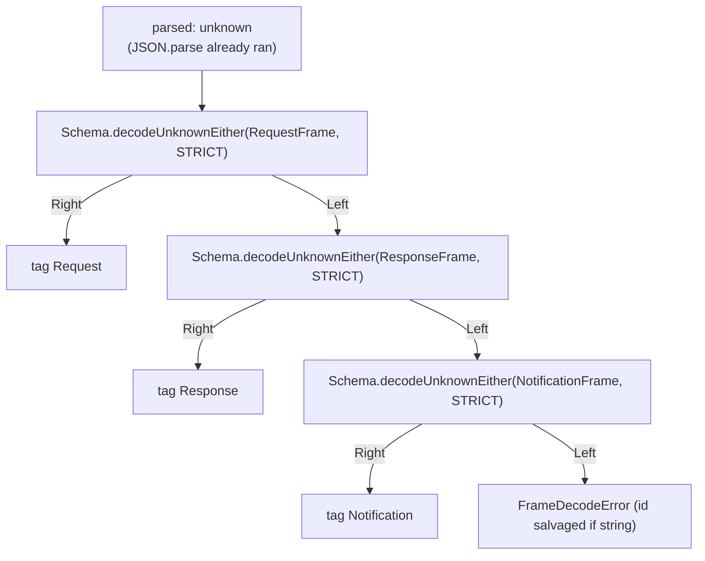
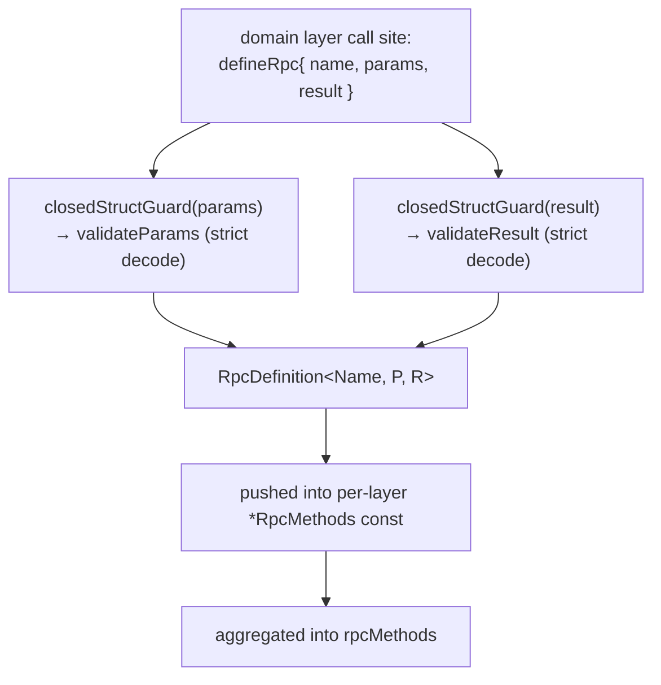
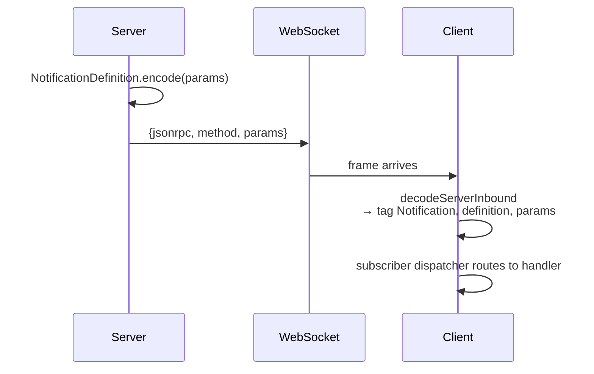
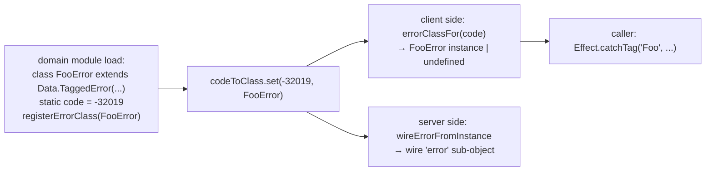

# protocol/transport

_`packages/protocol/src/transport`_

## Purpose

Public barrel for JSON-RPC transport descriptors and runtime helpers.

## Public surface

### [`AgentClientConnection`](https://github.com/chughtapan/moltzap/blob/main/packages/protocol/src/transport/connection.ts#L171)

_Interface_

```ts
export interface AgentClientConnection
  extends ConnectionIdentity,
    OutboundCall<AnyAgentClientRpcDefinition>,
```

`AgentClientConnection` — plain agent client. Outbound surface is
the full `serverRpcMethods` catalog. Outbound notifications: none
(clients consume notifications; they do not originate them) — the
`notify` method is typed `never`, which fails any call site. No
inbound surface (the AgentClient kind's inbound catalog is empty).

### [`AgentClientConnectionConfig`](https://github.com/chughtapan/moltzap/blob/main/packages/protocol/src/transport/connection.ts#L232)

_Interface_

```ts
export interface AgentClientConnectionConfig<Env, Conn> {
  readonly id: string;
  readonly slots: ErasedSlotTable<Env, Conn>;
  readonly write: (raw: string) => Effect.Effect<void, unknown>;
  readonly idPrefix: string;
}
```

Equivalent config for the AgentClient factory. `slots` is the empty
table (the AgentClient kind's inbound catalog is empty); the factory
accepts it for forward compatibility (if a future spec adds
AgentClient-inbound RPCs, the slot table demands coverage).

### [`AgentClientRpcGroup`](https://github.com/chughtapan/moltzap/blob/main/packages/protocol/src/transport/rpc-method-groups.ts#L105)

_Variable_

```ts
export const AgentClientRpcGroup = groupFromCatalog(agentClientRpcMethods)
```

Outbound group callable from `MoltZapAgentClient`.

### [`AlreadyConnected`](https://github.com/chughtapan/moltzap/blob/main/packages/protocol/src/transport/wire-errors.ts#L161)

_Class_

```ts
export class AlreadyConnected extends Data.TaggedError("AlreadyConnected")<
  RpcErrorPayload & {
    readonly principal: "agent" | "app";
  }
> {
  static readonly code = -32010;
  static readonly message =
    "Principal already has an active connection. Disconnect the prior session first.";
}
```

A principal (agent or app) already holds an active connection. Fires at
the Connect handler's per-connection preflight/atomic gate (a socket
already authenticated as either arm) and at the per-principal gate
(`AgentEndpointResolver.add` / `AppRegistry.register` rejecting a second
binding). The `principal` discriminator names which arm the conflict is
on; the wire code is shared.

### [`AnyCapabilityMiddleware`](https://github.com/chughtapan/moltzap/blob/main/packages/protocol/src/transport/capability-middleware.ts#L99)

_TypeAlias_

```ts
export type AnyCapabilityMiddleware = CapabilityMiddleware<
  never,
  AnyContextTag,
  any,
  any,
  any
>;
```

The tuple of middlewares carried on a definition's `middlewares` field.
Each element's `Params` is the OWNING method's decoded params type. The
`unknown`/`never` slots are intentionally wide here — the per-method
tuple narrows them at the descriptor literal (the same erasure-vs-recover
pattern as `CapabilityDescriptor` / `CapabilitiesOf`).

### [`AppCallableRpcGroup`](https://github.com/chughtapan/moltzap/blob/main/packages/protocol/src/transport/rpc-method-groups.ts#L108)

_Variable_

```ts
export const AppCallableRpcGroup = groupFromCatalog(appCallableRpcMethods)
```

Outbound group callable from an app connection: superset of the agent-client group.

### [`AppCallbackHandlers`](https://github.com/chughtapan/moltzap/blob/main/packages/protocol/src/transport/handlers.ts#L109)

_TypeAlias_

```ts
export type AppCallbackHandlers<
  Ctx,
  Caps extends Context.Tag<any, any> = never,
> = HandlerTable<AppCallbackInboundRpcDefinition, Ctx, Caps>;
```

### [`AppCallbackInboundRpcDefinition`](https://github.com/chughtapan/moltzap/blob/main/packages/protocol/src/transport/handlers.ts#L107)

_TypeAlias_

```ts
export type AppCallbackInboundRpcDefinition = AnyAppCallbackRpcDefinition;

export type AppCallbackHandlers<
  Ctx,
  Caps extends Context.Tag<any, any> = never,
> = HandlerTable<AppCallbackInboundRpcDefinition, Ctx, Caps>;
```

`AppCallbackHandlers` — handler table for an app moderating one or
more tasks. Catalog: `appCallbackMethods` —
`DispatchAuthorize`, `MessagesAuthorize`, `TaskCreate`. All three
REQUIRED (R14b); vacuous-deny moderators must write the handler
explicitly. `TaskCreate` is the server-initiated callback fired
after `task/request` lands the task in `waiting`; the app's typed
verdict drives the lifecycle transition.

### [`AppCallbackRpcGroup`](https://github.com/chughtapan/moltzap/blob/main/packages/protocol/src/transport/rpc-method-groups.ts#L102)

_Variable_

```ts
export const AppCallbackRpcGroup = groupFromCatalog(appCallbackMethods)
```

Server-to-client callback group: `dispatch/authorize`, `messages/authorize`, `task/create`.

### [`AppClientConnection`](https://github.com/chughtapan/moltzap/blob/main/packages/protocol/src/transport/connection.ts#L197)

_Interface_

```ts
export interface AppClientConnection<Env = unknown, Conn = unknown>
```

`AppClientConnection` — the CLIENT-facing outbound connection a
moderating app drives (distinct from the SERVER-side `AppConnection`
arm in `packages/server/src/transport/connection.ts → AppConnection`,
which is the inbound app-authenticated socket state the server stores).
Outbound surface is the full `serverRpcMethods` catalog (an app client
is a superset of an AgentClient at the type level). Outbound
notifications: none. Inbound surface is the `appCallbackMethods`
catalog, dispatched via the kind's ErasedSlotTable; every slot
is a REQUIRED real handler (Spec D3 R14b retired the optional
`forbidden` / `noOpNotification` sentinels), so vacuous-deny moderators
must bind an explicit `ForbiddenError`-returning handler per catalog
method.

### [`AppClientConnectionConfig`](https://github.com/chughtapan/moltzap/blob/main/packages/protocol/src/transport/connection.ts#L243)

_Interface_

```ts
export interface AppClientConnectionConfig<Env, Conn> {
  readonly id: string;
  readonly slots: ErasedSlotTable<Env, Conn>;
  readonly write: (raw: string) => Effect.Effect<void, unknown>;
  readonly idPrefix: string;
}
```

Config for the app-client factory. The app owns the `appCallbackMethods`
catalog inbound; its outbound surface is the full `serverRpcMethods` catalog.

### [`buildAgentClientDispatcher`](https://github.com/chughtapan/moltzap/blob/main/packages/protocol/src/transport/dispatch.ts#L104)

_Function_

```ts
export function buildAgentClientDispatcher<Env, Conn>(
  config: AgentClientConnectionConfig<Env, Conn>,
): Effect.Effect<AgentClientConnection, never, Scope.Scope>
```

Build the agent-client dispatcher. Wires the originator only (no
inbound dispatch — the AgentClient kind's inbound catalog is empty,
so `config.slots` is the empty table `{}`). The empty `notify` shape
is `never`-typed at the type level (no call site can satisfy the
constraint).

### [`buildAppClientDispatcher`](https://github.com/chughtapan/moltzap/blob/main/packages/protocol/src/transport/dispatch.ts#L132)

_Function_

```ts
export function buildAppClientDispatcher<Env, Conn>(
  config: AppClientConnectionConfig<Env, Conn>,
): Effect.Effect<AppClientConnection<Env, Conn>, never, Scope.Scope>
```

Build the app-client dispatcher. Wires both the inbound dispatch loop
(against `appCallbackMethods`) and the outbound originator (against
`serverRpcMethods`). Spec D3 R14b made every app-inbound slot
REQUIRED: callers must register a handler for each catalog method;
vacuous-deny moderators bind an explicit `ForbiddenError` handler.

### [`buildServerDispatcher`](https://github.com/chughtapan/moltzap/blob/main/packages/protocol/src/transport/dispatch.ts#L77)

_Function_

```ts
export function buildServerDispatcher<Env, Conn>(
  config: ServerConnectionConfig<Env, Conn>,
): Effect.Effect<ServerConnection<Env, Conn>, never, Scope.Scope>
```

Build the server-side dispatcher. Wires the inbound slot-table
dispatch loop + the outbound originator (app-callback path) into a
single `ServerConnection` value. `Env` is the slot table's residual
service-tag union; `Conn` is the server's three-arm `Connection`.

### [`callerAgentId`](https://github.com/chughtapan/moltzap/blob/main/packages/protocol/src/transport/current-principal.ts#L67)

_Variable_

```ts
export const callerAgentId: Effect.Effect<AgentId, never, CurrentPrincipal> =
  Effect.gen(function* () {
    const p = yield* CurrentPrincipal;
    // Exhaustive narrow on the tagged union — NOT an `as { agentId }`
    // assertion. The agent arm's `agentId` is reached by discriminant.
    return p._tag === "AgentContext"
      ? p.agentId
      : yield* Effect.die(
          new Error(
            `capability derivePayload reached a non-agent principal: ${p._tag}`,
          ),
        );
  }).pipe(Effect.withSpan("callerAgentId"))
```

Impossible-state defect: a capability `derivePayload` read the principal
and found a NON-agent arm. Every live descriptor cap is agent-originated
(its binding's `callablePrincipal` is `"agent"`), so the binding
guarantees an agent caller; an app arm here is a wiring defect, not a
caller-actionable error. Effect.die (not a caller-visible error)
because the principal-kind gate already rejected non-agent callers.

### [`CapabilityMiddleware`](https://github.com/chughtapan/moltzap/blob/main/packages/protocol/src/transport/capability-middleware.ts#L57)

_Interface_

```ts
export interface CapabilityMiddleware<
  Params,
  Provides extends AnyContextTag,
  Input,
  Env,
  Fail = never,
> {
  /** The service Tag the middleware PROVIDES (effect's `provides`). */
  readonly provides: Provides;

  /**
   * Typed, payload-only payload-derivation (was `CapabilityDescriptor.argsOf`).
   * Reads the DECODED per-method params (A9: `Params`, not `unknown`) and
   * the principal via `yield* CurrentPrincipal` (NO `ctx` parameter). The
   * `R` channel declares `CurrentPrincipal`; the dispatcher provides it.
   */
  readonly derivePayload: (
    params: Params,
  ) => Effect.Effect<Input, never, CurrentPrincipal>;

  /**
   * Obtain the service value under `Env` (the today
   * `serverCapabilityProviders` entry, now typed: input is `derivePayload`'s
   * output, output is the `Provides` service value).
   */
  readonly obtain: (
    input: Input,
  ) => Effect.Effect<Context.Tag.Service<Provides>, Fail, Env>;
}
```

A per-rpc capability middleware. The carrier for the middleware-reshaped
descriptor caps.

### [`ConflictError`](https://github.com/chughtapan/moltzap/blob/main/packages/protocol/src/transport/wire-errors.ts#L123)

_Class_

```ts
export class ConflictError extends Data.TaggedError(
  "Conflict",
)<RpcErrorPayload> {
  static readonly code = -32003;
  static readonly message = "Conflict";
}
```

Conflict on a resource (cross-cutting; e.g., duplicate registration).

### [`CurrentPrincipal`](https://github.com/chughtapan/moltzap/blob/main/packages/protocol/src/transport/current-principal.ts#L55)

_Class_

```ts
export class CurrentPrincipal extends Context.Tag(
  "@moltzap/protocol/CurrentPrincipal",
)<CurrentPrincipal, Principal>() {}
```

Protocol-owned `Context.Tag` carrying the request's authenticated
Principal. The capability middleware's `derivePayload` `yield*`s
it WITHOUT importing the server; the server SATISFIES it by
`provideService(CurrentPrincipal, principalCtx)` at the dispatch site.
Provided ONLY on authenticated/capability-bearing methods — capabilities
never run on the unauth Connect frame — so the unauth arm is never a
concern here.

### [`DecodedFrame`](https://github.com/chughtapan/moltzap/blob/main/packages/protocol/src/transport/wire.ts#L133)

_TypeAlias_

```ts
export type DecodedFrame =
  | { readonly _tag: "Request"; readonly frame: RequestFrame }
```

### [`DecodedNotification`](https://github.com/chughtapan/moltzap/blob/main/packages/protocol/src/transport/rpc-groups.ts#L53)

_TypeAlias_

```ts
export type DecodedNotification<
  D extends AnyNotificationDefinition,
  R = unknown,
> = D extends AnyNotificationDefinition
```

A decoded notification carries the discriminator + descriptor + typed
params + the original wire `jsonrpc`. It does NOT extend `NotificationFrame`
— re-encoding goes through `definition.encode(params)`, not by re-serializing
this struct, so the strict-additionalProperties wire schema stays unstuck.

The optional second parameter `R` narrows the `params` field to the refined
type — used by `MoltZapAgentClient.subscribe`'s user-defined-type-guard
overload (spec #596 / architect plan §5.2). The default sentinel
`unknown` resolves to the per-branch `NotificationParamsOf<D>` shape,
preserving the one-arg form for every existing consumer.

The default uses an `unknown` sentinel rather than `NotificationParamsOf<D>`
because TS does not distribute type-alias defaults through the
`D extends AnyNotificationDefinition` distributive conditional below —
a `NotificationParamsOf<D>` default would resolve once over the input
union and break per-branch params narrowing for `D` unions like
`DispatchesConsumed | DispatchesExpired`. Carrying `R` as a sentinel and
resolving inside the conditional keeps the original `params` shape per
distribution branch when the one-arg form is used.

### [`DecodedRpcRequest`](https://github.com/chughtapan/moltzap/blob/main/packages/protocol/src/transport/rpc-groups.ts#L22)

_TypeAlias_

```ts
export type DecodedRpcRequest<D extends AnyServerRpcDefinition> =
```

### [`decodeFrame`](https://github.com/chughtapan/moltzap/blob/main/packages/protocol/src/transport/wire.ts#L167)

_Function_

```ts
export function decodeFrame(
  parsed: unknown,
): Effect.Effect<DecodedFrame, FrameDecodeError>
```

Classify one already-`JSON.parse`d value as a JSON-RPC Request, Response,
or Notification frame — fail-closed on anything else.

The discrimination runs `Schema.decodeUnknownEither(...,
{ onExcessProperty: "error" })` against each frame schema in the existing
precedence (Request → Response → Notification). The `{ onExcessProperty:
"error" }` option preserves the former AJV `strict` rejection: a frame with
an extra top-level key fails decode at EVERY arm and falls through to
`FrameDecodeError` — the conformance `extra-property` / `oversized`
mutators depend on this.



### [`decodeNotification`](https://github.com/chughtapan/moltzap/blob/main/packages/protocol/src/transport/rpc-groups.ts#L123)

_Function_

```ts
export function decodeNotification<
  const Definitions extends readonly AnyNotificationDefinition[],
>(
  definitions: Definitions,
  frame: NotificationFrame,
): Effect.Effect<
  DecodedNotification<Definitions[number]>,
  NotificationDecodeError
>
```

### [`decodeRpcParams`](https://github.com/chughtapan/moltzap/blob/main/packages/protocol/src/transport/method.ts#L225)

_Function_

```ts
export function decodeRpcParams<
  Name extends string,
  P extends Schema.Schema.AnyNoContext,
  R extends Schema.Schema.AnyNoContext,
>(
  definition: RpcDefinition<Name, P, R>,
  data: unknown,
): Effect.Effect<Schema.Schema.Type<P>, RpcParamsDecodeError>
```

### [`decodeRpcRequest`](https://github.com/chughtapan/moltzap/blob/main/packages/protocol/src/transport/rpc-groups.ts#L98)

_Function_

```ts
export function decodeRpcRequest<
  const Definitions extends readonly AnyServerRpcDefinition[],
>(
  definitions: Definitions,
  frame: RequestFrame,
): Effect.Effect<
  DecodedRpcRequest<Definitions[number]>,
  RpcRequestDecodeError
>
```

### [`decodeRpcResult`](https://github.com/chughtapan/moltzap/blob/main/packages/protocol/src/transport/method.ts#L238)

_Function_

```ts
export function decodeRpcResult<
  Name extends string,
  P extends Schema.Schema.AnyNoContext,
  R extends Schema.Schema.AnyNoContext,
>(
  definition: RpcDefinition<Name, P, R>,
  data: unknown,
): Effect.Effect<Schema.Schema.Type<R>, RpcResultDecodeError>
```

### [`defineNotification`](https://github.com/chughtapan/moltzap/blob/main/packages/protocol/src/transport/method.ts#L185)

_Function_

```ts
export function defineNotification<
  Name extends string,
  P extends Schema.Schema.AnyNoContext,
>(def: { name: Name; params: P }): NotificationDefinition<Name, P>
```

Sibling of defineRpc for server-to-client notifications.
Same pipeline minus the result schema and response encoder —
notifications are fire-and-forget, no `id` field, no `result`.

### [`defineRpc`](https://github.com/chughtapan/moltzap/blob/main/packages/protocol/src/transport/method.ts#L115)

_Function_

```ts
export function defineRpc<
  Name extends string,
  P extends Schema.Schema.AnyNoContext,
  R extends Schema.Schema.AnyNoContext,
>(def: { name: Name; params: P; result: R }): RpcDefinition<Name, P, R>
```

Create one wire method's frozen descriptor: name, Effect `Schema` shapes,
strict decode-time validators, and per-descriptor request/response
encoders. Every wire boundary in moltzap is born from a single `defineRpc`
call at module-load time so the strict decoders are built eagerly and the
runtime never re-derives them.



- Every slot is REQUIRED in the handler table (Spec D3 R14b);
  omitting any key fails TS2741 at the factory call.
- #705 HALF-2: capabilities are NOT descriptor metadata. They are
  declared at the server binding site as `CapabilityMiddleware` tuples;
  `defineRpc` carries only the wire shape.
- The validators reject excess keys (`closedStructGuard`), preserving the
  AJV `strict` + `additionalProperties:false` rejection the conformance
  suite's `extra-property` / `oversized` mutators assert.

Method names are branded `JsonRpcMethod&lt;"the.name">` so a runtime
string can never accidentally type-fit a method position. See
`wire.ts → JsonRpcMethod` for the brand.

Sibling: defineNotification — same pipeline minus the
result schema and response encoder.

### [`encodeErrorResponse`](https://github.com/chughtapan/moltzap/blob/main/packages/protocol/src/transport/wire.ts#L259)

_Function_

```ts
export function encodeErrorResponse(
  id: JsonRpcId | null,
  error: ResponseFrameError,
): ResponseFrame
```

Public wire-error response encoder. Constructs a JSON-RPC error
response for any wire id (no method binding). Method-tied success
responses go through `RpcDefinition.encodeResponse`.

### [`ErasedSlot`](https://github.com/chughtapan/moltzap/blob/main/packages/protocol/src/transport/erased-slot.ts#L59)

_Interface_

```ts
export interface ErasedSlot<Env, Conn> {
  readonly definition: RpcDefinition<
    string,
    Schema.Schema.AnyNoContext,
    Schema.Schema.AnyNoContext
  >;
  readonly invoke: (
    params: unknown,
    ctx: SlotDispatchContext<Conn>,
  ) => Effect.Effect<Exit.Exit<unknown, unknown>, never, Env>;
}
```

Existential slot the dispatcher indexes by runtime method string.

`Env` is the `FullLive` service-tag union the dispatcher's
`ManagedRuntime` resolves at request time (the layer service tags
MINUS the per-frame capability tags, which are discharged inside
`invoke`). `Conn` is the server's three-arm `Connection` union.

`invoke` decodes `params` via the method's own validator (the Effect
`Schema`-backed `validateParams` guard, post-#723), runs the
pre-composed gated body (caps + principal discharged inside), and returns
the `Exit`. `R = Env` (NOT `never`). NO double-erasure cast, NO
`Context.Tag&lt;unknown, unknown>`.

### [`ErasedSlotTable`](https://github.com/chughtapan/moltzap/blob/main/packages/protocol/src/transport/erased-slot.ts#L77)

_TypeAlias_

```ts
export type ErasedSlotTable<Env, Conn> = Readonly<
  Record<string, ErasedSlot<Env, Conn> | undefined>
>;
```

The keyed table the dispatcher indexes by runtime method string. The
`| undefined` value type makes the wire-dynamic lookup honest: an
unknown method string yields `undefined` → wire `MethodNotFound`
-32601.

### [`errorClassFor`](https://github.com/chughtapan/moltzap/blob/main/packages/protocol/src/transport/wire-errors.ts#L73)

_Function_

```ts
export function errorClassFor(code: number): RpcErrorClass | undefined
```

Returns the registered class for a wire code, or `undefined`.

### [`ForbiddenError`](https://github.com/chughtapan/moltzap/blob/main/packages/protocol/src/transport/wire-errors.ts#L105)

_Class_

```ts
export class ForbiddenError extends Data.TaggedError(
  "Forbidden",
)<RpcErrorPayload> {
  static readonly code = -32001;
  static readonly message = "Forbidden";
}
```

Authenticated but not authorized for this resource.

### [`FrameDecodeError`](https://github.com/chughtapan/moltzap/blob/main/packages/protocol/src/transport/wire.ts#L138)

_Class_

```ts
export class FrameDecodeError extends Data.TaggedError("FrameDecodeError")<{
  readonly raw: unknown;
  readonly id: JsonRpcId | null;
}> {}
```

### [`GatedMiddlewareBody`](https://github.com/chughtapan/moltzap/blob/main/packages/protocol/src/transport/middleware-slot.ts#L53)

_TypeAlias_

```ts
export type GatedMiddlewareBody<
  P extends Schema.Schema.AnyNoContext,
  Conn,
  Env,
> = (
  params: Schema.Schema.Type<P>,
  ctx: SlotDispatchContext<Conn>,
) => Effect.Effect<Exit.Exit<unknown, unknown>, never, Env>;
```

The fully-composed gated body the binding site hands `makeMiddlewareSlot`.

It is the #720-gated handler with its STATIC per-arm capability
`provideServiceEffect` chain ALREADY woven AND the dispatcher's
`provideService(CurrentPrincipal, …)` + `provideService(ConnectionTag,
…)` ALREADY applied — so its residual `R` is exactly `Env` (cap tags and
`CurrentPrincipal` and `ConnectionTag` all subtracted, compiler-checked).
`makeMiddlewareSlot` only adds the param decode + the `Exit` projection.

`E` is `never` because the gated body has already `Effect.exit`'d its
outcome into the success channel (mirrors `makeErasedSlot.invoke`, which
returns `Effect&lt;Exit&lt;…&gt;, never, Env&gt;`).

### [`HandlerSlot`](https://github.com/chughtapan/moltzap/blob/main/packages/protocol/src/transport/handlers.ts#L36)

_Interface_

```ts
export interface HandlerSlot<
  D extends RpcDefinition<
    string,
    Schema.Schema.AnyNoContext,
    Schema.Schema.AnyNoContext
  >,
  Ctx,
  Caps extends Context.Tag<any, any>,
> {
  readonly definition: D;
  readonly handle: (
    params: ParamsOf<D>,
    ctx: Ctx,
  ) => Effect.Effect<ResultOf<D>, unknown, Caps>;
}
```

Per-definition handler slot (app-callback authoring shape). `Ctx` is
the per-frame context the client hands every handler. `Caps` is the
upper bound on which `Context.Tag`s the handler's R channel may
reference; the app-callback catalog declares no capabilities, so
callers bind `Caps = never`.

The WS client wraps each authored slot into an `ErasedSlot` (cap-less)
at connection time via makeMiddlewareSlot; the slot's `invoke`
decodes params and runs `handle`. The cross-package handler-R / cap
totality lockstep that the server side enforces lives on the
`defineXMiddlewareMethod` `weaveCaps` bound
(`server-core` `middleware-slot.types-check.ts`).

### [`InvalidParamsError`](https://github.com/chughtapan/moltzap/blob/main/packages/protocol/src/transport/wire-errors.ts#L137)

_Class_

```ts
export class InvalidParamsError extends Data.TaggedError("InvalidParamsError")<{
  readonly message: string;
}> {
  static readonly code = JSON_RPC_RESERVED_CODES.InvalidParams;
  static readonly message = "Invalid params";
}
```

Boundary validation error — JSON-RPC reserved code -32602. Raised by
protocol- and server-layer handlers when params fail schema validation;
registered with the wire-error registry so handler-raised instances map
to a `-32602 InvalidParams` wire response via `wireErrorFromInstance`.

### [`isDecodedNotification`](https://github.com/chughtapan/moltzap/blob/main/packages/protocol/src/transport/rpc-groups.ts#L153)

_Function_

```ts
export function isDecodedNotification<D extends AnyNotificationDefinition>(
  definition: D,
  notification: DecodedNotification<AnyNotificationDefinition>,
): notification is DecodedNotification<D>
```

### [`isRegisteredErrorInstance`](https://github.com/chughtapan/moltzap/blob/main/packages/protocol/src/transport/wire-errors.ts#L78)

_Function_

```ts
export function isRegisteredErrorInstance(value: object): boolean
```

Returns true iff `value`'s constructor is in the registered class set.

### [`JSON_RPC_RESERVED_CODES`](https://github.com/chughtapan/moltzap/blob/main/packages/protocol/src/transport/wire-errors.ts#L6)

_Variable_

```ts
export const JSON_RPC_RESERVED_CODES =
```

JSON-RPC 2.0 reserved codes. Emitted by TypedDispatcher; never raised by handlers.

### [`JSON_RPC_VERSION`](https://github.com/chughtapan/moltzap/blob/main/packages/protocol/src/transport/wire.ts#L11)

_Variable_

```ts
export const JSON_RPC_VERSION = "2.0" as const
```

### [`JsonRpcId`](https://github.com/chughtapan/moltzap/blob/main/packages/protocol/src/transport/wire.ts#L18)

_TypeAlias_

```ts
export type JsonRpcId = Schema.Schema.Type<typeof JsonRpcIdSchema>;
```

### [`jsonRpcMethod`](https://github.com/chughtapan/moltzap/blob/main/packages/protocol/src/transport/wire.ts#L29)

_Function_

```ts
export const jsonRpcMethod = <const Name extends string>(
  method: Name,
): JsonRpcMethod<Name>
```

Internal factory for descriptor construction (`defineRpc`,
`defineNotification`). Not on the package barrel — callers pass plain
strings to frame builders, which brand internally.

### [`JsonRpcMethod`](https://github.com/chughtapan/moltzap/blob/main/packages/protocol/src/transport/wire.ts#L19)

_TypeAlias_

```ts
export type JsonRpcMethod<Name extends string = string> = Name &
```

### [`makeAgentClientConnection`](https://github.com/chughtapan/moltzap/blob/main/packages/protocol/src/transport/connection.ts#L274)

_Function_

```ts
export function makeAgentClientConnection<Env, Conn>(
  config: AgentClientConnectionConfig<Env, Conn>,
): Effect.Effect<AgentClientConnection, never, Scope.Scope>
```

Factory — agent client. Delegates to `buildAgentClientDispatcher`
which wires the originator only (no inbound dispatch — the AgentClient
kind's inbound catalog is empty, so `config.slots` is `{}`).

### [`makeAppClientConnection`](https://github.com/chughtapan/moltzap/blob/main/packages/protocol/src/transport/connection.ts#L290)

_Function_

```ts
export function makeAppClientConnection<Env, Conn>(
  config: AppClientConnectionConfig<Env, Conn>,
): Effect.Effect<AppClientConnection<Env, Conn>, never, Scope.Scope>
```

Factory — app client. Delegates to `buildAppClientDispatcher` which
wires both the inbound dispatch loop (against `appCallbackMethods`)
and the outbound originator (against the full `serverRpcMethods` catalog).
Every app-inbound slot is REQUIRED. Spec D3 R14b retired the optional
sentinel defaults the prior shape carried; callers build the slot
table via `makeErasedSlot` per catalog method. Vacuous-deny
moderators bind an explicit `ForbiddenError`-returning handler for
each catalog method.

### [`makeMiddlewareSlot`](https://github.com/chughtapan/moltzap/blob/main/packages/protocol/src/transport/middleware-slot.ts#L70)

_Function_

```ts
export function makeMiddlewareSlot<
  Name extends string,
  P extends Schema.Schema.AnyNoContext,
  R extends Schema.Schema.AnyNoContext,
  Conn,
  Env,
>(
  definition: RpcDefinition<Name, P, R>,
  body: GatedMiddlewareBody<P, Conn, Env>,
): ErasedSlot<Env, Conn>
```

Build a real ErasedSlot from a definition + a fully-composed,
cast-free GatedMiddlewareBody. The body's caps were discharged by
a STATIC per-arm `provideServiceEffect` chain at the binding site, so
there is no runtime-fold carve-out to subtract R — the residual `R = Env`
is the body's own honest type. `invoke` adds the param decode; on decode
success it runs the body (which already returns the inner `Exit`).

### [`makeOriginator`](https://github.com/chughtapan/moltzap/blob/main/packages/protocol/src/transport/originator.ts#L230)

_Function_

```ts
export const makeOriginator = (config: {
  readonly write: (raw: string) => Effect.Effect<void, unknown>;
  readonly idPrefix: string;
}): Effect.Effect<Originator, never, Scope.Scope>
```

### [`makeServerConnection`](https://github.com/chughtapan/moltzap/blob/main/packages/protocol/src/transport/connection.ts#L263)

_Function_

```ts
export function makeServerConnection<Env, Conn>(
  config: ServerConnectionConfig<Env, Conn>,
): Effect.Effect<ServerConnection<Env, Conn>, never, Scope.Scope>
```

Factory — server side. Delegates to `buildServerDispatcher`
(`dispatch.ts`) which wires:
  - inbound: per-frame dispatch via the kind's ErasedSlotTable;
    each slot decodes params via its own validator + discharges the
    method's declared capabilities from its own positional providers
    tuple INSIDE `invoke`, so the dispatcher just routes and projects
    the slot's `Exit` to a wire response.
  - outbound: an internalized originator (formerly the body of
    `makeOriginator`) that mints `${idPrefix}-N` ids and tracks
    pending Deferreds. Scope finalizer drains pending Deferreds with
    `NotConnectedError`.

### [`MalformedFrameError`](https://github.com/chughtapan/moltzap/blob/main/packages/protocol/src/transport/wire-errors.ts#L146)

_Class_

```ts
export class MalformedFrameError extends Data.TaggedError(
  "MalformedFrameError",
)<{
  readonly raw: string;
  readonly cause?: unknown;
}> {}
```

Inbound frame failed to parse as JSON or did not match the expected shape.

### [`MiddlewaresOf`](https://github.com/chughtapan/moltzap/blob/main/packages/protocol/src/transport/capability-middleware.ts#L118)

_TypeAlias_

```ts
export type MiddlewaresOf<D> = D extends {
  readonly middlewares: ReadonlyArray<infer M>;
}
```

Type-level extractor: the union of cap-tag IDENTIFIERS the `middlewares`
tuple on a definition `D` PROVIDES — i.e. the `Context.Tag.Identifier`
(= `Self` instance type, for the repo's class tags) of each `provides`
tag, which is the type a handler's R-channel actually holds AND the type
`provideServiceEffect(tag, …)` subtracts. (Projecting to the raw `provides`
tag VALUE type `typeof Tag` would be WRONG — that is not what R holds, so
the totality bound would never subtract.) Mirrors `CapIdentsOf` for the
middleware surface. When `D["middlewares"]` is absent, resolves to
`never` (the method contributes no capability requirements).

### [`NotConnectedError`](https://github.com/chughtapan/moltzap/blob/main/packages/protocol/src/transport/rpc-errors.ts#L17)

_Class_

```ts
export class NotConnectedError extends Data.TaggedError("NotConnectedError")<{
  readonly message: string;
}> {}
```

The socket is not in the OPEN state when an RPC was attempted.

### [`NotFoundError`](https://github.com/chughtapan/moltzap/blob/main/packages/protocol/src/transport/wire-errors.ts#L114)

_Class_

```ts
export class NotFoundError extends Data.TaggedError(
  "NotFound",
)<RpcErrorPayload> {
  static readonly code = -32002;
  static readonly message = "Not found";
}
```

Resource not found (cross-cutting variant; domain-specific NotFound errors live with their domain).

### [`NotificationDecodeError`](https://github.com/chughtapan/moltzap/blob/main/packages/protocol/src/transport/rpc-groups.ts#L94)

_TypeAlias_

```ts
export type NotificationDecodeError =
  | UnknownNotificationMethodError
  | InvalidNotificationParamsError;

export function decodeRpcRequest<
  const Definitions extends readonly AnyServerRpcDefinition[],
>(
  definitions: Definitions,
  frame: RequestFrame,
): Effect.Effect<
  DecodedRpcRequest<Definitions[number]>,
  RpcRequestDecodeError
> {
  const definition = definitions.find((d) => d.name === frame.method);
  if (definition === undefined) {
    return Effect.fail(new UnknownRpcMethodError({ frame }));
  }
  const params = frame.params ?? {};
  if (!definition.validateParams(params)) {
    return Effect.fail(new InvalidRpcParamsError({ frame, definition }));
  }
  return Effect.succeed({
    frame,
    id: frame.id,
    definition,
    params,
  } as DecodedRpcRequest<Definitions[number]>);
}
```

### [`NotificationDefinition`](https://github.com/chughtapan/moltzap/blob/main/packages/protocol/src/transport/method.ts#L162)

_Interface_

```ts
export interface NotificationDefinition<
  Name extends string,
  P extends Schema.Schema.AnyNoContext,
> {
  readonly name: JsonRpcMethod<Name>;
  readonly paramsSchema: P;
  readonly validateParams: (data: unknown) => data is Schema.Schema.Type<P>;
  readonly encode: (params: unknown) => NotificationFrame;
}
```

A frozen descriptor for one server-to-client notification.
Notifications are fire-and-forget — no `id`, no response, no
pending-call registry. The transport-side runtimes don't track
them; consumers subscribe externally via per-method handlers.



Descriptor role at the transport layer: encode + decode + schema
validation. Routing semantics live in consumers (e.g.
`@moltzap/client/runtime/subscribers.ts`).

### [`notificationFrame`](https://github.com/chughtapan/moltzap/blob/main/packages/protocol/src/transport/wire.ts#L267)

_Function_

```ts
export function notificationFrame<
  Name extends string,
  P extends Schema.Schema.AnyNoContext,
>(
  definition: NotificationDefinition<Name, P>,
  params: Schema.Schema.Type<P>,
): NotificationFrame &
```

### [`NotificationFrame`](https://github.com/chughtapan/moltzap/blob/main/packages/protocol/src/transport/wire.ts#L90)

_TypeAlias_

```ts
export type NotificationFrame = Schema.Schema.Type<
  typeof NotificationFrameSchema
>;
```

### [`notificationFrameSchema`](https://github.com/chughtapan/moltzap/blob/main/packages/protocol/src/transport/wire.ts#L102)

_Function_

```ts
export function notificationFrameSchema(): typeof NotificationFrameSchema
```

### [`NotificationParamsOf`](https://github.com/chughtapan/moltzap/blob/main/packages/protocol/src/transport/method.ts#L173)

_TypeAlias_

```ts
export type NotificationParamsOf<
  D extends NotificationDefinition<string, Schema.Schema.AnyNoContext>,
> =
```

Type-only accessor for a notification's params payload.

### [`Originator`](https://github.com/chughtapan/moltzap/blob/main/packages/protocol/src/transport/originator.ts#L35)

_Interface_

```ts
export interface Originator {
  readonly call: <D extends AnyServerRpcDefinition>(
    definition: D,
    params: ParamsOf<D>,
  ) => Effect.Effect<ResultOf<D>, RpcCallError>;
  readonly resolve: (frame: ResponseFrame) => Effect.Effect<boolean>;
  readonly failAllPending: (error: NotConnectedError) => Effect.Effect<void>;
}
```

Originator side of a JSON-RPC connection. Scope-bound: closing the
scope runs `failAllPending(NotConnectedError)`. Caller owns timeouts.

### [`ParamsOf`](https://github.com/chughtapan/moltzap/blob/main/packages/protocol/src/transport/method.ts#L58)

_TypeAlias_

```ts
export type ParamsOf<
  D extends RpcDefinition<
    string,
    Schema.Schema.AnyNoContext,
    Schema.Schema.AnyNoContext
  >,
> =
```

Type-only accessor for a definition's params payload.

### [`Principal`](https://github.com/chughtapan/moltzap/blob/main/packages/protocol/src/transport/current-principal.ts#L42)

_TypeAlias_

```ts
export type Principal =
  | { readonly _tag: "AgentContext"; readonly agentId: AgentId }
```

The authenticated principal of the in-flight request — the value a
capability middleware `yield*`s to read `agentId` / `appId`. Tagged so a
middleware narrows the app-arm vs agent-arm by discriminant before
reading the field (no `as { agentId }` assertion).

The server's `AgentContext` / `AppContext`
(`@moltzap/server-core` `transport/context.ts`) — `Data.TaggedClass`
instances carrying extra fields (`agentStatus`, `ownerUserId`) —
structurally inhabit this union (`_tag` + `agentId` / `appId` match;
extra fields are fine for a read-only consumer), so the server provides
the live narrowed arm directly. The `appId` of the app arm is sourced
from the live `AppConnection.auth` minted at auth time, NOT hardcoded.

### [`provideMiddleware`](https://github.com/chughtapan/moltzap/blob/main/packages/protocol/src/transport/capability-middleware.ts#L145)

_Function_

```ts
export const provideMiddleware =
  <Params, Provides extends AnyContextTag, Input, Env, Fail>(
    mw: CapabilityMiddleware<Params, Provides, Input, Env, Fail>,
    params: Params,
  )
```

Apply ONE CapabilityMiddleware as a `provideServiceEffect` step:
`derivePayload(params)` (reads `CurrentPrincipal` via `yield*`) →
`flatMap(obtain)` → `provideServiceEffect(mw.provides, …)`. Returns a
`pipe`-able function so a binding site composes its method's chain by
listing one `provideMiddleware(mw, params)` per declared cap in REVERSE
declaration order (FIRST-declared = OUTERMOST, for
Forbidden-before-state-probe).

This is a PER-MIDDLEWARE step, NOT a variadic tuple-fold (cap-reshape
Concern 5 — a tuple-fold is unproven cast-free). `mw.provides` is a
CONCRETE tag at each call, so TS subtracts exactly that tag's `Identifier`
from the accumulator R — the spike-proven EXIT-0 R-subtraction, no cast.
The `CurrentPrincipal` requirement of `derivePayload` rides out on the
step's R; the dispatcher's `provideService(CurrentPrincipal, …)` (around
the whole arm) discharges it.

### [`registerErrorClass`](https://github.com/chughtapan/moltzap/blob/main/packages/protocol/src/transport/wire-errors.ts#L61)

_Function_

```ts
export function registerErrorClass(cls: RpcErrorClass): void
```

Register a tagged-error class so the originator can resurrect it
from a wire `error` payload by code. Each registered class carries
`static readonly code: number` and `static readonly message:
string`; both are read at registration time. Throws
`DuplicateErrorCodeError` at module-load if two classes claim the
same code.



`JSON_RPC_RESERVED_CODES` covers only the five JSON-RPC 2.0 spec
codes (-32700, -32600, -32601, -32602, -32603). Every other code
lives in the runtime registry, not in a central table. The
`RegisteredTaggedError` union in `rpc-registry.ts` mirrors the
registered classes and must be hand-kept in sync — the TS type
system cannot enumerate the static-side registry into a union.

### [`requestFrame`](https://github.com/chughtapan/moltzap/blob/main/packages/protocol/src/transport/wire.ts#L203)

_Function_

```ts
export function requestFrame<
  Name extends string,
  P extends Schema.Schema.AnyNoContext,
  R extends Schema.Schema.AnyNoContext,
>(
  id: string,
  definition: RpcDefinition<Name, P, R>,
  params: Schema.Schema.Type<P>,
): RequestFrame &
```

### [`RequestFrame`](https://github.com/chughtapan/moltzap/blob/main/packages/protocol/src/transport/wire.ts#L88)

_TypeAlias_

```ts
export type RequestFrame = Schema.Schema.Type<typeof RequestFrameSchema>;
```

### [`requestFrameSchema`](https://github.com/chughtapan/moltzap/blob/main/packages/protocol/src/transport/wire.ts#L94)

_Function_

```ts
export function requestFrameSchema(): typeof RequestFrameSchema
```

### [`responseFrame`](https://github.com/chughtapan/moltzap/blob/main/packages/protocol/src/transport/wire.ts#L235)

_Function_

```ts
export function responseFrame(
  id: string | null,
  body: ResponseFrameBody,
): ResponseFrame
```

### [`ResponseFrame`](https://github.com/chughtapan/moltzap/blob/main/packages/protocol/src/transport/wire.ts#L89)

_TypeAlias_

```ts
export type ResponseFrame = Schema.Schema.Type<typeof ResponseFrameSchema>;
```

### [`ResponseFrameBody`](https://github.com/chughtapan/moltzap/blob/main/packages/protocol/src/transport/wire.ts#L231)

_TypeAlias_

```ts
export type ResponseFrameBody =
  | { result: unknown }
```

### [`responseFrameSchema`](https://github.com/chughtapan/moltzap/blob/main/packages/protocol/src/transport/wire.ts#L98)

_Function_

```ts
export function responseFrameSchema(): typeof ResponseFrameSchema
```

### [`ResultOf`](https://github.com/chughtapan/moltzap/blob/main/packages/protocol/src/transport/method.ts#L70)

_TypeAlias_

```ts
export type ResultOf<
  D extends RpcDefinition<
    string,
    Schema.Schema.AnyNoContext,
    Schema.Schema.AnyNoContext
  >,
> =
```

Type-only accessor for a definition's result payload.

### [`RpcCallError`](https://github.com/chughtapan/moltzap/blob/main/packages/protocol/src/transport/originator.ts#L26)

_TypeAlias_

```ts
export type RpcCallError =
  | NotConnectedError
  | RpcServerError
  | RegisteredTaggedError;

/**
 * Originator side of a JSON-RPC connection. Scope-bound: closing the
 * scope runs `failAllPending(NotConnectedError)`. Caller owns timeouts.
 */
export interface Originator {
  readonly call: <D extends AnyServerRpcDefinition>(
    definition: D,
    params: ParamsOf<D>,
  ) => Effect.Effect<ResultOf<D>, RpcCallError>;
  readonly resolve: (frame: ResponseFrame) => Effect.Effect<boolean>;
  readonly failAllPending: (error: NotConnectedError) => Effect.Effect<void>;
}
```

### [`RpcDefinition`](https://github.com/chughtapan/moltzap/blob/main/packages/protocol/src/transport/method.ts#L37)

_Interface_

```ts
export interface RpcDefinition<
  Name extends string,
  P extends Schema.Schema.AnyNoContext,
  R extends Schema.Schema.AnyNoContext,
> {
  readonly name: JsonRpcMethod<Name>;
  readonly paramsSchema: P;
  readonly resultSchema: R;
  readonly validateParams: (data: unknown) => data is Schema.Schema.Type<P>;
  readonly validateResult: (data: unknown) => data is Schema.Schema.Type<R>;
  // `unknown` for variance compatibility with the
  // `<string, AnyNoContext, AnyNoContext>` supertype; concrete call sites
  // pass typed values.
  readonly encodeRequest: (id: string, params: unknown) => RequestFrame;
  readonly encodeResponse: (
    id: JsonRpcId | null,
    result: unknown,
  ) => ResponseFrame;
}
```

Typed manifest for one RPC method: wire name + Effect `Schema` shapes +
decode-time validators. Type-only payload accessors are exposed via
`ParamsOf&lt;D>`/`ResultOf&lt;D>` — there is no runtime `Params`/`Result`
property.

The `paramsSchema`/`resultSchema` are Effect `Schema` values (`P`/`R extends
Schema.Schema.AnyNoContext` — the wire schemas have no decode context).
`validateParams`/`validateResult` are strict, excess-rejecting type guards
(`closedStructGuard`) that match the former `ajv.compile(schema)` strict
behavior: a bare `Schema.is` would ACCEPT extra keys, so the guards wrap a
`Schema.decodeUnknownEither(schema)(value, { onExcessProperty: "error" })`
to preserve AJV `strict` rejection at the trust boundary.

#705 HALF-2 — a method's per-frame capabilities are NO LONGER descriptor
metadata. They are declared at the server binding site as
`CapabilityMiddleware` tuples woven by `defineXMiddlewareMethod`; the
descriptor carries only the wire shape. The former optional
`capabilities` field (+ its `argsOf` resolvers) and the runtime
`dischargeCaps` fold that read it are gone.

### [`RpcErrorClass`](https://github.com/chughtapan/moltzap/blob/main/packages/protocol/src/transport/wire-errors.ts#L21)

_TypeAlias_

```ts
export type RpcErrorClass = (new (
  ...args: never[]
) => {
  readonly _tag: string;
}) & {
  readonly code: number;
  readonly message: string;
};
```

A `Data.TaggedError`-derived class with static wire metadata
(`code` + `message`). The typed dispatcher reads
`err.constructor.code` to encode outbound error responses; the
originator looks up the class by code via `errorClassFor` for inbound
response decode.

### [`RpcErrorPayload`](https://github.com/chughtapan/moltzap/blob/main/packages/protocol/src/transport/wire-errors.ts#L88)

_Interface_

```ts
export interface RpcErrorPayload {
  readonly message?: string;
  readonly data?: JsonValue;
}
```

Optional per-instance overrides for tagged-error classes. The static
`message` on the class is the default; instances may carry a more
specific message and/or supplemental `data` payload that TypedDispatcher
forwards to the wire response.

### [`RpcParamsDecodeError`](https://github.com/chughtapan/moltzap/blob/main/packages/protocol/src/transport/method.ts#L203)

_Class_

```ts
export class RpcParamsDecodeError extends Data.TaggedError(
  "RpcParamsDecodeError",
)<{
  readonly definition: RpcDefinition<
    string,
    Schema.Schema.AnyNoContext,
    Schema.Schema.AnyNoContext
  >;
  readonly data: unknown;
}> {}
```

### [`RpcRequestDecodeError`](https://github.com/chughtapan/moltzap/blob/main/packages/protocol/src/transport/rpc-groups.ts#L77)

_TypeAlias_

```ts
export type RpcRequestDecodeError =
  | UnknownRpcMethodError
  | InvalidRpcParamsError;

class UnknownNotificationMethodError extends Data.TaggedError(
  "UnknownNotificationMethodError",
)<{
  readonly frame: NotificationFrame;
}> {}
```

### [`RpcResultDecodeError`](https://github.com/chughtapan/moltzap/blob/main/packages/protocol/src/transport/method.ts#L214)

_Class_

```ts
export class RpcResultDecodeError extends Data.TaggedError(
  "RpcResultDecodeError",
)<{
  readonly definition: RpcDefinition<
    string,
    Schema.Schema.AnyNoContext,
    Schema.Schema.AnyNoContext
  >;
  readonly data: unknown;
}> {}
```

### [`RpcServerError`](https://github.com/chughtapan/moltzap/blob/main/packages/protocol/src/transport/rpc-errors.ts#L28)

_Class_

```ts
export class RpcServerError extends Data.TaggedError("RpcServerError")<{
  readonly code: number;
  readonly message: string;
  readonly data?: unknown;
}> {}
```

The peer returned an `error` response frame.

### [`RpcTimeoutError`](https://github.com/chughtapan/moltzap/blob/main/packages/protocol/src/transport/rpc-errors.ts#L22)

_Class_

```ts
export class RpcTimeoutError extends Data.TaggedError("RpcTimeoutError")<{
  readonly method: JsonRpcMethod;
  readonly timeoutMs: number;
}> {}
```

The RPC exceeded the per-call timeout without a response frame.

### [`ServerConnection`](https://github.com/chughtapan/moltzap/blob/main/packages/protocol/src/transport/connection.ts#L158)

_Interface_

```ts
export interface ServerConnection<Env = unknown, Conn = unknown>
```

`ServerConnection` — server side. Outbound surface is the
`AnyAppCallbackRpcDefinition` union: the server may call INTO an app
for `DispatchAuthorize` and `MessagesAuthorize`. Outbound notifications
are the full `AnyNotificationDefinition` set (the server originates
delivery + lifecycle notifications). Inbound surface is the closed
`serverRpcMethods` catalog, dispatched via the kind's
ErasedSlotTable.

### [`ServerConnectionConfig`](https://github.com/chughtapan/moltzap/blob/main/packages/protocol/src/transport/connection.ts#L219)

_Interface_

```ts
export interface ServerConnectionConfig<Env, Conn> {
  readonly id: string;
  readonly slots: ErasedSlotTable<Env, Conn>;
  readonly write: (raw: string) => Effect.Effect<void, unknown>;
  readonly idPrefix: string;
}
```

Config record consumed by `makeServerConnection`. `slots` is the
kind's ErasedSlotTable: a `Record&lt;methodName, ErasedSlot&gt;`
each owning its typed `(definition, handler, providers)` triple. The
per-method capability discharge lives INSIDE each slot, so there is
no separate provider table on the config (the pre-HALF-1
`handlers` + `capabilities` pair).

`Env` is the residual service-tag union each slot's `invoke` requires
(resolved by the surrounding `ManagedRuntime` at request time); `Conn`
is the dispatcher's connection-ctx shape (`SlotDispatchContext&lt;Conn&gt;`).

`write` is the wire-level write effect the surrounding transport
supplies; `idPrefix` mirrors `makeOriginator`'s idPrefix convention
for the outbound app-callback path.

### [`ServerRpcGroup`](https://github.com/chughtapan/moltzap/blob/main/packages/protocol/src/transport/rpc-method-groups.ts#L99)

_Variable_

```ts
export const ServerRpcGroup = groupFromCatalog(serverRpcMethods)
```

`@effect/rpc` groups for moltzap's four per-kind RPC catalogs, built from the
`rpc-registry.ts` descriptor arrays. The native-engine cutover binds handlers
onto these via `RpcGroup.toLayer` (server inbound) and derives typed clients
via `RpcClient.make`; the dual-endpoint demux pairs ServerRpcGroup
(client-to-server) with AppCallbackRpcGroup (server-to-client).

### [`SlotDispatchContext`](https://github.com/chughtapan/moltzap/blob/main/packages/protocol/src/transport/erased-slot.ts#L41)

_Interface_

```ts
export interface SlotDispatchContext<Conn> {
  readonly connection: Conn;
}
```

The dispatcher-boundary `ctx` a slot's `invoke` receives. The live
THREE-arm `Connection` union whose unauthenticated arm has no `auth`. The
slot narrows `ctx.connection._tag` INSIDE `invoke` (the #720
principal-kind gate); it MUST be the 3-arm union because the Connect frame
(`agent/connect` / `app/connect`) is dispatched while the arm is still
unauthenticated, so the unauth arm reaches `invoke` unnarrowed.

Kept structural (not an import of the server type) so the protocol package
does not depend on `@moltzap/server-core`. The slot factory is generic over
`Conn`, which the server pins to its `Connection` union. The server's
`DispatchContext` (`transport/context.ts`) is just `SlotDispatchContext<
Connection>` — the SAME type, one name per role (#705 HALF-2 collapsed the
former duplicate server-local + argsOf-resolver `DispatchContext`s here).

### [`UnauthorizedError`](https://github.com/chughtapan/moltzap/blob/main/packages/protocol/src/transport/wire-errors.ts#L96)

_Class_

```ts
export class UnauthorizedError extends Data.TaggedError(
  "Unauthorized",
)<RpcErrorPayload> {
  static readonly code = -32000;
  static readonly message = "Not authenticated. Send network/connect first.";
}
```

### [`validateNotificationFrame`](https://github.com/chughtapan/moltzap/blob/main/packages/protocol/src/transport/wire.ts#L128)

_Function_

```ts
export const validateNotificationFrame = (v: unknown): v is NotificationFrame
```

### [`validateRequestFrame`](https://github.com/chughtapan/moltzap/blob/main/packages/protocol/src/transport/wire.ts#L124)

_Function_

```ts
export const validateRequestFrame = (v: unknown): v is RequestFrame
```

### [`validateResponseFrame`](https://github.com/chughtapan/moltzap/blob/main/packages/protocol/src/transport/wire.ts#L126)

_Function_

```ts
export const validateResponseFrame = (v: unknown): v is ResponseFrame
```

### [`wireErrorFromInstance`](https://github.com/chughtapan/moltzap/blob/main/packages/protocol/src/transport/dispatch.ts#L365)

_Function_

```ts
export function wireErrorFromInstance(value: unknown): WireError | null
```

Reads wire metadata (code/message/data) off an `RpcErrorClass` instance.
Returns `null` when the failure isn't a registered wire-error class
(caller routes to InternalError).

## Files

- `capability-middleware.ts`
- `connection.ts`
- `current-principal.ts`
- `dispatch.ts`
- `erased-slot.ts`
- `handlers.ts`
- `method.ts`
- `middleware-slot.ts`
- `originator.ts`
- `rpc-errors.ts`
- `rpc-groups.ts`
- `rpc-method-groups.ts`
- `wire-errors.ts`
- `wire.ts`
