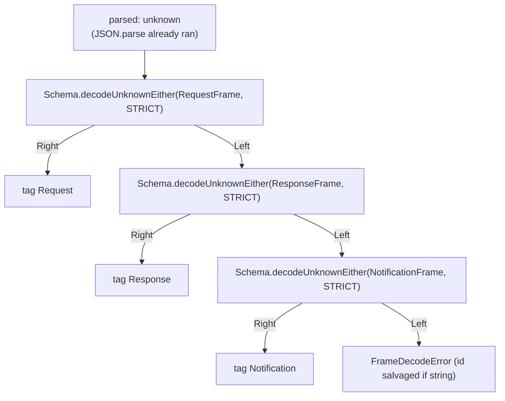
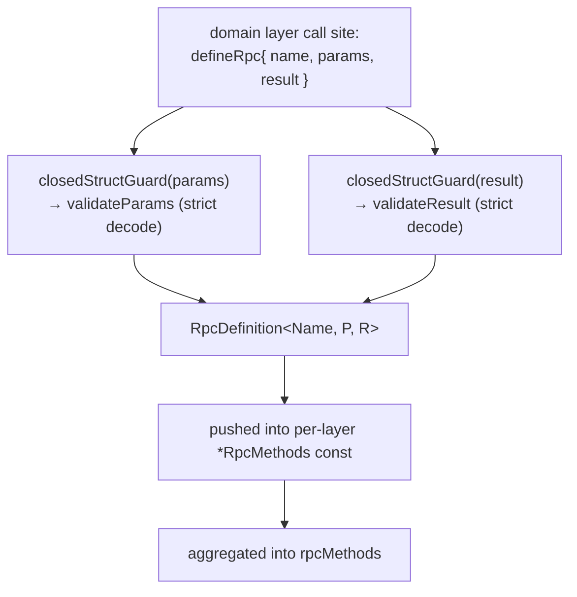
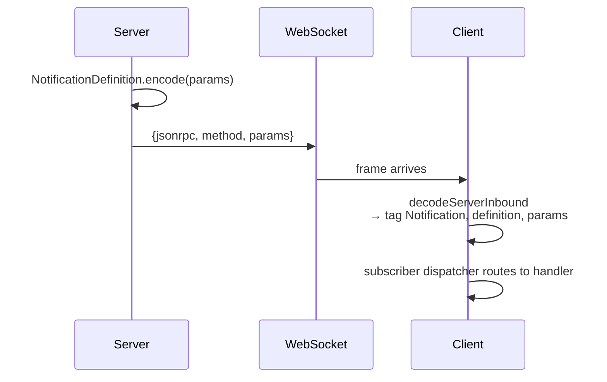

# protocol/transport

_`packages/protocol/src/transport`_

## Purpose

Public barrel for JSON-RPC transport descriptors and runtime helpers.

## Public surface

### [`AgentCallableGroup`](https://github.com/chughtapan/moltzap/blob/main/packages/protocol/src/transport/client-callable-groups.ts#L116)

_Variable_

```ts
export const AgentCallableGroup: RpcGroup.RpcGroup<
  MembersWhereKind<typeof serverRpcMethods, "agent" | "any">
> = callableGroup(["agent", "any"])
```

The outbound group a first-party AGENT client may originate: every
`serverRpcMethods` member whose `callablePrincipal` is `"agent"` or `"any"`. A
first-party `agentClient.taskClose(...)` (app-only) does not typecheck.

### [`AlreadyConnected`](https://github.com/chughtapan/moltzap/blob/main/packages/protocol/src/transport/wire-errors.ts#L76)

_Class_

```ts
export class AlreadyConnected extends Schema.TaggedError<AlreadyConnected>()(
  "AlreadyConnected",
  { ...errorPayloadFields, principal: Schema.Literal("agent", "app") },
) {
  static readonly message =
    "Principal already has an active connection. Disconnect the prior session first.";
}
```

A principal (agent or app) already holds an active connection. The
`principal` discriminator names which arm the conflict is on.

### [`AppCallableGroup`](https://github.com/chughtapan/moltzap/blob/main/packages/protocol/src/transport/client-callable-groups.ts#L126)

_Variable_

```ts
export const AppCallableGroup: RpcGroup.RpcGroup<
  MembersWhereKind<typeof serverRpcMethods, "app" | "any">
> = callableGroup(["app", "any"])
```

The outbound group a first-party APP client may originate: every
`serverRpcMethods` member whose `callablePrincipal` is `"app"` or `"any"`. A
first-party `appClient.taskRequest(...)` (agent-only) does not typecheck — the
compile-time Principle-1 win.

### [`AppCallbackHandlers`](https://github.com/chughtapan/moltzap/blob/main/packages/protocol/src/transport/handlers.ts#L96)

_TypeAlias_

```ts
export type AppCallbackHandlers<
  Ctx,
  Caps extends Context.Tag<any, any> = never,
> = HandlerTable<AppCallbackInboundRpcDefinition, Ctx, Caps>;
```

### [`AppCallbackInboundRpcDefinition`](https://github.com/chughtapan/moltzap/blob/main/packages/protocol/src/transport/handlers.ts#L94)

_TypeAlias_

```ts
export type AppCallbackInboundRpcDefinition = AnyAppCallbackRpcDefinition;

export type AppCallbackHandlers<
  Ctx,
  Caps extends Context.Tag<any, any> = never,
> = HandlerTable<AppCallbackInboundRpcDefinition, Ctx, Caps>;
```

`AppCallbackHandlers` — handler table for an app moderating one or
more tasks. Catalog: `appCallbackMethods` —
`DispatchAuthorize`, `MessagesAuthorize`, `TaskCreate`. All three
REQUIRED (R14b); vacuous-deny moderators must write the handler
explicitly. `TaskCreate` is the server-initiated callback fired
after `task/request` lands the task in `waiting`; the app's typed
verdict drives the lifecycle transition.

### [`assertWsEngineSize`](https://github.com/chughtapan/moltzap/blob/main/packages/protocol/src/transport/server-engine-group.ts#L212)

_Function_

```ts
export const assertWsEngineSize = (): string | undefined
```

Boot-time backstop pinning WsServerEngineRpcGroup's member count to
WS_ENGINE_MEMBER_COUNT. The type-level canary pins the member SET; this
inspects the ACTUAL built `.requests` map, so a filter regression that drops or
duplicates a member is caught at boot rather than shipping a misbound engine.
Returns the violation string, or `undefined` when the count matches.

### [`CallablePrincipal`](https://github.com/chughtapan/moltzap/blob/main/packages/protocol/src/transport/method.ts#L25)

_TypeAlias_

```ts
export type CallablePrincipal = "agent" | "app" | "any";

/**
 * A wire-discriminable tagged-error CLASS: a `Schema.TaggedError`-derived class
 * usable both as the runtime constructor and as a `Schema` for the wire `error`
 * union. The `_tag` literal is the union discriminant the engine decodes against;
 * a method's `error` Schema is `Schema.Union(...effective error classes)`, so the
 * per-method decode picks the right class by `_tag` with no code lookup.
 */
export type RpcErrorClass = Schema.Schema.AnyNoContext &
  (new (...args: never[]) => { readonly _tag: string });
```

The calling-principal axis of one RPC: which principal arm may originate it.
`"agent"`/`"app"` gate the method to that arm; `"any"` is the lone
unauthenticated method (`network/connect`, dispatched while the arm is still
unauthenticated). This is the single descriptor-level source the client
groups partition on and the server's principal gate reads.

### [`callerAgentId`](https://github.com/chughtapan/moltzap/blob/main/packages/protocol/src/transport/current-principal.ts#L66)

_Variable_

```ts
export const callerAgentId: Effect.Effect<AgentId, never, CurrentPrincipal> =
  Effect.gen(function* () {
    const p = yield* CurrentPrincipal;
    // Exhaustive narrow on the tagged union — NOT an `as { agentId }`
    // assertion. The agent arm's `agentId` is reached by discriminant.
    return p._tag === "AgentContext"
      ? p.agentId
      : yield* Effect.die(
          new Error(
            `capability derivePayload reached a non-agent principal: ${p._tag}`,
          ),
        );
  }).pipe(Effect.withSpan("callerAgentId"))
```

Impossible-state defect: a capability `derivePayload` read the principal
and found a NON-agent arm. Every live descriptor cap is agent-originated
(its binding's `callablePrincipal` is `"agent"`), so the binding
guarantees an agent caller; an app arm here is a wiring defect, not a
caller-actionable error. Effect.die (not a caller-visible error)
because the principal-kind gate already rejected non-agent callers.

### [`CallErrorsOf`](https://github.com/chughtapan/moltzap/blob/main/packages/protocol/src/transport/method.ts#L243)

_TypeAlias_

```ts
export type CallErrorsOf<
  D extends RpcDefinition<
    string,
    Schema.Schema.AnyNoContext,
    Schema.Schema.AnyNoContext
  >,
> =
```

The full typed error channel of a per-method call: the method's handler-domain
errors, its caps' declared errors, its principal-gate errors, plus the
always-possible transport errors. This is exactly what the typed client
surfaces on `client["method/name"](payload)`'s Effect — the same union the
wire `errorSchema` decodes, plus transport.

### [`CapErrorsOf`](https://github.com/chughtapan/moltzap/blob/main/packages/protocol/src/transport/method.ts#L212)

_TypeAlias_

```ts
export type CapErrorsOf<Caps extends ReadonlyArray<RpcCapTag>> =
```

The union of every declared cap's error instances for a `caps` tuple.

### [`capMiddlewareByCapKey`](https://github.com/chughtapan/moltzap/blob/main/packages/protocol/src/transport/cap-middlewares.ts#L89)

_Variable_

```ts
export const capMiddlewareByCapKey: Readonly<
  Record<string, RpcMiddleware.TagClassAny>
> =
```

Cap `Context.Tag` key → its `RpcMiddleware.Tag`. The engine binding
(`server-engine-group.ts → buildEngineMember`) reads a method's `caps` tuple
and stacks each cap's middleware in declared order. A cap that a method can
require MUST appear here, or the binding leaves it ungated — the boot guard
(`assertCapMiddlewareCoverage`) fails the build if a declared cap has no
middleware.

### [`CapMwFor`](https://github.com/chughtapan/moltzap/blob/main/packages/protocol/src/transport/cap-middlewares.ts#L105)

_TypeAlias_

```ts
export type CapMwFor<Cap> = Cap extends typeof ConversationInTask
```

Type-level cap `Context.Tag` → its `RpcMiddleware.Tag` (the runtime mirror is
capMiddlewareByCapKey). Matches by tag IDENTITY so the engine member's
middleware param carries the EXACT cap mws, keeping the per-cap `provides`
type-visible (a handler that `yield*`s a cap Tag has it stripped from the
Layer's residual requirement — the proof-exclusion guarantee).

### [`ChannelProtocol`](https://github.com/chughtapan/moltzap/blob/main/packages/protocol/src/transport/mux.ts#L284)

_Interface_

```ts
export interface ChannelProtocol<Impl> {
  readonly impl: Impl;
  readonly sink: ChannelSink;
}
```

A built channel protocol: the exact impl record the corresponding
`Protocol.make` callback returns, plus the ChannelSink the
demux registers so inbound frames on this channel reach the engine.
The two are split so the `Protocol.make` callback returns only `impl`
(no excess fields), while the demux owns `sink`.

### [`ChannelSink`](https://github.com/chughtapan/moltzap/blob/main/packages/protocol/src/transport/mux.ts#L116)

_Interface_

```ts
interface ChannelSink {
  readonly parser: RpcSerialization.Parser;
  readonly inject: (frame: unknown) => Effect.Effect<void>;
}
```

The per-channel inbound sinks the demux routes decoded wire strings
into. Each sink owns its endpoint's Parser and the engine-side
`write` injector the Parser feeds.

### [`clientProtocolCanary`](https://github.com/chughtapan/moltzap/blob/main/packages/protocol/src/transport/mux.types-check.ts#L47)

_Variable_

```ts
export const clientProtocolCanary = RpcClient.Protocol.make((write) =>
  clientBuilder(write).pipe(Effect.map((built) => built.impl)),
)
```

### [`ConflictError`](https://github.com/chughtapan/moltzap/blob/main/packages/protocol/src/transport/wire-errors.ts#L57)

_Class_

```ts
export class ConflictError extends Schema.TaggedError<ConflictError>()(
  "Conflict",
  errorPayloadFields,
) {
  static readonly message = "Conflict";
}
```

Conflict on a resource (cross-cutting; e.g., duplicate registration).

### [`ContactPolicyAllowsReachMw`](https://github.com/chughtapan/moltzap/blob/main/packages/protocol/src/transport/cap-middlewares.ts#L73)

_Class_

```ts
export class ContactPolicyAllowsReachMw extends RpcMiddleware.Tag<ContactPolicyAllowsReachMw>()(
  "@moltzap/protocol/cap/mw/contact-policy-allows-reach",
  {
    provides: ContactPolicyAllowsReach,
    failure: capFailure(ContactPolicyAllowsReach),
  },
) {}
```

### [`ConversationInTaskMw`](https://github.com/chughtapan/moltzap/blob/main/packages/protocol/src/transport/cap-middlewares.ts#L55)

_Class_

```ts
export class ConversationInTaskMw extends RpcMiddleware.Tag<ConversationInTaskMw>()(
  "@moltzap/protocol/cap/mw/conversation-in-task",
  { provides: ConversationInTask, failure: capFailure(ConversationInTask) },
) {}
```

### [`ConversationSendAccessMw`](https://github.com/chughtapan/moltzap/blob/main/packages/protocol/src/transport/cap-middlewares.ts#L60)

_Class_

```ts
export class ConversationSendAccessMw extends RpcMiddleware.Tag<ConversationSendAccessMw>()(
  "@moltzap/protocol/cap/mw/conversation-send-access",
  {
    provides: ConversationSendAccess,
    failure: capFailure(ConversationSendAccess),
  },
) {}
```

### [`CurrentPrincipal`](https://github.com/chughtapan/moltzap/blob/main/packages/protocol/src/transport/current-principal.ts#L54)

_Class_

```ts
export class CurrentPrincipal extends Context.Tag(
  "@moltzap/protocol/CurrentPrincipal",
)<CurrentPrincipal, Principal>() {}
```

Protocol-owned `Context.Tag` carrying the request's authenticated
Principal. The capability middleware's `derivePayload` `yield*`s
it WITHOUT importing the server; the server SATISFIES it by
`provideService(CurrentPrincipal, principalCtx)` at the dispatch site.
Provided ONLY on authenticated/capability-bearing methods — capabilities
never run on the unauth Connect frame — so the unauth arm is never a
concern here.

### [`DecodedFrame`](https://github.com/chughtapan/moltzap/blob/main/packages/protocol/src/transport/wire.ts#L137)

_TypeAlias_

```ts
export type DecodedFrame =
  | { readonly _tag: "Request"; readonly frame: RequestFrame }
```

### [`DecodedNotification`](https://github.com/chughtapan/moltzap/blob/main/packages/protocol/src/transport/rpc-groups.ts#L53)

_TypeAlias_

```ts
export type DecodedNotification<
  D extends AnyNotificationDefinition,
  R = unknown,
> = D extends AnyNotificationDefinition
```

A decoded notification carries the discriminator + descriptor + typed
params + the original wire `jsonrpc`. It does NOT extend `NotificationFrame`
— re-encoding goes through `definition.encode(params)`, not by re-serializing
this struct, so the strict-additionalProperties wire schema stays unstuck.

The optional second parameter `R` narrows the `params` field to the refined
type — used by `MoltZapAgentClient.subscribe`'s user-defined-type-guard
overload. The default sentinel `unknown` resolves to the per-branch
`NotificationParamsOf<D>` shape, preserving the one-arg form for every
consumer.

The default uses an `unknown` sentinel rather than `NotificationParamsOf<D>`
because TS does not distribute type-alias defaults through the
`D extends AnyNotificationDefinition` distributive conditional below —
a `NotificationParamsOf<D>` default would resolve once over the input
union and break per-branch params narrowing for `D` unions like
`DispatchesConsumed | DispatchesExpired`. Carrying `R` as a sentinel and
resolving inside the conditional keeps the original `params` shape per
distribution branch when the one-arg form is used.

### [`DecodedRpcRequest`](https://github.com/chughtapan/moltzap/blob/main/packages/protocol/src/transport/rpc-groups.ts#L22)

_TypeAlias_

```ts
export type DecodedRpcRequest<D extends AnyServerRpcDefinition> =
```

### [`decodeFrame`](https://github.com/chughtapan/moltzap/blob/main/packages/protocol/src/transport/wire.ts#L170)

_Function_

```ts
export function decodeFrame(
  parsed: unknown,
): Effect.Effect<DecodedFrame, FrameDecodeError>
```

Classify one already-`JSON.parse`d value as a JSON-RPC Request, Response,
or Notification frame — fail-closed on anything else.

The discrimination runs `Schema.decodeUnknownEither(...,
&#123; onExcessProperty: "error" })` against each frame schema in precedence order
(Request → Response → Notification). The `{ onExcessProperty: "error" }`
option rejects excess keys: a frame with an extra top-level key fails decode
at EVERY arm and falls through to `FrameDecodeError` — the conformance
`extra-property` / `oversized` mutators depend on this.



### [`decodeNotification`](https://github.com/chughtapan/moltzap/blob/main/packages/protocol/src/transport/rpc-groups.ts#L123)

_Function_

```ts
export function decodeNotification<
  const Definitions extends readonly AnyNotificationDefinition[],
>(
  definitions: Definitions,
  frame: NotificationFrame,
): Effect.Effect<
  DecodedNotification<Definitions[number]>,
  NotificationDecodeError
>
```

### [`decodeRpcRequest`](https://github.com/chughtapan/moltzap/blob/main/packages/protocol/src/transport/rpc-groups.ts#L98)

_Function_

```ts
export function decodeRpcRequest<
  const Definitions extends readonly AnyServerRpcDefinition[],
>(
  definitions: Definitions,
  frame: RequestFrame,
): Effect.Effect<
  DecodedRpcRequest<Definitions[number]>,
  RpcRequestDecodeError
>
```

### [`decodeRpcResult`](https://github.com/chughtapan/moltzap/blob/main/packages/protocol/src/transport/method.ts#L492)

_Function_

```ts
export function decodeRpcResult<
  Name extends string,
  P extends Schema.Schema.AnyNoContext,
  R extends Schema.Schema.AnyNoContext,
>(
  definition: RpcDefinition<Name, P, R>,
  data: unknown,
): Effect.Effect<Schema.Schema.Type<R>, RpcResultDecodeError>
```

### [`defineNotification`](https://github.com/chughtapan/moltzap/blob/main/packages/protocol/src/transport/method.ts#L462)

_Function_

```ts
export function defineNotification<
  Name extends string,
  P extends Schema.Schema.AnyNoContext,
>(def: { name: Name; params: P }): NotificationDefinition<Name, P>
```

Sibling of defineRpc for server-to-client notifications.
Same pipeline minus the result schema and response encoder —
notifications are fire-and-forget, no `id` field, no `result`.

### [`defineRpc`](https://github.com/chughtapan/moltzap/blob/main/packages/protocol/src/transport/method.ts#L350)

_Function_

```ts
export function defineRpc<
  Name extends string,
  P extends Schema.Schema.AnyNoContext,
  R extends Schema.Schema.AnyNoContext,
  const K extends CallablePrincipal = "any",
  const Caps extends ReadonlyArray<RpcCapTag> = readonly [],
  const Errs extends ReadonlyArray<RpcErrorClass> = readonly [],
>(def: {
  name: Name;
  params: P;
  result: R;
  callablePrincipal?: K;
  requiresActive?: boolean;
  caps?: Caps;

  /**
   * REQUIRED. The handler-domain tagged-error classes this method can fail
   * with — only what the handler itself raises. The principal-gate errors
   * (`Unauthorized`/`Forbidden` for authenticated methods) and each cap's own
   * `errors` are added automatically. A method with no handler-domain error
   * declares `[]`.
   */
  errors: Errs;
}): RpcDefinition<Name, P, R, K, Caps, Errs>
```

Create one wire method's frozen descriptor: name, Effect `Schema` shapes,
strict decode-time validators, and per-descriptor request/response
encoders. Every wire boundary in moltzap is born from a single `defineRpc`
call at module-load time so the strict decoders are built eagerly and the
runtime never re-derives them.



- Every slot is REQUIRED in the handler table; omitting any key fails TS2741
  at the factory call.
- Capabilities are NOT descriptor metadata; `defineRpc` carries only the
  wire shape, and the server's per-method `*AuthMw` runs the caps.
- The validators reject excess keys (`closedStructGuard`), preserving the
  AJV `strict` + `additionalProperties:false` rejection the conformance
  suite's `extra-property` / `oversized` mutators assert.

Method names are branded `JsonRpcMethod&lt;"the.name">` so a runtime
string can never accidentally type-fit a method position. See
`wire.ts → JsonRpcMethod` for the brand.

Sibling: defineNotification — same pipeline minus the
result schema and response encoder.

### [`dispatchCall`](https://github.com/chughtapan/moltzap/blob/main/packages/protocol/src/transport/typed-dispatch.ts#L62)

_Function_

```ts
export function dispatchCall<Rpcs extends Rpc.Any, E, K extends Rpcs["_tag"]>(
  map: TypedDispatchMap<Rpcs, E>,
  tag: K,
  payload: PayloadForTag<Rpcs, K>,
): Effect.Effect<SuccessForTag<Rpcs, K>, ErrorForTag<Rpcs, K> | E>
```

Dispatch one call through the typed map at tag `K` — cast-free. `map[tag]` is
the method's typed call; applying it to `payload` yields the per-tag result +
error. Leaf call sites pass a literal tag and recover the precise types; a
caller generic over `K` keeps the correlation because the map is keyed on the
literal tag, not on a widened def union.

### [`DomainErrorsOf`](https://github.com/chughtapan/moltzap/blob/main/packages/protocol/src/transport/method.ts#L218)

_TypeAlias_

```ts
export type DomainErrorsOf<
  D extends RpcDefinition<
    string,
    Schema.Schema.AnyNoContext,
    Schema.Schema.AnyNoContext
  >,
> =
```

The handler-domain error instance union a descriptor declares.

### [`effectiveErrorClasses`](https://github.com/chughtapan/moltzap/blob/main/packages/protocol/src/transport/method.ts#L272)

_Function_

```ts
export function effectiveErrorClasses(
  callablePrincipal: CallablePrincipal,
  caps: ReadonlyArray<RpcCapTag>,
  handlerErrors: ReadonlyArray<RpcErrorClass>,
): ReadonlyArray<RpcErrorClass>
```

The effective wire-error class list for a method: principal-gate errors (none
for the unauthenticated `"any"` method), each cap's declared errors in cap
order, then the handler-domain errors, deduped by identity (a class shared
across a cap and the handler list appears once). This is the single source the
wire `errorSchema`, the server gate, and the typed client all read.

### [`encodeErrorResponse`](https://github.com/chughtapan/moltzap/blob/main/packages/protocol/src/transport/wire.ts#L267)

_Function_

```ts
export function encodeErrorResponse(
  id: JsonRpcId | null,
  error: ResponseFrameError,
): ResponseFrame
```

Public wire-error response encoder. Constructs a JSON-RPC error
response for any wire id (no method binding). Method-tied success
responses go through `RpcDefinition.encodeResponse`.

### [`ErrorForTag`](https://github.com/chughtapan/moltzap/blob/main/packages/protocol/src/transport/typed-dispatch.ts#L38)

_TypeAlias_

```ts
export type ErrorForTag<
  Rpcs extends Rpc.Any,
  K extends Rpcs["_tag"],
> = Rpc.Error<RpcForTag<Rpcs, K>>;
```

The method's own tagged-error union for one tag (from its `errorSchema`).

### [`findEngineGatingMismatch`](https://github.com/chughtapan/moltzap/blob/main/packages/protocol/src/transport/server-engine-group.ts#L285)

_Function_

```ts
export const findEngineGatingMismatch = (): string | undefined
```

### [`ForbiddenError`](https://github.com/chughtapan/moltzap/blob/main/packages/protocol/src/transport/wire-errors.ts#L41)

_Class_

```ts
export class ForbiddenError extends Schema.TaggedError<ForbiddenError>()(
  "Forbidden",
  errorPayloadFields,
) {
  static readonly message = "Forbidden";
}
```

Authenticated but not authorized for this resource.

### [`FrameDecodeError`](https://github.com/chughtapan/moltzap/blob/main/packages/protocol/src/transport/wire.ts#L142)

_Class_

```ts
export class FrameDecodeError extends Data.TaggedError("FrameDecodeError")<{
  readonly raw: unknown;
  readonly id: JsonRpcId | null;
}> {}
```

### [`HandlerSlot`](https://github.com/chughtapan/moltzap/blob/main/packages/protocol/src/transport/handlers.ts#L25)

_Interface_

```ts
export interface HandlerSlot<
  D extends RpcDefinition<
    string,
    Schema.Schema.AnyNoContext,
    Schema.Schema.AnyNoContext
  >,
  Ctx,
  Caps extends Context.Tag<any, any>,
> {
  readonly definition: D;
  readonly handle: (
    params: ParamsOf<D>,
    ctx: Ctx,
  ) => Effect.Effect<ResultOf<D>, unknown, Caps>;
}
```

Per-definition handler slot (app-callback authoring shape). `Ctx` is the
per-frame context the client hands every handler. `Caps` is the upper bound
on which `Context.Tag`s the handler's R channel may reference; the
app-callback catalog declares no capabilities, so callers bind `Caps =
never`. The app client's reverse `RpcServer` serves each slot's `handle`.

### [`InvalidParamsError`](https://github.com/chughtapan/moltzap/blob/main/packages/protocol/src/transport/wire-errors.ts#L65)

_Class_

```ts
export class InvalidParamsError extends Schema.TaggedError<InvalidParamsError>()(
  "InvalidParamsError",
  errorPayloadFields,
) {
  static readonly message = "Invalid params";
}
```

Boundary validation error — params failed schema validation.

### [`isDecodedNotification`](https://github.com/chughtapan/moltzap/blob/main/packages/protocol/src/transport/rpc-groups.ts#L153)

_Function_

```ts
export function isDecodedNotification<D extends AnyNotificationDefinition>(
  definition: D,
  notification: DecodedNotification<AnyNotificationDefinition>,
): notification is DecodedNotification<D>
```

### [`isUnauthenticatedMethod`](https://github.com/chughtapan/moltzap/blob/main/packages/protocol/src/transport/server-engine-group.ts#L53)

_Function_

```ts
export const isUnauthenticatedMethod = (tag: string): boolean
```

Whether a wire tag is in UNAUTHENTICATED_METHODS — the single
membership check both the engine-group construction (which omits the gate
for these) and the server's `principalKinds` projection (which omits them
from the policy table) share, so the two agree on the partition by
construction.

### [`JSON_RPC_VERSION`](https://github.com/chughtapan/moltzap/blob/main/packages/protocol/src/transport/wire.ts#L11)

_Variable_

```ts
export const JSON_RPC_VERSION = "2.0" as const
```

### [`JsonRpcId`](https://github.com/chughtapan/moltzap/blob/main/packages/protocol/src/transport/wire.ts#L18)

_TypeAlias_

```ts
export type JsonRpcId = Schema.Schema.Type<typeof JsonRpcIdSchema>;
```

### [`jsonRpcMethod`](https://github.com/chughtapan/moltzap/blob/main/packages/protocol/src/transport/wire.ts#L29)

_Function_

```ts
export const jsonRpcMethod = <const Name extends string>(
  method: Name,
): JsonRpcMethod<Name>
```

Internal factory for descriptor construction (`defineRpc`,
`defineNotification`). Not on the package barrel — callers pass plain
strings to frame builders, which brand internally.

### [`JsonRpcMethod`](https://github.com/chughtapan/moltzap/blob/main/packages/protocol/src/transport/wire.ts#L19)

_TypeAlias_

```ts
export type JsonRpcMethod<Name extends string = string> = Name &
```

### [`makeClientChannelProtocol`](https://github.com/chughtapan/moltzap/blob/main/packages/protocol/src/transport/mux.ts#L346)

_Function_

```ts
export function makeClientChannelProtocol(options: {
  readonly channel: MuxChannel;
  readonly write: WireWrite;
}): (
  write: (data: FromServerEncoded) => Effect.Effect<void>,
)
```

Build the client-side `RpcClient.Protocol` impl over one socket
channel. Mirrors makeServerChannelProtocol for the client
engine: `send` encodes a `FromClientEncoded` through the channel's
Parser and writes the enveloped wire string; the sink's `inject`
feeds decoded inbound `FromServerEncoded` frames into the engine. The
client engine has no `disconnects` Mailbox — socket close fails the
client call channel through the underlying socket.

### [`makeServerChannelProtocol`](https://github.com/chughtapan/moltzap/blob/main/packages/protocol/src/transport/mux.ts#L301)

_Function_

```ts
export function makeServerChannelProtocol(options: {
  readonly channel: MuxChannel;
  readonly write: WireWrite;
  readonly disconnects: Mailbox.Mailbox<number>;
}): (
  write: (clientId: number, data: FromClientEncoded) => Effect.Effect<void>,
)
```

Build the server-side `RpcServer.Protocol` impl over one socket
channel. Pass the resulting builder the engine's `write` injector
(the argument `RpcServer.Protocol.make` hands its callback); the
builder returns the impl record `Protocol.make` expects plus the
ChannelSink the demux registers.

`send` encodes a `FromServerEncoded` through the channel's Parser and
writes the enveloped wire string. The sink's `inject` feeds decoded
inbound `FromClientEncoded` frames into the engine via `write`.
Socket close is surfaced through the shared `disconnects` Mailbox.

### [`makeServerProtocolLayer`](https://github.com/chughtapan/moltzap/blob/main/packages/protocol/src/transport/server-engine.ts#L60)

_Function_

```ts
export const makeServerProtocolLayer = (options: {
  readonly write: WireWrite;
  readonly disconnects: Mailbox.Mailbox<number>;
  readonly sinkReady: Deferred.Deferred<ChannelSink>;

  /**
   * Which mux channel this server engine binds. The live server's inbound
   * engine binds `c2s`; the client's reverse notification/callback server binds
   * `s2c`. Defaults to `c2s` (the server inbound engine, the common case).
   */
  readonly channel?: "c2s" | "s2c";
}): Layer.Layer<RpcServer.Protocol>
```

Build the `RpcServer.Protocol` layer over one server-side mux
channel. `RpcServer.Protocol.make` hands the engine's inbound `write`
injector to makeServerChannelProtocol's builder, which returns the
protocol impl record (the engine binds to) plus the channel sink (the mux
demux feeds decoded inbound frames into). Only the impl crosses into the
`Protocol` Tag; the built ChannelSink is fulfilled into the
caller-provided `sinkReady` Deferred so the live connection's
`runMuxReader` can route inbound `c2s` chunks into the engine.

The sink's `inject` closes over the SAME `write` injector the engine handed
the builder, so a chunk routed to the sink enters the engine's dispatch
loop. The Deferred handoff is necessary because the sink is only knowable
after the engine builds the Protocol (the `write` injector does not exist
until then), and `runMuxReader` must register it before the socket reader
forks.

`write` is the raw-write surface of the shared socket (one call writes one
enveloped chunk; the live connection passes `Socket.Socket["writer"]`).
`disconnects` is the Mailbox the live connection offers a client id to on
socket close, so the engine runs per-client teardown.

### [`makeTypedTransportCall`](https://github.com/chughtapan/moltzap/blob/main/packages/protocol/src/transport/typed-dispatch.ts#L82)

_Function_

```ts
export function makeTypedTransportCall<Rpcs extends Rpc.Any, TransportError>(
  client: TypedDispatchMap<Rpcs, RpcClientError>,
  onTransportError: () => TransportError,
): <Tag extends Rpcs["_tag"]>(
  tag: Tag,
  payload: PayloadForTag<Rpcs, Tag>,
)
```

Bind a non-flat `RpcClient` (viewed as a TypedDispatchMap) into a
per-method `call(tag, payload)` that folds the engine's transport-level
`RpcClientError` (a closed socket) into the caller's own `TransportError`.

Generic over `Rpcs`: the body type-checks `dispatchCall` against the abstract
`SuccessForTag&lt;Rpcs, Tag>`, so the per-tag success reduces at every concrete
instantiation — including the combined callback ∪ notification group — with
no value-boundary cast. Every endpoint that stands a non-flat client (the
agent + app clients, the server's reverse client) shares this one bridge, so
the transport-error fold is written once.

### [`MalformedFrameError`](https://github.com/chughtapan/moltzap/blob/main/packages/protocol/src/transport/wire-errors.ts#L89)

_Class_

```ts
export class MalformedFrameError extends Schema.TaggedError<MalformedFrameError>()(
  "MalformedFrameError",
  {
    raw: Schema.String,
    cause: Schema.optional(Schema.Unknown),
  },
) {}
```

Inbound frame failed to parse as JSON or did not match the expected shape.
Transport-internal — not a wire `error` union member (never crosses the wire
as a method failure).

### [`MUX_CLIENT_ID`](https://github.com/chughtapan/moltzap/blob/main/packages/protocol/src/transport/mux.ts#L244)

_Variable_

```ts
const MUX_CLIENT_ID = 0
```

The single physical client every endpoint on one socket shares. The
server `Protocol` keys per-client state by id; a mux carries one
socket, so every channel reports the same id.

### [`MuxChannel`](https://github.com/chughtapan/moltzap/blob/main/packages/protocol/src/transport/mux.ts#L51)

_TypeAlias_

```ts
export type MuxChannel = "c2s" | "s2c";

/**
 * The channel-tagged envelope every multiplexed frame rides in. `ch`
 * routes the frame to one endpoint's Parser; `f` is that endpoint's
 * encoded wire string (a `JSON.stringify`'d RPC frame). The mux owns
 * this framing, so the per-endpoint Parser runs with
 * `includesFraming=false`.
 */
const MuxEnvelopeSchema = Schema.Struct({
  ch: Schema.Literal("c2s", "s2c"),
  f: Schema.String,
});
```

A logical endpoint's slot on the shared socket. `c2s` carries the
client→server RPC group; `s2c` carries the server-originated callback
group (the role-inverted endpoint). Adding a logical endpoint adds a
channel here so the demux stays exhaustive.

### [`MuxEnvelope`](https://github.com/chughtapan/moltzap/blob/main/packages/protocol/src/transport/mux.ts#L70)

_TypeAlias_

```ts
export type MuxEnvelope = typeof MuxEnvelopeSchema.Type;

const decodeEnvelope = Schema.decodeUnknownEither(MuxEnvelopeSchema);
```

The envelope's decoded form. `ch` is narrowed to MuxChannel;
`f` is the per-endpoint encoded wire string awaiting that endpoint's
Parser.

### [`MwStackFor`](https://github.com/chughtapan/moltzap/blob/main/packages/protocol/src/transport/cap-middlewares.ts#L121)

_TypeAlias_

```ts
export type MwStackFor<Caps extends ReadonlyArray<unknown>> =
```

The middleware stack an authenticated method's `caps` tuple maps to: the
`PrincipalGateMw` (every authenticated method) ∪ each declared cap's
middleware Tag. The engine member's `Middleware` param is this union, so each
cap's `provides` is type-visible at the binding.

### [`NotConnectedError`](https://github.com/chughtapan/moltzap/blob/main/packages/protocol/src/transport/rpc-errors.ts#L15)

_Class_

```ts
export class NotConnectedError extends Data.TaggedError("NotConnectedError")<{
  readonly message: string;
}> {}
```

The socket is not in the OPEN state when an RPC was attempted.

### [`NotFoundError`](https://github.com/chughtapan/moltzap/blob/main/packages/protocol/src/transport/wire-errors.ts#L49)

_Class_

```ts
export class NotFoundError extends Schema.TaggedError<NotFoundError>()(
  "NotFound",
  errorPayloadFields,
) {
  static readonly message = "Not found";
}
```

Resource not found (cross-cutting; domain-specific NotFound errors live with their domain).

### [`NotificationDecodeError`](https://github.com/chughtapan/moltzap/blob/main/packages/protocol/src/transport/rpc-groups.ts#L94)

_TypeAlias_

```ts
export type NotificationDecodeError =
  | UnknownNotificationMethodError
  | InvalidNotificationParamsError;

export function decodeRpcRequest<
  const Definitions extends readonly AnyServerRpcDefinition[],
>(
  definitions: Definitions,
  frame: RequestFrame,
): Effect.Effect<
  DecodedRpcRequest<Definitions[number]>,
  RpcRequestDecodeError
> {
  const definition = definitions.find((d) => d.name === frame.method);
  if (definition === undefined) {
    return Effect.fail(new UnknownRpcMethodError({ frame }));
  }
  const params = frame.params ?? {};
  if (!definition.validateParams(params)) {
    return Effect.fail(new InvalidRpcParamsError({ frame, definition }));
  }
  return Effect.succeed({
    frame,
    id: frame.id,
    definition,
    params,
  } as DecodedRpcRequest<Definitions[number]>);
}
```

### [`NotificationDefinition`](https://github.com/chughtapan/moltzap/blob/main/packages/protocol/src/transport/method.ts#L439)

_Interface_

```ts
export interface NotificationDefinition<
  Name extends string,
  P extends Schema.Schema.AnyNoContext,
> {
  readonly name: JsonRpcMethod<Name>;
  readonly paramsSchema: P;
  readonly validateParams: (data: unknown) => data is Schema.Schema.Type<P>;
  readonly encode: (params: unknown) => NotificationFrame;
}
```

A frozen descriptor for one server-to-client notification.
Notifications are fire-and-forget — no `id`, no response, no
pending-call registry. The transport-side runtimes don't track
them; consumers subscribe externally via per-method handlers.



Descriptor role at the transport layer: encode + decode + schema
validation. Routing semantics live in consumers (e.g.
`@moltzap/client/runtime/subscribers.ts`).

### [`notificationFrame`](https://github.com/chughtapan/moltzap/blob/main/packages/protocol/src/transport/wire.ts#L275)

_Function_

```ts
export function notificationFrame<
  Name extends string,
  P extends Schema.Schema.AnyNoContext,
>(
  definition: NotificationDefinition<Name, P>,
  params: Schema.Schema.Type<P>,
): NotificationFrame &
```

### [`NotificationFrame`](https://github.com/chughtapan/moltzap/blob/main/packages/protocol/src/transport/wire.ts#L94)

_TypeAlias_

```ts
export type NotificationFrame = Schema.Schema.Type<
  typeof NotificationFrameSchema
>;
```

### [`notificationFrameSchema`](https://github.com/chughtapan/moltzap/blob/main/packages/protocol/src/transport/wire.ts#L106)

_Function_

```ts
export function notificationFrameSchema(): typeof NotificationFrameSchema
```

### [`NotificationParamsOf`](https://github.com/chughtapan/moltzap/blob/main/packages/protocol/src/transport/method.ts#L450)

_TypeAlias_

```ts
export type NotificationParamsOf<
  D extends NotificationDefinition<string, Schema.Schema.AnyNoContext>,
> =
```

Type-only accessor for a notification's params payload.

### [`NotificationRpcGroup`](https://github.com/chughtapan/moltzap/blob/main/packages/protocol/src/transport/rpc-method-groups.ts#L102)

_Variable_

```ts
export const NotificationRpcGroup = groupFromNotifications(
  notificationDefinitions,
)
```

Server→client reverse notification group. The server fires each notification
as a fire-and-forget `void`-result RPC on a target connection's reverse
channel; the client serves it via `RpcServer&lt;NotificationRpcGroup>`, routing
each payload into the `SubscriberRegistry`. Reuses the same s2c reverse-RPC
machinery as the moderator callbacks folded into ReverseRpcGroup.

### [`ParamsOf`](https://github.com/chughtapan/moltzap/blob/main/packages/protocol/src/transport/method.ts#L161)

_TypeAlias_

```ts
export type ParamsOf<
  D extends RpcDefinition<
    string,
    Schema.Schema.AnyNoContext,
    Schema.Schema.AnyNoContext
  >,
> =
```

Type-only accessor for a definition's params payload.

### [`PayloadForTag`](https://github.com/chughtapan/moltzap/blob/main/packages/protocol/src/transport/typed-dispatch.ts#L26)

_TypeAlias_

```ts
export type PayloadForTag<
  Rpcs extends Rpc.Any,
  K extends Rpcs["_tag"],
> = Rpc.PayloadConstructor<RpcForTag<Rpcs, K>>;
```

The payload type one tag accepts.

### [`Principal`](https://github.com/chughtapan/moltzap/blob/main/packages/protocol/src/transport/current-principal.ts#L41)

_TypeAlias_

```ts
export type Principal =
  | { readonly _tag: "AgentContext"; readonly agentId: AgentId }
```

The authenticated principal of the in-flight request — the value a
capability middleware `yield*`s to read `agentId` / `appId`. Tagged so a
middleware narrows the app-arm vs agent-arm by discriminant before
reading the field (no `as { agentId }` assertion).

The server's `AgentContext` / `AppContext`
(`@moltzap/server-core` `transport/context.ts`) — `Data.TaggedClass`
instances carrying extra fields (`agentStatus`, `ownerUserId`) —
structurally inhabit this union (`_tag` + `agentId` / `appId` match;
extra fields are fine for a read-only consumer), so the server provides
the live narrowed arm directly. The `appId` of the app arm is sourced
from the live `AppConnection.auth` minted at auth time, NOT hardcoded.

### [`PrincipalErrorClassesOf`](https://github.com/chughtapan/moltzap/blob/main/packages/protocol/src/transport/method.ts#L200)

_TypeAlias_

```ts
export type PrincipalErrorClassesOf<K extends CallablePrincipal> =
```

The principal-gate tagged-error classes a method's `callablePrincipal` admits.
Every authenticated method's principal middleware can fail
`Unauthorized`/`Forbidden`; the lone `"any"` method (`network/connect`) has no
principal gate, so it admits none. Sourced as a value at
principalErrorClasses; this is its type-level mirror.

### [`principalGateErrorClasses`](https://github.com/chughtapan/moltzap/blob/main/packages/protocol/src/transport/wire-errors.ts#L98)

_Variable_

```ts
export const principalGateErrorClasses = [
  UnauthorizedError,
  ForbiddenError,
] as const
```

The principal-gate error classes every authenticated method's gate can fail with.

### [`PrincipalGateMw`](https://github.com/chughtapan/moltzap/blob/main/packages/protocol/src/transport/cap-middlewares.ts#L50)

_Class_

```ts
export class PrincipalGateMw extends RpcMiddleware.Tag<PrincipalGateMw>()(
  "@moltzap/protocol/cap/mw/principal-gate",
  { failure: principalGateFailure },
) {}
```

The principal gate: narrows the live connection to the method's principal arm
and fails `Unauthorized` / `Forbidden`. No `provides` — the handler reads the
narrowed arm off `ConnectionTag`. Stacked first on every authenticated method.

### [`requestFrame`](https://github.com/chughtapan/moltzap/blob/main/packages/protocol/src/transport/wire.ts#L206)

_Function_

```ts
export function requestFrame<
  Name extends string,
  P extends Schema.Schema.AnyNoContext,
  R extends Schema.Schema.AnyNoContext,
>(
  id: string,
  definition: RpcDefinition<Name, P, R>,
  params: Schema.Schema.Type<P>,
): RequestFrame &
```

### [`RequestFrame`](https://github.com/chughtapan/moltzap/blob/main/packages/protocol/src/transport/wire.ts#L92)

_TypeAlias_

```ts
export type RequestFrame = Schema.Schema.Type<typeof RequestFrameSchema>;
```

### [`requestFrameSchema`](https://github.com/chughtapan/moltzap/blob/main/packages/protocol/src/transport/wire.ts#L98)

_Function_

```ts
export function requestFrameSchema(): typeof RequestFrameSchema
```

### [`ResponseErrorsOf`](https://github.com/chughtapan/moltzap/blob/main/packages/protocol/src/transport/method.ts#L191)

_TypeAlias_

```ts
export type ResponseErrorsOf = NotConnectedError | RpcTimeoutError;

/**
 * The principal-gate tagged-error classes a method's `callablePrincipal` admits.
 * Every authenticated method's principal middleware can fail
 * `Unauthorized`/`Forbidden`; the lone `"any"` method (`network/connect`) has no
 * principal gate, so it admits none. Sourced as a value at
 * {@link principalErrorClasses}; this is its type-level mirror.
 */
export type PrincipalErrorClassesOf<K extends CallablePrincipal> =
```

The transport-level errors any descriptor-driven call can surface regardless
of the method: the socket was not connected, or the response frame never
arrived. They originate at the client transport, not the handler, so they are
NOT in a descriptor's effective error union; the typed client adds them to
every per-method call's error channel.

### [`responseFrame`](https://github.com/chughtapan/moltzap/blob/main/packages/protocol/src/transport/wire.ts#L243)

_Function_

```ts
export function responseFrame(
  id: string | null,
  body: ResponseFrameBody,
): ResponseFrame
```

### [`ResponseFrame`](https://github.com/chughtapan/moltzap/blob/main/packages/protocol/src/transport/wire.ts#L93)

_TypeAlias_

```ts
export type ResponseFrame = Schema.Schema.Type<typeof ResponseFrameSchema>;
```

### [`ResponseFrameBody`](https://github.com/chughtapan/moltzap/blob/main/packages/protocol/src/transport/wire.ts#L239)

_TypeAlias_

```ts
export type ResponseFrameBody =
  | { result: unknown }
```

### [`responseFrameSchema`](https://github.com/chughtapan/moltzap/blob/main/packages/protocol/src/transport/wire.ts#L102)

_Function_

```ts
export function responseFrameSchema(): typeof ResponseFrameSchema
```

### [`ResultOf`](https://github.com/chughtapan/moltzap/blob/main/packages/protocol/src/transport/method.ts#L173)

_TypeAlias_

```ts
export type ResultOf<
  D extends RpcDefinition<
    string,
    Schema.Schema.AnyNoContext,
    Schema.Schema.AnyNoContext
  >,
> =
```

Type-only accessor for a definition's result payload.

### [`ReverseRpcGroup`](https://github.com/chughtapan/moltzap/blob/main/packages/protocol/src/transport/rpc-method-groups.ts#L133)

_Variable_

```ts
export const ReverseRpcGroup: RpcGroup.RpcGroup<ReverseRpcMember> =
  RpcGroup.make(
    // Same homogeneous-map laundering as `groupFromNotifications`: `Array.map`'s
    // element type cannot prove the per-slot tuple, but at runtime each callback
    // maps to a result-bearing `Rpc` and each notification to a `void`-result
    // `Rpc`, in source order — precisely the `ReverseRpcMember` union. Verified
    // by `rpc-method-groups.types-check.ts`.
    // eslint-disable-next-line agent-code-guard/as-unknown-as -- combined-tuple keying proof TS cannot express; verified by rpc-method-groups.types-check.ts
    ...([
      ...appCallbackMethods.map((definition) =>
        Rpc.make(definition.name, {
          payload: definition.paramsSchema,
          success: definition.resultSchema,
          error: definition.errorSchema,
        }),
      ),
      ...notificationDefinitions.map((definition) =>
        Rpc.make(definition.name, {
          payload: definition.paramsSchema,
          success: Schema.Void,
          error: Schema.Never,
        }),
      ),
    ] as unknown as readonly ReverseRpcMember[]), // #ignore-sloppy-code[as-unknown-as]: combined-tuple keying proof TS cannot express; verified by rpc-method-groups.types-check.ts.
  )
```

The full server→client reverse group: the moderator callbacks
(`appCallbackMethods`) ∪ the notifications (NotificationRpcGroup),
built as ONE `RpcGroup` over the combined member tuple (not `merge`). The
server holds one `RpcClient&lt;ReverseRpcGroup>` per connection (fires callbacks
awaiting a verdict, fires notifications fork-and-forget); the agent + app
clients stand one `RpcServer&lt;ReverseRpcGroup>` on the s2c sink. An agent client
only ever receives notifications (its handlers for the three callback methods
are never invoked — an agent is not a moderator), but it serves the whole
group so the s2c engine binds one handler map.

### [`routeInbound`](https://github.com/chughtapan/moltzap/blob/main/packages/protocol/src/transport/mux.ts#L216)

_Function_

```ts
export function routeInbound(
  raw: string | Uint8Array,
  sinks: Partial<Record<MuxChannel, ChannelSink>>,
  reply?: WireWrite,
): Effect.Effect<void>
```

### [`RpcCapTag`](https://github.com/chughtapan/moltzap/blob/main/packages/protocol/src/transport/method.ts#L51)

_TypeAlias_

```ts
export type RpcCapTag = Context.Tag<any, any>;
```

A capability tag a method requires: a `Context.Tag` (the proof the per-method
middleware provides). A capability IS a middleware — it resolves a proof into
context and declares its own `errors` (the tagged-error classes its
derive/obtain can fail with) as a static tuple on the tag class. The
descriptor unions every cap's `errors` into the method's effective error
channel (CapErrorsOf), so a method that requires a cap inherits that
cap's failure modes with no re-declaration.

The type is the plain `Context.Tag<any, any>` (not intersected with an
`errors` member): a concrete tag class does not match an intersection whose
other arm is the variance-laden Tag, so the `errors` static is read
structurally by CapErrorClassesOf rather than constrained here.

### [`RpcDefinition`](https://github.com/chughtapan/moltzap/blob/main/packages/protocol/src/transport/method.ts#L82)

_Interface_

```ts
export interface RpcDefinition<
  Name extends string,
  P extends Schema.Schema.AnyNoContext,
  R extends Schema.Schema.AnyNoContext,
  K extends CallablePrincipal = CallablePrincipal,
  Caps extends ReadonlyArray<RpcCapTag> = ReadonlyArray<RpcCapTag>,
  Errs extends ReadonlyArray<RpcErrorClass> = ReadonlyArray<RpcErrorClass>,
> {
  readonly name: JsonRpcMethod<Name>;
  readonly paramsSchema: P;
  readonly resultSchema: R;

  /**
   * The calling-principal axis (the single descriptor-level source). The client
   * groups partition on it; the server principal gate reads it. Defaults to
   * `"any"` for descriptors that do not declare it (only `network/connect`
   * stays `"any"` at the gate, but an undeclared descriptor is never
   * engine-gated).
   */
  readonly callablePrincipal: K;

  /**
   * Whether the agent arm must be claimed/active to call this method
   * (agent-arm only). Read by the server gate; ignored for `"app"`/`"any"`.
   */
  readonly requiresActive: boolean;

  /**
   * The capability tags this method requires, in run order. Each cap IS a
   * middleware: it provides a proof into the handler's Context and declares its
   * own `errors`. The per-method middleware runs each cap's derive/obtain after
   * resolving the principal. Empty for a method with no caps.
   */
  readonly caps: Caps;

  /**
   * The handler-domain tagged-error classes this method can fail with — only
   * the errors the HANDLER raises, not the principal-gate or cap errors (those
   * come from {@link principalErrorClasses} and each cap's own `errors`). The
   * method's effective wire error union is the dedup'd union of all three; see
   * {@link effectiveErrorClasses} / {@link errorSchema}.
   */
  readonly errors: Errs;

  /**
   * The wire `error` Schema the `@effect/rpc` engine encodes/decodes this
   * method's failures against: `Schema.Union(...effectiveErrorClasses)`. The
   * union discriminates on each error's `_tag`, so the per-method decode picks
   * the exact tagged-error class with no code lookup and no global registry.
   * `Schema.Never` when the method has no effective errors (only the lone
   * unauthenticated `network/connect`, which still inherits transport errors at
   * the client surface via {@link ResponseErrorsOf}).
   */
  readonly errorSchema: Schema.Schema.AnyNoContext;

  /**
   * The wire `error` Schema for the HANDLER-DOMAIN errors ALONE
   * (`Schema.Union(...errors)`) — what the server engine member sets as its
   * `error`. The principal-gate and cap errors are NOT here; they ride each
   * stacked middleware's own `failure`, and the engine unions them into the
   * method's error (`Rpc.ErrorSchema = _Error | _Middleware`). The catalog/client
   * group uses the full {@link errorSchema} (the client carries no middleware,
   * so it needs the aggregate union for its typed error channel).
   */
  readonly handlerErrorSchema: Schema.Schema.AnyNoContext;

  readonly validateParams: (data: unknown) => data is Schema.Schema.Type<P>;
  readonly validateResult: (data: unknown) => data is Schema.Schema.Type<R>;
  // `unknown` for variance compatibility with the
  // `<string, AnyNoContext, AnyNoContext>` supertype; concrete call sites
  // pass typed values.
  readonly encodeRequest: (id: string, params: unknown) => RequestFrame;
  readonly encodeResponse: (
    id: JsonRpcId | null,
    result: unknown,
  ) => ResponseFrame;
}
```

Typed manifest for one RPC method: wire name + Effect `Schema` shapes +
decode-time validators. Type-only payload accessors are exposed via
`ParamsOf&lt;D>`/`ResultOf&lt;D>` — there is no runtime `Params`/`Result`
property.

The `paramsSchema`/`resultSchema` are Effect `Schema` values (`P`/`R extends
Schema.Schema.AnyNoContext` — the wire schemas have no decode context).
`validateParams`/`validateResult` are strict, excess-rejecting type guards
(`closedStructGuard`): a bare `Schema.is` would ACCEPT extra keys, so the
guards wrap a `Schema.decodeUnknownEither(schema)(value, &#123; onExcessProperty:
"error" })` to reject excess properties at the trust boundary.

A method's per-frame capabilities are NOT descriptor metadata: the
descriptor carries only the wire shape. The server's per-method `*AuthMw`
impl Layer runs each declared cap's derive/obtain
(`server-core auth-middleware-layers.ts`).

### [`RpcErrorClass`](https://github.com/chughtapan/moltzap/blob/main/packages/protocol/src/transport/method.ts#L34)

_TypeAlias_

```ts
export type RpcErrorClass = Schema.Schema.AnyNoContext &
  (new (...args: never[]) => { readonly _tag: string });
```

A wire-discriminable tagged-error CLASS: a `Schema.TaggedError`-derived class
usable both as the runtime constructor and as a `Schema` for the wire `error`
union. The `_tag` literal is the union discriminant the engine decodes against;
a method's `error` Schema is `Schema.Union(...effective error classes)`, so the
per-method decode picks the right class by `_tag` with no code lookup.

### [`RpcErrorPayload`](https://github.com/chughtapan/moltzap/blob/main/packages/protocol/src/transport/wire-errors.ts#L27)

_Interface_

```ts
export interface RpcErrorPayload {
  readonly message?: string;
  readonly data?: unknown;
}
```

The supplemental-payload type a tagged-error instance accepts at construction:
an optional overriding message and optional `data`.

### [`RpcForTag`](https://github.com/chughtapan/moltzap/blob/main/packages/protocol/src/transport/typed-dispatch.ts#L20)

_TypeAlias_

```ts
export type RpcForTag<
  Rpcs extends Rpc.Any,
  K extends Rpcs["_tag"],
> = Rpc.ExtractTag<Rpcs, K>;
```

The `Rpc` member of `Rpcs` whose tag is `K`.

### [`RpcRequestDecodeError`](https://github.com/chughtapan/moltzap/blob/main/packages/protocol/src/transport/rpc-groups.ts#L77)

_TypeAlias_

```ts
export type RpcRequestDecodeError =
  | UnknownRpcMethodError
  | InvalidRpcParamsError;

class UnknownNotificationMethodError extends Data.TaggedError(
  "UnknownNotificationMethodError",
)<{
  readonly frame: NotificationFrame;
}> {}
```

### [`RpcResultDecodeError`](https://github.com/chughtapan/moltzap/blob/main/packages/protocol/src/transport/method.ts#L481)

_Class_

```ts
export class RpcResultDecodeError extends Data.TaggedError(
  "RpcResultDecodeError",
)<{
  readonly definition: RpcDefinition<
    string,
    Schema.Schema.AnyNoContext,
    Schema.Schema.AnyNoContext
  >;
  readonly data: unknown;
}> {}
```

### [`RpcTimeoutError`](https://github.com/chughtapan/moltzap/blob/main/packages/protocol/src/transport/rpc-errors.ts#L20)

_Class_

```ts
export class RpcTimeoutError extends Data.TaggedError("RpcTimeoutError")<{
  readonly method: JsonRpcMethod;
  readonly timeoutMs: number;
}> {}
```

The RPC exceeded the per-call timeout without a response frame.

### [`runMuxReader`](https://github.com/chughtapan/moltzap/blob/main/packages/protocol/src/transport/mux.ts#L382)

_Function_

```ts
export function runMuxReader(
  socket: Socket.Socket,
  sinks: Partial<Record<MuxChannel, ChannelSink>>,
  disconnects: Mailbox.Mailbox<number>,
  reply?: WireWrite,
): Effect.Effect<void, Socket.SocketError>
```

Drive the shared socket's read loop, routing every inbound chunk to
the channel sink named by its envelope. The owner forks this and
surfaces socket close to the server engine's `disconnects` Mailbox so
per-client teardown runs.

### [`ServerEngineLayer`](https://github.com/chughtapan/moltzap/blob/main/packages/protocol/src/transport/server-engine.ts#L105)

_Variable_

```ts
export const ServerEngineLayer = RpcServer.layer(WsServerEngineRpcGroup)
```

The server engine layer for WsServerEngineRpcGroup — the WS-dispatched
members, each carrying its per-method `*AuthMw`. Binding a group whose members
lacked the `*AuthMw` gate would run methods with no authorization gate. The
server-wiring guard canary (`server-engine.types-check.ts`) pins that this
layer's requirement channel demands the per-method `*AuthMw`.

`RpcServer.layer(group)` runs the dispatch loop over whatever
`RpcServer.Protocol` is in scope; there is no `RpcServer.toLayer`. Its
requirement channel is
`RpcServer.Protocol | Rpc.ToHandler&lt;WsServerEngineRpcGroup&gt;` plus every
member's `*AuthMw` — the live connection provides the Protocol via
makeServerProtocolLayer, the handler bodies via
`WsServerEngineRpcGroup.toLayer(serverHandlers)`, and each `*AuthMw`
runtime via its per-socket server-supplied `Layer`
(`auth-middleware-layers.ts`).

### [`ServerEngineRpcGroup`](https://github.com/chughtapan/moltzap/blob/main/packages/protocol/src/transport/server-engine-group.ts#L174)

_Variable_

```ts
export const ServerEngineRpcGroup: RpcGroup.RpcGroup<
  EngineMembers<typeof serverRpcMethods>[number]
> = RpcGroup.make(...engineMembers)
```

### [`serverProtocolCanary`](https://github.com/chughtapan/moltzap/blob/main/packages/protocol/src/transport/mux.types-check.ts#L37)

_Variable_

```ts
export const serverProtocolCanary = RpcServer.Protocol.make((write) =>
  serverBuilder(write).pipe(Effect.map((built) => built.impl)),
)
```

### [`SuccessForTag`](https://github.com/chughtapan/moltzap/blob/main/packages/protocol/src/transport/typed-dispatch.ts#L32)

_TypeAlias_

```ts
export type SuccessForTag<
  Rpcs extends Rpc.Any,
  K extends Rpcs["_tag"],
> = Rpc.Success<RpcForTag<Rpcs, K>>;
```

The success type one tag returns.

### [`TaskReadAccessMw`](https://github.com/chughtapan/moltzap/blob/main/packages/protocol/src/transport/cap-middlewares.ts#L68)

_Class_

```ts
export class TaskReadAccessMw extends RpcMiddleware.Tag<TaskReadAccessMw>()(
  "@moltzap/protocol/cap/mw/task-read-access",
  { provides: TaskReadAccess, failure: capFailure(TaskReadAccess) },
) {}
```

### [`TypedDispatchMap`](https://github.com/chughtapan/moltzap/blob/main/packages/protocol/src/transport/typed-dispatch.ts#L49)

_TypeAlias_

```ts
export type TypedDispatchMap<Rpcs extends Rpc.Any, E> = {
  readonly [K in Rpcs["_tag"]]: (
    payload: PayloadForTag<Rpcs, K>,
  ) => Effect.Effect<SuccessForTag<Rpcs, K>, ErrorForTag<Rpcs, K> | E>;
};
```

The per-method dispatch map a non-flat `RpcClient.make(group)` conforms to:
keyed by every member tag, each value the method's typed call
`(payload) => Effect&lt;success, methodErrors | E>`. `E` is the engine's
transport error (`RpcClientError`) the caller folds into its own channel.

### [`UNAUTHENTICATED_METHODS`](https://github.com/chughtapan/moltzap/blob/main/packages/protocol/src/transport/server-engine-group.ts#L41)

_Variable_

```ts
export const UNAUTHENTICATED_METHODS = ["network/connect"] as const
```

The ONLY methods callable on an unauthenticated connection. Built WITHOUT any
`*AuthMw` (no principal exists pre-auth); they read the live 3-arm `Connection`
via `ConnectionTag`. EXHAUSTIVE: every other catalog method is
authenticated and carries its `*AuthMw`. Adding a method here is a deliberate,
reviewed security decision — the partition canary
(`server-engine-group.types-check.ts`) FAILS the build if a method is in
neither partition or both.

### [`UnauthenticatedMethod`](https://github.com/chughtapan/moltzap/blob/main/packages/protocol/src/transport/server-engine-group.ts#L44)

_TypeAlias_

```ts
export type UnauthenticatedMethod = (typeof UNAUTHENTICATED_METHODS)[number];
```

A plain (unbranded) member of UNAUTHENTICATED_METHODS.

### [`UnauthorizedError`](https://github.com/chughtapan/moltzap/blob/main/packages/protocol/src/transport/wire-errors.ts#L33)

_Class_

```ts
export class UnauthorizedError extends Schema.TaggedError<UnauthorizedError>()(
  "Unauthorized",
  errorPayloadFields,
) {
  static readonly message = "Not authenticated. Send network/connect first.";
}
```

Not authenticated — `network/connect` has not run on this socket.

### [`validateNotificationFrame`](https://github.com/chughtapan/moltzap/blob/main/packages/protocol/src/transport/wire.ts#L132)

_Function_

```ts
export const validateNotificationFrame = (v: unknown): v is NotificationFrame
```

### [`validateRequestFrame`](https://github.com/chughtapan/moltzap/blob/main/packages/protocol/src/transport/wire.ts#L128)

_Function_

```ts
export const validateRequestFrame = (v: unknown): v is RequestFrame
```

### [`validateResponseFrame`](https://github.com/chughtapan/moltzap/blob/main/packages/protocol/src/transport/wire.ts#L130)

_Function_

```ts
export const validateResponseFrame = (v: unknown): v is ResponseFrame
```

### [`WireWrite`](https://github.com/chughtapan/moltzap/blob/main/packages/protocol/src/transport/mux.ts#L79)

_TypeAlias_

```ts
export type WireWrite = (
  chunk: string,
) => Effect.Effect<void, Socket.SocketError>;
```

The raw-write surface the mux drives. Mirrors the effect returned by
`Socket.Socket["writer"]`: one call writes one chunk to the wire and
fails with a Socket.SocketError if the socket is gone.

### [`WS_ENGINE_MEMBER_COUNT`](https://github.com/chughtapan/moltzap/blob/main/packages/protocol/src/transport/server-engine-group.ts#L203)

_Variable_

```ts
export const WS_ENGINE_MEMBER_COUNT = serverRpcMethods.length
```

The number of WS-dispatched engine members — the full catalog
(`serverRpcMethods`). The live server's handler map (`serverHandlers`) has
exactly this many entries; the boot guard assertWsEngineSize pins the
built group to it.

### [`WsServerEngineRpcGroup`](https://github.com/chughtapan/moltzap/blob/main/packages/protocol/src/transport/server-engine-group.ts#L194)

_Variable_

```ts
export const WsServerEngineRpcGroup: RpcGroup.RpcGroup<WsEngineMember> =
  RpcGroup.make(...engineMembers)
```

The group the live server engine binds: every catalog member, each carrying
its own `*AuthMw`. Its members map one-to-one onto `serverHandlers`, so
`WsServerEngineRpcGroup.toLayer` satisfies `HandlersFrom`.
`server-engine-group.types-check.ts` pins
`RpcGroup.Rpcs&lt;typeof WsServerEngineRpcGroup&gt; ≡ EngineRpcs`, and
assertWsEngineSize pins the count at boot.

## Files

- `cap-middlewares.ts`
- `client-callable-groups.ts`
- `current-principal.ts`
- `handlers.ts`
- `method.ts`
- `mux.ts`
- `mux.types-check.ts`
- `rpc-errors.ts`
- `rpc-groups.ts`
- `rpc-method-groups.ts`
- `server-engine-group.ts`
- `server-engine.ts`
- `typed-dispatch.ts`
- `wire-errors.ts`
- `wire.ts`
