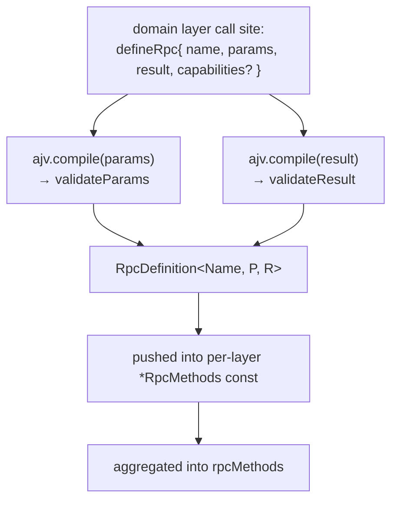
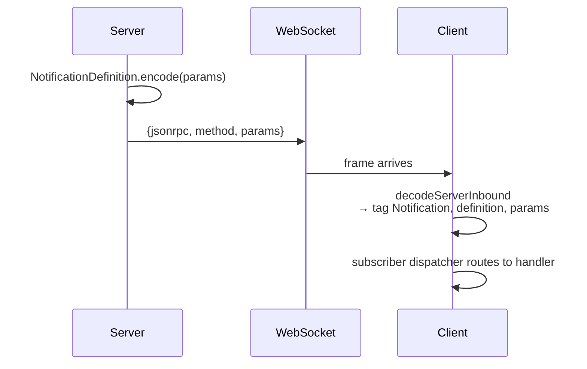
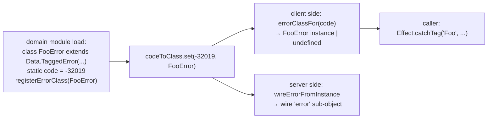

# protocol/transport

_`packages/protocol/src/transport`_

## Purpose

Public barrel for JSON-RPC transport descriptors and runtime helpers.

## Public surface

### [`AgentClientConnection`](https://github.com/chughtapan/moltzap/blob/main/packages/protocol/src/transport/connection.ts#L165)

_Interface_

```ts
export interface AgentClientConnection
  extends ConnectionIdentity,
    OutboundCall<AnyAgentClientRpcDefinition>,
```

`AgentClientConnection` — plain agent client. Outbound surface is
the full `serverRpcMethods` catalog. Outbound notifications: none
(clients consume notifications; they do not originate them) — the
`notify` method is typed `never`, which fails any call site. No
inbound surface (the AgentClient kind's inbound catalog is empty).

### [`AgentClientConnectionConfig`](https://github.com/chughtapan/moltzap/blob/main/packages/protocol/src/transport/connection.ts#L222)

_Interface_

```ts
export interface AgentClientConnectionConfig<Env, Conn> {
  readonly id: string;
  readonly slots: ErasedSlotTable<Env, Conn>;
  readonly write: (raw: string) => Effect.Effect<void, unknown>;
  readonly idPrefix: string;
}
```

Equivalent config for the AgentClient factory. `slots` is the empty
table (the AgentClient kind's inbound catalog is empty); the factory
accepts it for forward compatibility (if a future spec adds
AgentClient-inbound RPCs, the slot table demands coverage).

### [`ajv`](https://github.com/chughtapan/moltzap/blob/main/packages/protocol/src/transport/wire.ts#L19)

_Variable_

```ts
export const ajv:
```

### [`AlreadyConnected`](https://github.com/chughtapan/moltzap/blob/main/packages/protocol/src/transport/wire-errors.ts#L161)

_Class_

```ts
export class AlreadyConnected extends Data.TaggedError("AlreadyConnected")<
  RpcErrorPayload & {
    readonly principal: "agent" | "app";
  }
> {
  static readonly code = -32010;
  static readonly message =
    "Principal already has an active connection. Disconnect the prior session first.";
}
```

A principal (agent or app) already holds an active connection. Fires at
the Connect handler's per-connection preflight/atomic gate (a socket
already authenticated as either arm) and at the per-principal gate
(`AgentEndpointResolver.add` / `AppRegistry.register` rejecting a second
binding). The `principal` discriminator names which arm the conflict is
on; the wire code is shared.

### [`buildAgentClientDispatcher`](https://github.com/chughtapan/moltzap/blob/main/packages/protocol/src/transport/dispatch.ts#L104)

_Function_

```ts
export function buildAgentClientDispatcher<Env, Conn>(
  config: AgentClientConnectionConfig<Env, Conn>,
): Effect.Effect<AgentClientConnection, never, Scope.Scope>
```

Build the agent-client dispatcher. Wires the originator only (no
inbound dispatch — the AgentClient kind's inbound catalog is empty,
so `config.slots` is the empty table `{}`). The empty `notify` shape
is `never`-typed at the type level (no call site can satisfy the
constraint).

### [`buildServerDispatcher`](https://github.com/chughtapan/moltzap/blob/main/packages/protocol/src/transport/dispatch.ts#L77)

_Function_

```ts
export function buildServerDispatcher<Env, Conn>(
  config: ServerConnectionConfig<Env, Conn>,
): Effect.Effect<ServerConnection<Env, Conn>, never, Scope.Scope>
```

Build the server-side dispatcher. Wires the inbound slot-table
dispatch loop + the outbound originator (TM-callback path) into a
single `ServerConnection` value. `Env` is the slot table's residual
service-tag union; `Conn` is the server's three-arm `Connection`.

### [`buildTaskMasterDispatcher`](https://github.com/chughtapan/moltzap/blob/main/packages/protocol/src/transport/dispatch.ts#L132)

_Function_

```ts
export function buildTaskMasterDispatcher<Env, Conn>(
  config: TaskMasterConnectionConfig<Env, Conn>,
): Effect.Effect<TaskMasterConnection<Env, Conn>, never, Scope.Scope>
```

Build the TM dispatcher. Wires both the inbound dispatch loop
(against `taskCallbackMethods`) and the outbound originator (against
`serverRpcMethods`). Spec D3 R14b made every TM-inbound slot
REQUIRED: callers must register a handler for each catalog method;
vacuous-deny moderators bind an explicit `ForbiddenError` handler.

### [`callerAgentIdOf`](https://github.com/chughtapan/moltzap/blob/main/packages/protocol/src/transport/capabilities.ts#L70)

_Function_

```ts
export const callerAgentIdOf = (ctx: DispatchContext): AgentId
```

Read the AGENT arm's id off the protocol-owned DispatchContext
(D #705 Decision 2). The single shared helper for every agent-originated
`argsOf` resolver (`task/request`, `messages/send`, `messages/list`, …):
each is bound at a dispatch site that hands an agent ctx, so the
`_tag === "AgentContext"` narrowing always succeeds. The narrowing is
cast-free — `auth` is the tagged DispatchAuth union, so the agent
arm's `agentId` is reached by discriminant, NOT by an `as { agentId }`
assertion. A non-agent arm reaching here is an impossible-state defect
(the binding guarantees an agent caller), so it throws the tagged
NonAgentCallerError rather than returning a caller-actionable error.

### [`CapabilitiesOf`](https://github.com/chughtapan/moltzap/blob/main/packages/protocol/src/transport/capabilities.ts#L117)

_TypeAlias_

```ts
export type CapabilitiesOf<D> = D extends {
  readonly capabilities: ReadonlyArray<infer Cap>;
}
```

Type-level extractor: union of capability tags declared on definition `D`
via `D["capabilities"][number]["tag"]`. When `D["capabilities"]` is
absent (the spec F stub state, before impl-staff per-method updates),
resolves to `never` — the slot contributes no capability requirements.

### [`CapabilityDescriptor`](https://github.com/chughtapan/moltzap/blob/main/packages/protocol/src/transport/capabilities.ts#L98)

_Interface_

```ts
export interface CapabilityDescriptor {
  readonly tag: AnyContextTag;
  // `ctx` is the protocol-owned {@link DispatchContext} (D #705 Decision
  // 2): the `argsOf` resolver reads the AUTHENTICATED principal arm
  // (`connection.auth`) to derive the provider's args. The slot's
  // `invoke` narrows the live 3-arm connection to the agent/app arm
  // (the #720 principal-kind gate) BEFORE `argsOf` runs, so the
  // protocol 2-arm `DispatchContext` is always satisfied here. `params`
  // stays `unknown` — it is wire-dynamic, re-imposed per-method inside
  // each resolver.
  readonly argsOf: (params: unknown, ctx: DispatchContext) => unknown;
}
```

### [`CapIdentsOf`](https://github.com/chughtapan/moltzap/blob/main/packages/protocol/src/transport/erased-slot.ts#L158)

_TypeAlias_

```ts
export type CapIdentsOf<CapsTuple extends ReadonlyArray<CapabilityDescriptor>> =
```

Identifier union of the declared caps — the handler R upper bound.
Projects to the Tag Identifier (= `Self` for a class tag), the type a
real handler's R channel actually holds (NOT the Tag VALUE type
`typeof X`). `CapsTuple[number]["tag"]` is the union of the declared
tags; `Context.Tag.Identifier` projects each to its `Self`.

### [`CapProviders`](https://github.com/chughtapan/moltzap/blob/main/packages/protocol/src/transport/erased-slot.ts#L140)

_TypeAlias_

```ts
export type CapProviders<
  CapsTuple extends ReadonlyArray<CapabilityDescriptor>,
  Env,
> = {
  readonly [I in keyof CapsTuple]: CapsTuple[I] extends {
    readonly tag: infer Tag;
  }
    ? ProviderFor<Tag, Env>
    : never;
};
```

NON-VACUOUS providers obligation: a positional tuple correlated to the
descriptor's `capabilities` tuple. Element `I` provides the `I`-th
declared cap. A MISSING provider is a tuple-arity mismatch; a
WRONG-service provider is an element-type mismatch. Both FIRE for the
repo's class-style tags — the equivalent mapped-type keyed by the tag
Identifier does NOT (the class-tag Identifier is `Self`, a brand type,
not a string key, so the mapped type collapses to `{}`).

### [`ConflictError`](https://github.com/chughtapan/moltzap/blob/main/packages/protocol/src/transport/wire-errors.ts#L123)

_Class_

```ts
export class ConflictError extends Data.TaggedError(
  "Conflict",
)<RpcErrorPayload> {
  static readonly code = -32003;
  static readonly message = "Conflict";
}
```

Conflict on a resource (cross-cutting; e.g., duplicate registration).

### [`DecodedFrame`](https://github.com/chughtapan/moltzap/blob/main/packages/protocol/src/transport/wire.ts#L139)

_TypeAlias_

```ts
export type DecodedFrame =
  | { readonly _tag: "Request"; readonly frame: RequestFrame }
```

### [`DecodedNotification`](https://github.com/chughtapan/moltzap/blob/main/packages/protocol/src/transport/rpc-groups.ts#L47)

_TypeAlias_

```ts
export type DecodedNotification<
  D extends AnyNotificationDefinition,
  R = unknown,
> = D extends AnyNotificationDefinition
```

A decoded notification carries the discriminator + descriptor + typed
params + the original wire `jsonrpc`. It does NOT extend `NotificationFrame`
— re-encoding goes through `definition.encode(params)`, not by re-serializing
this struct, so the strict-additionalProperties wire schema stays unstuck.

The optional second parameter `R` narrows the `params` field to the refined
type — used by `MoltZapAgentClient.subscribe`'s user-defined-type-guard
overload (spec #596 / architect plan §5.2). The default sentinel
`unknown` resolves to the per-branch `NotificationParamsOf<D>` shape,
preserving the one-arg form for every existing consumer.

The default uses an `unknown` sentinel rather than `NotificationParamsOf<D>`
because TS does not distribute type-alias defaults through the
`D extends AnyNotificationDefinition` distributive conditional below —
a `NotificationParamsOf<D>` default would resolve once over the input
union and break per-branch params narrowing for `D` unions like
`DispatchesConsumed | DispatchesExpired`. Carrying `R` as a sentinel and
resolving inside the conditional keeps the original `params` shape per
distribution branch when the one-arg form is used.

### [`DecodedRpcRequest`](https://github.com/chughtapan/moltzap/blob/main/packages/protocol/src/transport/rpc-groups.ts#L16)

_TypeAlias_

```ts
export type DecodedRpcRequest<D extends AnyServerRpcDefinition> =
```

### [`decodeFrame`](https://github.com/chughtapan/moltzap/blob/main/packages/protocol/src/transport/wire.ts#L149)

_Function_

```ts
export function decodeFrame(
  parsed: unknown,
): Effect.Effect<DecodedFrame, FrameDecodeError>
```

### [`decodeNotification`](https://github.com/chughtapan/moltzap/blob/main/packages/protocol/src/transport/rpc-groups.ts#L117)

_Function_

```ts
export function decodeNotification<
  const Definitions extends readonly AnyNotificationDefinition[],
>(
  definitions: Definitions,
  frame: NotificationFrame,
): Effect.Effect<
  DecodedNotification<Definitions[number]>,
  NotificationDecodeError
>
```

### [`decodeRpcParams`](https://github.com/chughtapan/moltzap/blob/main/packages/protocol/src/transport/method.ts#L206)

_Function_

```ts
export function decodeRpcParams<
  Name extends string,
  P extends TSchema,
  R extends TSchema,
>(
  definition: RpcDefinition<Name, P, R>,
  data: unknown,
): Effect.Effect<Static<P>, RpcParamsDecodeError>
```

### [`decodeRpcRequest`](https://github.com/chughtapan/moltzap/blob/main/packages/protocol/src/transport/rpc-groups.ts#L92)

_Function_

```ts
export function decodeRpcRequest<
  const Definitions extends readonly AnyServerRpcDefinition[],
>(
  definitions: Definitions,
  frame: RequestFrame,
): Effect.Effect<
  DecodedRpcRequest<Definitions[number]>,
  RpcRequestDecodeError
>
```

### [`decodeRpcResult`](https://github.com/chughtapan/moltzap/blob/main/packages/protocol/src/transport/method.ts#L219)

_Function_

```ts
export function decodeRpcResult<
  Name extends string,
  P extends TSchema,
  R extends TSchema,
>(
  definition: RpcDefinition<Name, P, R>,
  data: unknown,
): Effect.Effect<Static<R>, RpcResultDecodeError>
```

### [`defineNotification`](https://github.com/chughtapan/moltzap/blob/main/packages/protocol/src/transport/method.ts#L177)

_Function_

```ts
export function defineNotification<
  Name extends string,
  P extends TSchema,
>(def: { name: Name; params: P }): NotificationDefinition<Name, P>
```

Sibling of defineRpc for server-to-client notifications.
Same pipeline minus the result schema and response encoder —
notifications are fire-and-forget, no `id` field, no `result`.

### [`defineRpc`](https://github.com/chughtapan/moltzap/blob/main/packages/protocol/src/transport/method.ts#L96)

_Function_

```ts
export function defineRpc<
  Name extends string,
  P extends TSchema,
  R extends TSchema,
  Caps extends ReadonlyArray<CapabilityDescriptor> = readonly [],
>(def: {
  name: Name;
  params: P;
  result: R;

  /**
   * Per-definition capability descriptors. Each entry pairs a Spec E
   * `Context.Tag` (the value the handler will `yield*`) with a
   * synchronous `argsOf` resolver that derives the obtain helper's
   * arguments from wire `params` + dispatcher `ctx`. Generic-parameterized
   * so the return type preserves the literal tuple shape for
   * `CapabilitiesOf&lt;D>`.
   */
  capabilities?: Caps;
}): Omit<RpcDefinition<Name, P, R>, "capabilities"> &
```

Create one wire method's frozen descriptor: name, schemas, AJV
validators, and per-descriptor request/response encoders. Every
wire boundary in moltzap is born from a single `defineRpc` call at
module-load time so AJV validators are compiled eagerly and the
runtime never re-parses schemas.



- Every slot is REQUIRED in the handler table (Spec D3 R14b);
  omitting any key fails TS2741 at the factory call.
- `capabilities` absent → no auto-provision; the dispatcher reads
  `definition.capabilities` per frame and threads
  `Effect.provideServiceEffect` for each entry.

Method names are branded `JsonRpcMethod&lt;"the.name">` so a runtime
string can never accidentally type-fit a method position. See
`wire.ts → JsonRpcMethod` for the brand.

Sibling: defineNotification — same pipeline minus the
result schema and response encoder.

### [`DispatchAuth`](https://github.com/chughtapan/moltzap/blob/main/packages/protocol/src/transport/capabilities.ts#L28)

_TypeAlias_

```ts
export type DispatchAuth =
  | { readonly _tag: "AgentContext"; readonly agentId: AgentId }
```

Protocol-owned principal union read by `argsOf` resolvers (D #705
Decision 2). Tagged so a resolver narrows app-arm vs agent-arm before
reading `appId` / `agentId`. The server's `AppContext` / `AgentContext`
(`@moltzap/server-core` `transport/context.ts`) satisfy this
structurally — their `_tag` / `agentId` / `appId` use these same
protocol-owned brands — so the descriptor type can name the principal
without protocol importing server.

### [`DispatchContext`](https://github.com/chughtapan/moltzap/blob/main/packages/protocol/src/transport/capabilities.ts#L40)

_Interface_

```ts
export interface DispatchContext {
  readonly connection: {
    readonly connId: ConnectionId;
    readonly auth: DispatchAuth;
  };
}
```

Per-request context handed to every `argsOf` resolver (D #705 Decision
2). Uniform across all methods (independent of the wire method string),
so — unlike `params` — it is compiler-typeable. Replaces the prior
`ctx: unknown` + per-site `ctx as ...` casts. The `connection.connId`
field matches the server's three-arm `Connection` arm `connId`; the
`connection.auth` tagged union mirrors the principal arms.

### [`encodeErrorResponse`](https://github.com/chughtapan/moltzap/blob/main/packages/protocol/src/transport/wire.ts#L225)

_Function_

```ts
export function encodeErrorResponse(
  id: JsonRpcId | null,
  error: ResponseFrameError,
): ResponseFrame
```

Public wire-error response encoder. Constructs a JSON-RPC error
response for any wire id (no method binding). Method-tied success
responses go through `RpcDefinition.encodeResponse`.

### [`ErasedSlot`](https://github.com/chughtapan/moltzap/blob/main/packages/protocol/src/transport/erased-slot.ts#L102)

_Interface_

```ts
export interface ErasedSlot<Env, Conn> {
  readonly definition: RpcDefinition<string, TSchema, TSchema>;
  readonly invoke: (
    params: unknown,
    ctx: SlotDispatchContext<Conn>,
  ) => Effect.Effect<Exit.Exit<unknown, unknown>, never, Env>;
}
```

Existential slot the dispatcher indexes by runtime method string.

`Env` is the `FullLive` service-tag union the dispatcher's
`ManagedRuntime` resolves at request time (the layer service tags
MINUS the per-frame capability tags, which are discharged inside
`invoke`). `Conn` is the server's three-arm `Connection` union.

`invoke` decodes `params` via the method's own AJV validator, threads
THIS method's declared capability providers in declaration order, runs
the typed handler, and returns the `Exit`. `R = Env` (NOT `never`):
capabilities are already discharged; the `ManagedRuntime&lt;FullLive>`
provides `Env`. NO double-erasure cast, NO `Context.Tag&lt;unknown, unknown>`.

### [`ErasedSlotTable`](https://github.com/chughtapan/moltzap/blob/main/packages/protocol/src/transport/erased-slot.ts#L116)

_TypeAlias_

```ts
export type ErasedSlotTable<Env, Conn> = Readonly<
  Record<string, ErasedSlot<Env, Conn> | undefined>
>;
```

The keyed table the dispatcher indexes by runtime method string. The
`| undefined` value type makes the wire-dynamic lookup honest: an
unknown method string yields `undefined` → wire `MethodNotFound`
-32601. HALF-2 types this away.

### [`errorClassFor`](https://github.com/chughtapan/moltzap/blob/main/packages/protocol/src/transport/wire-errors.ts#L73)

_Function_

```ts
export function errorClassFor(code: number): RpcErrorClass | undefined
```

Returns the registered class for a wire code, or `undefined`.

### [`ForbiddenError`](https://github.com/chughtapan/moltzap/blob/main/packages/protocol/src/transport/wire-errors.ts#L105)

_Class_

```ts
export class ForbiddenError extends Data.TaggedError(
  "Forbidden",
)<RpcErrorPayload> {
  static readonly code = -32001;
  static readonly message = "Forbidden";
}
```

Authenticated but not authorized for this resource.

### [`FrameDecodeError`](https://github.com/chughtapan/moltzap/blob/main/packages/protocol/src/transport/wire.ts#L144)

_Class_

```ts
export class FrameDecodeError extends Data.TaggedError("FrameDecodeError")<{
  readonly raw: unknown;
  readonly id: JsonRpcId | null;
}> {}
```

### [`HandlerSlot`](https://github.com/chughtapan/moltzap/blob/main/packages/protocol/src/transport/handlers.ts#L36)

_Interface_

```ts
export interface HandlerSlot<
  D extends RpcDefinition<string, TSchema, TSchema>,
  Ctx,
  Caps extends Context.Tag<any, any>,
> {
  readonly definition: D;
  readonly handle: (
    params: ParamsOf<D>,
    ctx: Ctx,
  ) => Effect.Effect<ResultOf<D>, unknown, Caps>;
}
```

Per-definition handler slot (TM-callback authoring shape). `Ctx` is
the per-frame context the client hands every handler. `Caps` is the
upper bound on which `Context.Tag`s the handler's R channel may
reference; the TM-callback catalog declares no capabilities, so
callers bind `Caps = never`.

The WS client wraps each authored slot into an `ErasedSlot` (caps
tuple `[]`) at connection time; the slot's `invoke` decodes params
and runs `handle`. The cross-package handler-R lockstep that the
server side enforces lives on `makeErasedSlot`'s typed handler bound
(`erased-slot.types-check.ts`).

### [`InvalidParamsError`](https://github.com/chughtapan/moltzap/blob/main/packages/protocol/src/transport/wire-errors.ts#L137)

_Class_

```ts
export class InvalidParamsError extends Data.TaggedError("InvalidParamsError")<{
  readonly message: string;
}> {
  static readonly code = JSON_RPC_RESERVED_CODES.InvalidParams;
  static readonly message = "Invalid params";
}
```

Boundary validation error — JSON-RPC reserved code -32602. Raised by
protocol- and server-layer handlers when params fail schema validation;
registered with the wire-error registry so handler-raised instances map
to a `-32602 InvalidParams` wire response via `wireErrorFromInstance`.

### [`isDecodedNotification`](https://github.com/chughtapan/moltzap/blob/main/packages/protocol/src/transport/rpc-groups.ts#L147)

_Function_

```ts
export function isDecodedNotification<D extends AnyNotificationDefinition>(
  definition: D,
  notification: DecodedNotification<AnyNotificationDefinition>,
): notification is DecodedNotification<D>
```

### [`isRegisteredErrorInstance`](https://github.com/chughtapan/moltzap/blob/main/packages/protocol/src/transport/wire-errors.ts#L78)

_Function_

```ts
export function isRegisteredErrorInstance(value: object): boolean
```

Returns true iff `value`'s constructor is in the registered class set.

### [`JSON_RPC_RESERVED_CODES`](https://github.com/chughtapan/moltzap/blob/main/packages/protocol/src/transport/wire-errors.ts#L6)

_Variable_

```ts
export const JSON_RPC_RESERVED_CODES =
```

JSON-RPC 2.0 reserved codes. Emitted by TypedDispatcher; never raised by handlers.

### [`JSON_RPC_VERSION`](https://github.com/chughtapan/moltzap/blob/main/packages/protocol/src/transport/wire.ts#L34)

_Variable_

```ts
export const JSON_RPC_VERSION = "2.0" as const
```

### [`JsonRpcId`](https://github.com/chughtapan/moltzap/blob/main/packages/protocol/src/transport/wire.ts#L41)

_TypeAlias_

```ts
export type JsonRpcId = Static<typeof JsonRpcIdSchema>;
```

### [`jsonRpcMethod`](https://github.com/chughtapan/moltzap/blob/main/packages/protocol/src/transport/wire.ts#L52)

_Function_

```ts
export const jsonRpcMethod = <const Name extends string>(
  method: Name,
): JsonRpcMethod<Name>
```

Internal factory for descriptor construction (`defineRpc`,
`defineNotification`). Not on the package barrel — callers pass plain
strings to frame builders, which brand internally.

### [`JsonRpcMethod`](https://github.com/chughtapan/moltzap/blob/main/packages/protocol/src/transport/wire.ts#L42)

_TypeAlias_

```ts
export type JsonRpcMethod<Name extends string = string> = Name &
```

### [`makeAgentClientConnection`](https://github.com/chughtapan/moltzap/blob/main/packages/protocol/src/transport/connection.ts#L264)

_Function_

```ts
export function makeAgentClientConnection<Env, Conn>(
  config: AgentClientConnectionConfig<Env, Conn>,
): Effect.Effect<AgentClientConnection, never, Scope.Scope>
```

Factory — agent client. Delegates to `buildAgentClientDispatcher`
which wires the originator only (no inbound dispatch — the AgentClient
kind's inbound catalog is empty, so `config.slots` is `{}`).

### [`makeErasedSlot`](https://github.com/chughtapan/moltzap/blob/main/packages/protocol/src/transport/erased-slot.ts#L182)

_Function_

```ts
export function makeErasedSlot<
  Name extends string,
  P extends TSchema,
  R extends TSchema,
  E,
  Conn,
  CapsTuple extends ReadonlyArray<CapabilityDescriptor>,
  Env, // pinned by caller (wrapper layer-tag union / canary turbofish) — NEVER left free
>(
  // `Omit<…, "capabilities">` strips `RpcDefinition`'s WIDE optional
  // `capabilities?: ReadonlyArray<CapabilityDescriptor>` so the
  // intersection does NOT poison `CapsTuple` with a `& CapabilityDescriptor[]`
  // arm (whose tag Identifier is `any`, which would swallow every
  // undeclared cap and make the R⊆Caps lockstep false-green). `defineRpc`'s
  // return type is `Omit`'d the same way so `definition.capabilities` is the
  // clean tuple this signature requires.
  definition: Omit<RpcDefinition<Name, P, R>, "capabilities"> & {
    readonly capabilities: CapsTuple;
  },
  // `CapsTuple` and `Env` are inferred ONLY from `definition` + `providers`;
  // `NoInfer` blocks the handler's R-channel from driving their inference.
  // Without it, a handler that `yield*`s an undeclared cap would let TS
  // WIDEN `CapsTuple`/`Env` to admit that cap and the R⊆Caps lockstep
  // would go false-green (the slot factory's whole point is that it bites).
  handler: (
    params: Static<P>,
    ctx: SlotDispatchContext<Conn>,
  ) => Effect.Effect<Static<R>, E, NoInfer<Env | CapIdentsOf<CapsTuple>>>,
  providers: CapProviders<CapsTuple, Env>,
): ErasedSlot<Env, Conn>
```

Build a real ErasedSlot from a typed `(definition, handler,
providers)` triple. `CapsTuple` is sourced from the `defineRpc` RETURN
shape (`& { readonly capabilities: CapsTuple }`) so it is the literal
tuple, never `never`. `Env` MUST be supplied concretely by the caller
(the wrapper supplies its layer service-tag union; a canary turbofishes
a concrete union) — a FREE `Env` widens to swallow an undeclared cap in
the handler's R and the R⊆Caps negative goes false-green. `Env` is the
LAST generic so the turbofish stays ergonomic; do NOT rely on inference
for it.

Lockstep obligations (both bound here, both verified to fire on
class-tags):
  - `handler` R upper bound = `Env | CapIdentsOf&lt;CapsTuple>` (R⊆Caps).
  - `providers: CapProviders&lt;CapsTuple, Env>` (one typed provider per
    declared cap, positional).

For the no-capability case (`capabilities: readonly []`):
`CapsTuple = readonly []`, `CapIdentsOf&lt;readonly []> = never`, the
handler R upper bound is `Env`, and `providers` is the empty tuple `[]`.

### [`makeOriginator`](https://github.com/chughtapan/moltzap/blob/main/packages/protocol/src/transport/originator.ts#L227)

_Function_

```ts
export const makeOriginator = (config: {
  readonly write: (raw: string) => Effect.Effect<void, unknown>;
  readonly idPrefix: string;
}): Effect.Effect<Originator, never, Scope.Scope>
```

### [`makeServerConnection`](https://github.com/chughtapan/moltzap/blob/main/packages/protocol/src/transport/connection.ts#L253)

_Function_

```ts
export function makeServerConnection<Env, Conn>(
  config: ServerConnectionConfig<Env, Conn>,
): Effect.Effect<ServerConnection<Env, Conn>, never, Scope.Scope>
```

Factory — server side. Delegates to `buildServerDispatcher`
(`dispatch.ts`) which wires:
  - inbound: per-frame dispatch via the kind's ErasedSlotTable;
    each slot decodes params via its own validator + discharges the
    method's declared capabilities from its own positional providers
    tuple INSIDE `invoke`, so the dispatcher just routes and projects
    the slot's `Exit` to a wire response.
  - outbound: an internalized originator (formerly the body of
    `makeOriginator`) that mints `${idPrefix}-N` ids and tracks
    pending Deferreds. Scope finalizer drains pending Deferreds with
    `NotConnectedError`.

### [`makeTaskMasterConnection`](https://github.com/chughtapan/moltzap/blob/main/packages/protocol/src/transport/connection.ts#L280)

_Function_

```ts
export function makeTaskMasterConnection<Env, Conn>(
  config: TaskMasterConnectionConfig<Env, Conn>,
): Effect.Effect<TaskMasterConnection<Env, Conn>, never, Scope.Scope>
```

Factory — TaskMaster. Delegates to `buildTaskMasterDispatcher` which
wires both the inbound dispatch loop (against `taskCallbackMethods`)
and the outbound originator (against the full `serverRpcMethods` catalog).
Every TM-inbound slot is REQUIRED. Spec D3 R14b retired the optional
sentinel defaults the prior shape carried; callers build the slot
table via `makeErasedSlot` per catalog method. Vacuous-deny
moderators bind an explicit `ForbiddenError`-returning handler for
each catalog method.

### [`MalformedFrameError`](https://github.com/chughtapan/moltzap/blob/main/packages/protocol/src/transport/wire-errors.ts#L146)

_Class_

```ts
export class MalformedFrameError extends Data.TaggedError(
  "MalformedFrameError",
)<{
  readonly raw: string;
  readonly cause?: unknown;
}> {}
```

Inbound frame failed to parse as JSON or did not match the expected shape.

### [`NotConnectedError`](https://github.com/chughtapan/moltzap/blob/main/packages/protocol/src/transport/rpc-errors.ts#L17)

_Class_

```ts
export class NotConnectedError extends Data.TaggedError("NotConnectedError")<{
  readonly message: string;
}> {}
```

The socket is not in the OPEN state when an RPC was attempted.

### [`NotFoundError`](https://github.com/chughtapan/moltzap/blob/main/packages/protocol/src/transport/wire-errors.ts#L114)

_Class_

```ts
export class NotFoundError extends Data.TaggedError(
  "NotFound",
)<RpcErrorPayload> {
  static readonly code = -32002;
  static readonly message = "Not found";
}
```

Resource not found (cross-cutting variant; domain-specific NotFound errors live with their domain).

### [`NotificationDecodeError`](https://github.com/chughtapan/moltzap/blob/main/packages/protocol/src/transport/rpc-groups.ts#L88)

_TypeAlias_

```ts
export type NotificationDecodeError =
  | UnknownNotificationMethodError
  | InvalidNotificationParamsError;

export function decodeRpcRequest<
  const Definitions extends readonly AnyServerRpcDefinition[],
>(
  definitions: Definitions,
  frame: RequestFrame,
): Effect.Effect<
  DecodedRpcRequest<Definitions[number]>,
  RpcRequestDecodeError
> {
  const definition = definitions.find((d) => d.name === frame.method);
  if (definition === undefined) {
    return Effect.fail(new UnknownRpcMethodError({ frame }));
  }
  const params = frame.params ?? {};
  if (!definition.validateParams(params)) {
    return Effect.fail(new InvalidRpcParamsError({ frame, definition }));
  }
  return Effect.succeed({
    frame,
    id: frame.id,
    definition,
    params,
  } as DecodedRpcRequest<Definitions[number]>);
}
```

### [`NotificationDefinition`](https://github.com/chughtapan/moltzap/blob/main/packages/protocol/src/transport/method.ts#L157)

_Interface_

```ts
export interface NotificationDefinition<
  Name extends string,
  P extends TSchema,
> {
  readonly name: JsonRpcMethod<Name>;
  readonly paramsSchema: P;
  readonly validateParams: (data: unknown) => data is Static<P>;
  readonly encode: (params: unknown) => NotificationFrame;
}
```

A frozen descriptor for one server-to-client notification.
Notifications are fire-and-forget — no `id`, no response, no
pending-call registry. The transport-side runtimes don't track
them; consumers subscribe externally via per-method handlers.



Descriptor role at the transport layer: encode + decode + schema
validation. Routing semantics live in consumers (e.g.
`@moltzap/client/runtime/subscribers.ts`).

### [`notificationFrame`](https://github.com/chughtapan/moltzap/blob/main/packages/protocol/src/transport/wire.ts#L233)

_Function_

```ts
export function notificationFrame<Name extends string, P extends TSchema>(
  definition: NotificationDefinition<Name, P>,
  params: Static<P>,
): NotificationFrame &
```

### [`NotificationFrame`](https://github.com/chughtapan/moltzap/blob/main/packages/protocol/src/transport/wire.ts#L113)

_TypeAlias_

```ts
export type NotificationFrame = Static<typeof NotificationFrameSchema>;
```

### [`notificationFrameSchema`](https://github.com/chughtapan/moltzap/blob/main/packages/protocol/src/transport/wire.ts#L123)

_Function_

```ts
export function notificationFrameSchema(): typeof NotificationFrameSchema
```

### [`NotificationParamsOf`](https://github.com/chughtapan/moltzap/blob/main/packages/protocol/src/transport/method.ts#L168)

_TypeAlias_

```ts
export type NotificationParamsOf<
  D extends NotificationDefinition<string, TSchema>,
> = D extends NotificationDefinition<string, infer P> ? Static<P> : never;
```

Type-only accessor for a notification's params payload.

### [`Originator`](https://github.com/chughtapan/moltzap/blob/main/packages/protocol/src/transport/originator.ts#L32)

_Interface_

```ts
export interface Originator {
  readonly call: <D extends AnyServerRpcDefinition>(
    definition: D,
    params: ParamsOf<D>,
  ) => Effect.Effect<ResultOf<D>, RpcCallError>;
  readonly resolve: (frame: ResponseFrame) => Effect.Effect<boolean>;
  readonly failAllPending: (error: NotConnectedError) => Effect.Effect<void>;
}
```

Originator side of a JSON-RPC connection. Scope-bound: closing the
scope runs `failAllPending(NotConnectedError)`. Caller owns timeouts.

### [`ParamsOf`](https://github.com/chughtapan/moltzap/blob/main/packages/protocol/src/transport/method.ts#L58)

_TypeAlias_

```ts
export type ParamsOf<D extends RpcDefinition<string, TSchema, TSchema>> =
```

Type-only accessor for a definition's params payload.

### [`registerErrorClass`](https://github.com/chughtapan/moltzap/blob/main/packages/protocol/src/transport/wire-errors.ts#L61)

_Function_

```ts
export function registerErrorClass(cls: RpcErrorClass): void
```

Register a tagged-error class so the originator can resurrect it
from a wire `error` payload by code. Each registered class carries
`static readonly code: number` and `static readonly message:
string`; both are read at registration time. Throws
`DuplicateErrorCodeError` at module-load if two classes claim the
same code.



`JSON_RPC_RESERVED_CODES` covers only the five JSON-RPC 2.0 spec
codes (-32700, -32600, -32601, -32602, -32603). Every other code
lives in the runtime registry, not in a central table. The
`RegisteredTaggedError` union in `rpc-registry.ts` mirrors the
registered classes and must be hand-kept in sync — the TS type
system cannot enumerate the static-side registry into a union.

### [`requestFrame`](https://github.com/chughtapan/moltzap/blob/main/packages/protocol/src/transport/wire.ts#L169)

_Function_

```ts
export function requestFrame<
  Name extends string,
  P extends TSchema,
  R extends TSchema,
>(
  id: string,
  definition: RpcDefinition<Name, P, R>,
  params: Static<P>,
): RequestFrame &
```

### [`RequestFrame`](https://github.com/chughtapan/moltzap/blob/main/packages/protocol/src/transport/wire.ts#L111)

_TypeAlias_

```ts
export type RequestFrame = Static<typeof RequestFrameSchema>;
```

### [`requestFrameSchema`](https://github.com/chughtapan/moltzap/blob/main/packages/protocol/src/transport/wire.ts#L115)

_Function_

```ts
export function requestFrameSchema(): typeof RequestFrameSchema
```

### [`responseFrame`](https://github.com/chughtapan/moltzap/blob/main/packages/protocol/src/transport/wire.ts#L201)

_Function_

```ts
export function responseFrame(
  id: string | null,
  body: ResponseFrameBody,
): ResponseFrame
```

### [`ResponseFrame`](https://github.com/chughtapan/moltzap/blob/main/packages/protocol/src/transport/wire.ts#L112)

_TypeAlias_

```ts
export type ResponseFrame = Static<typeof ResponseFrameSchema>;
```

### [`ResponseFrameBody`](https://github.com/chughtapan/moltzap/blob/main/packages/protocol/src/transport/wire.ts#L197)

_TypeAlias_

```ts
export type ResponseFrameBody =
  | { result: unknown }
```

### [`responseFrameSchema`](https://github.com/chughtapan/moltzap/blob/main/packages/protocol/src/transport/wire.ts#L119)

_Function_

```ts
export function responseFrameSchema(): typeof ResponseFrameSchema
```

### [`ResultOf`](https://github.com/chughtapan/moltzap/blob/main/packages/protocol/src/transport/method.ts#L62)

_TypeAlias_

```ts
export type ResultOf<D extends RpcDefinition<string, TSchema, TSchema>> =
```

Type-only accessor for a definition's result payload.

### [`RpcCallError`](https://github.com/chughtapan/moltzap/blob/main/packages/protocol/src/transport/originator.ts#L23)

_TypeAlias_

```ts
export type RpcCallError =
  | NotConnectedError
  | RpcServerError
  | RegisteredTaggedError;

/**
 * Originator side of a JSON-RPC connection. Scope-bound: closing the
 * scope runs `failAllPending(NotConnectedError)`. Caller owns timeouts.
 */
export interface Originator {
  readonly call: <D extends AnyServerRpcDefinition>(
    definition: D,
    params: ParamsOf<D>,
  ) => Effect.Effect<ResultOf<D>, RpcCallError>;
  readonly resolve: (frame: ResponseFrame) => Effect.Effect<boolean>;
  readonly failAllPending: (error: NotConnectedError) => Effect.Effect<void>;
}
```

### [`RpcDefinition`](https://github.com/chughtapan/moltzap/blob/main/packages/protocol/src/transport/method.ts#L29)

_Interface_

```ts
export interface RpcDefinition<
  Name extends string,
  P extends TSchema,
  R extends TSchema,
> {
  readonly name: JsonRpcMethod<Name>;
  readonly paramsSchema: P;
  readonly resultSchema: R;
  readonly validateParams: (data: unknown) => data is Static<P>;
  readonly validateResult: (data: unknown) => data is Static<R>;
  // `unknown` for variance compatibility with the `<string, TSchema, TSchema>`
  // supertype; concrete call sites pass typed values.
  readonly encodeRequest: (id: string, params: unknown) => RequestFrame;
  readonly encodeResponse: (
    id: JsonRpcId | null,
    result: unknown,
  ) => ResponseFrame;

  /**
   * Spec F G5/G6: per-definition capability descriptors. Each entry's
   * `tag` is a Spec E `Context.Tag` the handler will `yield*`; `argsOf`
   * is the synchronous resolver that derives the obtain helper's args
   * from `params` + `ctx`. The dispatcher reads this list at runtime
   * (not from the handler's R channel — TypeScript erases it).
   */
  readonly capabilities?: ReadonlyArray<CapabilityDescriptor>;
}
```

Typed manifest for one RPC method: wire name + schemas + validators.
Type-only payload accessors are exposed via `ParamsOf&lt;D>`/`ResultOf&lt;D>`
— there is no runtime `Params`/`Result` property.

`capabilities` is the only optional metadata: a runtime-readable list
of capability descriptors the dispatcher iterates to thread
`Effect.provideServiceEffect`. Each descriptor names a `Context.Tag`
plus an `argsOf` resolver that derives the obtain helper's args from
`params` + `ctx`. Absent → no capabilities.

### [`RpcErrorClass`](https://github.com/chughtapan/moltzap/blob/main/packages/protocol/src/transport/wire-errors.ts#L21)

_TypeAlias_

```ts
export type RpcErrorClass = (new (
  ...args: never[]
) => {
  readonly _tag: string;
}) & {
  readonly code: number;
  readonly message: string;
};
```

A `Data.TaggedError`-derived class with static wire metadata
(`code` + `message`). The typed dispatcher reads
`err.constructor.code` to encode outbound error responses; the
originator looks up the class by code via `errorClassFor` for inbound
response decode.

### [`RpcErrorPayload`](https://github.com/chughtapan/moltzap/blob/main/packages/protocol/src/transport/wire-errors.ts#L88)

_Interface_

```ts
export interface RpcErrorPayload {
  readonly message?: string;
  readonly data?: JsonValue;
}
```

Optional per-instance overrides for tagged-error classes. The static
`message` on the class is the default; instances may carry a more
specific message and/or supplemental `data` payload that TypedDispatcher
forwards to the wire response.

### [`RpcParamsDecodeError`](https://github.com/chughtapan/moltzap/blob/main/packages/protocol/src/transport/method.ts#L192)

_Class_

```ts
export class RpcParamsDecodeError extends Data.TaggedError(
  "RpcParamsDecodeError",
)<{
  readonly definition: RpcDefinition<string, TSchema, TSchema>;
  readonly data: unknown;
}> {}
```

### [`RpcRequestDecodeError`](https://github.com/chughtapan/moltzap/blob/main/packages/protocol/src/transport/rpc-groups.ts#L71)

_TypeAlias_

```ts
export type RpcRequestDecodeError =
  | UnknownRpcMethodError
  | InvalidRpcParamsError;

class UnknownNotificationMethodError extends Data.TaggedError(
  "UnknownNotificationMethodError",
)<{
  readonly frame: NotificationFrame;
}> {}
```

### [`RpcResultDecodeError`](https://github.com/chughtapan/moltzap/blob/main/packages/protocol/src/transport/method.ts#L199)

_Class_

```ts
export class RpcResultDecodeError extends Data.TaggedError(
  "RpcResultDecodeError",
)<{
  readonly definition: RpcDefinition<string, TSchema, TSchema>;
  readonly data: unknown;
}> {}
```

### [`RpcServerError`](https://github.com/chughtapan/moltzap/blob/main/packages/protocol/src/transport/rpc-errors.ts#L28)

_Class_

```ts
export class RpcServerError extends Data.TaggedError("RpcServerError")<{
  readonly code: number;
  readonly message: string;
  readonly data?: unknown;
}> {}
```

The peer returned an `error` response frame.

### [`RpcTimeoutError`](https://github.com/chughtapan/moltzap/blob/main/packages/protocol/src/transport/rpc-errors.ts#L22)

_Class_

```ts
export class RpcTimeoutError extends Data.TaggedError("RpcTimeoutError")<{
  readonly method: JsonRpcMethod;
  readonly timeoutMs: number;
}> {}
```

The RPC exceeded the per-call timeout without a response frame.

### [`ServerConnection`](https://github.com/chughtapan/moltzap/blob/main/packages/protocol/src/transport/connection.ts#L152)

_Interface_

```ts
export interface ServerConnection<Env = unknown, Conn = unknown>
```

`ServerConnection` — server side. Outbound surface is the
`AnyTaskCallbackRpcDefinition` union: the server may call INTO a TM
for `DispatchAuthorize` and `MessagesAuthorize`. Outbound notifications
are the full `AnyNotificationDefinition` set (the server originates
delivery + lifecycle notifications). Inbound surface is the closed
`serverRpcMethods` catalog, dispatched via the kind's
ErasedSlotTable.

### [`ServerConnectionConfig`](https://github.com/chughtapan/moltzap/blob/main/packages/protocol/src/transport/connection.ts#L209)

_Interface_

```ts
export interface ServerConnectionConfig<Env, Conn> {
  readonly id: string;
  readonly slots: ErasedSlotTable<Env, Conn>;
  readonly write: (raw: string) => Effect.Effect<void, unknown>;
  readonly idPrefix: string;
}
```

Config record consumed by `makeServerConnection`. `slots` is the
kind's ErasedSlotTable: a `Record&lt;methodName, ErasedSlot&gt;`
each owning its typed `(definition, handler, providers)` triple. The
per-method capability discharge lives INSIDE each slot, so there is
no separate provider table on the config (the pre-HALF-1
`handlers` + `capabilities` pair).

`Env` is the residual service-tag union each slot's `invoke` requires
(resolved by the surrounding `ManagedRuntime` at request time); `Conn`
is the dispatcher's connection-ctx shape (`SlotDispatchContext&lt;Conn&gt;`).

`write` is the wire-level write effect the surrounding transport
supplies; `idPrefix` mirrors `makeOriginator`'s idPrefix convention
for the outbound TM-callback path.

### [`SlotDispatchContext`](https://github.com/chughtapan/moltzap/blob/main/packages/protocol/src/transport/erased-slot.ts#L84)

_Interface_

```ts
export interface SlotDispatchContext<Conn> {
  readonly connection: Conn;
}
```

The dispatcher-boundary `ctx` the slot's `invoke` receives. Structural
mirror of the SERVER `DispatchContext`
(`@moltzap/server-core` `transport/context.ts → DispatchContext`) — the
live THREE-arm `Connection` union whose unauthenticated arm has no
`auth`. The slot narrows `ctx.connection._tag` INSIDE `invoke` (the
#720 principal-kind gate); it MUST be the 3-arm union because the
Connect frame (`agent/connect` / `app/connect`) is dispatched while the
arm is still unauthenticated, so the unauth arm reaches `invoke`
unnarrowed. The protocol `DispatchContext` (`capabilities.ts`) is a
DIFFERENT type for a DIFFERENT role — the `argsOf` resolver context
(Decision 2) — and requires `auth`, so it cannot stand in here.

Kept structural (not an import of the server type) so the protocol
package does not depend on `@moltzap/server-core`. The slot factory is
generic over `Conn`, which the server pins to its `Connection` union.

### [`TaskMasterConnection`](https://github.com/chughtapan/moltzap/blob/main/packages/protocol/src/transport/connection.ts#L187)

_Interface_

```ts
export interface TaskMasterConnection<Env = unknown, Conn = unknown>
```

`TaskMasterConnection` — agent acting as TM. Outbound surface is the
full `serverRpcMethods` catalog (a TM is a superset of an AgentClient at the
type level). Outbound notifications: none. Inbound surface is the
`taskCallbackMethods` catalog, dispatched via the kind's
ErasedSlotTable; every slot is a REQUIRED real handler (Spec
D3 R14b retired the optional `forbidden` / `noOpNotification`
sentinels), so vacuous-deny moderators must bind an explicit
`ForbiddenError`-returning handler per catalog method.

### [`TaskMasterConnectionConfig`](https://github.com/chughtapan/moltzap/blob/main/packages/protocol/src/transport/connection.ts#L233)

_Interface_

```ts
export interface TaskMasterConnectionConfig<Env, Conn> {
  readonly id: string;
  readonly slots: ErasedSlotTable<Env, Conn>;
  readonly write: (raw: string) => Effect.Effect<void, unknown>;
  readonly idPrefix: string;
}
```

Config for the TaskMaster factory. The TM owns the `taskCallbackMethods`
catalog inbound; its outbound surface is the full `serverRpcMethods` catalog.

### [`TaskMasterHandlers`](https://github.com/chughtapan/moltzap/blob/main/packages/protocol/src/transport/handlers.ts#L90)

_TypeAlias_

```ts
export type TaskMasterHandlers<
  Ctx,
  Caps extends Context.Tag<any, any> = never,
> = HandlerTable<TaskMasterInboundRpcDefinition, Ctx, Caps>;
```

### [`TaskMasterInboundRpcDefinition`](https://github.com/chughtapan/moltzap/blob/main/packages/protocol/src/transport/handlers.ts#L88)

_TypeAlias_

```ts
export type TaskMasterInboundRpcDefinition = AnyTaskCallbackRpcDefinition;

export type TaskMasterHandlers<
  Ctx,
  Caps extends Context.Tag<any, any> = never,
> = HandlerTable<TaskMasterInboundRpcDefinition, Ctx, Caps>;
```

`TaskMasterHandlers` — handler table for an agent acting as TM for
one or more tasks. Catalog: `taskCallbackMethods` —
`DispatchAuthorize`, `MessagesAuthorize`, `TaskCreate`. All three
REQUIRED (R14b); vacuous-deny moderators must write the handler
explicitly. `TaskCreate` is the server-initiated callback fired
after `task/request` lands the task in `waiting`; the TM's typed
verdict drives the lifecycle transition.

### [`UnauthorizedError`](https://github.com/chughtapan/moltzap/blob/main/packages/protocol/src/transport/wire-errors.ts#L96)

_Class_

```ts
export class UnauthorizedError extends Data.TaggedError(
  "Unauthorized",
)<RpcErrorPayload> {
  static readonly code = -32000;
  static readonly message = "Not authenticated. Send network/connect first.";
}
```

### [`validateNotificationFrame`](https://github.com/chughtapan/moltzap/blob/main/packages/protocol/src/transport/wire.ts#L133)

_Variable_

```ts
export const validateNotificationFrame = ajv.compile(
  NotificationFrameSchema,
) as (v: unknown)
```

### [`validateRequestFrame`](https://github.com/chughtapan/moltzap/blob/main/packages/protocol/src/transport/wire.ts#L127)

_Variable_

```ts
export const validateRequestFrame = ajv.compile(RequestFrameSchema) as (
  v: unknown,
)
```

### [`validateResponseFrame`](https://github.com/chughtapan/moltzap/blob/main/packages/protocol/src/transport/wire.ts#L130)

_Variable_

```ts
export const validateResponseFrame = ajv.compile(ResponseFrameSchema) as (
  v: unknown,
)
```

### [`wireErrorFromInstance`](https://github.com/chughtapan/moltzap/blob/main/packages/protocol/src/transport/dispatch.ts#L365)

_Function_

```ts
export function wireErrorFromInstance(value: unknown): WireError | null
```

Reads wire metadata (code/message/data) off an `RpcErrorClass` instance.
Returns `null` when the failure isn't a registered wire-error class
(caller routes to InternalError).

## Files

- `capabilities.ts`
- `connection.ts`
- `dispatch.ts`
- `erased-slot.ts`
- `handlers.ts`
- `method.ts`
- `originator.ts`
- `rpc-errors.ts`
- `rpc-groups.ts`
- `wire-errors.ts`
- `wire.ts`
