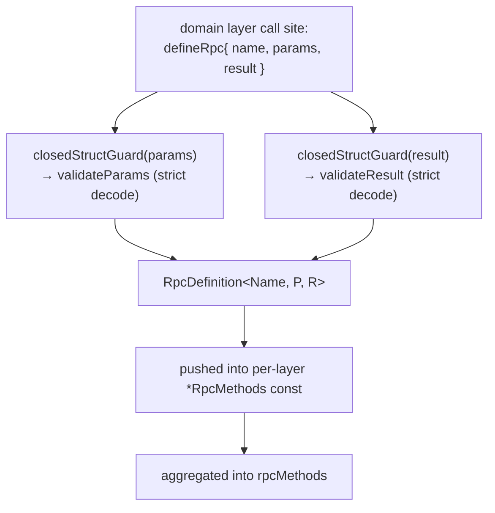
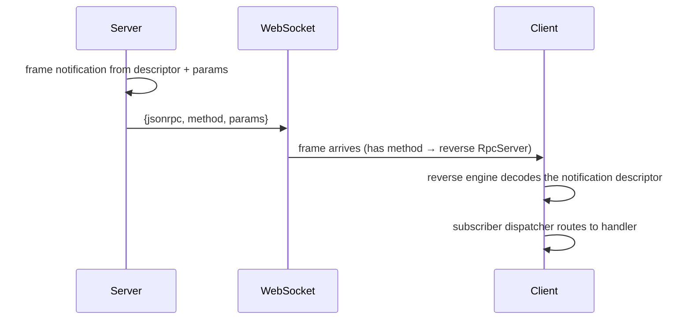

# protocol/transport

_`packages/protocol/src/transport`_

## Purpose

Public barrel for JSON-RPC transport descriptors and runtime helpers.

## Public surface

### [`AgentClaimed`](https://github.com/chughtapan/moltzap/blob/main/packages/protocol/src/transport/principal.ts#L67)

_Class_

```ts
export class AgentClaimed extends RpcMiddleware.Tag<AgentClaimed>()(
  "@moltzap/protocol/requirement/AgentClaimed",
  { failure: agentClaimedFailure },
) {}
```

Refinement requirement (agent-only): the agent arm must be claimed/active.
Type-paired with AgentPrincipal — the server reads
`connection.auth.agentStatus`; it is meaningless without a preceding agent
principal. Fails `Forbidden` on a not-yet-claimed agent.

### [`AgentPrincipal`](https://github.com/chughtapan/moltzap/blob/main/packages/protocol/src/transport/principal.ts#L36)

_Class_

```ts
export class AgentPrincipal extends RpcMiddleware.Tag<AgentPrincipal>()(
  "@moltzap/protocol/requirement/AgentPrincipal",
  { failure: principalGateFailure },
) {}
```

Principal requirement: narrow the live connection to the agent arm. The first
element of an agent-callable method's `requires`. Fails `Unauthorized` /
`Forbidden` (the principal-gate errors) on a non-agent arm.

### [`AlreadyConnected`](https://github.com/chughtapan/moltzap/blob/main/packages/protocol/src/transport/wire-errors.ts#L77)

_Class_

```ts
export class AlreadyConnected extends Schema.TaggedError<AlreadyConnected>()(
  "AlreadyConnected",
  { ...errorPayloadFields, principal: Schema.Literal("agent", "app") },
) {
  static readonly message =
    "Principal already has an active connection. Disconnect the prior session first.";
}
```

A principal (agent or app) already holds an active connection. The
`principal` discriminator names which arm the conflict is on.

### [`AppPrincipal`](https://github.com/chughtapan/moltzap/blob/main/packages/protocol/src/transport/principal.ts#L46)

_Class_

```ts
export class AppPrincipal extends RpcMiddleware.Tag<AppPrincipal>()(
  "@moltzap/protocol/requirement/AppPrincipal",
  { failure: principalGateFailure },
) {}
```

Principal requirement: narrow the live connection to the app arm. The first
element of an app-callable method's `requires`. Fails `Unauthorized` /
`Forbidden` on a non-app arm.

### [`AuthenticatedPrincipal`](https://github.com/chughtapan/moltzap/blob/main/packages/protocol/src/transport/principal.ts#L56)

_Class_

```ts
export class AuthenticatedPrincipal extends RpcMiddleware.Tag<AuthenticatedPrincipal>()(
  "@moltzap/protocol/requirement/AuthenticatedPrincipal",
  { failure: principalGateFailure },
) {}
```

Principal requirement: require any authenticated arm. Used by methods that
are shared by first-party agent and app clients but still must reject the
unauthenticated pre-connect arm.

### [`brandedId`](https://github.com/chughtapan/moltzap/blob/main/packages/protocol/src/transport/wire-string.ts#L143)

_Function_

```ts
export function brandedId<const BrandName extends string>(brand: BrandName)
```

Convenience over brandedString that adds the `uuid` format. The
canonical way to define wire id types in this package
(`AgentId = brandedId("AgentId")`, `TaskId = brandedId("TaskId")`, etc.).
The format check runs the `UUID_RE` regex at decode time and annotates the
schema so `JSONSchema.make` emits `format:"uuid"` for the docs walker.

### [`brandedString`](https://github.com/chughtapan/moltzap/blob/main/packages/protocol/src/transport/wire-string.ts#L45)

_Function_

```ts
export function brandedString<const BrandName extends string>(
  brand: BrandName,
  options: BrandedStringOptions = {},
): Schema.Schema<BrandedString<BrandName>, string>
```

Effect `Schema` whose decoded type is `BrandedString&lt;BrandName>`. The
brand exists only at the type level — decode runs against the underlying
string with the requested refinements (`minLength`, `maxLength`, `pattern`,
and the three wire `format` checkers below) as `Schema.pattern` /
`Schema.filter` refinements inside the same `Schema.decode*` engine as
everything else.

`format` annotates the schema with `{ jsonSchema: { format } }` so
`JSONSchema.make` re-emits the draft-07 `format` keyword the docs walker
reads (`scripts/docs/schema.ts → getStringTypeName`). The `pattern`/`filter`
refinement still runs at decode time regardless of the annotation.

### [`BrandedString`](https://github.com/chughtapan/moltzap/blob/main/packages/protocol/src/transport/wire-string.ts#L17)

_TypeAlias_

```ts
export type BrandedString<BrandName extends string> = string &
```

A `string` carrying a nominal `Brand.Brand&lt;BrandName>` tag. Prevents
a `string` from accidentally type-fitting a slot expecting the brand.

`Schema.brand` produces `string & Brand.Brand&lt;BrandName>`, identical to
this alias, so a `brandedString("Foo")` schema's `Schema.Schema.Type` is
assignable both ways with `BrandedString&lt;"Foo">`.

### [`BrandedStringOptions`](https://github.com/chughtapan/moltzap/blob/main/packages/protocol/src/transport/wire-string.ts#L24)

_Interface_

```ts
export interface BrandedStringOptions {
  readonly minLength?: number;
  readonly maxLength?: number;
  readonly pattern?: string;
  readonly format?: WireStringFormat;
  readonly description?: string;
}
```

Refinement options accepted by brandedString.

### [`CallErrorsOf`](https://github.com/chughtapan/moltzap/blob/main/packages/protocol/src/transport/method.ts#L174)

_TypeAlias_

```ts
export type CallErrorsOf<D extends RpcDefinitionAny> =
```

The full typed error channel of a per-method call: the method's handler-domain
errors, every requirement's declared errors, plus the always-possible
transport errors. This is exactly what the typed client surfaces on
`client["method/name"](payload)`'s Effect — the same union the wire
`errorSchema` decodes, plus transport.

### [`ChannelProtocol`](https://github.com/chughtapan/moltzap/blob/main/packages/protocol/src/transport/mux.ts#L261)

_Interface_

```ts
export interface ChannelProtocol<Impl> {
  readonly impl: Impl;
  readonly sink: ChannelSink;
}
```

A built engine protocol: the exact impl record the corresponding
`Protocol.make` callback returns, plus the ChannelSink the demux
registers so inbound frames reach the engine. The two are split so the
`Protocol.make` callback returns only `impl` (no excess fields), while the
demux owns `sink`.

### [`ChannelSink`](https://github.com/chughtapan/moltzap/blob/main/packages/protocol/src/transport/mux.ts#L66)

_Interface_

```ts
interface ChannelSink {
  readonly parser: RpcSerialization.Parser;
  readonly inject: (frame: unknown) => Effect.Effect<void>;
}
```

One engine's inbound sink the demux routes decoded frames into. Each sink
owns its engine's Parser and the `write` injector the Parser feeds.

### [`clientProtocolCanary`](https://github.com/chughtapan/moltzap/blob/main/packages/protocol/src/transport/mux.types-check.ts#L44)

_Variable_

```ts
export const clientProtocolCanary = RpcClient.Protocol.make((write) =>
  clientBuilder(write).pipe(Effect.map((built) => built.impl)),
)
```

### [`closedStructGuard`](https://github.com/chughtapan/moltzap/blob/main/packages/protocol/src/transport/strict-decode.ts#L15)

_Function_

```ts
export function closedStructGuard<A, I>(
  schema: Schema.Schema<A, I>,
): (value: unknown)
```

### [`ConflictError`](https://github.com/chughtapan/moltzap/blob/main/packages/protocol/src/transport/wire-errors.ts#L58)

_Class_

```ts
export class ConflictError extends Schema.TaggedError<ConflictError>()(
  "Conflict",
  errorPayloadFields,
) {
  static readonly message = "Conflict";
}
```

Conflict on a resource (cross-cutting; e.g., duplicate registration).

### [`dateTimeStringSchema`](https://github.com/chughtapan/moltzap/blob/main/packages/protocol/src/transport/wire-string.ts#L185)

_Function_

```ts
export function dateTimeStringSchema(): typeof DateTimeStringSchema
```

Returns the shared `DateTimeStringSchema` singleton. Functioned so callers
can keep `as const` references stable while the schema body is owned here.

### [`decodeRpcResult`](https://github.com/chughtapan/moltzap/blob/main/packages/protocol/src/transport/method.ts#L509)

_Function_

```ts
export function decodeRpcResult<
  Name extends string,
  P extends Schema.Schema.AnyNoContext,
  R extends Schema.Schema.AnyNoContext,
  Requires extends ReadonlyArray<RequirementShape>,
  Errs extends ReadonlyArray<RpcErrorClass>,
>(
  definition: RpcDefinition<Name, P, R, Requires, Errs>,
  data: unknown,
): Effect.Effect<Schema.Schema.Type<R>, RpcResultDecodeError>
```

### [`decodesStrictly`](https://github.com/chughtapan/moltzap/blob/main/packages/protocol/src/transport/strict-decode.ts#L5)

_Function_

```ts
export function decodesStrictly<A, I>(
  schema: Schema.Schema<A, I>,
  value: unknown,
): boolean
```

### [`DEFAULT_PAGE_LIMIT`](https://github.com/chughtapan/moltzap/blob/main/packages/protocol/src/transport/pagination.ts#L4)

_Variable_

```ts
export const DEFAULT_PAGE_LIMIT = 50
```

### [`defineNotification`](https://github.com/chughtapan/moltzap/blob/main/packages/protocol/src/transport/method.ts#L481)

_Function_

```ts
export function defineNotification<
  Name extends string,
  P extends Schema.Schema.AnyNoContext,
>(def: {
  name: Name;
  params: P;
}): NotificationDefinition<Name, P, Schema.Schema.Type<P>>
```

Sibling of defineRpc for server-to-client notifications.
Same pipeline minus the result schema — notifications are
fire-and-forget, no `id` field, no `result`.

### [`defineRpc`](https://github.com/chughtapan/moltzap/blob/main/packages/protocol/src/transport/method.ts#L244)

_Function_

```ts
export function defineRpc<
  Name extends string,
  P extends Schema.Schema.AnyNoContext,
  R extends Schema.Schema.AnyNoContext,
  const Errs extends ReadonlyArray<RpcErrorClass> = readonly [],
>(def: {
  name: Name;
  params: P;
  result: R;
  requires: readonly [];
  errors: Errs;
}): RpcDefinition<Name, P, R, readonly [], Errs>
```

Create one wire method's frozen descriptor: name, Effect `Schema` shapes,
the effective wire error union, and strict decode-time validators. Every wire
boundary in moltzap is born from a single `defineRpc` call at module-load
time so the strict decoders are built eagerly and the runtime never
re-derives them.



- Every slot is REQUIRED in the handler table; omitting any key fails TS2741
  at the factory call.
- Capabilities are NOT descriptor metadata; `defineRpc` carries only the
  wire shape, and the server's per-method `*AuthMw` runs the caps.
- The param/result validators reject excess keys (`closedStructGuard`): a
  bare `Schema.is` accepts unknown keys, so per-method validation closes the
  struct to catch a caller that sends a field the descriptor never declared.

Method names stay as literal strings so Effect RPC's generated client remains
a normal string-keyed dispatch map.

Sibling: defineNotification — same pipeline minus the
result schema and the error union.

### [`dispatchCall`](https://github.com/chughtapan/moltzap/blob/main/packages/protocol/src/transport/typed-dispatch.ts#L62)

_Function_

```ts
export function dispatchCall<Rpcs extends Rpc.Any, E, K extends Rpcs["_tag"]>(
  map: TypedDispatchMap<Rpcs, E>,
  tag: K,
  payload: PayloadForTag<Rpcs, K>,
): Effect.Effect<SuccessForTag<Rpcs, K>, ErrorForTag<Rpcs, K> | E>
```

Dispatch one call through the typed map at tag `K` — cast-free. `map[tag]` is
the method's typed call; applying it to `payload` yields the per-tag result +
error. Leaf call sites pass a literal tag and recover the precise types; a
caller generic over `K` keeps the correlation because the map is keyed on the
literal tag, not on a widened def union.

### [`DomainErrorsOf`](https://github.com/chughtapan/moltzap/blob/main/packages/protocol/src/transport/method.ts#L162)

_TypeAlias_

```ts
export type DomainErrorsOf<D extends RpcDefinitionAny> =
```

The handler-domain error instance union a descriptor declares.

### [`effectiveErrorClasses`](https://github.com/chughtapan/moltzap/blob/main/packages/protocol/src/transport/method.ts#L185)

_Function_

```ts
export function effectiveErrorClasses(
  requires: ReadonlyArray<RequirementShape>,
  handlerErrors: ReadonlyArray<RpcErrorClass>,
): ReadonlyArray<Schema.Schema.AnyNoContext>
```

The effective wire-error schema list for a method: every requirement
middleware's failure schema (in `requires` order) then the handler-domain
errors. This is the single source the wire `errorSchema`, the server gate,
and the typed client all read.

### [`ErrorForTag`](https://github.com/chughtapan/moltzap/blob/main/packages/protocol/src/transport/typed-dispatch.ts#L38)

_TypeAlias_

```ts
export type ErrorForTag<
  Rpcs extends Rpc.Any,
  K extends Rpcs["_tag"],
> = Rpc.Error<RpcForTag<Rpcs, K>>;
```

The method's own tagged-error union for one tag (from its `errorSchema`).

### [`ForbiddenError`](https://github.com/chughtapan/moltzap/blob/main/packages/protocol/src/transport/wire-errors.ts#L42)

_Class_

```ts
export class ForbiddenError extends Schema.TaggedError<ForbiddenError>()(
  "Forbidden",
  errorPayloadFields,
) {
  static readonly message = "Forbidden";
}
```

Authenticated but not authorized for this resource.

### [`formatString`](https://github.com/chughtapan/moltzap/blob/main/packages/protocol/src/transport/wire-string.ts#L157)

_Function_

```ts
export function formatString(format: WireStringFormat): Schema.Schema<string>
```

Unbranded `Schema.String` carrying one of the three wire `format` checkers.
Use for `result`/nested string fields that need a `format` but no brand
(e.g. a callback URL `uri`, a raw `uuid`-shaped id field). Emits the draft-07
`format` keyword for the docs walker and runs the regex/finiteness
refinement at decode time.

### [`InvalidParamsError`](https://github.com/chughtapan/moltzap/blob/main/packages/protocol/src/transport/wire-errors.ts#L66)

_Class_

```ts
export class InvalidParamsError extends Schema.TaggedError<InvalidParamsError>()(
  "InvalidParamsError",
  errorPayloadFields,
) {
  static readonly message = "Invalid params";
}
```

Boundary validation error — params failed schema validation.

### [`isNotificationDeliveryFor`](https://github.com/chughtapan/moltzap/blob/main/packages/protocol/src/transport/method.ts#L466)

_Function_

```ts
export function isNotificationDeliveryFor<D extends NotificationDefinitionAny>(
  delivery: NotificationDelivery,
  definition: D,
): delivery is NotificationDelivery<D>
```

### [`jsonRpcMethod`](https://github.com/chughtapan/moltzap/blob/main/packages/protocol/src/transport/method.ts#L12)

_Function_

```ts
export const jsonRpcMethod = <const Name extends string>(method: Name): Name
```

Internal factory for descriptor construction (`defineRpc`,
`defineNotification`). Callers pass plain strings to descriptors, and the
literal type is preserved in every method/key position.

### [`ListCursor`](https://github.com/chughtapan/moltzap/blob/main/packages/protocol/src/transport/pagination.ts#L15)

_TypeAlias_

```ts
export type ListCursor = BrandedString<"ListCursor">;
```

### [`listCursorSchema`](https://github.com/chughtapan/moltzap/blob/main/packages/protocol/src/transport/pagination.ts#L24)

_Function_

```ts
export function listCursorSchema(): typeof ListCursorSchema
```

### [`ListLimitSchema`](https://github.com/chughtapan/moltzap/blob/main/packages/protocol/src/transport/pagination.ts#L7)

_Variable_

```ts
export const ListLimitSchema = Schema.optional(
  Schema.Number.pipe(
    Schema.int(),
    Schema.greaterThanOrEqualTo(1),
    Schema.lessThanOrEqualTo(MAX_PAGE_LIMIT),
  ),
)
```

### [`makeClientChannelProtocol`](https://github.com/chughtapan/moltzap/blob/main/packages/protocol/src/transport/mux.ts#L329)

_Function_

```ts
export function makeClientChannelProtocol(options: {
  readonly write: WireWrite;
}): (
  write: (data: FromServerEncoded) => Effect.Effect<void>,
)
```

Build the client-side `RpcClient.Protocol` impl over one socket. Mirrors
makeServerChannelProtocol for the client engine: `send` encodes a
`FromClientEncoded` through the engine's Parser and writes the bare wire
string; the sink's `inject` feeds decoded inbound `FromServerEncoded` frames
into the engine. The client engine has no `disconnects` Mailbox — socket
close fails the client call channel through the underlying socket.

### [`makeNotificationSubscriberRegistry`](https://github.com/chughtapan/moltzap/blob/main/packages/protocol/src/transport/notification-subscribers.ts#L336)

_Function_

```ts
export function makeNotificationSubscriberRegistry<
  CloseError,
  Definitions extends AnyNotificationDescriptor = AnyNotificationDescriptor,
>(
  options: NotificationSubscriberRegistryOptions<CloseError>,
): Effect.Effect<
  NotificationSubscriberRegistry<CloseError, Definitions>,
  never
>
```

### [`makeServerChannelProtocol`](https://github.com/chughtapan/moltzap/blob/main/packages/protocol/src/transport/mux.ts#L278)

_Function_

```ts
export function makeServerChannelProtocol(options: {
  readonly write: WireWrite;
  readonly disconnects: Mailbox.Mailbox<number>;
}): (
  write: (clientId: number, data: FromClientEncoded) => Effect.Effect<void>,
)
```

Build the server-side `RpcServer.Protocol` impl over one socket. Pass the
resulting builder the engine's `write` injector (the argument
`RpcServer.Protocol.make` hands its callback); the builder returns the impl
record `Protocol.make` expects plus the ChannelSink the demux
registers.

`send` encodes a `FromServerEncoded` through the engine's Parser and writes
the bare wire string. The sink's `inject` feeds decoded inbound
`FromClientEncoded` frames into the engine via `write`. Socket close is
surfaced through the shared `disconnects` Mailbox.

### [`makeTypedTransportCall`](https://github.com/chughtapan/moltzap/blob/main/packages/protocol/src/transport/typed-dispatch.ts#L82)

_Function_

```ts
export function makeTypedTransportCall<Rpcs extends Rpc.Any, TransportError>(
  client: TypedDispatchMap<Rpcs, RpcClientError>,
  onTransportError: () => TransportError,
): <Tag extends Rpcs["_tag"]>(
  tag: Tag,
  payload: PayloadForTag<Rpcs, Tag>,
)
```

Bind a non-flat `RpcClient` (viewed as a TypedDispatchMap) into a
per-method `call(tag, payload)` that folds the engine's transport-level
`RpcClientError` (a closed socket) into the caller's own `TransportError`.

Generic over `Rpcs`: the body type-checks `dispatchCall` against the abstract
`SuccessForTag&lt;Rpcs, Tag>`, so the per-tag success reduces at every concrete
instantiation — including the combined callback ∪ notification group — with
no value-boundary cast. Every endpoint that stands a non-flat client (the
agent + app clients, the server's reverse client) shares this one bridge, so
the transport-error fold is written once.

### [`MAX_PAGE_LIMIT`](https://github.com/chughtapan/moltzap/blob/main/packages/protocol/src/transport/pagination.ts#L5)

_Variable_

```ts
export const MAX_PAGE_LIMIT = 200
```

### [`NotConnectedError`](https://github.com/chughtapan/moltzap/blob/main/packages/protocol/src/transport/rpc-errors.ts#L14)

_Class_

```ts
export class NotConnectedError extends Schema.TaggedError<NotConnectedError>()(
  "NotConnectedError",
  { message: Schema.String },
) {}
```

The socket is not in the OPEN state when an RPC was attempted.

### [`NotFoundError`](https://github.com/chughtapan/moltzap/blob/main/packages/protocol/src/transport/wire-errors.ts#L50)

_Class_

```ts
export class NotFoundError extends Schema.TaggedError<NotFoundError>()(
  "NotFound",
  errorPayloadFields,
) {
  static readonly message = "Not found";
}
```

Resource not found (cross-cutting; domain-specific NotFound errors live with their domain).

### [`NotificationDefinition`](https://github.com/chughtapan/moltzap/blob/main/packages/protocol/src/transport/method.ts#L423)

_Interface_

```ts
export interface NotificationDefinition<
  Name extends string,
  P extends Schema.Schema.AnyNoContext,
  Params = Schema.Schema.Type<P>,
> {
  readonly name: Name;
  readonly paramsSchema: P;
  readonly notificationRpc: Rpc.Rpc<
    Name,
    RpcMemberPayload<P>,
    typeof Schema.Void,
    typeof Schema.Never
  >;
  readonly validateParams: (data: unknown) => data is Params;
}
```

A frozen descriptor for one server-to-client notification.
Notifications are fire-and-forget — no `id`, no response, no
pending-call registry. The transport-side runtimes don't track
them; consumers subscribe externally via per-method handlers.



Descriptor role at the transport layer: the wire `name` + params schema +
strict decode-time validator. Routing semantics live in consumers (e.g.
`@moltzap/client/runtime/subscribers.ts`).

### [`NotificationDefinitionAny`](https://github.com/chughtapan/moltzap/blob/main/packages/protocol/src/transport/method.ts#L439)

_TypeAlias_

```ts
export type NotificationDefinitionAny = NotificationDefinition<
  any,
  any,
  unknown
>;
```

### [`NotificationDelivery`](https://github.com/chughtapan/moltzap/blob/main/packages/protocol/src/transport/method.ts#L458)

_Interface_

```ts
export interface NotificationDelivery<
  D extends NotificationDefinitionAny = NotificationDefinitionAny,
> {
  readonly definition: D;
  readonly method: D["name"];
  readonly params: NotificationParamsOf<D>;
}
```

Descriptor-tagged notification delivery after native Effect RPC/Schema
decode. This is the broad-subscription shape; typed subscriptions consume
`NotificationParamsOf<D>` directly.

### [`NotificationParamsOf`](https://github.com/chughtapan/moltzap/blob/main/packages/protocol/src/transport/method.ts#L450)

_TypeAlias_

```ts
export type NotificationParamsOf<D extends NotificationDefinitionAny> =
```

Type-only accessor for a decoded notification delivery payload.

### [`NotificationPayloadOf`](https://github.com/chughtapan/moltzap/blob/main/packages/protocol/src/transport/method.ts#L446)

_TypeAlias_

```ts
export type NotificationPayloadOf<D extends NotificationDefinitionAny> =
```

Type-only accessor for a notification's outbound call payload.

### [`notificationSubscribe`](https://github.com/chughtapan/moltzap/blob/main/packages/protocol/src/transport/notification-subscribers.ts#L375)

_Function_

```ts
export function notificationSubscribe<
  CloseError,
  Definitions extends AnyNotificationDescriptor,
  D extends Definitions,
  R extends NotificationParamsOf<D>,
>(
  registry: NotificationSubscriberRegistry<CloseError, Definitions>,
  definition: D,
  refinement: (params: NotificationParamsOf<D>) => params is R,
): Stream.Stream<R, CloseError>
```

### [`notificationSubscribeAll`](https://github.com/chughtapan/moltzap/blob/main/packages/protocol/src/transport/notification-subscribers.ts#L420)

_Function_

```ts
export function notificationSubscribeAll<
  CloseError,
  Definitions extends AnyNotificationDescriptor,
>(
  registry: NotificationSubscriberRegistry<CloseError, Definitions>,
  refinement?: (delivery: DeliveryOf<Definitions>) => boolean,
): Stream.Stream<DeliveryOf<Definitions>, CloseError>
```

### [`NotificationSubscriberRegistry`](https://github.com/chughtapan/moltzap/blob/main/packages/protocol/src/transport/notification-subscribers.ts#L51)

_Interface_

```ts
export interface NotificationSubscriberRegistry<
  CloseError,
  Definitions extends AnyNotificationDescriptor = AnyNotificationDescriptor,
> {
  readonly register: <D extends Definitions>(
    definition: D,
    refinement: ((params: NotificationParamsOf<D>) => boolean) | undefined,
    callbacks: {
      readonly onFrame: (
        params: NotificationParamsOf<D>,
      ) => Effect.Effect<void, never>;
      readonly onClose: SubscriberCloseCallback<CloseError>;
    },
  ) => Effect.Effect<NotificationSubscriptionHandle, never>;

  readonly registerAll: (
    refinement: ((delivery: DeliveryOf<Definitions>) => boolean) | undefined,
    callbacks: {
      readonly onFrame: BroadSubscriberFrameCallback<Definitions>;
      readonly onClose: SubscriberCloseCallback<CloseError>;
    },
  ) => Effect.Effect<NotificationSubscriptionHandle, never>;

  readonly dispatch: (
    delivery: DeliveryOf<Definitions>,
  ) => Effect.Effect<void, never>;

  readonly closeAll: Effect.Effect<void, never>;
}
```

### [`NotificationSubscriberRegistryOptions`](https://github.com/chughtapan/moltzap/blob/main/packages/protocol/src/transport/notification-subscribers.ts#L81)

_Interface_

```ts
export interface NotificationSubscriberRegistryOptions<CloseError> {
  readonly closeCause: () => CloseError;
  readonly logPrefix?: string;
  readonly spanName?: string;
}
```

### [`NotificationSubscriptionHandle`](https://github.com/chughtapan/moltzap/blob/main/packages/protocol/src/transport/notification-subscribers.ts#L46)

_Interface_

```ts
export interface NotificationSubscriptionHandle {
  readonly id: string;
  readonly unregister: Effect.Effect<void, never>;
}
```

### [`ParamsOf`](https://github.com/chughtapan/moltzap/blob/main/packages/protocol/src/transport/method.ts#L130)

_TypeAlias_

```ts
export type ParamsOf<D extends RpcDefinitionAny> = Schema.Schema.Type<
  D["paramsSchema"]
>;
```

Type-only accessor for a definition's params payload.

### [`PayloadForTag`](https://github.com/chughtapan/moltzap/blob/main/packages/protocol/src/transport/typed-dispatch.ts#L26)

_TypeAlias_

```ts
export type PayloadForTag<
  Rpcs extends Rpc.Any,
  K extends Rpcs["_tag"],
> = Rpc.PayloadConstructor<RpcForTag<Rpcs, K>>;
```

The payload type one tag accepts.

### [`principalGateErrorClasses`](https://github.com/chughtapan/moltzap/blob/main/packages/protocol/src/transport/wire-errors.ts#L86)

_Variable_

```ts
export const principalGateErrorClasses = [
  UnauthorizedError,
  ForbiddenError,
] as const
```

The principal-gate error classes every authenticated method's gate can fail with.

### [`PrincipalRequirement`](https://github.com/chughtapan/moltzap/blob/main/packages/protocol/src/transport/principal.ts#L73)

_TypeAlias_

```ts
export type PrincipalRequirement =
  | typeof AgentPrincipal
  | typeof AppPrincipal
  | typeof AuthenticatedPrincipal;
```

The principal-requirement tags — the only valid `requires` heads.

### [`RequirementErrorsOf`](https://github.com/chughtapan/moltzap/blob/main/packages/protocol/src/transport/method.ts#L152)

_TypeAlias_

```ts
export type RequirementErrorsOf<
  Requires extends ReadonlyArray<RequirementShape>,
> =
```

The union of every requirement middleware's failure type for a `requires`
tuple. Empty `requires` yields `never`.

### [`RequirementShape`](https://github.com/chughtapan/moltzap/blob/main/packages/protocol/src/transport/method.ts#L31)

_TypeAlias_

```ts
export type RequirementShape = RpcMiddleware.TagClassAny & {
  readonly failure: Schema.Schema.AnyNoContext;
};
```

The structural shape of one `requires` entry: the requirement IS the
`@effect/rpc` middleware tag. The descriptor factory reads its `failure`
schema for wire-error aggregation and treats the tag itself as the authority
marker the engine stacks.

### [`ResponseErrorsOf`](https://github.com/chughtapan/moltzap/blob/main/packages/protocol/src/transport/method.ts#L146)

_TypeAlias_

```ts
export type ResponseErrorsOf = NotConnectedError | RpcTimeoutError;

/**
 * The union of every requirement middleware's failure type for a `requires`
 * tuple. Empty `requires` yields `never`.
 */
export type RequirementErrorsOf<
  Requires extends ReadonlyArray<RequirementShape>,
> =
```

The transport-level errors any descriptor-driven call can surface regardless
of the method: the socket was not connected, or the response frame never
arrived. They originate at the client transport, not the handler, so they are
NOT in a descriptor's effective error union; the typed client adds them to
every per-method call's error channel.

### [`ResultOf`](https://github.com/chughtapan/moltzap/blob/main/packages/protocol/src/transport/method.ts#L135)

_TypeAlias_

```ts
export type ResultOf<D extends RpcDefinitionAny> = Schema.Schema.Type<
  D["resultSchema"]
>;
```

Type-only accessor for a definition's result payload.

### [`routeInbound`](https://github.com/chughtapan/moltzap/blob/main/packages/protocol/src/transport/mux.ts#L171)

_Function_

```ts
export function routeInbound(
  raw: string | Uint8Array,
  sinks: SocketSinks,
  reply?: WireWrite,
): Effect.Effect<void>
```

Route one raw socket chunk to the engine sink named by its frame family. A
chunk that does not decode into a routable protocol frame — non-JSON, a
non-object body, or an inner wire string the engine Parser rejects — is
answered with a JSON-RPC `-32700` parse-error reply (via `reply`) rather than
failing the socket: a single malformed frame must not tear down both engines
on the shared connection. When `reply` is omitted the chunk is dropped after
a warning. The engine's Parser may yield zero or more decoded frames per wire
string; every frame is injected in order.

### [`RpcDefinition`](https://github.com/chughtapan/moltzap/blob/main/packages/protocol/src/transport/method.ts#L56)

_Interface_

```ts
export interface RpcDefinition<
  Name extends string,
  P extends Schema.Schema.AnyNoContext,
  R extends Schema.Schema.AnyNoContext,
  Requires extends
    ReadonlyArray<RequirementShape> = ReadonlyArray<RequirementShape>,
  Errs extends ReadonlyArray<RpcErrorClass> = ReadonlyArray<RpcErrorClass>,
> {
  readonly name: Name;
  readonly paramsSchema: P;
  readonly resultSchema: R;
  readonly clientRpc: Rpc.Rpc<
    Name,
    RpcMemberPayload<P>,
    R,
    Schema.Schema.AnyNoContext
  >;
  readonly serverRpc: Rpc.Rpc<
    Name,
    RpcMemberPayload<P>,
    R,
    Schema.Schema.AnyNoContext,
    Requires[number]
  >;

  /**
   * The ordered authority list. The FIRST element is exactly one principal
   * requirement (`AgentPrincipal` | `AppPrincipal` |
   * `AuthenticatedPrincipal`); an optional `AgentClaimed` refinement
   * (agent-only) follows; the rest are capability tags, in run order. Empty for
   * the unauthenticated connect methods (`agent/connect`, `app/connect`). The
   * server stacks each requirement middleware; each element's `failure` folds
   * into the wire error union.
   */
  readonly requires: Requires;

  /**
   * The handler-domain tagged-error classes this method can fail with — only
   * the errors the HANDLER raises, not the requirement (principal/cap) errors
   * (those come from each requirement's own `failure`). The method's effective
   * wire error union is the union of both; see
   * {@link effectiveErrorClasses} / {@link errorSchema}.
   */
  readonly errors: Errs;

  /**
   * The wire `error` Schema the `@effect/rpc` engine encodes/decodes this
   * method's failures against: `Schema.Union(...effectiveErrorClasses)`. The
   * union discriminates on each error's `_tag`, so the per-method decode picks
   * the exact tagged-error class with no code lookup and no global registry.
   * `Schema.Never` when the method has no effective errors. Connect methods
   * still inherit transport errors at the client surface via
   * {@link ResponseErrorsOf}.
   */
  readonly errorSchema: Schema.Schema.AnyNoContext;

  /**
   * The wire `error` Schema for the HANDLER-DOMAIN errors ALONE
   * (`Schema.Union(...errors)`) — what the server engine member sets as its
   * `error`. The principal-gate and cap errors are NOT here; they ride each
   * stacked middleware's own `failure`, and the engine unions them into the
   * method's error (`Rpc.ErrorSchema = _Error | _Middleware`). The catalog/client
   * group uses the full {@link errorSchema} (the client carries no middleware,
   * so it needs the aggregate union for its typed error channel).
   */
  readonly handlerErrorSchema: Schema.Schema.AnyNoContext;

  readonly validateParams: (data: unknown) => data is Schema.Schema.Type<P>;
  readonly validateResult: (data: unknown) => data is Schema.Schema.Type<R>;
}
```

Typed manifest for one RPC method: wire name + Effect `Schema` shapes +
decode-time validators + the `requires` authority list. Type-only payload
accessors are exposed via `ParamsOf&lt;D>`/`ResultOf&lt;D>` — there is no
runtime `Params`/`Result` property.

The `paramsSchema`/`resultSchema` are Effect `Schema` values (`P`/`R extends
Schema.Schema.AnyNoContext` — the wire schemas have no decode context).
`validateParams`/`validateResult` are strict, excess-rejecting type guards
(`closedStructGuard`): a bare `Schema.is` would ACCEPT extra keys, so the
guards wrap a `Schema.decodeUnknownEither(schema)(value, &#123; onExcessProperty:
"error" })` to reject excess properties at the trust boundary.

`requires` is the one authority axis: the client groups partition on its head
(the principal requirement), the server stacks each requirement middleware,
and the descriptor folds each requirement's `failure` into the effective wire
error union.

### [`RpcDefinitionAny`](https://github.com/chughtapan/moltzap/blob/main/packages/protocol/src/transport/method.ts#L127)

_TypeAlias_

```ts
export type RpcDefinitionAny = RpcDefinition<any, any, any, any, any>;
```

### [`RpcErrorClass`](https://github.com/chughtapan/moltzap/blob/main/packages/protocol/src/transport/method.ts#L22)

_TypeAlias_

```ts
export type RpcErrorClass = Schema.Schema.AnyNoContext &
  (new (...args: never[]) => { readonly _tag: string });
```

A wire-discriminable tagged-error CLASS: a `Schema.TaggedError`-derived class
usable both as the runtime constructor and as a `Schema` for the wire `error`
union. The `_tag` literal is the union discriminant the engine decodes against;
a method's `error` Schema is `Schema.Union(...effective error classes)`, so the
per-method decode picks the right class by `_tag` with no code lookup.

### [`RpcErrorPayload`](https://github.com/chughtapan/moltzap/blob/main/packages/protocol/src/transport/wire-errors.ts#L27)

_Interface_

```ts
export interface RpcErrorPayload {
  readonly message?: string;
  readonly data?: unknown;
}
```

The supplemental-payload type a tagged-error instance accepts at construction:
an optional overriding message and optional `data`.

### [`RpcForTag`](https://github.com/chughtapan/moltzap/blob/main/packages/protocol/src/transport/typed-dispatch.ts#L20)

_TypeAlias_

```ts
export type RpcForTag<Rpcs extends Rpc.Any, K extends Rpcs["_tag"]> = Extract<
  Rpcs,
  { readonly _tag: K }
>;
```

The `Rpc` member of `Rpcs` whose tag is `K`.

### [`RpcTimeoutError`](https://github.com/chughtapan/moltzap/blob/main/packages/protocol/src/transport/rpc-errors.ts#L20)

_Class_

```ts
export class RpcTimeoutError extends Schema.TaggedError<RpcTimeoutError>()(
  "RpcTimeoutError",
  {
    method: Schema.String,
    timeoutMs: Schema.Number.pipe(Schema.int(), Schema.nonNegative()),
  },
) {}
```

The RPC exceeded the per-call timeout without a response frame.

### [`runMuxReader`](https://github.com/chughtapan/moltzap/blob/main/packages/protocol/src/transport/mux.ts#L394)

_Function_

```ts
export function runMuxReader(
  socket: Socket.Socket,
  sinks: SocketSinks,
  disconnects: Mailbox.Mailbox<number>,
  reply?: WireWrite,
): Effect.Effect<void, Socket.SocketError>
```

Drive the shared socket's read loop, routing every inbound chunk to the
engine sink named by its frame family. The owner forks this and surfaces
socket close to the server engine's `disconnects` Mailbox so per-client
teardown runs.

### [`serverProtocolCanary`](https://github.com/chughtapan/moltzap/blob/main/packages/protocol/src/transport/mux.types-check.ts#L35)

_Variable_

```ts
export const serverProtocolCanary = RpcServer.Protocol.make((write) =>
  serverBuilder(write).pipe(Effect.map((built) => built.impl)),
)
```

### [`SocketSinks`](https://github.com/chughtapan/moltzap/blob/main/packages/protocol/src/transport/mux.ts#L77)

_Interface_

```ts
export interface SocketSinks {
  readonly server?: ChannelSink;
  readonly client?: ChannelSink;
}
```

The two role-inverted sinks on one socket. `server` is the local
`RpcServer`'s inbound sink (request-family frames); `client` is the local
`RpcClient`'s inbound sink (response-family frames). A socket may carry
either or both.

### [`stringEnum`](https://github.com/chughtapan/moltzap/blob/main/packages/protocol/src/transport/wire-string.ts#L168)

_Function_

```ts
export function stringEnum<T extends string[]>(
  values: [...T],
): Schema.Schema<T[number]>
```

`Schema.Literal(...values)` typed as the union of the literal values. Use
instead of `Schema.Union(Schema.Literal("a"), Schema.Literal("b"))` — same
wire shape, simpler schema. `JSONSchema.make` renders a literal union as
`{ "enum": [...] }` (string-valued), which the docs walker reads off
`.enum`.

### [`SuccessForTag`](https://github.com/chughtapan/moltzap/blob/main/packages/protocol/src/transport/typed-dispatch.ts#L32)

_TypeAlias_

```ts
export type SuccessForTag<
  Rpcs extends Rpc.Any,
  K extends Rpcs["_tag"],
> = Rpc.Success<RpcForTag<Rpcs, K>>;
```

The success type one tag returns.

### [`TypedDispatchMap`](https://github.com/chughtapan/moltzap/blob/main/packages/protocol/src/transport/typed-dispatch.ts#L49)

_TypeAlias_

```ts
export type TypedDispatchMap<Rpcs extends Rpc.Any, E> = {
  readonly [K in Rpcs["_tag"]]: (
    payload: PayloadForTag<Rpcs, K>,
  ) => Effect.Effect<SuccessForTag<Rpcs, K>, ErrorForTag<Rpcs, K> | E>;
};
```

The per-method dispatch map a non-flat `RpcClient.make(group)` conforms to:
keyed by every member tag, each value the method's typed call
`(payload) => Effect&lt;success, methodErrors | E>`. `E` is the engine's
transport error (`RpcClientError`) the caller folds into its own channel.

### [`UnauthorizedError`](https://github.com/chughtapan/moltzap/blob/main/packages/protocol/src/transport/wire-errors.ts#L33)

_Class_

```ts
export class UnauthorizedError extends Schema.TaggedError<UnauthorizedError>()(
  "Unauthorized",
  errorPayloadFields,
) {
  static readonly message =
    "Not authenticated. Send agent/connect or app/connect first.";
}
```

Not authenticated — `agent/connect` or `app/connect` has not run on this socket.

### [`WireStringFormat`](https://github.com/chughtapan/moltzap/blob/main/packages/protocol/src/transport/wire-string.ts#L21)

_TypeAlias_

```ts
export type WireStringFormat = "uuid" | "uri" | "date-time";

/** Refinement options accepted by {@link brandedString}. */
export interface BrandedStringOptions {
  readonly minLength?: number;
  readonly maxLength?: number;
  readonly pattern?: string;
  readonly format?: WireStringFormat;
  readonly description?: string;
}
```

The three wire string formats.

### [`WireWrite`](https://github.com/chughtapan/moltzap/blob/main/packages/protocol/src/transport/mux.ts#L58)

_TypeAlias_

```ts
export type WireWrite = (
  chunk: string,
) => Effect.Effect<void, Socket.SocketError>;
```

The raw-write surface the transport drives. Mirrors the effect returned by
`Socket.Socket["writer"]`: one call writes one chunk to the wire and
fails with a Socket.SocketError if the socket is gone.

## Files

- `method.ts`
- `mux.ts`
- `mux.types-check.ts`
- `notification-subscribers.ts`
- `pagination.ts`
- `principal.ts`
- `rpc-errors.ts`
- `strict-decode.ts`
- `typed-dispatch.ts`
- `wire-errors.ts`
- `wire-string.ts`
