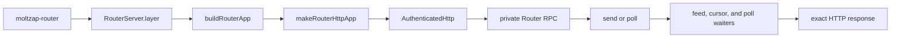

# router/src

_`packages/router/src`_

## Purpose

Public Router contracts: opaque SignedMessages addressed to
explicit AgentIds, send results, and bounded endpoint-wide
PollCursors. Router carries no ConversationId, membership,
transaction, persistence, replay, or recovery semantics; those
belong to the endpoint Harness in `@moltzap/client`.

## Public surface

### [`PollCursor (type)`](https://github.com/chughtapan/moltzap/blob/cutover/four-layer-v2/packages/router/src/router/contract.ts#L97)

_TypeAlias_

```ts
export type PollCursor = typeof PollCursor.Type;
```

Validated opaque Router poll continuation.

### [`PollCursor (value)`](https://github.com/chughtapan/moltzap/blob/cutover/four-layer-v2/packages/router/src/router/contract.ts#L85)

_Variable_

```ts
export const PollCursor = Schema.String.pipe(
  Schema.filter(hasCanonicalCursorShape, {
    identifier: "PollCursor",
    description: "Canonical opaque Router poll continuation",
  }),
  Schema.brand("PollCursor"),
  Schema.annotations({
    identifier: "PollCursor",
    description: "Canonical opaque Router poll continuation",
  }),
)
```

Opaque, authenticated continuation for one caller and Router instance.

### [`Router`](https://github.com/chughtapan/moltzap/blob/cutover/four-layer-v2/packages/router/src/router.ts#L66)

_Class_

```ts
export class Router extends Context.Tag("@moltzap/router/Router")<
  Router,
  RouterClientService
>() {
  static readonly send: (input: {
    readonly request: RouterSendRequest;
    readonly callerAgentId: AgentId;
    readonly signingAuthority: AgentSigningAuthority;
  }) => Effect.Effect<RouterSendResult, RouterClientError, Router> =
    Effect.serviceFunctionEffect(Router, (service) => service.send);

  static readonly poll: (input: {
    readonly request: RouterPollRequest;
    readonly callerAgentId: AgentId;
    readonly signingAuthority: AgentSigningAuthority;
  }) => Effect.Effect<RouterPollResult, RouterClientError, Router> =
    Effect.serviceFunctionEffect(Router, (service) => service.poll);

  static readonly layer = (input: {
    readonly origin: URL;
    readonly sendTimeout: Duration.Duration;
    readonly pollTimeout: Duration.Duration;
  }): Layer.Layer<Router, never, HttpClient.HttpClient> =>
    Layer.effect(Router, makeRouterClient(input));
}
```

Opaque message acceptance and endpoint-wide bounded polling.

### [`RouterConnectionError`](https://github.com/chughtapan/moltzap/blob/cutover/four-layer-v2/packages/router/src/router/contract.ts#L273)

_Class_

```ts
export class RouterConnectionError extends Data.TaggedError(
  "RouterConnectionError",
) {}
```

The Router connection could not be established or used.

### [`RouterInstanceId (type)`](https://github.com/chughtapan/moltzap/blob/cutover/four-layer-v2/packages/router/src/router/contract.ts#L73)

_TypeAlias_

```ts
export type RouterInstanceId = typeof RouterInstanceId.Type;
```

Validated Router process identity.

### [`RouterInstanceId (value)`](https://github.com/chughtapan/moltzap/blob/cutover/four-layer-v2/packages/router/src/router/contract.ts#L67)

_Variable_

```ts
export const RouterInstanceId = canonicalValue(
  "RouterInstanceId",
  "rti_",
  INSTANCE_BYTE_LENGTH,
)
```

Identifies one volatile Router process instance.

### [`RouterInvalidResponseError`](https://github.com/chughtapan/moltzap/blob/cutover/four-layer-v2/packages/router/src/router/contract.ts#L283)

_Class_

```ts
export class RouterInvalidResponseError extends Data.TaggedError(
  "RouterInvalidResponseError",
) {}
```

A Router response did not match the selected operation contract.

### [`RouterPollRequest (type)`](https://github.com/chughtapan/moltzap/blob/cutover/four-layer-v2/packages/router/src/router/contract.ts#L205)

_Interface_

```ts
export interface RouterPollRequest {
  readonly pollCursor?: PollCursor;
}
```

One authenticated endpoint-wide poll request.

### [`RouterPollRequest (value)`](https://github.com/chughtapan/moltzap/blob/cutover/four-layer-v2/packages/router/src/router/contract.ts#L214)

_Variable_

```ts
export const RouterPollRequest: Schema.Schema<
  RouterPollRequest,
  RouterPollRequestEncoded
> = closedStruct({
  pollCursor: Schema.optional(PollCursor),
}).annotations({ identifier: "RouterPollRequest" })
```

Exact Schema for one endpoint-wide poll request.

### [`RouterPollResult (type)`](https://github.com/chughtapan/moltzap/blob/cutover/four-layer-v2/packages/router/src/router/contract.ts#L236)

_TypeAlias_

```ts
export type RouterPollResult =
  | Readonly<{
      kind: "batch";
      routerInstanceId: RouterInstanceId;
      signedMessages: readonly SignedMessageValue[];
      pollCursor: PollCursor;
    }>
  | Readonly<{
      kind: "feed_gap";
      routerInstanceId: RouterInstanceId;
    }>
  | Readonly<{ kind: "cursor_invalid" }>;
```

Closed outcome of one endpoint-wide bounded poll.

### [`RouterPollResult (value)`](https://github.com/chughtapan/moltzap/blob/cutover/four-layer-v2/packages/router/src/router/contract.ts#L263)

_Variable_

```ts
export const RouterPollResult: Schema.Schema<
  RouterPollResult,
  RouterPollResultEncoded
> = Schema.Union(batch, feedGap, cursorInvalid).annotations({
  identifier: "RouterPollResult",
})
```

Exact Schema for every closed poll outcome.

### [`RouterRequestTimeoutError`](https://github.com/chughtapan/moltzap/blob/cutover/four-layer-v2/packages/router/src/router/contract.ts#L278)

_Class_

```ts
export class RouterRequestTimeoutError extends Data.TaggedError(
  "RouterRequestTimeoutError",
) {}
```

The configured complete Router call deadline expired.

### [`RouterSendRequest (type)`](https://github.com/chughtapan/moltzap/blob/cutover/four-layer-v2/packages/router/src/router/contract.ts#L100)

_Interface_

```ts
export interface RouterSendRequest {
  readonly expectedRouterInstanceId: RouterInstanceId;
  readonly mode: "initial" | "retry";
  readonly signedMessage: SignedMessageValue;
}
```

One authenticated request to accept or recover an opaque message.

### [`RouterSendRequest (value)`](https://github.com/chughtapan/moltzap/blob/cutover/four-layer-v2/packages/router/src/router/contract.ts#L135)

_Variable_

```ts
export const RouterSendRequest: Schema.Schema<
  RouterSendRequest,
  RouterSendRequestEncoded
> = closedStruct({
  expectedRouterInstanceId: RouterInstanceId,
  mode: Schema.Literal("initial", "retry"),
  signedMessage: SignedMessage,
}).annotations({ identifier: "RouterSendRequest" })
```

Exact Schema for one send request.

### [`RouterSendResult (type)`](https://github.com/chughtapan/moltzap/blob/cutover/four-layer-v2/packages/router/src/router/contract.ts#L164)

_TypeAlias_

```ts
export type RouterSendResult =
  | Readonly<{
      kind: "accepted";
      routerInstanceId: RouterInstanceId;
      signedMessageDigest: SignedMessageDigest;
    }>
  | Readonly<{
      kind: "router_restarted";
      routerInstanceId: RouterInstanceId;
    }>
  | Readonly<{ kind: "message_invalid" }>
  | Readonly<{ kind: "idempotency_conflict" }>
  | Readonly<{ kind: "retry_identity_unknown" }>;
```

Closed outcome of accepting or recovering an opaque message.

### [`RouterSendResult (value)`](https://github.com/chughtapan/moltzap/blob/cutover/four-layer-v2/packages/router/src/router/contract.ts#L193)

_Variable_

```ts
export const RouterSendResult: Schema.Schema<
  RouterSendResult,
  RouterSendResultEncoded
> = Schema.Union(
  accepted,
  routerRestarted,
  messageInvalid,
  idempotencyConflict,
  retryIdentityUnknown,
).annotations({ identifier: "RouterSendResult" })
```

Exact Schema for every closed send outcome.

### [`SignedMessageDigest (type)`](https://github.com/chughtapan/moltzap/blob/cutover/four-layer-v2/packages/router/src/router/contract.ts#L82)

_TypeAlias_

```ts
export type SignedMessageDigest = typeof SignedMessageDigest.Type;
```

Validated SignedMessage equality receipt.

### [`SignedMessageDigest (value)`](https://github.com/chughtapan/moltzap/blob/cutover/four-layer-v2/packages/router/src/router/contract.ts#L76)

_Variable_

```ts
export const SignedMessageDigest = canonicalValue(
  "SignedMessageDigest",
  "smd_",
  DIGEST_BYTE_LENGTH,
)
```

Equality receipt for one complete retained SignedMessage.

## Package subpaths

### `@moltzap/router/server`

#### [`RouterServer`](https://github.com/chughtapan/moltzap/blob/cutover/four-layer-v2/packages/router/src/server.ts#L27)

_Namespace_

Production Router process surface.

#### [`RouterServer.StartupError`](https://github.com/chughtapan/moltzap/blob/cutover/four-layer-v2/packages/router/src/server.ts#L29)

_Class_

```ts
  export class StartupError extends Data.TaggedError(
    "RouterServerStartupError",
  )<{
    readonly phase: "configuration" | "listener";
  }> {}
```

Closed Router startup phase.

#### [`RouterServer.layer`](https://github.com/chughtapan/moltzap/blob/cutover/four-layer-v2/packages/router/src/server.ts#L66)

_Variable_

```ts
  export const layer: Layer.Layer<never, StartupError> =
    Layer.scopedDiscard(runRouterServer)
```

Complete production Router process composition.



## Files

- `index.ts`
- `router.ts`
- `router/contract.ts`
- `router/feed.ts`
- `router/http.ts`
- `router/poll-cursor.ts`
- `router/poll-waiters.ts`
- `router/poll.ts`
- `router/README.md`
- `router/rpc.ts`
- `router/send.ts`
- `server.ts`
