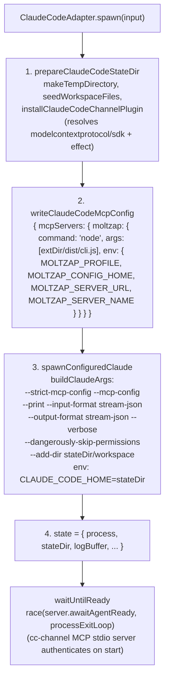
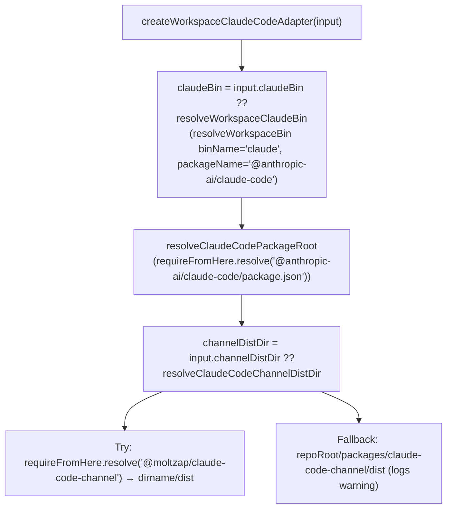
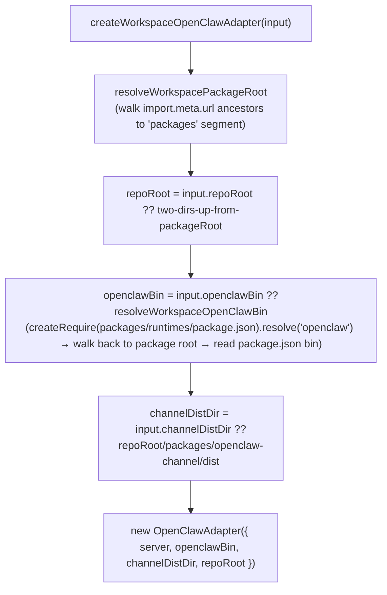
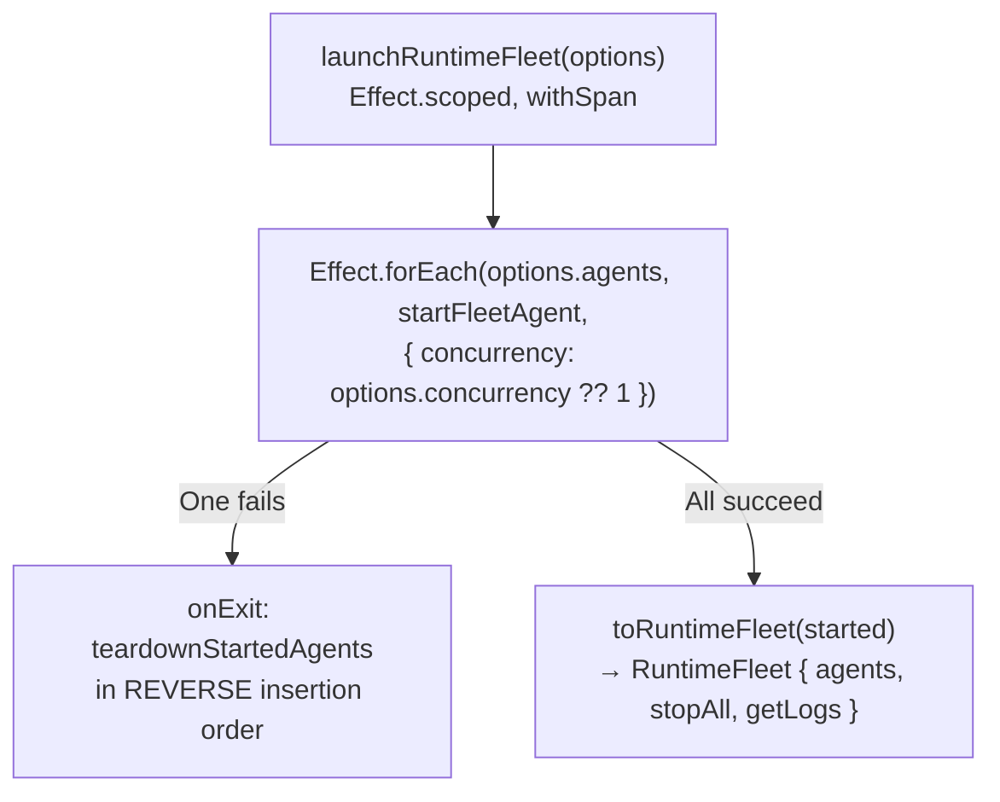
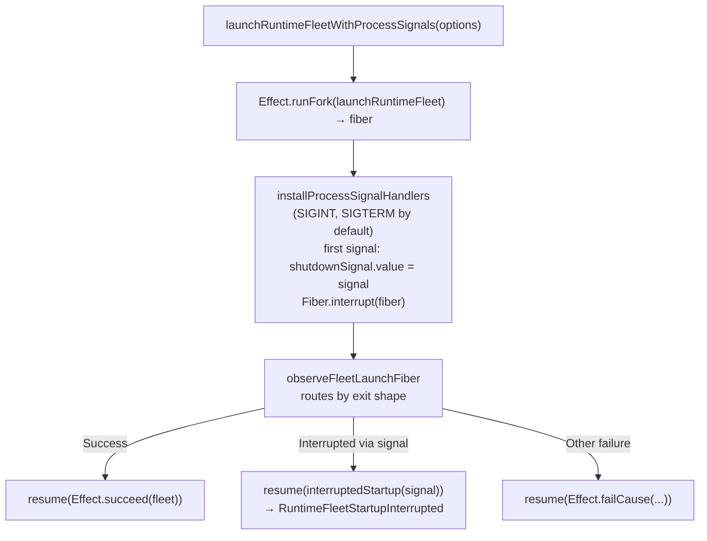
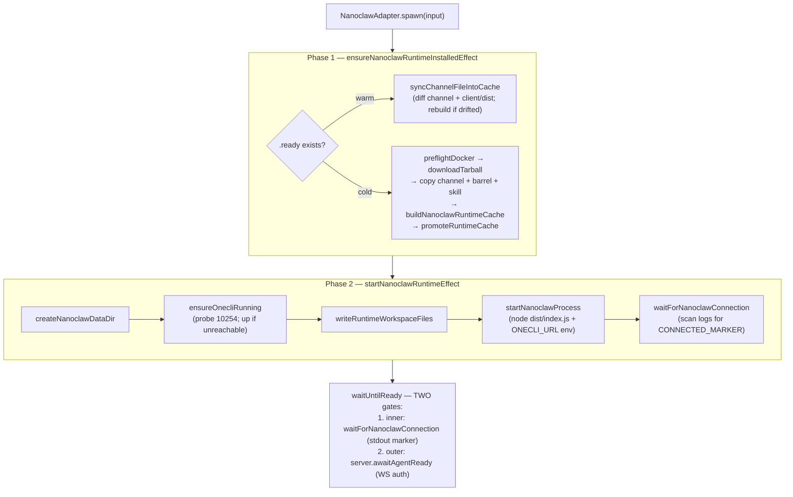
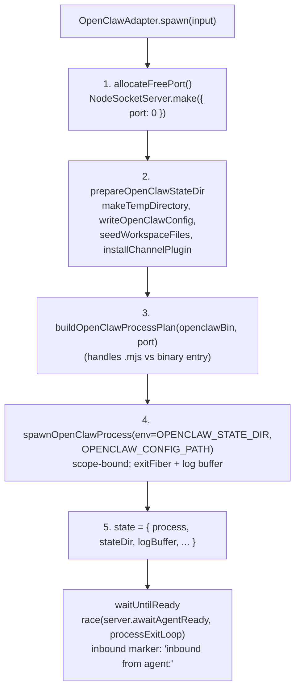
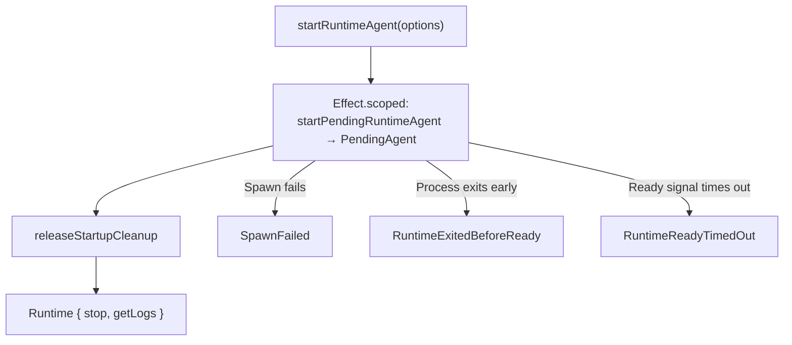

# runtimes/src

_`packages/runtimes/src`_

## Purpose

Public exports for runtime adapter orchestration.

## Public surface

### [`AgentName`](https://github.com/chughtapan/moltzap/blob/main/packages/runtimes/src/runtime.ts#L8)

_TypeAlias_

```ts
export type AgentName = string & Brand.Brand<"AgentName">;
```

### [`AgentName`](https://github.com/chughtapan/moltzap/blob/main/packages/runtimes/src/runtime.ts#L8)

_Variable_

```ts
export type AgentName = string & Brand.Brand<"AgentName">
```

### [`awaitAgentReadyByPolling`](https://github.com/chughtapan/moltzap/blob/main/packages/runtimes/src/await-agent-ready.ts#L106)

_Function_

```ts
export function awaitAgentReadyByPolling(
  connections: PollingConnections,
  agentId: AgentId,
  timeoutMs: number,
  pollIntervalMs: number = DEFAULT_POLL_INTERVAL_MS,
): Effect.Effect<ReadyOutcome, never, never>
```

### [`ClaudeCodeAdapter`](https://github.com/chughtapan/moltzap/blob/main/packages/runtimes/src/claude-code-adapter.ts#L463)

_Class_

```ts
export class ClaudeCodeAdapter implements Runtime {
  private state: AdapterState | null = null;

  constructor(private readonly deps: ClaudeCodeAdapterDeps) {}

  spawn(input: SpawnInput): Effect.Effect<void, SpawnFailed, never> {
    const toSpawnFailed = (cause: unknown): SpawnFailed => {
      const error = cause instanceof Error ? cause : new Error(String(cause));
      return new SpawnFailed({
        agentName: input.agentName,
        cause: error,
        message: `Failed to spawn agent "${input.agentName}": ${error.message}`,
      });
    };

    return Effect.gen(this, function* () {
      const { stateDir, extDir } = yield* prepareClaudeCodeStateDir(
        this.deps,
        input,
      );

      const mcpConfigPath = yield* writeClaudeCodeMcpConfig({
        stateDir,
        extDir,
        serverUrl: input.serverUrl,
        agentName: input.agentName,
      });

      const logBuffer = { value: "" };
      const child = yield* spawnConfiguredClaude({
        deps: this.deps,
        stateDir,
        mcpConfigPath,
        spawnInput: input,
        logBuffer,
      });

      this.state = {
        process: child,
        stateDir,
        spawnInput: input,
        logBuffer,
        tornDown: false,
      };
    }).pipe(Effect.mapError(toSpawnFailed), Effect.provide(NodeContext.layer));
  }

  waitUntilReady(timeoutMs: number): Effect.Effect<ReadyOutcome, never, never> {
    if (!this.state) {
      return Effect.succeed({ _tag: "Ready" as const });
    }
    const { process: proc, spawnInput, logBuffer } = this.state;
    const agentId = spawnInput.agentId;

    // The server side of readiness — Ready when ConnectionManager records
    // an authenticated connection, Timeout if it never does. Pluggable per
    // server-handle implementation (in-process polling vs. out-of-process
    // WS-presence subscription).
    const serverReady = this.deps.server.awaitAgentReady(agentId, timeoutMs);
    const processExit = {
      pollExitCode: () => pollClaudeExitCode(proc),
      stderr: () => logBuffer.value,
      timeoutMs,
    };

    return pipe(
      Effect.race(serverReady, processExitLoop(processExit)),
      // Final-check: if the race resolved `Timeout`, the process may have
      // exited within the last `exitLoop` tick window — give the adapter one
      // last sync poll so a near-deadline exit still surfaces with stderr
      // instead of an opaque `Timeout`.
      Effect.flatMap((outcome) =>
        promoteTimeoutIfProcessExited(outcome, processExit),
      ),
      // Failure outcomes (Timeout, ProcessExited) tear down before returning
      // — keeps the Runtime contract that the adapter cleans up after itself.
      Effect.tap((outcome) =>
        outcome._tag === "Ready" ? Effect.void : this.doTeardown(),
      ),
    );
  }

  teardown(): Effect.Effect<void, never, never> {
    return Effect.suspend(() => this.doTeardown());
  }

  getLogs(offset: number): LogSlice {
    if (!this.state) return { text: "", nextOffset: 0 };
    const full = this.state.logBuffer.value;
    return { text: full.slice(offset), nextOffset: full.length };
  }

  getInboundMarker(): string {
    // The cc-channel pushes an MCP `notifications/claude/channel` to claude
    // for every inbound; that method name appears in `--verbose` stream-json
    // output. Used by trace-capture as a coarse "did inbound reach the
    // agent" signal.
    return "notifications/claude/channel";
  }

  private doTeardown(): Effect.Effect<void, never, never> {
    if (!this.state || this.state.tornDown) return Effect.void;
    this.state.tornDown = true;
    const { process: proc, stateDir } = this.state;

    const removeStateDir = FileSystem.FileSystem.pipe(
      Effect.flatMap((fileSystem) =>
        fileSystem.remove(stateDir, { recursive: true, force: true }),
      ),
      Effect.provide(NodeContext.layer),
      Effect.catchAll((cause) =>
        Effect.logWarning(
          "failed to remove claude-code adapter state dir",
          cause,
        ),
      ),
    );

    // SIGTERM with a timeout; escalate to SIGKILL if SIGTERM doesn't
    // reap. Closing `proc.scope` afterward runs Command.start's kill
```

Claude Code runtime adapter. Spawns the `claude` CLI as the host
process with the moltzap channel installed as a stdio MCP server.



Inbound marker: `notifications/claude/channel`. The cc-channel
sends MCP `notifications/claude/channel` per inbound message; this
is visible in claude's `--verbose` stream-json output. Shutdown
via SIGTERM on the claude process propagates to the MCP stdio
child naturally — no process-group kill needed (unlike OpenClaw).

### [`ClaudeCodeAdapterDeps`](https://github.com/chughtapan/moltzap/blob/main/packages/runtimes/src/claude-code-adapter.ts#L73)

_Interface_

```ts
export interface ClaudeCodeAdapterDeps {
  readonly server: RuntimeServerHandle;

  /**
   * Absolute path to the `claude` CLI bin. Production callers pass the
   * workspace `node_modules/.bin/claude` (resolved by
   * `createWorkspaceClaudeCodeAdapter`).
   */
  readonly claudeBin: string;

  /**
   * Absolute path to `@moltzap/claude-code-channel`'s built `dist/` dir.
   * The adapter copies this into the per-agent state dir and points the
   * MCP config at the copied bin.
   */
  readonly channelDistDir: string;

  /**
   * Absolute path to the moltzap repo root — used to symlink workspace
   * deps (`@moltzap/protocol`, `@moltzap/client`, etc.) into the plugin
   * state dir's `node_modules`.
   */
  readonly repoRoot: string;
}
```

### [`createWorkspaceClaudeCodeAdapter`](https://github.com/chughtapan/moltzap/blob/main/packages/runtimes/src/claude-code-adapter.ts#L619)

_Function_

```ts
export function createWorkspaceClaudeCodeAdapter(
  input: WorkspaceClaudeCodeAdapterInput,
): ClaudeCodeAdapter
```

Workspace-aware factory mirroring
createWorkspaceOpenClawAdapter. Resolves `claudeBin` and
`channelDistDir` from the monorepo at construction time.



### [`createWorkspaceOpenClawAdapter`](https://github.com/chughtapan/moltzap/blob/main/packages/runtimes/src/openclaw-adapter.ts#L427)

_Function_

```ts
export function createWorkspaceOpenClawAdapter(
  input: WorkspaceOpenClawAdapterInput,
): OpenClawAdapter
```

Workspace-aware factory: resolves `openclawBin`, `channelDistDir`,
and `repoRoot` from the monorepo layout at module-load time
(synchronously via `Effect.runSync`), then constructs an
OpenClawAdapter.



Non-workspace usage: pass explicit `openclawBin` /
`channelDistDir` to OpenClawAdapter's constructor
directly. This factory is a convenience for monorepo callers.

### [`launchRuntimeFleet`](https://github.com/chughtapan/moltzap/blob/main/packages/runtimes/src/fleet.ts#L337)

_Function_

```ts
export function launchRuntimeFleet(
  options: RuntimeFleetLaunchOptions,
): Effect.Effect<RuntimeFleet, RuntimeLaunchFailed, never>
```

Launch N agents (sequentially by default; concurrency is opt-in),
tearing down all already-started agents if any one fails.



Sibling: launchRuntimeFleetWithProcessSignals adds SIGINT
/ SIGTERM handlers so Ctrl-C during startup interrupts cleanly via
`RuntimeFleetStartupInterrupted`.

### [`launchRuntimeFleetWithProcessSignals`](https://github.com/chughtapan/moltzap/blob/main/packages/runtimes/src/fleet.ts#L438)

_Function_

```ts
export function launchRuntimeFleetWithProcessSignals(
  options: RuntimeFleetProcessSignalOptions,
): Effect.Effect<
  RuntimeFleet,
  RuntimeLaunchFailed | RuntimeFleetStartupInterrupted,
  never
>
```

Wraps launchRuntimeFleet with OS-signal handlers so user
Ctrl-C during startup interrupts cleanly instead of half-launching
a fleet.



**Fails with:**

- `RuntimeFleetStartupInterrupted` — a signal arrives during fleet startup

### [`LogSlice`](https://github.com/chughtapan/moltzap/blob/main/packages/runtimes/src/runtime.ts#L50)

_Interface_

```ts
export interface LogSlice {
  /** stdout+stderr bytes starting from the requested offset. */
  readonly text: string;
  /** Byte offset to pass on the next call to continue reading. */
  readonly nextOffset: number;
}
```

### [`NanoclawAdapter`](https://github.com/chughtapan/moltzap/blob/main/packages/runtimes/src/nanoclaw-adapter.ts#L80)

_Class_

```ts
export class NanoclawAdapter implements Runtime {
  private state: AdapterState | null = null;

  constructor(private readonly deps: NanoclawAdapterDeps) {}

  spawn(input: SpawnInput): Effect.Effect<void, SpawnFailed, never> {
    const toSpawnFailed = (cause: unknown) => {
      const error = cause instanceof Error ? cause : new Error(String(cause));
      return new SpawnFailed({
        agentName: input.agentName,
        cause: error,
        message: `Failed to spawn agent "${input.agentName}": ${error.message}`,
      });
    };

    return Effect.gen(this, function* () {
      yield* ensureNanoclawRuntimeInstalledEffect();

      const handle = yield* startNanoclawRuntimeEffect({
        agentName: input.agentName,
        agentId: input.agentId,
        apiKey: input.apiKey,
        serverUrl: input.serverUrl,
        workspaceFiles: input.workspaceFiles,
      });

      yield* Effect.sync(() => {
        this.state = { handle, spawnInput: input, tornDown: false };
      });
    }).pipe(Effect.mapError(toSpawnFailed), Effect.provide(NodeContext.layer));
  }

  waitUntilReady(timeoutMs: number): Effect.Effect<ReadyOutcome, never, never> {
    if (!this.state) {
      return Effect.succeed({ _tag: "Ready" as const });
    }
    const { handle, spawnInput } = this.state;
    const agentId = spawnInput.agentId;

    const serverReady = this.deps.server.awaitAgentReady(agentId, timeoutMs);
    const processExit = {
      pollExitCode: () => pollNanoclawExitCode(handle),
      stderr: () => getNanoclawRuntimeLogs(handle),
      timeoutMs,
    };

    return pipe(
      Effect.race(serverReady, processExitLoop(processExit)),
      // Final-check: if the race resolved `Timeout`, nanoclaw's subprocess
      // may have exited within the last `exitLoop` tick window — one last
      // sync probe promotes that case to `ProcessExited` with the actual
      // exit code so the diagnostic stderr isn't lost behind an opaque
      // `Timeout`.
      Effect.flatMap((outcome) =>
        promoteTimeoutIfProcessExited(outcome, processExit),
      ),
      Effect.tap((outcome) =>
        outcome._tag === "Ready" ? Effect.void : this.teardown(),
      ),
    );
  }

  teardown(): Effect.Effect<void, never, never> {
    return this.doTeardown();
  }

  getLogs(offset: number): LogSlice {
    if (!this.state) return { text: "", nextOffset: 0 };
    const full = getNanoclawRuntimeLogs(this.state.handle);
    const text = full.slice(offset);
    return { text, nextOffset: full.length };
  }

  getInboundMarker(): string {
    return "New messages";
  }

  private doTeardown(): Effect.Effect<void, never, never> {
    return Effect.sync(() => {
      const state = this.state;
      if (!state || state.tornDown) return null;
      state.tornDown = true;
      return state.handle;
    }).pipe(
      Effect.flatMap((handle) =>
        handle === null
          ? Effect.void
          : stopNanoclawRuntimeEffect(handle).pipe(
              Effect.provide(NodeContext.layer),
              Effect.catchAll(() => Effect.void),
            ),
      ),
    );
  }
}
```

Nanoclaw runtime adapter. Runs agent subprocesses inside Docker
containers via the OneCLI gateway. Two-phase startup: ensure the
runtime cache is installed, then launch.



Inbound marker: `New messages`. Cache lives at
`NANOCLAW_RUNTIME_CACHE`; the channel-file sync detects drift in
the moltzap channel + client-dist files and rebuilds.

### [`NanoclawAdapterDeps`](https://github.com/chughtapan/moltzap/blob/main/packages/runtimes/src/nanoclaw-adapter.ts#L25)

_Interface_

```ts
export interface NanoclawAdapterDeps {
  readonly server: RuntimeServerHandle;
  readonly nanoclawCache?: string;
}
```

### [`OpenClawAdapter`](https://github.com/chughtapan/moltzap/blob/main/packages/runtimes/src/openclaw-adapter.ts#L287)

_Class_

```ts
export class OpenClawAdapter implements Runtime {
  private state: AdapterState | null = null;

  constructor(private readonly deps: OpenClawAdapterDeps) {}

  spawn(input: SpawnInput): Effect.Effect<void, SpawnFailed, never> {
    const toSpawnFailed = (cause: unknown) => {
      const error = cause instanceof Error ? cause : new Error(String(cause));
      return new SpawnFailed({
        agentName: input.agentName,
        cause: error,
        message: `Failed to spawn agent "${input.agentName}": ${error.message}`,
      });
    };

    return Effect.gen(this, function* () {
      const port = yield* allocateFreePort();
      const { deps } = this;
      const stateDir = yield* prepareOpenClawStateDir(deps, input);
      const logBuffer = { value: "" };
      const child = yield* spawnConfiguredOpenClaw({
        deps,
        stateDir,
        input,
        port,
        logBuffer,
      });

      const st: AdapterState = {
        process: child,
        stateDir,
        logBuffer,
        spawnInput: input,
        tornDown: false,
      };

      this.state = st;
    }).pipe(Effect.mapError(toSpawnFailed), Effect.provide(NodeContext.layer));
  }

  waitUntilReady(timeoutMs: number): Effect.Effect<ReadyOutcome, never, never> {
    if (!this.state) {
      return Effect.succeed({ _tag: "Ready" as const });
    }
    const { process: proc, spawnInput, logBuffer } = this.state;
    const agentId = spawnInput.agentId;

    const serverReady = this.deps.server.awaitAgentReady(agentId, timeoutMs);
    const processExit = {
      pollExitCode: () => pollExitCode(proc),
      stderr: () => logBuffer.value,
      timeoutMs,
    };

    return pipe(
      Effect.race(serverReady, processExitLoop(processExit)),
      // Final-check: if the race resolved `Timeout`, the child may have
      // exited within the last `exitLoop` tick window — one last sync probe
      // promotes that case to `ProcessExited` with the actual exit code so
      // the diagnostic stderr isn't lost behind an opaque `Timeout`.
      Effect.flatMap((outcome) =>
        promoteTimeoutIfProcessExited(outcome, processExit),
      ),
      // Failure outcomes (Timeout, ProcessExited) tear down before returning.
      Effect.tap((outcome) =>
        outcome._tag === "Ready" ? Effect.void : this.teardown(),
      ),
    );
  }

  teardown(): Effect.Effect<void, never, never> {
    return this.doTeardown();
  }

  getLogs(offset: number): LogSlice {
    if (!this.state) return { text: "", nextOffset: 0 };
    const full = this.state.logBuffer.value;
    const text = full.slice(offset);
    return { text, nextOffset: full.length };
  }

  getInboundMarker(): string {
    return "inbound from agent:";
  }

  private doTeardown(): Effect.Effect<void, never, never> {
    return Effect.gen(this, function* () {
      const teardownState = yield* Effect.sync(() => {
        const state = this.state;
        if (!state || state.tornDown) return null;
        state.tornDown = true;
        return { process: state.process, stateDir: state.stateDir };
      });

      if (teardownState === null) return;

      const { process: proc, stateDir } = teardownState;
      const exitOpt = yield* pollExitCode(proc);
      if (Option.isNone(exitOpt)) {
        yield* waitAfterSigterm(proc).pipe(Effect.asVoid);
      }
      yield* Scope.close(proc.scope, Exit.succeed(undefined));

      yield* FileSystem.FileSystem.pipe(
        Effect.flatMap((fileSystem) =>
          fileSystem.remove(stateDir, { recursive: true, force: true }),
        ),
        Effect.provide(NodeContext.layer),
        Effect.catchAll((cause) =>
          Effect.logWarning(
            "failed to remove OpenClaw adapter state dir",
            cause,
          ),
        ),
      );
    });
  }
}
```

OpenClaw runtime adapter. Spawns the OpenClaw gateway as a child
process, configures it with a moltzap channel plugin, and reports
readiness via the server-side WS authentication event.



Readiness signal: server-side WS authentication event surfaces via
`deps.server.awaitAgentReady`. Inbound traffic log marker:
`inbound from agent:`. Errors flow into the fleet via `SpawnFailed`
(boot) or `RuntimeExitedBeforeReady` / `RuntimeReadyTimedOut`
(post-spawn, surfaced by `processExitLoop`).

### [`OpenClawAdapterDeps`](https://github.com/chughtapan/moltzap/blob/main/packages/runtimes/src/openclaw-adapter.ts#L155)

_Interface_

```ts
export interface OpenClawAdapterDeps {
  readonly server: RuntimeServerHandle;
  readonly openclawBin: string;
  readonly channelDistDir: string;
  readonly repoRoot: string;
}
```

### [`ReadyOutcome`](https://github.com/chughtapan/moltzap/blob/main/packages/runtimes/src/runtime.ts#L57)

_TypeAlias_

```ts
export type ReadyOutcome =
  | { readonly _tag: "Ready" }
```

### [`Runtime`](https://github.com/chughtapan/moltzap/blob/main/packages/runtimes/src/runtime.ts#L76)

_Interface_

```ts
export interface Runtime {
  spawn(input: SpawnInput): Effect.Effect<void, SpawnFailed, never>;

  /**
   * Blocks until the agent's subprocess has authenticated against the server
   * (confirmed by ConnectionManager entry) or timeout/exit.
   * On Timeout or ProcessExited, the adapter calls teardown internally
   * before returning.
   */
  waitUntilReady(timeoutMs: number): Effect.Effect<ReadyOutcome, never, never>;

  /** Idempotent. SIGTERM → wait 10s → SIGKILL to process group. rm -rf workdir. */
  teardown(): Effect.Effect<void, never, never>;

  /** Returns stdout+stderr from the given byte offset. */
  getLogs(offset: number): LogSlice;

  /** Substring that proves inbound message delivery when matched against post-send logs. */
  getInboundMarker(): string;
}
```

Runtime interface contract for agent subprocess management.

Five methods. spawn starts the subprocess. waitUntilReady blocks until
the server's ConnectionManager confirms authentication (or timeout/exit).
teardown kills the process group and removes the working directory.
getLogs returns accumulated output from a byte offset.
getInboundMarker returns a substring that proves an inbound message
was received by the runtime's channel plugin.

### [`RuntimeAgentSpec`](https://github.com/chughtapan/moltzap/blob/main/packages/runtimes/src/fleet.ts#L36)

_Interface_

```ts
export interface RuntimeAgentSpec {
  readonly agentName: string;
  readonly apiKey: AgentKey;
  readonly agentId: AgentId;
  readonly serverUrl: string;
  readonly workspaceFiles?: ReadonlyArray<WorkspaceFile>;
  readonly modelId?: string;
}
```

### [`RuntimeExitedBeforeReady`](https://github.com/chughtapan/moltzap/blob/main/packages/runtimes/src/errors.ts#L46)

_Class_

```ts
export class RuntimeExitedBeforeReady extends Data.TaggedError(
  "RuntimeExitedBeforeReady",
)<{
  readonly agentName: string;
  readonly exitCode: number | null;
  readonly stderr: string;
  readonly message: string;
}> {}
```

Raised by `startPendingRuntimeAgent` when `waitUntilReady` returns
`ProcessExited`. The process exited before reaching ready.

`stderr` carries the full accumulated stdout+stderr at exit;
`exitCode` is `null` only if the process exited via signal.
Caller action: inspect `stderr`; check binary auth config.

### [`RuntimeFleet`](https://github.com/chughtapan/moltzap/blob/main/packages/runtimes/src/fleet.ts#L76)

_Interface_

```ts
export interface RuntimeFleet {
  readonly agents: ReadonlyArray<RuntimeFleetAgent>;
  stopAll(): Effect.Effect<void, never, never>;
  getLogs(name: string): string;
}
```

### [`RuntimeFleetAgent`](https://github.com/chughtapan/moltzap/blob/main/packages/runtimes/src/fleet.ts#L71)

_Interface_

```ts
export interface RuntimeFleetAgent {
  readonly name: string;
  readonly agentId: AgentId;
}
```

### [`RuntimeFleetLaunchOptions`](https://github.com/chughtapan/moltzap/blob/main/packages/runtimes/src/fleet.ts#L55)

_Interface_

```ts
export interface RuntimeFleetLaunchOptions {
  readonly kind: RuntimeKind;
  readonly server: RuntimeServerHandle;
  readonly agents: ReadonlyArray<RuntimeAgentSpec>;
  readonly readyTimeoutMs: number;
  readonly concurrency?: number | "unbounded";
  readonly openclaw?: Omit<WorkspaceOpenClawAdapterInput, "server">;
  readonly nanoclaw?: Omit<NanoclawAdapterDeps, "server">;
  readonly claudeCode?: Omit<WorkspaceClaudeCodeAdapterInput, "server">;
}
```

### [`RuntimeFleetProcessSignalOptions`](https://github.com/chughtapan/moltzap/blob/main/packages/runtimes/src/fleet.ts#L66)

_Interface_

```ts
export interface RuntimeFleetProcessSignalOptions
  extends RuntimeFleetLaunchOptions {
  readonly signals?: ReadonlyArray<Signal>;
}
```

### [`RuntimeFleetStartupInterrupted`](https://github.com/chughtapan/moltzap/blob/main/packages/runtimes/src/fleet.ts#L82)

_Class_

```ts
export class RuntimeFleetStartupInterrupted extends Data.TaggedError(
  "RuntimeFleetStartupInterrupted",
)<{
  readonly signal: Signal;
  readonly message: string;
}> {}
```

### [`RuntimeKind`](https://github.com/chughtapan/moltzap/blob/main/packages/runtimes/src/fleet.ts#L32)

_TypeAlias_

```ts
export type RuntimeKind = "openclaw" | "nanoclaw" | "claude-code";

const LOG_START_OFFSET = 0;

export interface RuntimeAgentSpec {
  readonly agentName: string;
  readonly apiKey: AgentKey;
  readonly agentId: AgentId;
  readonly serverUrl: string;
  readonly workspaceFiles?: ReadonlyArray<WorkspaceFile>;
  readonly modelId?: string;
}
```

### [`RuntimeLaunchFailed`](https://github.com/chughtapan/moltzap/blob/main/packages/runtimes/src/errors.ts#L64)

_TypeAlias_

```ts
export type RuntimeLaunchFailed =
  | SpawnFailed
  | RuntimeReadyTimedOut
  | RuntimeExitedBeforeReady;
```

Union of every failure mode `startRuntimeAgent` and
`launchRuntimeFleet` can produce. Use `Effect.catchTags` to
branch by tag, or `Effect.catchAll` to handle uniformly.

Note: `RuntimeFleetStartupInterrupted` lives in `fleet.ts` because
it only arises in the signal-handling variant and carries the
interrupting `Signal`.

### [`RuntimeReadyTimedOut`](https://github.com/chughtapan/moltzap/blob/main/packages/runtimes/src/errors.ts#L30)

_Class_

```ts
export class RuntimeReadyTimedOut extends Data.TaggedError(
  "RuntimeReadyTimedOut",
)<{
  readonly agentName: string;
  readonly timeoutMs: number;
  readonly message: string;
}> {}
```

Raised by `startPendingRuntimeAgent` when `waitUntilReady` returns
`Timeout`. The process is still running but never signaled ready
within `timeoutMs`.

Caller action: increase `readyTimeoutMs`, or inspect
`runtime.getLogs(0)` to see what the subprocess is doing.

### [`RuntimeServerHandle`](https://github.com/chughtapan/moltzap/blob/main/packages/runtimes/src/runtime.ts#L21)

_Interface_

```ts
export interface RuntimeServerHandle {
  /**
   * Resolves to `Ready` when the named agent has authenticated against the
   * server. Resolves to `Timeout` after `timeoutMs` if no authenticated
   * connection ever appears. Resolves to `ProcessExited` only if the
   * implementation can detect that the agent's owning process exited before
   * authenticating; otherwise `Timeout` covers that case (the runtime
   * adapters layer their own exit-detection on top via `Effect.race`).
   *
   * In-process implementations wire this through `awaitAgentReadyByPolling`.
   * Out-of-process implementations (e.g., a zapbot orchestrator talking to
   * a standalone moltzap-server) implement it directly, typically via a
   * presence-event subscription on the server's WebSocket API.
   */
  awaitAgentReady(
    agentId: AgentId,
    timeoutMs: number,
  ): Effect.Effect<ReadyOutcome, never, never>;
}
```

### [`RuntimeStartOptions`](https://github.com/chughtapan/moltzap/blob/main/packages/runtimes/src/fleet.ts#L45)

_Interface_

```ts
export interface RuntimeStartOptions {
  readonly kind: RuntimeKind;
  readonly server: RuntimeServerHandle;
  readonly agent: RuntimeAgentSpec;
  readonly readyTimeoutMs: number;
  readonly openclaw?: Omit<WorkspaceOpenClawAdapterInput, "server">;
  readonly nanoclaw?: Omit<NanoclawAdapterDeps, "server">;
  readonly claudeCode?: Omit<WorkspaceClaudeCodeAdapterInput, "server">;
}
```

### [`ServerUrl`](https://github.com/chughtapan/moltzap/blob/main/packages/runtimes/src/runtime.ts#L9)

_TypeAlias_

```ts
export type ServerUrl = string & Brand.Brand<"ServerUrl">;
```

### [`ServerUrl`](https://github.com/chughtapan/moltzap/blob/main/packages/runtimes/src/runtime.ts#L9)

_Variable_

```ts
export type ServerUrl = string & Brand.Brand<"ServerUrl">
```

### [`SpawnFailed`](https://github.com/chughtapan/moltzap/blob/main/packages/runtimes/src/errors.ts#L16)

_Class_

```ts
export class SpawnFailed extends Data.TaggedError("SpawnFailed")<{
  readonly agentName: string;
  readonly message: string;
  readonly cause: Error;
}> {}
```

Raised by `Runtime.spawn()` in any adapter when the child process
cannot be started — exec error, missing binary, port allocation
failure, state-dir creation failure.

`cause` carries the underlying Error.
Caller action: surface to user. No retry — binary or config is wrong.

### [`SpawnInput`](https://github.com/chughtapan/moltzap/blob/main/packages/runtimes/src/runtime.ts#L41)

_Interface_

```ts
export interface SpawnInput {
  readonly agentName: AgentName;
  readonly apiKey: AgentKey;
  readonly agentId: AgentId;
  readonly serverUrl: ServerUrl;
  readonly workspaceFiles?: ReadonlyArray<WorkspaceFile>;
  readonly modelId?: string;
}
```

### [`startRuntimeAgent`](https://github.com/chughtapan/moltzap/blob/main/packages/runtimes/src/fleet.ts#L309)

_Function_

```ts
export function startRuntimeAgent(
  options: RuntimeStartOptions,
): Effect.Effect<Runtime, RuntimeLaunchFailed, never>
```

Spawn one runtime agent, wait for ready, release the startup cleanup
scope and hand a long-lived `Runtime` back to the caller.



Error channel is the union `RuntimeLaunchFailed` of the three
shapes above. Sibling: launchRuntimeFleet for multi-agent
coordinated startup.

**Fails with:**

- `SpawnFailed` — the child process cannot be started (exec error, bad binary, port allocation failure, state-dir error)
- `RuntimeReadyTimedOut` — `waitUntilReady` exceeds `readyTimeoutMs`
- `RuntimeExitedBeforeReady` — the process exits before signaling ready (inspect `stderr`)

### [`WorkspaceClaudeCodeAdapterInput`](https://github.com/chughtapan/moltzap/blob/main/packages/runtimes/src/claude-code-adapter.ts#L98)

_Interface_

```ts
export interface WorkspaceClaudeCodeAdapterInput {
  readonly server: RuntimeServerHandle;
  readonly claudeBin?: string;
  readonly channelDistDir?: string;
  readonly repoRoot?: string;
}
```

### [`WorkspaceFile`](https://github.com/chughtapan/moltzap/blob/main/packages/runtimes/src/runtime.ts#L16)

_Interface_

```ts
export interface WorkspaceFile {
  readonly relativePath: string;
  readonly content: string;
}
```

### [`WorkspaceOpenClawAdapterInput`](https://github.com/chughtapan/moltzap/blob/main/packages/runtimes/src/openclaw-adapter.ts#L162)

_Interface_

```ts
export interface WorkspaceOpenClawAdapterInput {
  readonly server: RuntimeServerHandle;
  readonly openclawBin?: string;
  readonly channelDistDir?: string;
  readonly repoRoot?: string;
}
```

## Files

- `await-agent-ready.ts`
- `claude-code-adapter.ts`
- `errors.ts`
- `fleet.ts`
- `nanoclaw-adapter.ts`
- `openclaw-adapter.ts`
- `runtime.ts`
