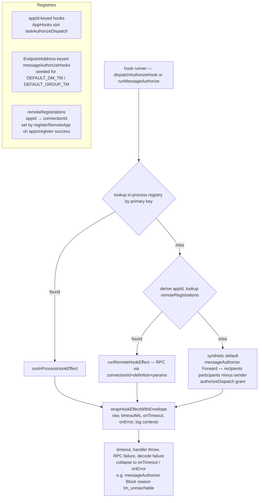
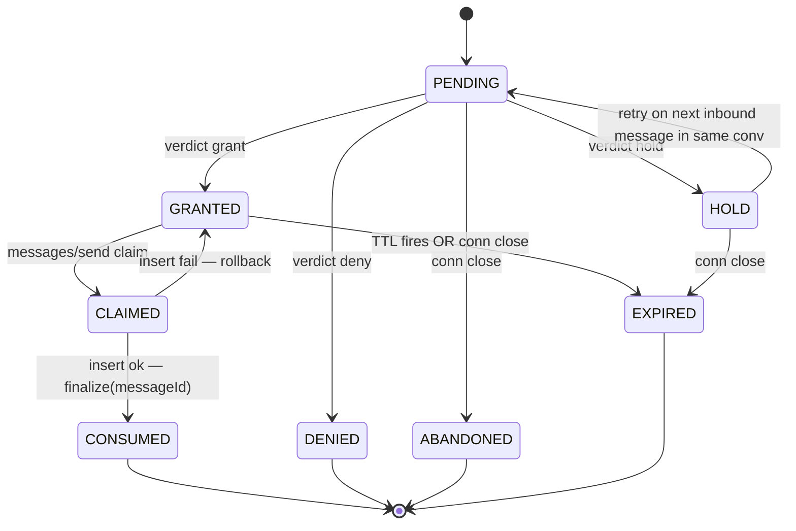
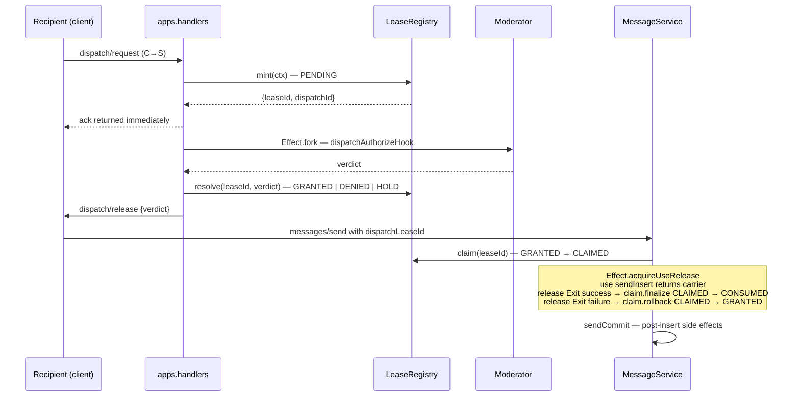
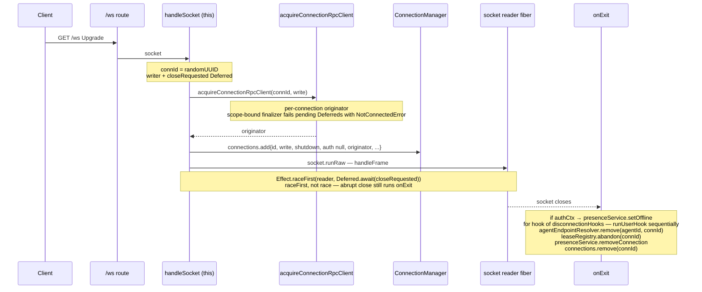

# server-core/app

_`packages/server/src/app`_

## Purpose

App layer public barrel.

The app layer owns AppHost, app registration, lease registry, server boot,
and service layer composition. It may import every lower protocol layer, but
lower layers must not import it because app is the composition root.

## Public surface

### [`AgentEndpointResolverLive`](https://github.com/chughtapan/moltzap/blob/main/packages/server/src/app/layers.ts#L178)

_Variable_

```ts
export const AgentEndpointResolverLive = Layer.effect(
  AgentEndpointResolverTag,
  AgentEndpointResolver.make,
)
```

Build the resolver from its `Effect.make` constructor. The resolver is
a `Ref`-backed in-memory data structure with no upstream deps; the
Layer exists to register it under AgentEndpointResolverTag so
downstream layers (and `network.send`) can pick it up via Context.

### [`AgentEndpointResolverTag`](https://github.com/chughtapan/moltzap/blob/main/packages/server/src/app/layers.ts#L79)

_Class_

```ts
export class AgentEndpointResolverTag extends Context.Tag(
  "moltzap/AgentEndpointResolver",
)<AgentEndpointResolverTag, AgentEndpointResolver>() {}
```

`AgentId → HashSet&lt;ConnectionId>` multimap maintained by the
`network/connect` success path and the WS disconnect finalizer. Read by
NetworkSendServiceTag for O(1) outbound routing.

### [`AppHost`](https://github.com/chughtapan/moltzap/blob/main/packages/server/src/app/app-host.ts#L203)

_Class_

```ts
export class AppHost {
  /**
   * Single source of truth for app registrations. Each `AppId` maps to
   * one `AppRegistration` carrying its `MoltZapConnection` — a real WS
   * connection for wire-registered apps, a loopback connection for
   * boot-installed apps (e.g. `DEFAULT_APP_ID`). AppHost dispatches
   * via the connection uniformly; see `./app-registration.ts`.
   */
  private apps = new AppRegistry();

  private contactService: ContactService | null = null;

  /**
   * Optional lease registry for the #529 reshape surface.
   * Set post-construction by the layer wiring (see {@link setLeaseRegistry}).
   * Consumed exclusively by `enqueueDispatchRequest`. Kept optional so
   * existing tests that construct AppHost directly without a registry
   * still work.
   */
  private leaseRegistry: LeaseRegistry | null = null;

  /**
   * Optional conversation service for the #529 reshape additive deny
   * arm. Wired post-construction by the server layer (see
   * {@link setConversationService}). Used by the forked moderator
   * round-trip to call `removeParticipant` on verdict-deny / synthesized
   * timeout-deny — the architect §3 state-machine rule "On `deny`
   * verdict, registry calls `conversationService.removeParticipant(...)`".
   * Synthesized infra-hold (no hook registered) does NOT call
   * removeParticipant — that is the prereq-2 hold case.
   */
  private conversationService: ConversationServiceForAppHost | null = null;

  constructor(
    private db: Db,
    private connections: ConnectionManager,
  ) {}

  /** Wire the lease registry post-construction. */
  setLeaseRegistry(registry: LeaseRegistry): void {
    this.leaseRegistry = registry;
  }

  /**
   * Wire the conversation service post-construction. The server layer
   * sets this after both AppHost and ConversationService have been
   * constructed (the layer order has ConversationService depending on
   * AppHost, so the inverse cannot be a constructor arg without
   * breaking the cycle).
   */
  setConversationService(svc: ConversationServiceForAppHost): void {
    this.conversationService = svc;
  }

  /** Test-only / handler-side accessor. */
  getLeaseRegistry(): LeaseRegistry | null {
    return this.leaseRegistry;
  }

  /**
   * Register an app under the given connection. The registry rejects
   * overwrites unconditionally — returns false when `manifest.appId`
   * is already registered. Callers (the `apps/register` handler and
   * `installDefaultApp`) decide how to surface false (typed
   * `ForbiddenError` over the wire; exception at boot).
   */
  registerApp(manifest: AppManifest, connection: MoltZapConnection): boolean {
    const ok = this.apps.register(manifest, connection);
    if (ok) {
      Effect.runFork(
        Effect.logInfo("App registered").pipe(
          Effect.annotateLogs({
            appId: manifest.appId,
            connectionId: connection.id,
          }),
        ),
      );
    }
    return ok;
  }

  /**
   * Drop a registration. Idempotent (no-op if absent). The
   * boot-installed default app is never unregistered in production —
   * its loopback connection has a stable id no client caller can
   * match, so {@link unregisterAppsForConnection} never targets it.
   */
  unregisterApp(appId: AppId): void {
    if (this.apps.unregister(appId)) {
      Effect.runFork(
        Effect.logInfo("App unregistered").pipe(Effect.annotateLogs({ appId })),
      );
    }
  }

  /**
   * Drop every registration whose connection matches `connId`. Called
   * by `socket-handler.ts → closeSession` on WS disconnect. The
   * default app's loopback connection has a server-minted id that no
   * client connection can ever match, so this method never targets
   * boot-installed apps.
   */
  unregisterAppsForConnection(connId: ConnectionId): void {
    this.apps.unregisterByConnection(connId);
  }

  /**
   * Read-side accessor for handlers + capability obtain helpers.
   * Returns the registration record (manifest + connection) or
   * undefined if no entry exists.
   */
  lookupApp(appId: AppId): AppRegistration | undefined {
    return this.apps.get(appId);
  }

  /**
   * TM-authority gate: returns true iff `callerConnId` IS the
   * connection currently registered for `appId`. For the default app
   * (loopback connection with a server-minted id), no client caller
   * can match — always returns false.
```

Hook registry + fail-closed envelope for every "send context, get
verdict" S→C interaction. The same `Hook&lt;TContext, TResult>`
abstraction backs `dispatch/authorize` (lease verdict) and
`messages/authorize` (delivery verdict). Each hook runner uses the
three-step resolution and the envelope to keep the wire surface
uniform.



Every fail-mode collapses to a deny-shaped verdict so callers
never see an Effect failure on the hook channel — the envelope IS
the contract.

### [`AppHostLive`](https://github.com/chughtapan/moltzap/blob/main/packages/server/src/app/layers.ts#L267)

_Variable_

```ts
export const AppHostLive = Layer.effect(
  AppHostTag,
  Effect.gen(function* () {
    const db = yield* DbTag;
    const connections = yield* ConnectionManagerTag;
    const leaseRegistry = yield* LeaseRegistryTag;
    const host = new AppHost(db, connections);
    host.setLeaseRegistry(leaseRegistry);
    return host;
  }).pipe(Effect.withSpan("AppHostLive")),
)
```

### [`AppHostTag`](https://github.com/chughtapan/moltzap/blob/main/packages/server/src/app/layers.ts#L114)

_Class_

```ts
export class AppHostTag extends Context.Tag("moltzap/AppHost")<
  AppHostTag,
  AppHost
>() {}
```

### [`AppRegistration`](https://github.com/chughtapan/moltzap/blob/main/packages/server/src/app/app-registration.ts#L15)

_Interface_

```ts
export interface AppRegistration {
  readonly appId: AppId;
  readonly manifest: AppManifest;
  readonly connection: MoltZapConnection;
}
```

A registered app. There is NO `InProcess` vs `Remote` distinction —
every app, including the boot-installed default, carries a
`MoltZapConnection`. Wire-registered apps hold the real WebSocket
connection their `apps/register` call arrived on; the default app
holds a loopback connection (see `loopback-connection.ts`) whose
`originator.call` dispatches in-process. AppHost sees ONE shape and
uses ONE dispatch path: `sendRpcToClient(entry.connection, …)`.

### [`AppRegistry`](https://github.com/chughtapan/moltzap/blob/main/packages/server/src/app/app-registration.ts#L30)

_Class_

```ts
export class AppRegistry {
  private entries = new Map<AppId, AppRegistration>();

  /**
   * Returns true if the registration was installed, false if `appId`
   * is already present. Never overwrites — the caller MUST unregister
   * first if they want to replace.
   */
  register(manifest: AppManifest, connection: MoltZapConnection): boolean {
    const appId = Value.Decode(AppId, manifest.appId);
    if (this.entries.has(appId)) return false;
    this.entries.set(appId, { appId, manifest, connection });
    return true;
  }

  unregister(appId: AppId): boolean {
    return this.entries.delete(appId);
  }

  /**
   * Drop every entry whose connection matches `connectionId`. Used
   * by the WS-close path to clean up any apps the closing connection
   * registered.
   */
  unregisterByConnection(connectionId: string): void {
    for (const [appId, entry] of this.entries) {
      if (entry.connection.id === connectionId) {
        this.entries.delete(appId);
      }
    }
  }

  get(appId: AppId): AppRegistration | undefined {
    return this.entries.get(appId);
  }

  has(appId: AppId): boolean {
    return this.entries.has(appId);
  }
}
```

Single source of truth for app registrations. The registry has no
notion of "boot" vs "wire" — both go through register.
The registry itself enforces the no-overwrite invariant: any
attempt to register on top of an existing entry returns false.
Callers (the `apps/register` handler, `installDefaultApp`) map a
`false` return to whatever surfacing they need — typed
`ForbiddenError` for the wire path, an exception for boot.

### [`AuthServiceLive`](https://github.com/chughtapan/moltzap/blob/main/packages/server/src/app/layers.ts#L199)

_Variable_

```ts
export const AuthServiceLive = Layer.effect(
  AuthServiceTag,
  Effect.gen(function* () {
    const db = yield* DbTag;
    return new AuthService(db);
  }).pipe(Effect.withSpan("AuthServiceLive")),
)
```

### [`AuthServiceTag`](https://github.com/chughtapan/moltzap/blob/main/packages/server/src/app/layers.ts#L91)

_Class_

```ts
export class AuthServiceTag extends Context.Tag("moltzap/AuthService")<
  AuthServiceTag,
  AuthService
>() {}
```

### [`Claim`](https://github.com/chughtapan/moltzap/blob/main/packages/server/src/app/lease-registry.ts#L222)

_Interface_

```ts
export interface Claim {
  readonly leaseId: LeaseId;

  /**
   * CLAIMED → CONSUMED. Idempotent with respect to a successful durable
   * insert — calling twice on the same handle is a typed defect.
   */
  readonly finalize: (
    messageId: MessageId,
  ) => Effect.Effect<void, LeaseInvalidError, never>;
```

Active claim handle returned by `claim`. Implements
acquire-use-release: the wrapping `Effect.acquireUseRelease` MUST
call exactly one of `finalize` or `rollback` on the release path.
The handle carries the lease id privately so callers cannot forge a
finalize against a different lease.

### [`ConnectionHook`](https://github.com/chughtapan/moltzap/blob/main/packages/server/src/app/types.ts#L79)

_TypeAlias_

```ts
export type ConnectionHook = (params: {
  agentId: string;
  agentName: string;
  /** Owner user ID resolved at network/connect time. Null for unclaimed agents. */
  ownerUserId: string | null;
  connId: ConnectionId;
}) => PromiseLike<void> | void;
```

### [`ConnectionManagerLive`](https://github.com/chughtapan/moltzap/blob/main/packages/server/src/app/layers.ts#L167)

_Variable_

```ts
export const ConnectionManagerLive = Layer.sync(
  ConnectionManagerTag,
  () => new ConnectionManager(),
)
```

### [`ConnectionManagerTag`](https://github.com/chughtapan/moltzap/blob/main/packages/server/src/app/layers.ts#L70)

_Class_

```ts
export class ConnectionManagerTag extends Context.Tag(
  "moltzap/ConnectionManager",
)<ConnectionManagerTag, ConnectionManager>() {}
```

### [`ConnectionTag`](https://github.com/chughtapan/moltzap/blob/main/packages/server/src/app/layers.ts#L65)

_Class_

```ts
export class ConnectionTag extends Context.Tag("moltzap/Connection")<
  ConnectionTag,
  MoltZapConnection
>() {}
```

Request-scoped connection. Provided per WebSocket RPC dispatch by the
router; read by handlers via `yield* ConnectionTag`. Handlers that
only need the id read `.id` on the connection. Replaces the
previous `ConnectionTag` — carrying the connection directly eliminates
the lookup-by-id-and-maybe-fail step (and its associated defect
path) every handler that wanted the connection object had to do.

### [`ContactService`](https://github.com/chughtapan/moltzap/blob/main/packages/server/src/app/app-host.ts#L62)

_Interface_

```ts
export interface ContactService {
  areInContact(userIdA: string, userIdB: string): Effect.Effect<boolean, never>;
}
```

### [`ContactsServiceLive`](https://github.com/chughtapan/moltzap/blob/main/packages/server/src/app/layers.ts#L239)

_Variable_

```ts
export const ContactsServiceLive = Layer.effect(
  ContactsServiceTag,
  Effect.gen(function* () {
    const db = yield* DbTag;
    return new ContactsService(db);
  }).pipe(Effect.withSpan("ContactsServiceLive")),
)
```

### [`ContactsServiceTag`](https://github.com/chughtapan/moltzap/blob/main/packages/server/src/app/layers.ts#L104)

_Class_

```ts
export class ContactsServiceTag extends Context.Tag("moltzap/ContactsService")<
  ContactsServiceTag,
  ContactsService
>() {}
```

### [`ConversationAppLookup`](https://github.com/chughtapan/moltzap/blob/main/packages/server/src/app/conversation-app-lookup.ts#L31)

_TypeAlias_

```ts
export type ConversationAppLookup =
  | { readonly _tag: "NoAppSession" }
```

Result of resolving the app session governing a conversation, by joining
`conversations.task_id → tasks.app_id`. Discriminates the four cases the
caller in AppHost.runAuthorizeDispatch must distinguish:

- `NoAppSession` — parent task has `app_id IS NULL` and the conversation
  is not archived. Caller default-grants (no moderator to consult).
- `AppBound` — parent task has `app_id IS NOT NULL`. Caller looks the
  `AppRegistration` up in `AppHost.apps` and routes to the bundled
  InProcess or Remote hook for that `appId`.
- `ConversationArchived` — `conversations.archived_at IS NOT NULL`.
  Caller denies with reason `"conversation_archived"`. The archive
  check fires before the app discriminator so an archived app-bound
  conversation still denies (matches the pre-helper ordering).
- `ConversationNotFound` — no row matches the given `conversationId`.
  Caller default-grants (preserves the pre-helper fall-through).

The discriminated union — rather than `Option&lt;{...}>` plus a separate
archived flag — encodes exhaustiveness at the type level: every caller
`switch` ends with a `never` assignment and a future fifth case
becomes a compile error at every call site (Principle 4).

### [`ConversationServiceForAppHost`](https://github.com/chughtapan/moltzap/blob/main/packages/server/src/app/app-host.ts#L78)

_Interface_

```ts
export interface ConversationServiceForAppHost {
  removeParticipant(
    conversationId: ConversationId,
    agentId: AgentId,
    requesterAgentId: AgentId,
  ): Effect.Effect<void, unknown, NetworkSendServiceTag>;
  getParticipantAgentIds(
    conversationId: ConversationId,
  ): Effect.Effect<readonly AgentId[]>;
}
```

Structural slice of ConversationService that AppHost +
`installDefaultApp` depend on. Defined locally rather than
importing the concrete service to avoid a circular import — the
layer order has ConversationService depending on AppHost.

 - `removeParticipant`: #529 reshape deny arm (forked moderator
   round-trip drops the recipient on deny).
 - `getParticipantAgentIds`: default-app `messages/authorize`
   forward-all policy reads the conversation's participant set
   here instead of re-implementing the SQL.

### [`ConversationServiceLive`](https://github.com/chughtapan/moltzap/blob/main/packages/server/src/app/layers.ts#L215)

_Variable_

```ts
export const ConversationServiceLive = Layer.effect(
  ConversationServiceTag,
  Effect.gen(function* () {
    const db = yield* DbTag;
    const participants = yield* ParticipantServiceTag;
    const connections = yield* ConnectionManagerTag;
    const appHost = yield* AppHostTag;
    return new ConversationService(
      db,
      participants,
      connections,
      // Lazy: AppHost.contactService is wired post-construction in
      // standalone.ts (`app.setContactService(...)`) AFTER this Layer has
      // already produced its ConversationService instance, so capturing
      // a snapshot here would always be `null`.
      () => {
        const cs = appHost.getContactService();
        if (!cs) return null;
        return (a, b) => cs.areInContact(a, b);
      },
    );
  }).pipe(Effect.withSpan("ConversationServiceLive")),
)
```

### [`ConversationServiceTag`](https://github.com/chughtapan/moltzap/blob/main/packages/server/src/app/layers.ts#L100)

_Class_

```ts
export class ConversationServiceTag extends Context.Tag(
  "moltzap/ConversationService",
)<ConversationServiceTag, ConversationService>() {}
```

### [`CoreApp`](https://github.com/chughtapan/moltzap/blob/main/packages/server/src/app/types.ts#L93)

_Interface_

```ts
export interface CoreApp {
  readonly port: number;
  onConnection: (hook: ConnectionHook) => void;
```

### [`CoreConfig`](https://github.com/chughtapan/moltzap/blob/main/packages/server/src/app/types.ts#L19)

_Interface_

```ts
export interface CoreConfig {
  db: Db;
  dbCleanup?: () => PromiseLike<void>;
```

### [`createCoreApp`](https://github.com/chughtapan/moltzap/blob/main/packages/server/src/app/server.ts#L96)

_Function_

```ts
export function createCoreApp(config: CoreConfig): CoreApp
```

### [`DbTag`](https://github.com/chughtapan/moltzap/blob/main/packages/server/src/app/layers.ts#L49)

_Class_

```ts
export class DbTag extends Context.Tag("moltzap/Db")<DbTag, Db>() {}
```

Postgres/PGlite database handle (Kysely&lt;Database>).

### [`DeliveryWebhookTag`](https://github.com/chughtapan/moltzap/blob/main/packages/server/src/app/layers.ts#L160)

_Class_

```ts
export class DeliveryWebhookTag extends Context.Tag("moltzap/DeliveryWebhook")<
  DeliveryWebhookTag,
  DeliveryWebhookConfig | null
>() {}
```

Optional fire-and-forget message-delivery webhook. `null` means no
webhook — the fanout is skipped entirely.

### [`DisconnectionHook`](https://github.com/chughtapan/moltzap/blob/main/packages/server/src/app/types.ts#L87)

_TypeAlias_

```ts
export type DisconnectionHook = (params: {
  agentId: string;
  ownerUserId: string | null;
  connId: ConnectionId;
}) => PromiseLike<void> | void;
```

### [`DispatchAdmissionResult`](https://github.com/chughtapan/moltzap/blob/main/packages/server/src/app/hooks.ts#L32)

_TypeAlias_

```ts
export type DispatchAdmissionResult =
  | {
      decision: "grant";
      leaseId?: string;
      leaseTimeoutMs?: number;
      dispatchMessageId?: MessageId;
    }
```

### [`DispatchAuthorizeContext`](https://github.com/chughtapan/moltzap/blob/main/packages/server/src/app/hooks.ts#L11)

_Interface_

```ts
export interface DispatchAuthorizeContext {
  conversationId: ConversationId;
  recipient: { agentId: AgentId; ownerId: string };
  message: { id: MessageId; senderAgentId: AgentId; parts?: Part[] };
  taskId: TaskId;
  appId: string;
  attempt: number;
  receivedAt?: string;
  clock?: LogicalClock;
  pending?: ReadonlyArray<{
    messageId: MessageId;
    conversationId: ConversationId;
    senderAgentId: AgentId;
    createdAt: string;
    receivedAt: string;
    clock?: LogicalClock;
    parts?: Part[];
  }>;
  signal: AbortSignal;
}
```

Server-side dispatch admission hook context. Wire shape mirrors
the protocol's `DispatchAuthorizeContextSchema`. Consumed by
`AppHost.callAppRpc` to construct the params for the
`dispatch/authorize` server→app call.

### [`EncryptionTag`](https://github.com/chughtapan/moltzap/blob/main/packages/server/src/app/layers.ts#L52)

_Class_

```ts
export class EncryptionTag extends Context.Tag("moltzap/Encryption")<
  EncryptionTag,
  EnvelopeEncryption | null
>() {}
```

Optional envelope-encryption helper. null when encryption is disabled.

### [`ERROR_INVALID_JSON`](https://github.com/chughtapan/moltzap/blob/main/packages/server/src/app/server-constants.ts#L10)

_Variable_

```ts
export const ERROR_INVALID_JSON = "Invalid JSON"
```

### [`ERROR_INVALID_PARAMETERS`](https://github.com/chughtapan/moltzap/blob/main/packages/server/src/app/server-constants.ts#L11)

_Variable_

```ts
export const ERROR_INVALID_PARAMETERS = "Invalid parameters"
```

### [`HTTP_BAD_REQUEST`](https://github.com/chughtapan/moltzap/blob/main/packages/server/src/app/server-constants.ts#L3)

_Variable_

```ts
export const HTTP_BAD_REQUEST = 400
```

### [`HTTP_CONFLICT`](https://github.com/chughtapan/moltzap/blob/main/packages/server/src/app/server-constants.ts#L7)

_Variable_

```ts
export const HTTP_CONFLICT = 409
```

### [`HTTP_CREATED`](https://github.com/chughtapan/moltzap/blob/main/packages/server/src/app/server-constants.ts#L2)

_Variable_

```ts
export const HTTP_CREATED = 201
```

### [`HTTP_FORBIDDEN`](https://github.com/chughtapan/moltzap/blob/main/packages/server/src/app/server-constants.ts#L5)

_Variable_

```ts
export const HTTP_FORBIDDEN = 403
```

### [`HTTP_INTERNAL_SERVER_ERROR`](https://github.com/chughtapan/moltzap/blob/main/packages/server/src/app/server-constants.ts#L8)

_Variable_

```ts
export const HTTP_INTERNAL_SERVER_ERROR = 500
```

### [`HTTP_NOT_FOUND`](https://github.com/chughtapan/moltzap/blob/main/packages/server/src/app/server-constants.ts#L6)

_Variable_

```ts
export const HTTP_NOT_FOUND = 404
```

### [`HTTP_OK`](https://github.com/chughtapan/moltzap/blob/main/packages/server/src/app/server-constants.ts#L1)

_Variable_

```ts
export const HTTP_OK = 200
```

### [`HTTP_UNAUTHORIZED`](https://github.com/chughtapan/moltzap/blob/main/packages/server/src/app/server-constants.ts#L4)

_Variable_

```ts
export const HTTP_UNAUTHORIZED = 401
```

### [`installDefaultApp`](https://github.com/chughtapan/moltzap/blob/main/packages/server/src/app/default-app.ts#L39)

_Function_

```ts
export function installDefaultApp(
  appHost: AppHost,
  conversation: ConversationServiceForAppHost,
): void
```

Boot-time installation of the default app. Wires a loopback
`MoltZapConnection` whose `originator.call` dispatches in-process
— from AppHost's perspective this is identical to a wire-registered
app. The two task-callback handlers:

  - `dispatch/authorize` → always `grant`. Unmoderated semantic.
  - `messages/authorize` → `Forward { recipients: participants \ sender }`,
    reading participants via `ConversationService.getParticipantAgentIds`
    (same helper every other server-side participant query uses).

TM-only RPCs remain unreachable on DEFAULT_APP_ID tasks because
`isAppConnection` compares the caller's connection id against the
loopback's — no client connection can ever match.

### [`LeaseBindingTuple`](https://github.com/chughtapan/moltzap/blob/main/packages/server/src/app/lease-registry.ts#L102)

_Interface_

```ts
export interface LeaseBindingTuple {
  readonly recipientAgentId: AgentId;
  readonly recipientConnectionId: ConnectionId;
  readonly moderatorConnectionId: ConnectionId;
  readonly taskId: TaskId;
  readonly conversationId: ConversationId;
  readonly appId: AppId;
}
```

Audit binding tuple recorded at `mint` time. Used by `dispatches/get`
scope-enforcement and connection-close cleanup. Once recorded, the
tuple is immutable for the lease's lifetime.

### [`LeaseInvalidError`](https://github.com/chughtapan/moltzap/blob/main/packages/server/src/app/lease-registry.ts#L182)

_Class_

```ts
export class LeaseInvalidError extends Data.TaggedError("LeaseInvalidError")<{
  readonly leaseId: LeaseId;
  readonly state: LeaseState;
  readonly expected: ReadonlyArray<LeaseState>;
  readonly operation:
    | "resolve"
    | "claim"
    | "finalize"
    | "rollback"
    | "read"
    | "bindToConnection";
}> {
  override get message(): string {
    return `lease ${this.leaseId} in state ${this.state} cannot ${this.operation} (expected one of ${this.expected.join(", ")})`;
  }
}
```

Tagged error channel for the registry's transition-rejecting paths.
The `state` carries the lease's CURRENT state (so callers can
surface a precise wire-error code per #529's typed-CONSUMED /
typed-EXPIRED requirements) and `expected` carries the set of
states the operation would have accepted.

### [`LeaseMintContext`](https://github.com/chughtapan/moltzap/blob/main/packages/server/src/app/lease-registry.ts#L156)

_Interface_

```ts
export interface LeaseMintContext {
  readonly recipientAgentId: AgentId;
  readonly recipientConnectionId: ConnectionId;
  readonly moderatorConnectionId: ConnectionId;
  readonly taskId: TaskId;
  readonly conversationId: ConversationId;
  readonly appId: AppId;
}
```

Inputs to `mint`. Captured into the binding tuple plus mint
timestamp; the registry generates `leaseId` and `dispatchId`
internally via `crypto.randomUUID()` (≥122 bits entropy per spec).

### [`LeaseMintResult`](https://github.com/chughtapan/moltzap/blob/main/packages/server/src/app/lease-registry.ts#L170)

_Interface_

```ts
export interface LeaseMintResult {
  readonly leaseId: LeaseId;
  readonly dispatchId: DispatchId;
}
```

Lease mint result. Both ids are branded — calling code cannot
accidentally confuse them with `MessageId` / `TaskId` / generic
strings.

### [`LeaseNotFoundError`](https://github.com/chughtapan/moltzap/blob/main/packages/server/src/app/lease-registry.ts#L206)

_Class_

```ts
export class LeaseNotFoundError extends Data.TaggedError("LeaseNotFoundError")<{
  readonly id: LeaseId | DispatchId;
  readonly kind: "leaseId" | "dispatchId";
}> {
  override get message(): string {
    return `no lease record for ${this.kind}=${this.id}`;
  }
}
```

Lookup-by-id failure when the registry has no entry for the supplied
id. Distinct from `LeaseInvalidError` — that error fires when the
lease exists but is in the wrong state. `LeaseNotFoundError` fires
when the id is unknown (caller forged it, or it aged out of the
retention window).

### [`LeaseRecord`](https://github.com/chughtapan/moltzap/blob/main/packages/server/src/app/lease-registry.ts#L137)

_Interface_

```ts
export interface LeaseRecord {
  readonly dispatchId: DispatchId;
  readonly leaseId: LeaseId;
  readonly binding: LeaseBindingTuple;
  readonly state: LeaseState;
  readonly verdict: LeaseVerdict | null;
  readonly mintedAt: string;
  readonly resolvedAt: string | null;
  readonly consumedAt: string | null;
  readonly consumedMessageId: MessageId | null;
  readonly expiredAt: string | null;
  readonly leaseTimeoutMs: number | null;
}
```

Snapshot of a lease for `dispatches/get` and observability tests.
Mirrors the wire `LeaseRecordSchema` shape; ISO-8601 timestamps for
cross-boundary stability.

### [`leaseRecordToWire`](https://github.com/chughtapan/moltzap/blob/main/packages/server/src/app/lease-registry.ts#L513)

_Function_

```ts
export function leaseRecordToWire(record: LeaseRecord): LeaseRecordWire
```

Translation point between the in-process nested `LeaseRecord`
(binding field carries the full audit tuple) and the wire
`LeaseRecordSchema` shape (flat fields). Centralizing this keeps the
in-process representation as the single source of truth for the
authoritative tuple while the wire schema stays flat for simple
ergonomics on the moderator client side.

Advisory carry-over from review-senior-arch529 #2.

### [`LeaseRegistry`](https://github.com/chughtapan/moltzap/blob/main/packages/server/src/app/lease-registry.ts#L307)

_Interface_

```ts
export interface LeaseRegistry {
  /**
   * Mint a new PENDING lease. Synchronous (`Effect&lt;..., never>`) — the
```

Public contract of the lease registry. One instance per server
lifetime; held by `AppHost` and the messages handler. Backed by an
in-process `Ref&lt;Map&lt;LeaseId, LeaseEntry>>` with per-lease TTL
fibers — no DB row. State transitions are atomic via `Ref.modify`.

Lease state machine (eight states; `LeaseState` in this file is the
normative enumeration):



Mint + claim + finalize sequence (recipient + moderator round-trip):



Post-insert side effects (`sendCommit`) DO NOT affect lease state:
a failure there leaves the lease CONSUMED and the durable row
intact. Callers must not retry.

Connection-close cleanup runs `abandon(connId)` from the disconnect
finalizer: PENDING → ABANDONED, GRANTED/HOLD → EXPIRED, CLAIMED →
no-op. The CLAIMED no-op is load-bearing — without it, a recipient
disconnect mid-insert could roll back a committed durable row,
permitting a duplicate retry.

Timer wheel / min-heap for TTLs runs on a single fiber; per-lease
scheduler fibers are forbidden. Manifest TTLs come from
`manifest.hooks.dispatch_authorize.timeout_ms` (moderator response)
and the verdict's `leaseTimeoutMs` (post-grant lease).

### [`LeaseRegistryDeps`](https://github.com/chughtapan/moltzap/blob/main/packages/server/src/app/lease-registry.ts#L451)

_Interface_

```ts
export interface LeaseRegistryDeps {
  readonly connections: ConnectionManager;
  readonly leaseRetentionMs: number;
}
```

Constructor dependencies for the lease registry.
- `connections`: looked up at `emitRelease` time to find the
  recipient and at `dispatches/consumed` / `dispatches/expired`
  emission to find the moderator's connection.
- `leaseRetentionMs`: terminal-state retention window (CONSUMED /
  DENIED / EXPIRED / ABANDONED). Live states (PENDING / GRANTED /
  HOLD / CLAIMED) age out on their own TTLs.

### [`LeaseRegistryLive`](https://github.com/chughtapan/moltzap/blob/main/packages/server/src/app/layers.ts#L256)

_Variable_

```ts
export const LeaseRegistryLive = Layer.effect(
  LeaseRegistryTag,
  Effect.gen(function* () {
    const connections = yield* ConnectionManagerTag;
    return yield* makeLeaseRegistry({
      connections,
      leaseRetentionMs: DEFAULT_LEASE_RETENTION_MS,
    });
  }).pipe(Effect.withSpan("LeaseRegistryLive")),
)
```

### [`LeaseRegistryTag`](https://github.com/chughtapan/moltzap/blob/main/packages/server/src/app/layers.ts#L125)

_Class_

```ts
export class LeaseRegistryTag extends Context.Tag("moltzap/LeaseRegistry")<
  LeaseRegistryTag,
  LeaseRegistry
>() {}
```

`LeaseRegistry` for the #529 reshape additive `dispatch/*` admission
surface. In-process state (`Ref&lt;Map&lt;LeaseId, LeaseEntry>>` + per-lease
TTL fibers); no DB. Constructed once per server lifetime via
LeaseRegistryLive.

### [`LeaseState`](https://github.com/chughtapan/moltzap/blob/main/packages/server/src/app/lease-registry.ts#L116)

_TypeAlias_

```ts
export type LeaseState =
  | "PENDING"
  | "CLAIMED"
  | "GRANTED"
  | "CONSUMED"
  | "DENIED"
  | "EXPIRED"
  | "ABANDONED"
  | "HOLD";
```

Discriminated state of a lease. The registry's `Ref.modify`
transitions read this discriminator and reject illegal transitions
with a typed error (see LeaseInvalidError).

### [`LeaseVerdict`](https://github.com/chughtapan/moltzap/blob/main/packages/server/src/app/lease-registry.ts#L127)

_TypeAlias_

```ts
export type LeaseVerdict =
  | { readonly _tag: "grant"; readonly leaseTimeoutMs?: number }
```

Verdict shapes accepted by `resolve` — mirrors the wire decision.

### [`loadCoreConfig`](https://github.com/chughtapan/moltzap/blob/main/packages/server/src/app/config.ts#L155)

_Function_

```ts
export function loadCoreConfig(): LoadedConfig
```

Sync facade for the one boot entry (`app/dev.ts`) that runs outside an
Effect program. Safe here because this is the absolute process entrypoint:
a `ConfigError` bubbles up as an unhandled exception and fails startup —
the same outcome the previous throw-based loader produced.

### [`LoadedConfig`](https://github.com/chughtapan/moltzap/blob/main/packages/server/src/app/config.ts#L8)

_Interface_

```ts
export interface LoadedConfig {
  database: {
    url: string;
  };
  encryption: {
    /**
     * Derived from `ENCRYPTION_MASTER_SECRET`. When absent, the encryption
     * layer is disabled and messages are stored as plaintext. Operators who
     * want at-rest encryption must set this env var.
     */
    masterSecret: string | undefined;
  };
  server: {
    port: number;
    corsOrigins: CorsConfig;
  };
  devMode: boolean;
}
```

### [`logError`](https://github.com/chughtapan/moltzap/blob/main/packages/server/src/app/logging.ts#L15)

_Function_

```ts
export const logError = (
  message: string,
  annotations: Record<string, unknown> = {},
): Effect.Effect<void>
```

### [`logInfo`](https://github.com/chughtapan/moltzap/blob/main/packages/server/src/app/logging.ts#L3)

_Function_

```ts
export const logInfo = (
  message: string,
  annotations: Record<string, unknown> = {},
): Effect.Effect<void>
```

### [`logWarning`](https://github.com/chughtapan/moltzap/blob/main/packages/server/src/app/logging.ts#L9)

_Function_

```ts
export const logWarning = (
  message: string,
  annotations: Record<string, unknown> = {},
): Effect.Effect<void>
```

### [`lookupAppForConversation`](https://github.com/chughtapan/moltzap/blob/main/packages/server/src/app/conversation-app-lookup.ts#L75)

_Function_

```ts
export function lookupAppForConversation(
  db: Db,
  conversationId: ConversationId,
): Effect.Effect<ConversationAppLookup, never, never>
```

Resolve which app (if any) governs the conversation by joining
`conversations.task_id → tasks.app_id`. Replaces the dead in-memory
`conversationToSession` cache that lived on `AppHost`.

SQL shape (single round-trip):

```
SELECT conversations.archived_at,
       tasks.id     AS task_id,
       tasks.app_id AS app_id
FROM   conversations
INNER JOIN tasks ON tasks.id = conversations.task_id
WHERE  conversations.id = ?
LIMIT  1
```

`INNER JOIN` is correct: `conversations.task_id` is `NOT NULL` with a
FK to `tasks.id`, so every conversation row joins exactly one task
row. The query collapses the pre-helper archive-check + cache lookup
into one round-trip.

Branch ordering matches the pre-helper behavior at the caller:
archive check fires first, then the app discriminator. An archived
app-bound conversation returns `ConversationArchived`, not `AppBound`
— same as the inline archive query short-circuited before the cache
lookup ever ran.

Error channel is `never`: SQL errors surface as defects via
`catchSqlErrorAsDefect` at the call site in `AppHost.runAuthorizeDispatch`,
which is the existing convention for AppHost DB reads. Defects are
the right channel here — a database failure during admission is a
server-internal fault, not a moderator verdict.

### [`LoopbackHandlers`](https://github.com/chughtapan/moltzap/blob/main/packages/server/src/app/loopback-connection.ts#L29)

_TypeAlias_

```ts
export type LoopbackHandlers = {
  readonly [D in AnyTaskCallbackRpcDefinition as D["name"]]: LoopbackHandler<D>;
};
```

Mapped over the closed `AnyTaskCallbackRpcDefinition` union, keyed
by each definition's wire name. Mandates one handler per
task-callback RPC at construction time — adding a new entry to
`taskCallbackMethods` becomes a compile error at every loopback
construction site (which is the right blast radius for "I added a
new server→app RPC; who needs to handle it?").

### [`makeCoreHttpApp`](https://github.com/chughtapan/moltzap/blob/main/packages/server/src/app/http-routes.ts#L91)

_Function_

```ts
export function makeCoreHttpApp(options: CoreHttpAppOptions)
```

Build the core HTTP app. Composes the three always-on routes
(`/health`, `/ws`, conditional admin) with the auth surface
(`/api/v1/auth/register`, `/api/v1/auth/claim`) and wraps the
router in CORS.

| Route                              | Mounted unless         | Method | Body                          | Status                                                       |
|------------------------------------|------------------------|--------|-------------------------------|--------------------------------------------------------------|
| `/health`                          | always                 | GET    | —                             | 200 `{status, connections}`                                  |
| `/ws`                              | always                 | GET    | WS Upgrade                    | 101                                                          |
| `/api/v1/auth/register`            | `skipDefaultRegisterRoute` | POST | `Register.params`           | 201 `{agentId, apiKey, claimToken, claimUrl}`; 400/403/500   |
| `/api/v1/auth/claim`               | `skipDefaultRegisterRoute` | POST | `Claim.params`              | 200 (idempotent) / 201 (first); 401/403/500                  |
| `/api/v1/admin/register-agent`     | only when `skipDefaultRegisterRoute=false` AND `registrationSecret` set | POST | superset of `Register.params` + `ownerUserId` | 200 (rotated) / 201 (new); 400/403/409/500 |

All bodied routes funnel through `readValidatedBody` for JSON
decode + Ajv validation. Invite-gate checks use `safeEqual`
(constant-time) to compare `inviteCode` against
`registrationSecret`.

The `/api/v1/auth/claim` success path refreshes
`conn.auth.ownerUserId` on every live connection of the
just-claimed agent so subsequent owner-gated RPCs see fresh state
without forcing a reconnect.

### [`makeLeaseRegistry`](https://github.com/chughtapan/moltzap/blob/main/packages/server/src/app/lease-registry.ts#L1210)

_Function_

```ts
export function makeLeaseRegistry(
  deps: LeaseRegistryDeps,
): Effect.Effect<LeaseRegistry, never, never>
```

Construct the registry. The constructor is the only public factory
— `LeaseRegistry` is referenced as an interface from call sites.

Implementation: a `Ref&lt;Map&lt;LeaseId, LeaseEntry>>` plus a per-lease
scheduled TTL fiber (Effect-managed; safe to interrupt). Every state
transition is a `Ref.modify` predicate that returns the new entry +
a description of the side-effect (notification to emit, fiber to
cancel). The side-effects run AFTER the predicate commits — so the
state change is visible to concurrent readers before the
notification fires, satisfying the "first writer wins" invariant.

### [`makeLoopbackConnection`](https://github.com/chughtapan/moltzap/blob/main/packages/server/src/app/loopback-connection.ts#L71)

_Function_

```ts
export function makeLoopbackConnection(args: {
  readonly id: ConnectionId;
  readonly handlers: LoopbackHandlers;
}): MoltZapConnection
```

Build a `MoltZapConnection` whose outbound `call` dispatches to
in-process handlers instead of going over a WebSocket. The
connection satisfies the same interface as a real WS connection so
`AppHost`, `AppRegistry`, and `sendRpcToClient` see ONE shape — the
difference between "in-process moderator" and "wire moderator" is
which factory built the connection, not how it's consumed.

Loopback-specific behavior:
  - `originator.call(D, params)` indexes `handlers` by `D.name`. The
    mapped type guarantees every member of
    `AnyTaskCallbackRpcDefinition` has a handler — no runtime
    "method not found" branch exists.
  - `originator.notify` / `failAllPending` are no-ops (the default
    app doesn't subscribe to notifications and has no pending
    Deferreds to drain).
  - `originator.handle` / `originator.resolve` defect — a loopback
    never receives inbound frames; if anyone calls these, it's a
    wiring bug that should crash the server immediately.
  - `write` / `shutdown` are similarly defects / inert.

### [`makeNodeHttpServer`](https://github.com/chughtapan/moltzap/blob/main/packages/server/src/app/node-http-server.ts#L3)

_Function_

```ts
export function makeNodeHttpServer()
```

### [`makeSocketHandler`](https://github.com/chughtapan/moltzap/blob/main/packages/server/src/app/socket-handler.ts#L97)

_Function_

```ts
export function makeSocketHandler(options: SocketHandlerOptions)
```

Build the handler that the `/ws` route hands the upgraded socket
to. Each connection runs as one scoped Effect: the connection
scope owns the per-connection RPC originator, the
`ConnectionManager` entry, and every cleanup hook.



`Effect.raceFirst` (vs plain `race`) is load-bearing: an abrupt
disconnect still propagates as an interruption that triggers
`onExit`. Plain `race` would leak resources on abnormal close.

Disconnection hooks run SEQUENTIALLY so each hook's cleanup
completes before the next observes post-close state.

### [`makeStubConnection`](https://github.com/chughtapan/moltzap/blob/main/packages/server/src/app/loopback-connection.ts#L117)

_Function_

```ts
export function makeStubConnection(args: {
  readonly id: ConnectionId;
  readonly originatorCall?: <D extends AnyTaskCallbackRpcDefinition>(
    definition: D,
    params: ParamsOf<D>,
  ) => Effect.Effect<ResultOf<D>, RpcCallError>;
}): MoltZapConnection
```

Minimal `MoltZapConnection` for tests that only assert the
registration surface (id-equality via `isAppConnection`,
unregister-side effects, etc.). Every dispatch method defects —
tests that actually drive `runMessageAuthorize` /
`runDispatchAuthorize` MUST use makeLoopbackConnection
(or, in app-host integration tests, a real wire connection via
`acquireConnectionRpcClient`).

Optional `originatorCall` override lets a test mock the outbound
RPC channel (e.g., to simulate a stale-connection
`NotConnectedError` without spinning up a real socket).

### [`MessageAuthorizeContext`](https://github.com/chughtapan/moltzap/blob/main/packages/server/src/app/hooks.ts#L48)

_Interface_

```ts
export interface MessageAuthorizeContext {
  conversationId: ConversationId;
  message: { id: MessageId; senderAgentId: AgentId; parts?: Part[] };
  taskId: TaskId;
  appId: string;
  receivedAt?: string;
  clock?: LogicalClock;
  signal: AbortSignal;
}
```

Server-side message-fan-out authorization hook context. Wire shape
mirrors the protocol's `MessagesAuthorizeContextSchema`. Symmetric
to `DispatchAuthorizeContext` — same fields, same fail-closed
posture, different verdict union.

### [`MessageAuthorizeResult`](https://github.com/chughtapan/moltzap/blob/main/packages/server/src/app/hooks.ts#L67)

_TypeAlias_

```ts
export type MessageAuthorizeResult =
  | { decision: "Forward"; recipients: ReadonlyArray<AgentId> }
```

2-arm verdict the TM declares for fan-out. `Forward { recipients }`
names the agents the server SHALL deliver to; `Block { reason }`
suppresses fan-out and surfaces `RpcFailure(HookBlocked)` to the
sender. `recipients` MUST be a subset of the conversation's
participants; the server does not re-fan to non-participants.
Empty `recipients` is legal — message lands in the sender's
transcript but is delivered to no one else.

### [`MessageServiceLive`](https://github.com/chughtapan/moltzap/blob/main/packages/server/src/app/layers.ts#L279)

_Variable_

```ts
export const MessageServiceLive = Layer.effect(
  MessageServiceTag,
  Effect.gen(function* () {
    const db = yield* DbTag;
    const conversations = yield* ConversationServiceTag;
    const networkSend = yield* NetworkSendServiceTag;
    const encryption = yield* EncryptionTag;
    const deliveryWebhook = yield* DeliveryWebhookTag;
    const webhookClient = yield* WebhookClientTag;
    const traceCapture = yield* TraceCaptureTag;
    const appHost = yield* AppHostTag;
    return new MessageService({
      db,
      conversations,
      networkSend,
      encryption,
      deliveryWebhook,
      webhookClient,
      traceCapture,
      appHost,
    });
  }).pipe(Effect.withSpan("MessageServiceLive")),
)
```

### [`MessageServiceTag`](https://github.com/chughtapan/moltzap/blob/main/packages/server/src/app/layers.ts#L130)

_Class_

```ts
export class MessageServiceTag extends Context.Tag("moltzap/MessageService")<
  MessageServiceTag,
  MessageService
>() {}
```

### [`NetworkSendServiceLive`](https://github.com/chughtapan/moltzap/blob/main/packages/server/src/app/layers.ts#L188)

_Variable_

```ts
export const NetworkSendServiceLive = Layer.effect(
  NetworkSendServiceTag,
  Effect.gen(function* () {
    const resolver = yield* AgentEndpointResolverTag;
    const connections = yield* ConnectionManagerTag;
    return new NetworkSendService(resolver, connections);
  }).pipe(Effect.withSpan("NetworkSendServiceLive")),
)
```

`network.send` Layer. Composes the resolver and the connection
manager into the NetworkSendService instance the rest of the
server holds via NetworkSendServiceTag.

### [`NetworkSendServiceTag`](https://github.com/chughtapan/moltzap/blob/main/packages/server/src/app/layers.ts#L87)

_Class_

```ts
export class NetworkSendServiceTag extends Context.Tag(
  "moltzap/NetworkSendService",
)<NetworkSendServiceTag, NetworkSendService>() {}
```

Single outbound surface: `send` (directed) and `broadcast`
(fan-out).

### [`ParticipantServiceLive`](https://github.com/chughtapan/moltzap/blob/main/packages/server/src/app/layers.ts#L207)

_Variable_

```ts
export const ParticipantServiceLive = Layer.effect(
  ParticipantServiceTag,
  Effect.gen(function* () {
    const db = yield* DbTag;
    return new ParticipantService(db);
  }).pipe(Effect.withSpan("ParticipantServiceLive")),
)
```

### [`ParticipantServiceTag`](https://github.com/chughtapan/moltzap/blob/main/packages/server/src/app/layers.ts#L96)

_Class_

```ts
export class ParticipantServiceTag extends Context.Tag(
  "moltzap/ParticipantService",
)<ParticipantServiceTag, ParticipantService>() {}
```

### [`PresenceServiceLive`](https://github.com/chughtapan/moltzap/blob/main/packages/server/src/app/layers.ts#L247)

_Variable_

```ts
export const PresenceServiceLive = Layer.effect(
  PresenceServiceTag,
  Effect.gen(function* () {
    const connections = yield* ConnectionManagerTag;
    const sink = createConnectionFanOutPresenceEventSink({ connections });
    return new PresenceService(sink);
  }).pipe(Effect.withSpan("PresenceServiceLive")),
)
```

### [`PresenceServiceTag`](https://github.com/chughtapan/moltzap/blob/main/packages/server/src/app/layers.ts#L109)

_Class_

```ts
export class PresenceServiceTag extends Context.Tag("moltzap/PresenceService")<
  PresenceServiceTag,
  PresenceService
>() {}
```

### [`ResolvedServices`](https://github.com/chughtapan/moltzap/blob/main/packages/server/src/app/layers.ts#L407)

_Interface_

```ts
export interface ResolvedServices {
  readonly db: Db;
  readonly connections: ConnectionManager;
  readonly agentEndpointResolver: AgentEndpointResolver;
  readonly networkSendService: NetworkSendService;
  readonly authService: AuthService;
  readonly participantService: ParticipantService;
  readonly conversationService: ConversationService;
  readonly contactService: ContactsService;
  readonly presenceService: PresenceService;
  readonly appHost: AppHost;
  readonly leaseRegistry: LeaseRegistry;
  readonly messageService: MessageService;
  readonly taskService: TaskService;
  readonly encryption: EnvelopeEncryption | null;
  readonly traceCapture: TraceCapture;
}
```

Shape of the fully-resolved services. Handler factories consume this
plain-object view rather than reading each tag individually.

### [`resolveServices`](https://github.com/chughtapan/moltzap/blob/main/packages/server/src/app/layers.ts#L430)

_Variable_

```ts
export const resolveServices = Effect.all({
  db: DbTag,
  encryption: EncryptionTag,
  connections: ConnectionManagerTag,
  agentEndpointResolver: AgentEndpointResolverTag,
  networkSendService: NetworkSendServiceTag,
  authService: AuthServiceTag,
  participantService: ParticipantServiceTag,
  conversationService: ConversationServiceTag,
  contactService: ContactsServiceTag,
  presenceService: PresenceServiceTag,
  appHost: AppHostTag,
  leaseRegistry: LeaseRegistryTag,
  messageService: MessageServiceTag,
  taskService: TaskServiceTag,
  traceCapture: TraceCaptureTag,
}) satisfies Effect.Effect<ResolvedServices, never, unknown>
```

Resolves every service via Context into a plain-object view (matches the
shape handler factories already expect). Context requirements inferred
from the tag record.

### [`serverCapabilityProviders`](https://github.com/chughtapan/moltzap/blob/main/packages/server/src/app/capability-providers.ts#L126)

_Variable_

```ts
export const serverCapabilityProviders =
```

Provider table keyed by `Context.Tag.key`. Each entry receives the
dispatcher-derived args (built by the descriptor's `argsOf`), narrows
via a single-level `as` cast, and returns the obtain helper's effect.

Both `makeServerConnection` call sites pass this same constant so the
`Caps` generic of `ServerConnectionConfig` agrees across them.

### [`ServerConfigLoader`](https://github.com/chughtapan/moltzap/blob/main/packages/server/src/app/config.ts#L104)

_Variable_

```ts
export const ServerConfigLoader: Effect.Effect<
  LoadedConfig,
  ConfigError.ConfigError
> = Effect.gen(function* () {
  const devMode = yield* Config.boolean("MOLTZAP_DEV_MODE").pipe(
    Config.withDefault(false),
  );

  const databaseUrl = yield* Config.string("DATABASE_URL").pipe(
    Config.withDefault(""),
  );

  if (devMode && databaseUrl.includes(".supabase.co")) {
    return yield* Effect.fail(
      ConfigError.InvalidData(
        ["DATABASE_URL"],
        "MOLTZAP_DEV_MODE=true cannot be used with a Supabase-hosted database",
      ),
    );
  }

  const masterSecret = Option.getOrUndefined(
    Option.map(
      yield* Config.option(Config.redacted("ENCRYPTION_MASTER_SECRET")),
      Redacted.value,
    ),
  );

  const port = yield* Config.integer("PORT").pipe(
    Config.withDefault(DEFAULT_SERVER_PORT),
  );
  const corsRawOpt = yield* Config.option(Config.string("CORS_ORIGINS"));
  const corsOrigins = yield* parseCorsOrigins(
    Option.getOrUndefined(corsRawOpt),
    devMode,
  );

  return {
    database: { url: databaseUrl },
    encryption: { masterSecret },
    server: { port, corsOrigins },
    devMode,
  };
}).pipe(Effect.withSpan("ServerConfigLoader"))
```

Effect-native server config loader. Reads env vars through `Config` so
missing/invalid values surface as typed `ConfigError` instead of thrown
`Error`. Callers already inside an Effect program `yield*` this; the one
sync entrypoint (`loadCoreConfig`) bridges via `Effect.runSync`.

### [`ServicesLive`](https://github.com/chughtapan/moltzap/blob/main/packages/server/src/app/layers.ts#L401)

_Variable_

```ts
export const ServicesLive = Tier6
```

All service Layers merged, with cross-layer deps resolved. Still requires
`DbTag | EncryptionTag` from a base Layer.

### [`SessionValidatorTag`](https://github.com/chughtapan/moltzap/blob/main/packages/server/src/app/layers.ts#L141)

_Class_

```ts
export class SessionValidatorTag extends Context.Tag(
  "moltzap/SessionValidator",
)<SessionValidatorTag, SessionValidator | null>() {}
```

Optional bearer-token session validator. `null` → bearer auth disabled.

### [`TaskServiceLive`](https://github.com/chughtapan/moltzap/blob/main/packages/server/src/app/layers.ts#L386)

_Variable_

```ts
export const TaskServiceLive = Layer.effect(
  TaskServiceTag,
  Effect.gen(function* () {
    const db = yield* DbTag;
    const conversations = yield* ConversationServiceTag;
    const messages = yield* MessageServiceTag;
    return new TaskService(db, conversations, messages);
  }).pipe(Effect.withSpan("TaskServiceLive")),
)
```

### [`TaskServiceTag`](https://github.com/chughtapan/moltzap/blob/main/packages/server/src/app/layers.ts#L135)

_Class_

```ts
export class TaskServiceTag extends Context.Tag("moltzap/TaskService")<
  TaskServiceTag,
  TaskService
>() {}
```

### [`WebhookClientTag`](https://github.com/chughtapan/moltzap/blob/main/packages/server/src/app/layers.ts#L151)

_Class_

```ts
export class WebhookClientTag extends Context.Tag("moltzap/WebhookClient")<
  WebhookClientTag,
  WebhookClient
>() {}
```

Shared outbound HTTP client used by MessageService.deliveryWebhook
for the fire-and-forget post-delivery push and by `WebhookSessionValidator`.
Separate Tag so connection pooling / semaphore sharing is controlled in
one place.

## Files

- `app-host.ts`
- `app-registration.ts`
- `capability-providers.ts`
- `config.ts`
- `conversation-app-lookup.ts`
- `default-app.ts`
- `hooks.ts`
- `http-routes.ts`
- `layers.ts`
- `lease-registry.ts`
- `logging.ts`
- `loopback-connection.ts`
- `node-http-server.ts`
- `server-constants.ts`
- `server.ts`
- `socket-handler.ts`
- `types.ts`
