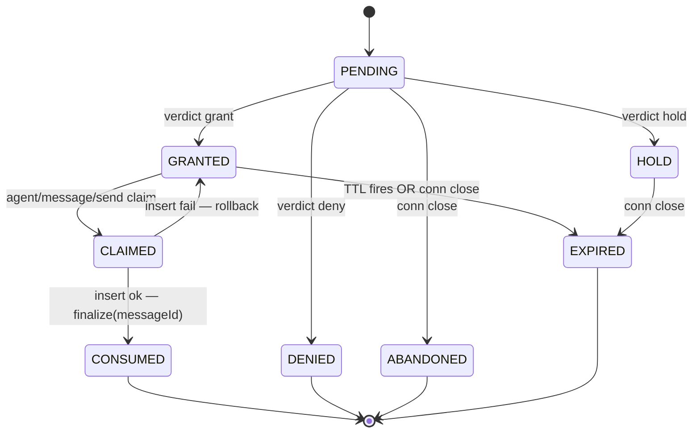
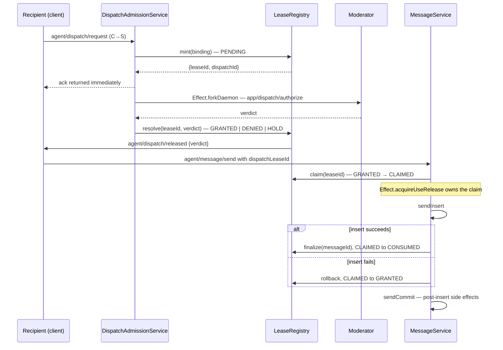

# server-core/dispatch

_`packages/server/src/dispatch`_

## Purpose

Dispatch-domain service barrel.

## Public surface

### [`DispatchAdmissionConversations`](https://github.com/chughtapan/moltzap/blob/main/packages/server/src/dispatch/admission.service.ts#L105)

_Interface_

```ts
export interface DispatchAdmissionConversations {
  removeParticipant(
    conversationId: ConversationId,
    agentId: AgentId,
  ): Effect.Effect<unknown, unknown, NetworkSendServiceTag>;
}
```

Describes dispatch admission conversations.

### [`DispatchAdmissionResult`](https://github.com/chughtapan/moltzap/blob/main/packages/server/src/dispatch/admission.service.ts#L72)

_TypeAlias_

```ts
export type DispatchAdmissionResult =
  | {
      readonly decision: "grant";
      readonly leaseId?: LeaseId;
      readonly leaseTimeoutMs?: number;
      readonly dispatchMessageId?: MessageId;
    }
```

Represents the result of dispatch admission.

### [`DispatchAdmissionService`](https://github.com/chughtapan/moltzap/blob/main/packages/server/src/dispatch/admission.service.ts#L158)

_Class_

```ts
export class DispatchAdmissionService {
  private readonly db: Db;
  private readonly apps: AppEndpointRegistry;
  private readonly registry: LeaseRegistry;
  private readonly conversations: DispatchAdmissionConversations;

  constructor(
    db: Db,
    apps: AppEndpointRegistry,
    registry: LeaseRegistry,
    conversations: DispatchAdmissionConversations,
  ) {
    this.db = db;
    this.apps = apps;
    this.registry = registry;
    this.conversations = conversations;
  }

  enqueue(
    args: EnqueueDispatchRequestArgs,
  ): Effect.Effect<
    { readonly leaseId: LeaseId; readonly dispatchId: DispatchId },
    never,
    NetworkSendServiceTag
  > {
    return catchSqlErrorAsDefect(this.enqueueEffect(args));
  }

  private enqueueEffect(
    args: EnqueueDispatchRequestArgs,
  ): Effect.Effect<
    { readonly leaseId: LeaseId; readonly dispatchId: DispatchId },
    SqlError,
    NetworkSendServiceTag
  > {
    return Effect.gen(
      function* (this: DispatchAdmissionService) {
        const lookup = yield* lookupAppBoundForConversation(
          this.db,
          args.conversationId,
        );
        const binding = yield* this.dispatchLeaseBindingForLookup(args, lookup);
        const minted = yield* this.registry.mint(binding);

        yield* this.attachDispatchRoundTripFiber(minted.leaseId, lookup, {
          conversationId: args.conversationId,
          recipientAgentId: args.recipientAgentId,
          messageId: args.messageId,
          senderAgentId: args.senderAgentId,
          parts: args.parts,
          attempt: args.attempt,
          receivedAt: args.receivedAt,
          pending: args.pending,
        });
        return minted;
      }.bind(this),
    );
  }

  private dispatchLeaseBindingForLookup(
    args: EnqueueDispatchRequestArgs,
    lookup: AppBoundConversationLookup,
  ): Effect.Effect<ModeratorBoundLeaseBinding> {
    const entry = this.apps.lookupApp(lookup.appId);
    if (entry === undefined) {
      return Effect.die(
        new DispatchAppUnavailableError({
          appId: lookup.appId,
          conversationId: args.conversationId,
        }),
      );
    }

    return Effect.succeed({
      _tag: "ModeratorBound",
      recipientAgentId: args.recipientAgentId,
      recipientConnectionId: args.recipientConnectionId,
      conversationId: args.conversationId,
      appId: lookup.appId,
      moderatorConnectionId: entry.endpoint.connId,
    });
  }

  private attachDispatchRoundTripFiber(
    leaseId: LeaseId,
    lookup: AppBoundConversationLookup,
    params: DispatchRoundTripParams,
  ): Effect.Effect<void, never, NetworkSendServiceTag> {
    return Effect.gen(
      function* (this: DispatchAdmissionService) {
        const fiber = yield* Effect.forkDaemon(
          this.runForkedDispatchRoundTrip(leaseId, lookup, params),
        );
        yield* this.registry.attachRoundTripFiber(leaseId, fiber);
      }.bind(this),
    );
  }

  private runForkedDispatchRoundTrip(
    leaseId: LeaseId,
    lookup: AppBoundConversationLookup,
    params: DispatchRoundTripParams,
  ): Effect.Effect<void, never, NetworkSendServiceTag> {
    return catchSqlErrorAsDefect(
      this.runAppBoundDispatchRoundTrip(leaseId, lookup, params),
    );
  }

  private runAppBoundDispatchRoundTrip(
    leaseId: LeaseId,
    lookup: AppBoundConversationLookup,
    params: DispatchRoundTripParams,
  ): Effect.Effect<void, SqlError, NetworkSendServiceTag> {
    if (this.apps.lookupApp(lookup.appId) === undefined) {
      return this.resolveLease(leaseId, {
        _tag: "deny",
        reason: "app_unavailable",
      });
    }
```

Implements dispatch admission service.

### [`dispatchAdmissionServiceLive`](https://github.com/chughtapan/moltzap/blob/main/packages/server/src/dispatch/layer.ts#L43)

_Variable_

```ts
export const dispatchAdmissionServiceLive = Layer.effect(
  DispatchAdmissionServiceTag,
  Effect.gen(function* () {
    const db = yield* DbTag;
    const appEndpointRegistry = yield* AppEndpointRegistryTag;
    const leaseRegistry = yield* LeaseRegistryTag;
    const conversations = yield* ConversationServiceTag;
    return new DispatchAdmissionService(
      db,
      appEndpointRegistry,
      leaseRegistry,
      conversations,
    );
  }).pipe(Effect.withSpan("DispatchAdmissionServiceLive")),
)
```

Provides the dispatch admission service live runtime value.

### [`DispatchAdmissionServiceTag`](https://github.com/chughtapan/moltzap/blob/main/packages/server/src/dispatch/layer.ts#L26)

_Class_

```ts
export class DispatchAdmissionServiceTag extends Context.Tag(
  "moltzap/DispatchAdmissionService",
)<DispatchAdmissionServiceTag, DispatchAdmissionService>() {}
```

Implements dispatch admission service tag.

### [`DispatchAuthorizeContext`](https://github.com/chughtapan/moltzap/blob/main/packages/server/src/dispatch/admission.service.ts#L28)

_TypeAlias_

```ts
export type DispatchAuthorizeContext = ParamsOf<typeof dispatchAuthorize>;
```

Represents dispatch authorize context values.

### [`dispatchLeaseGet`](https://github.com/chughtapan/moltzap/blob/main/packages/server/src/dispatch/handlers.ts#L77)

_Variable_

```ts
export const dispatchLeaseGet: ServerHandler<
  typeof dispatchLeaseGetDefinition
> = (params)
```

Provides the dispatch lease get runtime value.

**Returns:** The dispatch lease get result.

### [`dispatchRequest`](https://github.com/chughtapan/moltzap/blob/main/packages/server/src/dispatch/handlers.ts#L67)

_Variable_

```ts
export const dispatchRequest: ServerHandler<typeof dispatchRequestDefinition> =
  Effect.fn("dispatchRequest")(function* (params) {
    return yield* dispatchRequestBody(params, yield* agentArm);
  })
```

Provides the dispatch request runtime value.

**Returns:** The dispatch request result.

### [`EnqueueDispatchRequestArgs`](https://github.com/chughtapan/moltzap/blob/main/packages/server/src/dispatch/admission.service.ts#L92)

_Interface_

```ts
export interface EnqueueDispatchRequestArgs {
  readonly conversationId: ConversationId;
  readonly recipientAgentId: AgentId;
  readonly recipientConnectionId: ConnectionId;
  readonly messageId: MessageId;
  readonly senderAgentId: AgentId;
  readonly parts?: MessageParts;
  readonly attempt?: number;
  readonly receivedAt?: string;
  readonly pending?: readonly PendingDispatchMessage[];
}
```

Describes enqueue dispatch request args.

### [`LeaseInvalidError`](https://github.com/chughtapan/moltzap/blob/main/packages/server/src/dispatch/lease-registry.ts#L163)

_Class_

```ts
export class LeaseInvalidError extends Data.TaggedError("LeaseInvalidError")<{
  readonly leaseId: LeaseId;
  readonly state: LeaseState;
  readonly expected: readonly LeaseState[];
  readonly operation: "resolve" | "claim" | "finalize" | "rollback" | "read";
}> {
  override get message(): string {
    return `lease ${this.leaseId} in state ${this.state} cannot ${this.operation} (expected one of ${this.expected.join(", ")})`;
  }
}
```

Tagged error channel for the registry's transition-rejecting paths.
The `state` carries the lease's CURRENT state (so callers can
surface a precise wire-error code, e.g. Typed-CONSUMED /
typed-EXPIRED) and `expected` carries the set of states the
operation would have accepted.

### [`LeaseRecord`](https://github.com/chughtapan/moltzap/blob/main/packages/server/src/dispatch/lease-registry.ts#L133)

_Interface_

```ts
export interface LeaseRecord {
  readonly dispatchId: DispatchId;
  readonly leaseId: LeaseId;
  readonly binding: ModeratorBoundLeaseBinding;
  readonly state: LeaseState;
  readonly verdict: LeaseVerdict | null;
  readonly mintedAt: string;
  readonly resolvedAt: string | null;
  readonly consumedAt: string | null;
  readonly consumedMessageId: MessageId | null;
  readonly expiredAt: string | null;
  readonly leaseTimeoutMs: number | null;
}
```

Snapshot of a lease for `app/dispatch/lease/get` and observability tests.
Mirrors the wire `LeaseRecordSchema` shape; ISO-8601 timestamps for
cross-boundary stability.

### [`leaseRecordToWire`](https://github.com/chughtapan/moltzap/blob/main/packages/server/src/dispatch/lease-registry.ts#L512)

_Function_

```ts
export function leaseRecordToWire(record: LeaseRecord): LeaseRecordWire
```

Translation point between the in-process nested `LeaseRecord` and the wire
`LeaseRecordSchema` shape.

**Returns:** The lease record to wire result.

### [`LeaseRegistry`](https://github.com/chughtapan/moltzap/blob/main/packages/server/src/dispatch/lease-registry.ts#L287)

_Interface_

```ts
export interface LeaseRegistry {
  /**
   * Mint a new PENDING lease. Synchronous (`Effect&lt;..., never>`) — the
   * registry is in-process. Records the moderator-bound binding for audit,
   * `app/dispatch/lease/get`, and connection-close cleanup.
   *
   * Both ids are minted via `crypto.randomUUID()`; the brand on
   * `LeaseId` / `DispatchId` keeps them disjoint at every call site.
   */
  mint(binding: ModeratorBoundLeaseBinding): Effect.Effect<LeaseMintResult>;

  /**
   * Settle a PENDING lease into a terminal-or-near-terminal state via
   * the moderator's verdict (or a synthesized verdict for app-unavailable /
   * moderator-timeout). First writer wins via `Ref.modify`; second `resolve`
   * against the same lease fails with `LeaseInvalidError`. Internally calls the
   * module-local `emitDispatchRelease` helper so `agent/dispatch/released` fires on
   * every resolution path uniformly.
   */
  resolve(
    leaseId: LeaseId,
    verdict: LeaseVerdict,
  ): Effect.Effect<void, LeaseInvalidError | LeaseNotFoundError>;

  /**
   * Atomic GRANTED → CLAIMED. Called from the messages handler
   * BEFORE `messageService.sendInsert`. CLAIMED is the in-flight
   * state — the lease is reserved by this caller but the durable
   * insert has not yet committed.
   *
   * Two transitions out of CLAIMED only: `finalize` (success) or
   * `rollback` (insert failure). The TTL transition skips CLAIMED
   * (load-bearing rule 1); the connection-close transition skips
   * CLAIMED (load-bearing rule 2).
   */
  claim(
    leaseId: LeaseId,
  ): Effect.Effect<Claim, LeaseInvalidError | LeaseNotFoundError>;

  /**
   * Snapshot read for `app/dispatch/lease/get`. Includes the live `leaseId` —
   * the moderator is the authority for the lease, so live-id visibility
   * is in-scope.
   *
   * Lookup by either id flavor; the `kind` discriminator on the
   * error tells the caller which key was used. Scope enforcement
   * (caller must be the lease's bound moderator) is the handler's
   * responsibility, not the registry's.
   */
  read(
    id:
      | { readonly _tag: "leaseId"; readonly value: LeaseId }
      | {
          readonly _tag: "dispatchId";
          readonly value: DispatchId;
        },
  ): Effect.Effect<LeaseRecord, LeaseNotFoundError>;

  /**
   * Connection-close cleanup. Called from the WS disconnect-hook chain
   * with the closing connection id. Iterates leases bound to that
   * recipientConnectionId and applies these transitions:
   *
   * - **PENDING → ABANDONED**: cancels the forked moderator round-trip
   *   (its `resolve` call against the now-ABANDONED lease returns
   *   `LeaseInvalidError(state=ABANDONED, expected=PENDING)`, which the
   *   forked fiber catches and discards). No `agent/dispatch/released`
   *   notification fires (the recipient is gone).
   *
   * - **GRANTED / HOLD → EXPIRED-on-disconnect**: terminal state; emits
   *   `app/dispatch/lease-expired` to the moderator. Cancels the post-grant TTL
   *   fiber. The recipient won't observe; the moderator's view stays
   *   consistent.
   *
   * - **CLAIMED → no-op (load-bearing rule 2)**: a CLAIMED lease has an
   *   in-flight `agent/message/send` owning it via `Effect.acquireUseRelease`.
   *   Disconnecting mid-insert MUST NOT roll back the lease — the
   *   release-arm of the acquireUseRelease is responsible. Otherwise a
   *   committed durable row could be retried into a duplicate.
   *
   * - **DENIED / EXPIRED / ABANDONED / CONSUMED**: no-op (already terminal;
   *   no recipient-binding work to do).
   *
   * The matching transitions commit as one atomic batch. Notification
   * failures are absorbed so disconnect cleanup always completes; the public
   * error channel is `never`.
   */
  abandon(connId: ConnectionId): Effect.Effect<void>;

  /**
   * Internal — record the forked moderator round-trip fiber so
   * {@link abandon} can interrupt it on recipient disconnect. The
   * caller forks the round-trip immediately after `mint`; the registry
   * interrupts the fiber when the binding's recipient connection closes
   * (PENDING → ABANDONED). If the child already resolved the lease, attachment
   * leaves that winning child alive to finish its post-commit work. If the
   * lease was abandoned or removed, attachment interrupts the orphaned child.
   * Reattaching the same fiber is idempotent.
   */
  attachRoundTripFiber(
    leaseId: LeaseId,
    fiber: Fiber.RuntimeFiber<unknown, unknown>,
  ): Effect.Effect<void>;

  /**
   * Deterministic shutdown drain — invoked by `CoreApp.close`
   * (`core/app.ts -> closeCoreAppEffect`) BEFORE `Scope.close(appScope)`.
   *
   * Atomically closes and drains the registry, completes the shared signal
   * observed by background notification and retention fibers, then interrupts
   * live TTL and moderator round-trip fibers. No concurrent transition can
   * repopulate the registry after the drain.
   *
   * Idempotent; safe to call when no leases are live. Error channel `never` —
   * shutdown is best-effort.
   */
  shutdown(): Effect.Effect<void>;
}
```

Public contract of the lease registry. One instance per server lifetime,
shared by dispatch admission and message send. Backed by an in-process
`Ref&lt;LeaseRegistryData>` containing entries, dispatch index, and the closed
flag — no DB row. State transitions are atomic via `Ref.modify`.

Lease state machine (eight states; `LeaseState` in this file is the
normative enumeration):.



Mint + claim + finalize sequence (recipient + moderator round-trip):



Post-insert side effects (`sendCommit`) DO NOT affect lease state:
a failure there leaves the lease CONSUMED and the durable row
intact. Callers must not retry.

Connection-close cleanup runs `abandon(connId)` from the disconnect
finalizer: PENDING → ABANDONED, GRANTED/HOLD → EXPIRED, CLAIMED →
no-op. The CLAIMED no-op is load-bearing — without it, a recipient
disconnect mid-insert could roll back a committed durable row,
permitting a duplicate retry.

Each timed GRANTED lease owns one daemon TTL fiber. The fiber is bound to
the immutable record version that created it, so a stale pre-rollback timer
cannot expire a newer GRANTED epoch. The timeout comes from the grant
verdict's `leaseTimeoutMs`.

### [`leaseRegistryLive`](https://github.com/chughtapan/moltzap/blob/main/packages/server/src/dispatch/layer.ts#L31)

_Variable_

```ts
export const leaseRegistryLive = Layer.effect(
  LeaseRegistryTag,
  Effect.gen(function* () {
    const connections = yield* ConnectionManagerTag;
    return yield* makeLeaseRegistry({
      connections,
      leaseRetentionMs: DEFAULT_LEASE_RETENTION_MS,
    });
  }).pipe(Effect.withSpan("LeaseRegistryLive")),
)
```

Provides the lease registry live runtime value.

### [`LeaseRegistryTag`](https://github.com/chughtapan/moltzap/blob/main/packages/server/src/dispatch/layer.ts#L20)

_Class_

```ts
export class LeaseRegistryTag extends Context.Tag("moltzap/LeaseRegistry")<
  LeaseRegistryTag,
  LeaseRegistry
>() {}
```

Implements lease registry tag.

### [`LeaseState`](https://github.com/chughtapan/moltzap/blob/main/packages/server/src/dispatch/lease-registry.ts#L112)

_TypeAlias_

```ts
export type LeaseState =
  | "PENDING"
  | "CLAIMED"
  | "GRANTED"
  | "CONSUMED"
  | "DENIED"
  | "EXPIRED"
  | "ABANDONED"
  | "HOLD";
```

Discriminated state of a lease. The registry's `Ref.modify`
transitions read this discriminator and reject illegal transitions
with a typed error (see LeaseInvalidError).

### [`LeaseVerdict`](https://github.com/chughtapan/moltzap/blob/main/packages/server/src/dispatch/lease-registry.ts#L123)

_TypeAlias_

```ts
export type LeaseVerdict =
  | { readonly _tag: "grant"; readonly leaseTimeoutMs?: number }
```

Verdict shapes accepted by `resolve` — mirrors the wire decision.

### [`makeLeaseRegistry`](https://github.com/chughtapan/moltzap/blob/main/packages/server/src/dispatch/lease-registry.ts#L1296)

_Function_

```ts
export function makeLeaseRegistry(
  deps: LeaseRegistryDeps,
): Effect.Effect<LeaseRegistry>
```

Construct the registry. The constructor is the only public factory
— `LeaseRegistry` is referenced as an interface from call sites.

Implementation: one `Ref&lt;LeaseRegistryData>` atomically owns entries,
dispatch index, and closed state; network notifications and fiber
interruption run after the commit. A shared shutdown signal cancels parked
notification and retention effects.

**Returns:** The created lease registry.

### [`ModeratorBoundLeaseBinding`](https://github.com/chughtapan/moltzap/blob/main/packages/server/src/dispatch/lease-registry.ts#L98)

_Interface_

```ts
export interface ModeratorBoundLeaseBinding {
  readonly _tag: "ModeratorBound";
  readonly recipientAgentId: AgentId;
  readonly recipientConnectionId: ConnectionId;
  readonly conversationId: ConversationId;
  readonly moderatorConnectionId: ConnectionId;
  readonly appId: AppId;
}
```

Audit binding recorded at `mint` time. Used by `app/dispatch/lease/get`
scope-enforcement, moderator observability, and connection-close cleanup.
Once recorded, the binding is immutable for the lease's lifetime.

## Files

- `admission.service.ts`
- `handlers.ts`
- `layer.ts`
- `lease-registry.ts`
