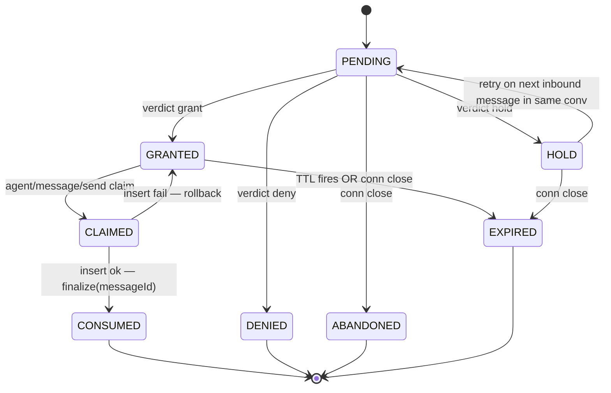
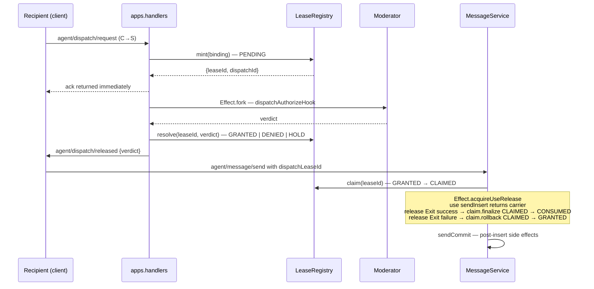

# server-core/dispatch

_`packages/server/src/dispatch`_

## Purpose

Dispatch-domain service barrel.

## Public surface

### [`AppBoundConversationLookup`](https://github.com/chughtapan/moltzap/blob/main/packages/server/src/dispatch/app-bound-conversation.ts#L11)

_Interface_

```ts
export interface AppBoundConversationLookup {
  readonly _tag: "AppBound";
  readonly taskId: TaskId;
  readonly appId: AppId;
}
```

### [`DispatchAdmissionConversations`](https://github.com/chughtapan/moltzap/blob/main/packages/server/src/dispatch/admission.service.ts#L64)

_Interface_

```ts
export interface DispatchAdmissionConversations {
  removeParticipant(
    conversationId: ConversationId,
    agentId: AgentId,
  ): Effect.Effect<unknown, unknown, NetworkSendServiceTag>;
}
```

### [`DispatchAdmissionResult`](https://github.com/chughtapan/moltzap/blob/main/packages/server/src/dispatch/admission.service.ts#L33)

_TypeAlias_

```ts
export type DispatchAdmissionResult =
  | {
      readonly decision: "grant";
      readonly leaseId?: LeaseId;
      readonly leaseTimeoutMs?: number;
      readonly dispatchMessageId?: MessageId;
    }
```

### [`DispatchAdmissionService`](https://github.com/chughtapan/moltzap/blob/main/packages/server/src/dispatch/admission.service.ts#L112)

_Class_

```ts
export class DispatchAdmissionService {
  constructor(
    private readonly db: Db,
    private readonly apps: AppHost,
    private readonly registry: LeaseRegistry,
    private readonly conversations: DispatchAdmissionConversations,
  ) {}

  enqueue(
    args: EnqueueDispatchRequestArgs,
  ): Effect.Effect<
    { readonly leaseId: LeaseId; readonly dispatchId: DispatchId },
    never,
    NetworkSendServiceTag
  > {
    return catchSqlErrorAsDefect(this.enqueueEffect(args));
  }

  private enqueueEffect(
    args: EnqueueDispatchRequestArgs,
  ): Effect.Effect<
    { readonly leaseId: LeaseId; readonly dispatchId: DispatchId },
    SqlError,
    NetworkSendServiceTag
  > {
    return Effect.gen(this, function* () {
      const lookup = yield* lookupAppBoundForConversation(
        this.db,
        args.conversationId,
      );
      const binding = yield* this.dispatchLeaseBindingForLookup(args, lookup);
      const minted = yield* this.registry.mint(binding);

      yield* this.attachDispatchRoundTripFiber(minted.leaseId, lookup, {
        conversationId: args.conversationId,
        recipientAgentId: args.recipientAgentId,
        messageId: args.messageId,
        senderAgentId: args.senderAgentId,
        parts: args.parts,
        attempt: args.attempt,
        receivedAt: args.receivedAt,
        pending: args.pending,
      });
      return minted;
    });
  }

  private dispatchLeaseBindingForLookup(
    args: EnqueueDispatchRequestArgs,
    lookup: AppBoundConversationLookup,
  ): Effect.Effect<ModeratorBoundLeaseBinding, never> {
    const entry = this.apps.lookupApp(lookup.appId);
    if (entry === undefined) {
      return Effect.die(
        new DispatchAppUnavailableError({
          appId: lookup.appId,
          conversationId: args.conversationId,
        }),
      );
    }

    return Effect.succeed({
      _tag: "ModeratorBound",
      recipientAgentId: args.recipientAgentId,
      recipientConnectionId: args.recipientConnectionId,
      conversationId: args.conversationId,
      appId: lookup.appId,
      taskId: lookup.taskId,
      moderatorConnectionId: entry.endpoint.connId,
    });
  }

  private attachDispatchRoundTripFiber(
    leaseId: LeaseId,
    lookup: AppBoundConversationLookup,
    params: DispatchRoundTripParams,
  ): Effect.Effect<void, never, NetworkSendServiceTag> {
    return Effect.gen(this, function* () {
      const fiber = yield* Effect.forkDaemon(
        this.runForkedDispatchRoundTrip(leaseId, lookup, params),
      );
      yield* this.registry.attachRoundTripFiber(leaseId, fiber);
    });
  }

  private runForkedDispatchRoundTrip(
    leaseId: LeaseId,
    lookup: AppBoundConversationLookup,
    params: DispatchRoundTripParams,
  ): Effect.Effect<void, never, NetworkSendServiceTag> {
    return catchSqlErrorAsDefect(
      this.runAppBoundDispatchRoundTrip(leaseId, lookup, params),
    );
  }

  private runAppBoundDispatchRoundTrip(
    leaseId: LeaseId,
    lookup: AppBoundConversationLookup,
    params: DispatchRoundTripParams,
  ): Effect.Effect<void, SqlError, NetworkSendServiceTag> {
    if (this.apps.lookupApp(lookup.appId) === undefined) {
      return this.resolveLease(leaseId, {
        _tag: "deny",
        reason: "app_unavailable",
      });
    }

    return Effect.gen(this, function* () {
      const ctx = yield* this.dispatchAuthorizeContext(lookup, params);
      const verdict = yield* this.dispatchAuthorize(lookup.appId, ctx);
      yield* this.resolveLease(leaseId, dispatchVerdictToLeaseVerdict(verdict));
      yield* this.removeDeniedParticipant(verdict, params);
    });
  }

  private dispatchAuthorizeContext(
    lookup: AppBoundConversationLookup,
    params: DispatchRoundTripParams,
  ): Effect.Effect<DispatchAuthorizeContext, SqlError> {
    return Effect.gen(this, function* () {
```

### [`DispatchAuthorizeContext`](https://github.com/chughtapan/moltzap/blob/main/packages/server/src/dispatch/admission.service.ts#L31)

_TypeAlias_

```ts
export type DispatchAuthorizeContext = ParamsOf<typeof DispatchAuthorize>;
```

### [`dispatchLeaseGet`](https://github.com/chughtapan/moltzap/blob/main/packages/server/src/dispatch/handlers.ts#L83)

_Variable_

```ts
export const dispatchLeaseGet: ServerHandler<typeof DispatchLeaseGet> = (
  params,
)
```

### [`dispatchRequest`](https://github.com/chughtapan/moltzap/blob/main/packages/server/src/dispatch/handlers.ts#L76)

_Variable_

```ts
export const dispatchRequest: ServerHandler<typeof DispatchRequest> = (
  params,
)
```

### [`EnqueueDispatchRequestArgs`](https://github.com/chughtapan/moltzap/blob/main/packages/server/src/dispatch/admission.service.ts#L52)

_Interface_

```ts
export interface EnqueueDispatchRequestArgs {
  readonly conversationId: ConversationId;
  readonly recipientAgentId: AgentId;
  readonly recipientConnectionId: ConnectionId;
  readonly messageId: MessageId;
  readonly senderAgentId: AgentId;
  readonly parts?: ReadonlyArray<Part>;
  readonly attempt?: number;
  readonly receivedAt?: string;
  readonly pending?: ReadonlyArray<PendingDispatchMessage>;
}
```

### [`LeaseInvalidError`](https://github.com/chughtapan/moltzap/blob/main/packages/server/src/dispatch/lease-registry.ts#L163)

_Class_

```ts
export class LeaseInvalidError extends Data.TaggedError("LeaseInvalidError")<{
  readonly leaseId: LeaseId;
  readonly state: LeaseState;
  readonly expected: ReadonlyArray<LeaseState>;
  readonly operation: "resolve" | "claim" | "finalize" | "rollback" | "read";
}> {
  override get message(): string {
    return `lease ${this.leaseId} in state ${this.state} cannot ${this.operation} (expected one of ${this.expected.join(", ")})`;
  }
}
```

Tagged error channel for the registry's transition-rejecting paths.
The `state` carries the lease's CURRENT state (so callers can
surface a precise wire-error code, e.g. typed-CONSUMED /
typed-EXPIRED) and `expected` carries the set of states the
operation would have accepted.

### [`LeaseRecord`](https://github.com/chughtapan/moltzap/blob/main/packages/server/src/dispatch/lease-registry.ts#L132)

_Interface_

```ts
export interface LeaseRecord {
  readonly dispatchId: DispatchId;
  readonly leaseId: LeaseId;
  readonly binding: ModeratorBoundLeaseBinding;
  readonly state: LeaseState;
  readonly verdict: LeaseVerdict | null;
  readonly mintedAt: string;
  readonly resolvedAt: string | null;
  readonly consumedAt: string | null;
  readonly consumedMessageId: MessageId | null;
  readonly expiredAt: string | null;
  readonly leaseTimeoutMs: number | null;
}
```

Snapshot of a lease for `app/dispatch/lease/get` and observability tests.
Mirrors the wire `LeaseRecordSchema` shape; ISO-8601 timestamps for
cross-boundary stability.

### [`leaseRecordToWire`](https://github.com/chughtapan/moltzap/blob/main/packages/server/src/dispatch/lease-registry.ts#L488)

_Function_

```ts
export function leaseRecordToWire(record: LeaseRecord): LeaseRecordWire
```

Translation point between the in-process nested `LeaseRecord` and the wire
`LeaseRecordSchema` shape.

### [`LeaseRegistry`](https://github.com/chughtapan/moltzap/blob/main/packages/server/src/dispatch/lease-registry.ts#L282)

_Interface_

```ts
export interface LeaseRegistry {
  /**
   * Mint a new PENDING lease. Synchronous (`Effect&lt;..., never>`) — the
   * registry is in-process. Records the moderator-bound binding for audit,
   * `app/dispatch/lease/get`, and connection-close cleanup.
   *
   * Both ids are minted via `crypto.randomUUID()`; the brand on
   * `LeaseId` / `DispatchId` keeps them disjoint at every call site.
   */
  mint(
    binding: ModeratorBoundLeaseBinding,
  ): Effect.Effect<LeaseMintResult, never, never>;

  /**
   * Settle a PENDING lease into a terminal-or-near-terminal state via
   * the moderator's verdict (or a synthesized verdict for app-unavailable /
   * moderator-timeout). First writer wins via `Ref.modify`; second `resolve`
   * against the same lease fails with `LeaseInvalidError`. Internally calls the
   * module-local `emitDispatchRelease` helper so `agent/dispatch/released` fires on
   * every resolution path uniformly.
   */
  resolve(
    leaseId: LeaseId,
    verdict: LeaseVerdict,
  ): Effect.Effect<void, LeaseInvalidError | LeaseNotFoundError, never>;

  /**
   * Atomic GRANTED → CLAIMED. Called from the messages handler
   * BEFORE `messageService.sendInsert`. CLAIMED is the in-flight
   * state — the lease is reserved by this caller but the durable
   * insert has not yet committed.
   *
   * Two transitions out of CLAIMED only: `finalize` (success) or
   * `rollback` (insert failure). The TTL transition skips CLAIMED
   * (load-bearing rule 1); the connection-close transition skips
   * CLAIMED (load-bearing rule 2).
   */
  claim(
    leaseId: LeaseId,
  ): Effect.Effect<Claim, LeaseInvalidError | LeaseNotFoundError, never>;

  /**
   * Snapshot read for `app/dispatch/lease/get`. Includes the live `leaseId` —
   * the moderator is the authority for the lease, so live-id visibility
   * is in-scope.
   *
   * Lookup by either id flavor; the `kind` discriminator on the
   * error tells the caller which key was used. Scope enforcement
   * (caller must be the lease's bound moderator) is the handler's
   * responsibility, not the registry's.
   */
  read(
    id:
      | { readonly _tag: "leaseId"; readonly value: LeaseId }
      | {
          readonly _tag: "dispatchId";
          readonly value: DispatchId;
        },
  ): Effect.Effect<LeaseRecord, LeaseNotFoundError, never>;

  /**
   * Connection-close cleanup. Called from the WS disconnect-hook chain
   * with the closing connection id. Iterates leases bound to that
   * recipientConnectionId and applies these transitions:
   *
   * - **PENDING → ABANDONED**: cancels the forked moderator round-trip
   *   (its `resolve` call against the now-ABANDONED lease returns
   *   `LeaseInvalidError(state=ABANDONED, expected=PENDING)`, which the
   *   forked fiber catches and discards). No `agent/dispatch/released`
   *   notification fires (the recipient is gone).
   *
   * - **GRANTED → EXPIRED-on-disconnect**: terminal state; emits
   *   `app/dispatch/lease-expired` to the moderator. Cancels the post-grant TTL
   *   fiber. The recipient won't observe; the moderator's view stays
   *   consistent.
   *
   * - **CLAIMED → no-op (load-bearing rule 2)**: a CLAIMED lease has an
   *   in-flight `agent/message/send` owning it via `Effect.acquireUseRelease`.
   *   Disconnecting mid-insert MUST NOT roll back the lease — the
   *   release-arm of the acquireUseRelease is responsible. Otherwise a
   *   committed durable row could be retried into a duplicate.
   *
   * - **HOLD / DENIED / EXPIRED / ABANDONED / CONSUMED**: no-op (already
   *   terminal-or-near-terminal; no recipient-binding work to do).
   *
   * Errors are absorbed: connection-close cleanup is fire-and-forget;
   * any per-lease transition failure is logged-and-dropped (the
   * disconnect path must complete even if a single lease's state is
   * unexpected). Public error channel is `never`.
   */
  abandon(connId: ConnectionId): Effect.Effect<void, never, never>;

  /**
   * Internal — record the forked moderator round-trip fiber so
   * {@link abandon} can interrupt it on recipient disconnect. The
   * caller forks the round-trip immediately after `mint`; the registry
   * interrupts the fiber when the binding's recipient connection
   * closes (PENDING → ABANDONED transition). No-op if the lease is no
   * longer in PENDING when the fiber is attached. Idempotent.
   */
  attachRoundTripFiber(
    leaseId: LeaseId,
    fiber: Fiber.RuntimeFiber<unknown, unknown>,
  ): Effect.Effect<void, never, never>;

  /**
   * Deterministic shutdown drain — invoked by `CoreApp.close`
   * (`core/app.ts -> closeCoreAppEffect`) BEFORE `Scope.close(appScope)`.
   *
   * Closing the app scope interrupts every per-connection WebSocket fiber.
   * Each interrupted fiber runs its disconnect cleanup
   * (`MoltZapServer`/`socket/server-socket.ts` close cleanup) in an UNINTERRUPTIBLE
   * `onExit` region, and that cleanup calls {@link abandon}. For a recipient
   * connection holding a GRANTED lease, `abandon` emits a `app/dispatch/lease-expired`
   * frame to the MODERATOR connection via {@link fireNotification}. When the
   * moderator socket is being torn down concurrently its write-latch is
   * closed, so the cross-connection write SUSPENDS forever — inside the
   * uninterruptible region — and `Scope.close` blocks awaiting that
   * fiber. That is the teardown deadlock this method prevents.
   *
```

Public contract of the lease registry. One instance per server lifetime,
shared by dispatch admission and message send. Backed by an in-process
`Ref&lt;Map&lt;LeaseId, LeaseEntry>>` with per-lease TTL fibers — no DB row.
State transitions are atomic via `Ref.modify`.

Lease state machine (eight states; `LeaseState` in this file is the
normative enumeration):



Mint + claim + finalize sequence (recipient + moderator round-trip):



Post-insert side effects (`sendCommit`) DO NOT affect lease state:
a failure there leaves the lease CONSUMED and the durable row
intact. Callers must not retry.

Connection-close cleanup runs `abandon(connId)` from the disconnect
finalizer: PENDING → ABANDONED, GRANTED/HOLD → EXPIRED, CLAIMED →
no-op. The CLAIMED no-op is load-bearing — without it, a recipient
disconnect mid-insert could roll back a committed durable row,
permitting a duplicate retry.

Timer wheel / min-heap for TTLs runs on a single fiber; per-lease
scheduler fibers are forbidden. Manifest TTLs come from the
`dispatch_authorize` `{ kind: "hook", timeoutMs }` policy (moderator
response) and the verdict's `leaseTimeoutMs` (post-grant lease).

### [`LeaseRegistryDeps`](https://github.com/chughtapan/moltzap/blob/main/packages/server/src/dispatch/lease-registry.ts#L431)

_Interface_

```ts
export interface LeaseRegistryDeps {
  readonly connections: ConnectionManager;
  readonly leaseRetentionMs: number;
  readonly transitionObserver: LeaseTransitionObserver;
}
```

Constructor dependencies for the lease registry.
- `connections`: looked up by the internal `emitDispatchRelease`
  helper to find the recipient and at `app/dispatch/lease-consumed` /
  `app/dispatch/lease-expired` emission to find the moderator's connection.
- `leaseRetentionMs`: terminal-state retention window (CONSUMED /
  DENIED / EXPIRED / ABANDONED). Live states (PENDING / GRANTED /
  HOLD / CLAIMED) age out on their own TTLs.
- `transitionObserver`: called at every transition that crosses the
  lease's "active for presence" boundary (PENDING → GRANTED, exits
  from GRANTED|CLAIMED). Feeds presence emission. **Required, not
  optional** — every constructor call site supplies a value, either
  the real `PresenceService` (production) or the
  `noopLeaseTransitionObserver` constant (tests that do not exercise
  presence). Required-not-default is structurally tighter: TypeScript
  surfaces missing wiring at the call site. See
  `network/presence → LeaseTransitionObserver` for the call shape; the
  per-transition contract lives in `network/presence → PresenceService`.

### [`LeaseState`](https://github.com/chughtapan/moltzap/blob/main/packages/server/src/dispatch/lease-registry.ts#L111)

_TypeAlias_

```ts
export type LeaseState =
  | "PENDING"
  | "CLAIMED"
  | "GRANTED"
  | "CONSUMED"
  | "DENIED"
  | "EXPIRED"
  | "ABANDONED"
  | "HOLD";

/** Verdict shapes accepted by `resolve` — mirrors the wire decision. */
export type LeaseVerdict =
  | { readonly _tag: "grant"; readonly leaseTimeoutMs?: number }
```

Discriminated state of a lease. The registry's `Ref.modify`
transitions read this discriminator and reject illegal transitions
with a typed error (see LeaseInvalidError).

### [`LeaseVerdict`](https://github.com/chughtapan/moltzap/blob/main/packages/server/src/dispatch/lease-registry.ts#L122)

_TypeAlias_

```ts
export type LeaseVerdict =
  | { readonly _tag: "grant"; readonly leaseTimeoutMs?: number }
```

Verdict shapes accepted by `resolve` — mirrors the wire decision.

### [`lookupAppBoundForConversation`](https://github.com/chughtapan/moltzap/blob/main/packages/server/src/dispatch/app-bound-conversation.ts#L22)

_Function_

```ts
export function lookupAppBoundForConversation(
  db: Db,
  conversationId: ConversationId,
): Effect.Effect<AppBoundConversationLookup, never, never>
```

Dispatch admission is only defined for app-bound, non-archived
conversations. The success type deliberately has no non-app-bound arm, so
downstream lease minting cannot accidentally handle one as a lease binding.

### [`makeLeaseRegistry`](https://github.com/chughtapan/moltzap/blob/main/packages/server/src/dispatch/lease-registry.ts#L1227)

_Function_

```ts
export function makeLeaseRegistry(
  deps: LeaseRegistryDeps,
): Effect.Effect<LeaseRegistry, never, never>
```

Construct the registry. The constructor is the only public factory
— `LeaseRegistry` is referenced as an interface from call sites.

Implementation: a `Ref&lt;Map&lt;LeaseId, LeaseEntry>>` plus a per-lease
scheduled TTL fiber (Effect-managed; safe to interrupt). Every state
transition is a `Ref.modify` predicate that returns the new entry +
a description of the side-effect (notification to emit, fiber to
cancel). The side-effects run AFTER the predicate commits — so the
state change is visible to concurrent readers before the
notification fires, satisfying the "first writer wins" invariant.

### [`ModeratorBoundLeaseBinding`](https://github.com/chughtapan/moltzap/blob/main/packages/server/src/dispatch/lease-registry.ts#L96)

_Interface_

```ts
export interface ModeratorBoundLeaseBinding {
  readonly _tag: "ModeratorBound";
  readonly recipientAgentId: AgentId;
  readonly recipientConnectionId: ConnectionId;
  readonly conversationId: ConversationId;
  readonly moderatorConnectionId: ConnectionId;
  readonly taskId: TaskId;
  readonly appId: AppId;
}
```

Audit binding recorded at `mint` time. Used by `app/dispatch/lease/get`
scope-enforcement, moderator observability, and connection-close cleanup.
Once recorded, the binding is immutable for the lease's lifetime.

## Files

- `admission.service.ts`
- `app-bound-conversation.ts`
- `handlers.ts`
- `lease-registry.ts`
