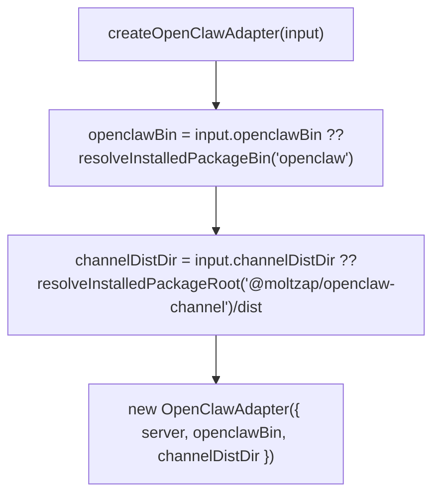
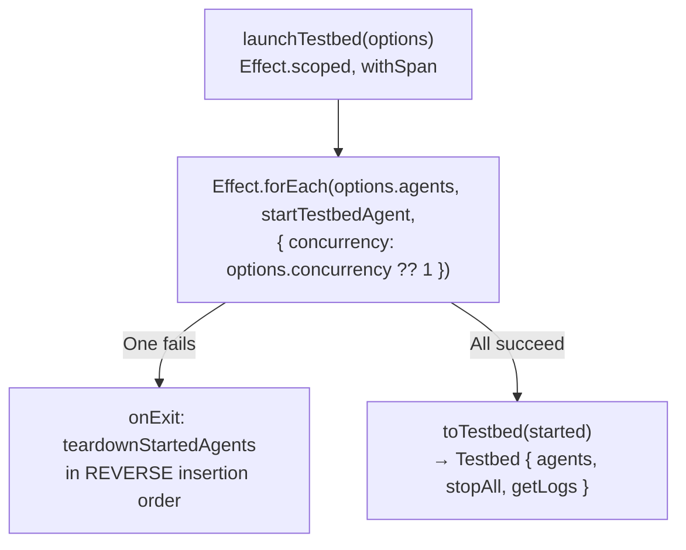
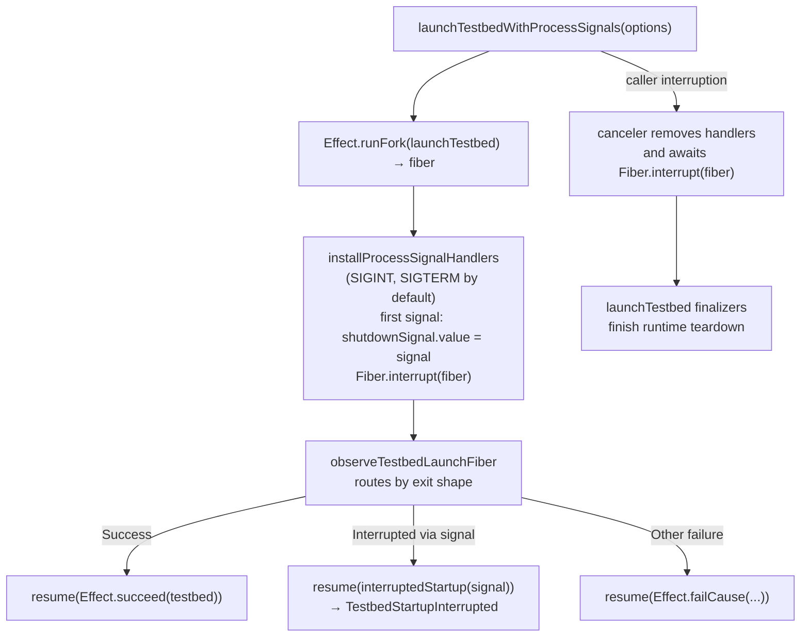
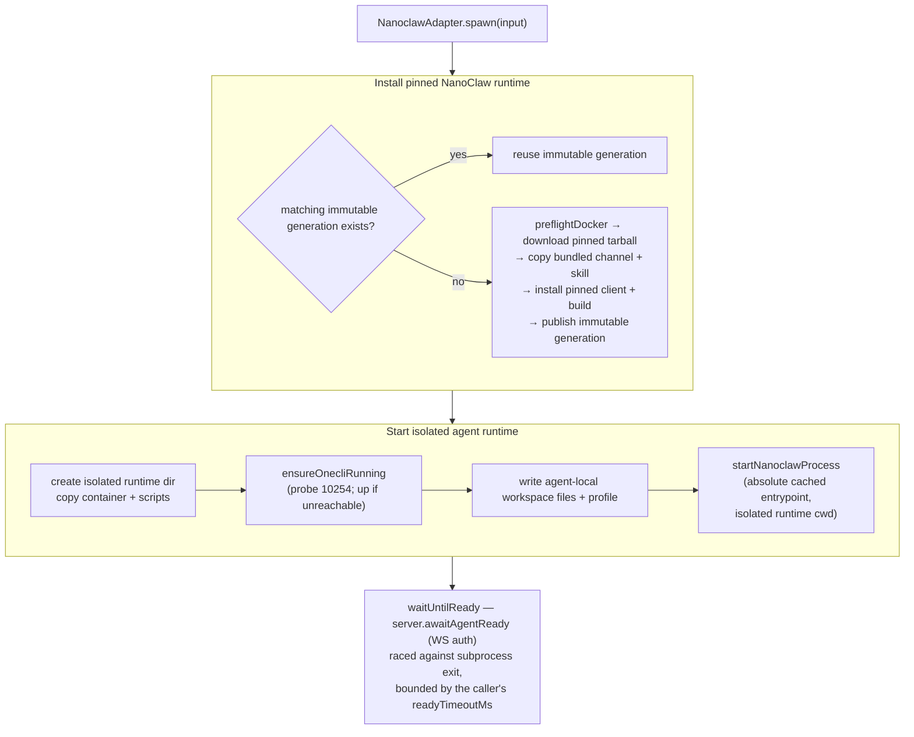
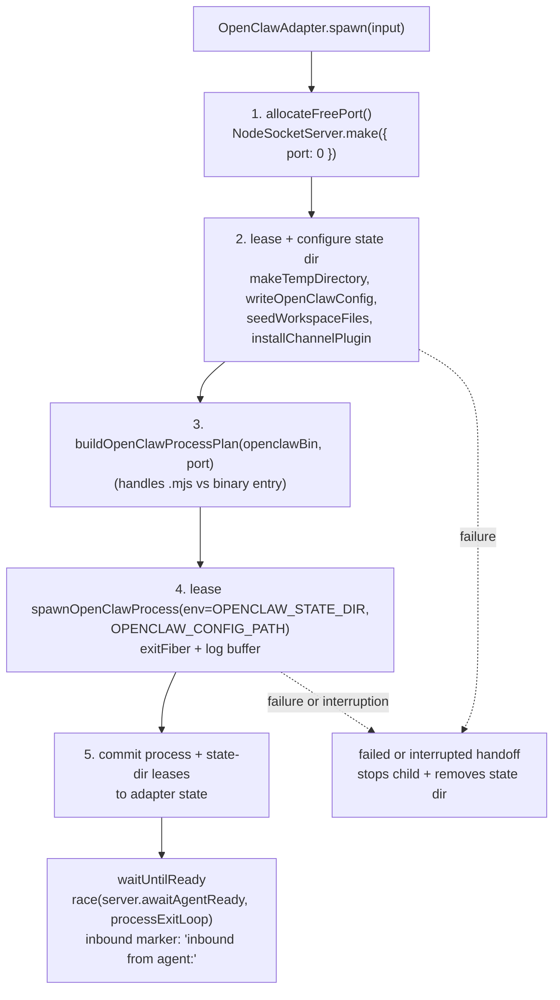
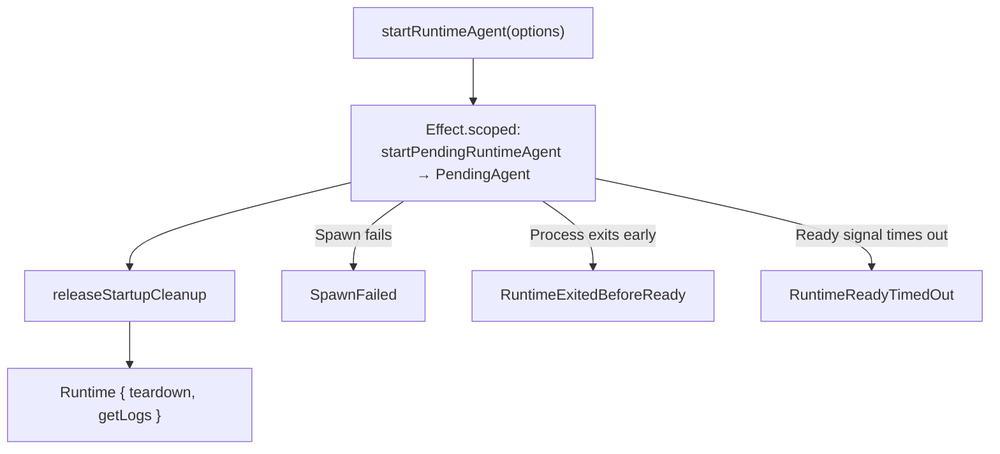

# testbed/src

_`packages/testbed/src`_

## Purpose

Public exports for launching and supervising connected-agent testbeds.

## Public surface

### [`AgentName`](https://github.com/chughtapan/moltzap/blob/main/packages/testbed/src/runtime.ts#L7)

_TypeAlias_

```ts
export type AgentName = string & Brand.Brand<"AgentName">;
```

### [`AgentName`](https://github.com/chughtapan/moltzap/blob/main/packages/testbed/src/runtime.ts#L7)

_Variable_

```ts
export type AgentName = string & Brand.Brand<"AgentName">
```

### [`awaitAgentReadyByPolling`](https://github.com/chughtapan/moltzap/blob/main/packages/testbed/src/await-agent-ready.ts#L106)

_Function_

```ts
export function awaitAgentReadyByPolling(
  connections: PollingConnections,
  agentId: AgentId,
  timeoutMs: number,
  pollIntervalMs: number = DEFAULT_POLL_INTERVAL_MS,
): Effect.Effect<ReadyOutcome, never, never>
```

### [`createOpenClawAdapter`](https://github.com/chughtapan/moltzap/blob/main/packages/testbed/src/openclaw-adapter.ts#L508)

_Function_

```ts
export function createOpenClawAdapter(
  input: OpenClawAdapterOptions,
): OpenClawAdapter
```

Creates an OpenClawAdapter. Omitted paths resolve from this package's
installed, versioned `openclaw` and `@moltzap/openclaw-channel`
dependencies. Callers may override either path for local development.



### [`launchTestbed`](https://github.com/chughtapan/moltzap/blob/main/packages/testbed/src/testbed.ts#L337)

_Function_

```ts
export function launchTestbed(
  options: TestbedLaunchOptions,
): Effect.Effect<Testbed, RuntimeLaunchFailed, never>
```

Launch a testbed of N agents (sequentially by default; concurrency is
opt-in), tearing down all already-started agents if any one fails.



Sibling: launchTestbedWithProcessSignals adds SIGINT
/ SIGTERM handlers so Ctrl-C during startup interrupts cleanly via
`TestbedStartupInterrupted`.

### [`launchTestbedWithProcessSignals`](https://github.com/chughtapan/moltzap/blob/main/packages/testbed/src/testbed.ts#L439)

_Function_

```ts
export function launchTestbedWithProcessSignals(
  options: TestbedProcessSignalOptions,
): Effect.Effect<
  Testbed,
  RuntimeLaunchFailed | TestbedStartupInterrupted,
  never
>
```

Wraps launchTestbed with OS-signal handlers so user Ctrl-C
during startup interrupts cleanly instead of half-launching a testbed.



**Fails with:**

- `TestbedStartupInterrupted` — a signal arrives during testbed startup

### [`LogSlice`](https://github.com/chughtapan/moltzap/blob/main/packages/testbed/src/runtime.ts#L49)

_Interface_

```ts
export interface LogSlice {
  /**
   * stdout+stderr from the requested offset. Adapters retain a bounded
   * window (startup head + rolling tail); when the offset falls into a
   * dropped region, the missing middle is replaced by a
   * `[... log window elided ...]` marker, so a stale cursor can observe
   * non-contiguous text and marker-matching consumers must poll faster
   * than the tail window fills.
   */
  readonly text: string;
  /** Byte offset to pass on the next call to continue reading. */
  readonly nextOffset: number;
}
```

### [`NanoclawAdapter`](https://github.com/chughtapan/moltzap/blob/main/packages/testbed/src/nanoclaw-adapter.ts#L96)

_Class_

```ts
export class NanoclawAdapter implements Runtime {
  private state: AdapterState | null = null;

  constructor(private readonly options: NanoclawAdapterOptions) {}

  spawn(input: SpawnInput): Effect.Effect<void, SpawnFailed, never> {
    return this.launchRuntime(input).pipe(
      Effect.mapError((cause) => spawnFailed(input.agentName, cause)),
      Effect.provide(NodeContext.layer),
    );
  }

  waitUntilReady(timeoutMs: number): Effect.Effect<ReadyOutcome, never, never> {
    if (!this.state) {
      return Effect.succeed({ _tag: "Ready" as const });
    }
    const { handle, spawnInput } = this.state;
    return raceReadiness({
      serverReady: this.options.server.awaitAgentReady(
        spawnInput.agentId,
        timeoutMs,
      ),
      source: {
        pollExitCode: () => pollFiberExitCode(handle.exitFiber),
        stderr: () => handle.logs.text,
        timeoutMs,
      },
      teardown: () => this.teardown(),
    });
  }

  teardown(): Effect.Effect<void, never, never> {
    return this.state?.teardown ?? Effect.void;
  }

  getLogs(offset: number): LogSlice {
    if (!this.state) return { text: "", nextOffset: 0 };
    return this.state.handle.logs.read(offset);
  }

  getInboundMarker(): string {
    return "New messages";
  }

  private launchRuntime(input: SpawnInput) {
    const lease = { committed: false };
    return Effect.uninterruptibleMask((restore) =>
      Effect.scoped(
        Effect.gen(this, function* () {
          const handle = yield* Effect.acquireRelease(
            restore(
              acquireNanoclawRuntime(
                input,
                this.options.autoRegisterConversations ?? false,
              ),
            ),
            (acquired) =>
              lease.committed
                ? Effect.void
                : stopNanoclawRuntimeSafely(
                    acquired,
                    "failed to release uncommitted NanoClaw runtime",
                  ),
          );
          const teardown = yield* Effect.cached(
            stopNanoclawRuntimeSafely(
              handle,
              "failed to tear down NanoClaw runtime",
            ),
          );
          yield* Effect.sync(() => {
            this.state = { handle, spawnInput: input, teardown };
            lease.committed = true;
          });
        }),
      ),
    );
  }
}
```

Nanoclaw runtime adapter. Runs agent subprocesses inside Docker
containers via the OneCLI gateway. Two-phase startup: ensure the
runtime cache is installed, then launch.



Inbound marker: `New messages`. The immutable cache key covers the pinned
NanoClaw source, dependency lock, bundled channel/skill, and host ABI.

### [`NanoclawAdapterOptions`](https://github.com/chughtapan/moltzap/blob/main/packages/testbed/src/nanoclaw-adapter.ts#L22)

_Interface_

```ts
export interface NanoclawAdapterOptions {
  readonly server: RuntimeServerHandle;

  /**
   * Registers conversations on first delivery so NanoClaw will process them.
   * Defaults to `false`; enable it only for disposable testbeds that should
   * accept conversations without a pre-provisioned NanoClaw registration.
   */
  readonly autoRegisterConversations?: boolean;
}
```

### [`OpenClawAdapter`](https://github.com/chughtapan/moltzap/blob/main/packages/testbed/src/openclaw-adapter.ts#L430)

_Class_

```ts
export class OpenClawAdapter implements Runtime {
  private state: AdapterState | null = null;

  constructor(private readonly deps: OpenClawAdapterDeps) {}

  spawn(input: SpawnInput): Effect.Effect<void, SpawnFailed, never> {
    return startOpenClawAdapter(this.deps, input, (state) => {
      this.state = state;
    }).pipe(
      Effect.mapError((cause) => spawnFailed(input.agentName, cause)),
      Effect.provide(NodeContext.layer),
    );
  }

  waitUntilReady(timeoutMs: number): Effect.Effect<ReadyOutcome, never, never> {
    if (!this.state) {
      return Effect.succeed({ _tag: "Ready" as const });
    }
    const { process: proc, spawnInput, logBuffer } = this.state;
    return raceReadiness({
      serverReady: this.deps.server.awaitAgentReady(
        spawnInput.agentId,
        timeoutMs,
      ),
      source: {
        pollExitCode: () => pollExitCode(proc),
        stderr: () => logBuffer.text,
        timeoutMs,
      },
      teardown: () => this.teardown(),
    });
  }

  teardown(): Effect.Effect<void, never, never> {
    return Effect.uninterruptible(
      Effect.gen(this, function* () {
        const teardownState = yield* Effect.sync(() => {
          const state = this.state;
          if (!state || state.tornDown) return null;
          state.tornDown = true;
          return { process: state.process, stateDir: state.stateDir };
        });

        if (teardownState === null) return;

        const { process: proc, stateDir } = teardownState;
        yield* stopSpawnedOpenClawProcess(proc);
        yield* removeOpenClawStateDir(stateDir).pipe(
          Effect.provide(NodeContext.layer),
        );
      }),
    );
  }

  getLogs(offset: number): LogSlice {
    if (!this.state) return { text: "", nextOffset: 0 };
    return this.state.logBuffer.read(offset);
  }

  getInboundMarker(): string {
    return "inbound from agent:";
  }
}
```

OpenClaw runtime adapter. Spawns the OpenClaw gateway as a child
process, configures it with a moltzap channel plugin, and reports
readiness via the server-side WS authentication event.



Readiness signal: server-side WS authentication event surfaces via
`deps.server.awaitAgentReady`. Inbound traffic log marker:
`inbound from agent:`. Errors flow into the testbed via `SpawnFailed`
(boot) or `RuntimeExitedBeforeReady` / `RuntimeReadyTimedOut`
(post-spawn, surfaced by `processExitLoop`).

### [`OpenClawAdapterDeps`](https://github.com/chughtapan/moltzap/blob/main/packages/testbed/src/openclaw-adapter.ts#L153)

_Interface_

```ts
export interface OpenClawAdapterDeps {
  readonly server: RuntimeServerHandle;
  readonly openclawBin: string;
  readonly channelDistDir: string;
}
```

### [`OpenClawAdapterOptions`](https://github.com/chughtapan/moltzap/blob/main/packages/testbed/src/openclaw-adapter.ts#L159)

_Interface_

```ts
export interface OpenClawAdapterOptions {
  readonly server: RuntimeServerHandle;
  readonly openclawBin?: string;
  readonly channelDistDir?: string;
}
```

### [`ReadyOutcome`](https://github.com/chughtapan/moltzap/blob/main/packages/testbed/src/runtime.ts#L63)

_TypeAlias_

```ts
export type ReadyOutcome =
  | { readonly _tag: "Ready" }
```

### [`Runtime`](https://github.com/chughtapan/moltzap/blob/main/packages/testbed/src/runtime.ts#L82)

_Interface_

```ts
export interface Runtime {
  spawn(input: SpawnInput): Effect.Effect<void, SpawnFailed, never>;

  /**
   * Blocks until the agent's subprocess has authenticated against the server
   * (confirmed by ConnectionManager entry) or timeout/exit.
   * On Timeout or ProcessExited, the adapter calls teardown internally
   * before returning.
   */
  waitUntilReady(timeoutMs: number): Effect.Effect<ReadyOutcome, never, never>;

  /** Idempotently stops the spawned runtime and removes its isolated state. */
  teardown(): Effect.Effect<void, never, never>;

  /** Returns stdout+stderr from the given byte offset. */
  getLogs(offset: number): LogSlice;

  /** Substring that proves inbound message delivery when matched against post-send logs. */
  getInboundMarker(): string;
}
```

Runtime interface contract for agent subprocess management.

Five methods. spawn starts the subprocess. waitUntilReady blocks until
the server's ConnectionManager confirms authentication (or timeout/exit).
teardown kills the process group and removes the working directory.
getLogs returns accumulated output from a byte offset.
getInboundMarker returns a substring that proves an inbound message
was received by the runtime's channel plugin.

### [`RuntimeExitedBeforeReady`](https://github.com/chughtapan/moltzap/blob/main/packages/testbed/src/errors.ts#L56)

_Class_

```ts
export class RuntimeExitedBeforeReady extends Data.TaggedError(
  "RuntimeExitedBeforeReady",
)<{
  readonly agentName: string;
  readonly exitCode: number | null;
  readonly stderr: string;
  readonly message: string;
}> {}
```

Raised by `startPendingRuntimeAgent` when `waitUntilReady` returns
`ProcessExited`. The process exited before reaching ready.

`stderr` carries the full accumulated stdout+stderr at exit;
`exitCode` is `null` only if the process exited via signal.
Caller action: inspect `stderr`; check binary auth config.

### [`RuntimeKind`](https://github.com/chughtapan/moltzap/blob/main/packages/testbed/src/testbed.ts#L56)

_TypeAlias_

```ts
export type RuntimeKind = RuntimeSelection["kind"];
```

### [`RuntimeLaunchFailed`](https://github.com/chughtapan/moltzap/blob/main/packages/testbed/src/errors.ts#L73)

_TypeAlias_

```ts
export type RuntimeLaunchFailed =
  | SpawnFailed
  | RuntimeReadyTimedOut
  | RuntimeExitedBeforeReady;
```

Union of every failure mode `startRuntimeAgent` and `launchTestbed` can
produce. Use `Effect.catchTags` to
branch by tag, or `Effect.catchAll` to handle uniformly.

Note: `TestbedStartupInterrupted` lives in `testbed.ts` because it only
arises in the signal-handling variant and carries the interrupting `Signal`.

### [`RuntimeReadyTimedOut`](https://github.com/chughtapan/moltzap/blob/main/packages/testbed/src/errors.ts#L40)

_Class_

```ts
export class RuntimeReadyTimedOut extends Data.TaggedError(
  "RuntimeReadyTimedOut",
)<{
  readonly agentName: string;
  readonly timeoutMs: number;
  readonly message: string;
}> {}
```

Raised by `startPendingRuntimeAgent` when `waitUntilReady` returns
`Timeout`. The process did not signal ready within `timeoutMs` and
has been torn down before the failure reaches the caller.

Caller action: increase `readyTimeoutMs`, or enable process-level
diagnostics at the adapter boundary.

### [`RuntimeServerHandle`](https://github.com/chughtapan/moltzap/blob/main/packages/testbed/src/runtime.ts#L20)

_Interface_

```ts
export interface RuntimeServerHandle {
  /**
   * Resolves to `Ready` when the named agent has authenticated against the
   * server. Resolves to `Timeout` after `timeoutMs` if no authenticated
   * connection ever appears. Resolves to `ProcessExited` only if the
   * implementation can detect that the agent's owning process exited before
   * authenticating; otherwise `Timeout` covers that case (the runtime
   * adapters layer their own exit-detection on top via `Effect.race`).
   *
   * In-process implementations wire this through `awaitAgentReadyByPolling`.
   * Out-of-process implementations (e.g., a zapbot orchestrator talking to
   * a standalone moltzap-server) implement it directly, typically via a
   * presence-event subscription on the server's WebSocket API.
   */
  awaitAgentReady(
    agentId: AgentId,
    timeoutMs: number,
  ): Effect.Effect<ReadyOutcome, never, never>;
}
```

### [`RuntimeStartOptions`](https://github.com/chughtapan/moltzap/blob/main/packages/testbed/src/testbed.ts#L58)

_TypeAlias_

```ts
export type RuntimeStartOptions = RuntimeStartOptionsBase & RuntimeSelection;

interface TestbedLaunchOptionsBase {
  readonly server: RuntimeServerHandle;
  readonly agents: ReadonlyArray<TestbedAgentSpec>;
  readonly readyTimeoutMs: number;
  readonly concurrency?: number | "unbounded";
}
```

### [`ServerUrl`](https://github.com/chughtapan/moltzap/blob/main/packages/testbed/src/runtime.ts#L8)

_TypeAlias_

```ts
export type ServerUrl = string & Brand.Brand<"ServerUrl">;
```

### [`ServerUrl`](https://github.com/chughtapan/moltzap/blob/main/packages/testbed/src/runtime.ts#L8)

_Variable_

```ts
export type ServerUrl = string & Brand.Brand<"ServerUrl">
```

### [`SpawnFailed`](https://github.com/chughtapan/moltzap/blob/main/packages/testbed/src/errors.ts#L16)

_Class_

```ts
export class SpawnFailed extends Data.TaggedError("SpawnFailed")<{
  readonly agentName: string;
  readonly message: string;
  readonly cause: Error;
}> {}
```

Raised by `Runtime.spawn()` in any adapter when the child process
cannot be started — exec error, missing binary, port allocation
failure, state-dir creation failure.

`cause` carries the underlying Error.
Caller action: surface to user. No retry — binary or config is wrong.

### [`SpawnInput`](https://github.com/chughtapan/moltzap/blob/main/packages/testbed/src/runtime.ts#L40)

_Interface_

```ts
export interface SpawnInput {
  readonly agentName: AgentName;
  readonly apiKey: AgentKey;
  readonly agentId: AgentId;
  readonly serverUrl: ServerUrl;
  readonly workspaceFiles?: ReadonlyArray<WorkspaceFile>;
  readonly modelId?: string;
}
```

### [`startRuntimeAgent`](https://github.com/chughtapan/moltzap/blob/main/packages/testbed/src/testbed.ts#L309)

_Function_

```ts
export function startRuntimeAgent(
  options: RuntimeStartOptions,
): Effect.Effect<Runtime, RuntimeLaunchFailed, never>
```

Spawn one runtime agent, wait for ready, release the startup cleanup
scope and hand a long-lived `Runtime` back to the caller.



Error channel is the union `RuntimeLaunchFailed` of the three
shapes above. Sibling: launchTestbed for multi-agent
coordinated startup.

**Fails with:**

- `SpawnFailed` — the child process cannot be started (exec error, bad binary, port allocation failure, state-dir error)
- `RuntimeReadyTimedOut` — `waitUntilReady` exceeds `readyTimeoutMs`
- `RuntimeExitedBeforeReady` — the process exits before signaling ready (inspect `stderr`)

### [`Testbed`](https://github.com/chughtapan/moltzap/blob/main/packages/testbed/src/testbed.ts#L78)

_Interface_

```ts
export interface Testbed {
  readonly agents: ReadonlyArray<TestbedAgent>;
  stopAll(): Effect.Effect<void, never, never>;
  getLogs(name: string): string;
}
```

### [`TestbedAgent`](https://github.com/chughtapan/moltzap/blob/main/packages/testbed/src/testbed.ts#L73)

_Interface_

```ts
export interface TestbedAgent {
  readonly name: string;
  readonly agentId: AgentId;
}
```

### [`TestbedAgentSpec`](https://github.com/chughtapan/moltzap/blob/main/packages/testbed/src/testbed.ts#L29)

_Interface_

```ts
export interface TestbedAgentSpec {
  readonly agentName: string;
  readonly apiKey: AgentKey;
  readonly agentId: AgentId;
  readonly serverUrl: string;
  readonly workspaceFiles?: ReadonlyArray<WorkspaceFile>;
  readonly modelId?: string;
}
```

### [`TestbedLaunchOptions`](https://github.com/chughtapan/moltzap/blob/main/packages/testbed/src/testbed.ts#L67)

_TypeAlias_

```ts
export type TestbedLaunchOptions = TestbedLaunchOptionsBase & RuntimeSelection;

export type TestbedProcessSignalOptions = TestbedLaunchOptions & {
  readonly signals?: ReadonlyArray<Signal>;
};
```

### [`TestbedProcessSignalOptions`](https://github.com/chughtapan/moltzap/blob/main/packages/testbed/src/testbed.ts#L69)

_TypeAlias_

```ts
export type TestbedProcessSignalOptions = TestbedLaunchOptions & {
  readonly signals?: ReadonlyArray<Signal>;
};
```

### [`TestbedStartupInterrupted`](https://github.com/chughtapan/moltzap/blob/main/packages/testbed/src/testbed.ts#L84)

_Class_

```ts
export class TestbedStartupInterrupted extends Data.TaggedError(
  "TestbedStartupInterrupted",
)<{
  readonly signal: Signal;
  readonly message: string;
}> {}
```

### [`WorkspaceFile`](https://github.com/chughtapan/moltzap/blob/main/packages/testbed/src/runtime.ts#L15)

_Interface_

```ts
export interface WorkspaceFile {
  readonly relativePath: string;
  readonly content: string;
}
```

## Files

- `await-agent-ready.ts`
- `errors.ts`
- `nanoclaw-adapter.ts`
- `openclaw-adapter.ts`
- `runtime.ts`
- `testbed.ts`
