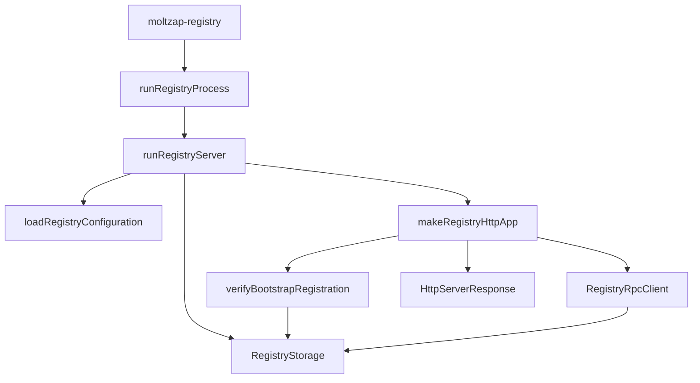

# v2/identity/src

_`v2/identity/src`_

## Purpose

Public identity contracts: immutable agent cards, identifiers,
and the signing and request-authentication profiles every other v2
package builds on. `identity` sits at the root of the v2 dependency
graph and imports no other v2 package.

## Public surface

### [`AgentCard (type)`](https://github.com/chughtapan/moltzap/blob/v2/v2/identity/src/agent-card.ts#L143)

_Interface_

```ts
export interface AgentCard {
  readonly agentId: AgentIdValue;
  readonly principalId: PrincipalIdValue;
  readonly agentName: AgentNameValue;
  readonly publicKey: Ed25519PublicKeyValue;
  readonly issuedAt: string;
}
```

Immutable public identity fields carried by an AgentCard.

### [`AgentCard (value)`](https://github.com/chughtapan/moltzap/blob/v2/v2/identity/src/agent-card.ts#L438)

_Variable_

```ts
export const AgentCard = Object.assign(agentCardSchema, {
  verify: verifyAgentCard,
}) as unknown as Schema.Schema<AgentCard, unknown> &
  Readonly<{
    readonly verify: typeof verifyAgentCard;
  }>
```

Verifies immutable Registry attestation without exposing JOSE mechanics.

### [`AgentCardDigest (type)`](https://github.com/chughtapan/moltzap/blob/v2/v2/identity/src/agent-card.ts#L60)

_TypeAlias_

```ts
export type AgentCardDigest = typeof AgentCardDigest.Type;
```

Validated nominal value decoded by AgentCardDigest.

### [`AgentCardDigest (value)`](https://github.com/chughtapan/moltzap/blob/v2/v2/identity/src/agent-card.ts#L53)

_Variable_

```ts
export const AgentCardDigest = canonicalIdentifier(
  "AgentCardDigest",
  "acd_",
  DIGEST_BYTE_LENGTH,
)
```

Digest binding a message to one complete immutable AgentCard.

### [`AgentCardVerificationError`](https://github.com/chughtapan/moltzap/blob/v2/v2/identity/src/agent-card.ts#L282)

_Class_

```ts
export class AgentCardVerificationError extends Data.TaggedError(
  "AgentCardVerificationError",
) {}
```

A parsed AgentCard does not verify against the pinned Registry signer.

### [`AgentId (type)`](https://github.com/chughtapan/moltzap/blob/v2/v2/identity/src/identifiers.ts#L71)

_TypeAlias_

```ts
export type AgentId = typeof AgentId.Type;
```

Validated nominal value decoded by AgentId.

### [`AgentId (value)`](https://github.com/chughtapan/moltzap/blob/v2/v2/identity/src/identifiers.ts#L65)

_Variable_

```ts
export const AgentId = canonicalIdentifier(
  "AgentId",
  "agt_",
  IDENTIFIER_BYTE_LENGTH,
)
```

Canonical network identity minted by the Registry.

### [`AgentName (type)`](https://github.com/chughtapan/moltzap/blob/v2/v2/identity/src/identifiers.ts#L94)

_TypeAlias_

```ts
export type AgentName = typeof AgentName.Type;
```

Validated nominal value decoded by AgentName.

### [`AgentName (value)`](https://github.com/chughtapan/moltzap/blob/v2/v2/identity/src/identifiers.ts#L83)

_Variable_

```ts
export const AgentName = Schema.String.pipe(
  Schema.minLength(3),
  Schema.maxLength(32),
  Schema.pattern(/^[a-z0-9]+(-[a-z0-9]+)*$/),
  Schema.brand("AgentName"),
  Schema.annotations({
    identifier: "AgentName",
    description: "Registry-wide immutable agent handle",
  }),
)
```

Immutable Registry-wide human-facing agent handle.

### [`AgentSigningAuthority (type)`](https://github.com/chughtapan/moltzap/blob/v2/v2/identity/src/agent-key.ts#L274)

_Interface_

```ts
export interface AgentSigningAuthority {
  readonly [agentSigningAuthorityBrand]: "AgentSigningAuthority";
}
```

Opaque authority over one imported Ed25519 private key.

### [`AgentSigningAuthority (value)`](https://github.com/chughtapan/moltzap/blob/v2/v2/identity/src/agent-key.ts#L361)

_Variable_

```ts
export const AgentSigningAuthority = Object.freeze({
  fromPkcs8,
  publicKey,
})
```

Loads and identifies one Ed25519 signing authority without exposing its
private key or a generic signing operation.

### [`AgentSigningError`](https://github.com/chughtapan/moltzap/blob/v2/v2/identity/src/http-signature.ts#L29)

_Class_

```ts
export class AgentSigningError extends Data.TaggedError("AgentSigningError") {}
```

An agent-owned HTTP request could not be signed.

### [`AuthenticatedHttp`](https://github.com/chughtapan/moltzap/blob/v2/v2/identity/src/authenticated-http.ts#L55)

_Class_

```ts
export class AuthenticatedHttp extends Context.Tag(
  "@moltzap/v2-identity/AuthenticatedHttp",
)<AuthenticatedHttp, AuthenticatedHttpService>() {
  static readonly signAgentRequest = signAgentRequest;

  static readonly verifyAgentRequest: (input: {
    readonly httpRequest: HttpServerRequest.HttpServerRequest;
    readonly bodyBytes: Uint8Array;
  }) => Effect.Effect<
    VerifiedAgentRequest,
    AuthenticationError,
    AuthenticatedHttp
  > = Effect.serviceFunctionEffect(
    AuthenticatedHttp,
    (service) => service.verifyAgentRequest,
  );

  static readonly layer = (input: {
    readonly liveNonceCapacity: number;
    readonly agentCardCacheCapacity: number;
    readonly registryLookupConcurrencyLimit: number;
  }): Layer.Layer<AuthenticatedHttp, never, Registry> =>
    Layer.effect(AuthenticatedHttp, makeService({ ...input }));
}
```

Registered-agent request signing and verification.

### [`AuthenticationFailedError`](https://github.com/chughtapan/moltzap/blob/v2/v2/identity/src/http-errors.ts#L10)

_Class_

```ts
export class AuthenticationFailedError extends Schema.TaggedError<AuthenticationFailedError>()(
  "AuthenticationFailedError",
  {},
) {}
```

The request does not prove the required identity or admission authority.

### [`Ed25519PublicKey (type)`](https://github.com/chughtapan/moltzap/blob/v2/v2/identity/src/agent-key.ts#L240)

_TypeAlias_

```ts
export type Ed25519PublicKey = typeof Ed25519PublicKey.Type;
```

Validated immutable Ed25519 public JWK.

### [`Ed25519PublicKey (value)`](https://github.com/chughtapan/moltzap/blob/v2/v2/identity/src/agent-key.ts#L209)

_Variable_

```ts
export const Ed25519PublicKey = Schema.transform(
  publicKeyRepresentation,
  publicKeyValueSchema,
  {
    strict: true,
    decode: (value) =>
      Object.freeze({
        crv: value.crv,
        kty: value.kty,
        x: value.x,
      }),
    encode: (value) => ({
      crv: value.crv,
      kty: value.kty,
      x: value.x,
    }),
  },
).pipe(
  Schema.brand("Ed25519PublicKey"),
  Schema.annotations({
    identifier: "Ed25519PublicKey",
    description: "Exact immutable Ed25519 public JWK",
    parseOptions: {
      exact: true,
      onExcessProperty: "error",
    },
  }),
)
```

Exact immutable Ed25519 public JWK.

### [`InternalServerError`](https://github.com/chughtapan/moltzap/blob/v2/v2/identity/src/http-errors.ts#L58)

_Class_

```ts
export class InternalServerError extends Schema.TaggedError<InternalServerError>()(
  "InternalServerError",
  {},
) {}
```

An unexpected implementation failure prevented a closed result.

### [`InvalidAgentPrivateKeyError`](https://github.com/chughtapan/moltzap/blob/v2/v2/identity/src/agent-key.ts#L279)

_Class_

```ts
export class InvalidAgentPrivateKeyError extends Data.TaggedError(
  "InvalidAgentPrivateKeyError",
) {}
```

The supplied private-key material cannot act as an Ed25519 signer.

### [`MalformedRequestError`](https://github.com/chughtapan/moltzap/blob/v2/v2/identity/src/http-errors.ts#L4)

_Class_

```ts
export class MalformedRequestError extends Schema.TaggedError<MalformedRequestError>()(
  "MalformedRequestError",
  {},
) {}
```

The request representation is not valid for the selected operation.

### [`MessageId (type)`](https://github.com/chughtapan/moltzap/blob/v2/v2/identity/src/signed-message.ts#L38)

_TypeAlias_

```ts
export type MessageId = typeof MessageId.Type;
```

Validated nominal value decoded by MessageId.

### [`MessageId (value)`](https://github.com/chughtapan/moltzap/blob/v2/v2/identity/src/signed-message.ts#L35)

_Variable_

```ts
export const MessageId = canonicalIdentifier("MessageId", "msg_", 16)
```

Sender-scoped identity of one attributed message.

### [`MethodNotAllowedError`](https://github.com/chughtapan/moltzap/blob/v2/v2/identity/src/http-errors.ts#L22)

_Class_

```ts
export class MethodNotAllowedError extends Schema.TaggedError<MethodNotAllowedError>()(
  "MethodNotAllowedError",
  {},
) {}
```

The selected route does not accept the request method.

### [`MOLTZAP_VERSION`](https://github.com/chughtapan/moltzap/blob/v2/v2/identity/src/version.ts#L2)

_Variable_

```ts
export const MOLTZAP_VERSION = "2026.729.1"
```

Sole compatibility value for MoltZap-owned network boundaries.

### [`OverloadedError`](https://github.com/chughtapan/moltzap/blob/v2/v2/identity/src/http-errors.ts#L46)

_Class_

```ts
export class OverloadedError extends Schema.TaggedError<OverloadedError>()(
  "OverloadedError",
  {},
) {}
```

A finite immediate resource permit is unavailable.

### [`PayloadTooLargeError`](https://github.com/chughtapan/moltzap/blob/v2/v2/identity/src/http-errors.ts#L34)

_Class_

```ts
export class PayloadTooLargeError extends Schema.TaggedError<PayloadTooLargeError>()(
  "PayloadTooLargeError",
  {},
) {}
```

The received body exceeds the selected route's derived representation cap.

### [`PrincipalId (type)`](https://github.com/chughtapan/moltzap/blob/v2/v2/identity/src/identifiers.ts#L80)

_TypeAlias_

```ts
export type PrincipalId = typeof PrincipalId.Type;
```

Validated nominal value decoded by PrincipalId.

### [`PrincipalId (value)`](https://github.com/chughtapan/moltzap/blob/v2/v2/identity/src/identifiers.ts#L74)

_Variable_

```ts
export const PrincipalId = canonicalIdentifier(
  "PrincipalId",
  "prn_",
  IDENTIFIER_BYTE_LENGTH,
)
```

Opaque identity of the principal represented by an agent.

### [`RouteNotFoundError`](https://github.com/chughtapan/moltzap/blob/v2/v2/identity/src/http-errors.ts#L16)

_Class_

```ts
export class RouteNotFoundError extends Schema.TaggedError<RouteNotFoundError>()(
  "RouteNotFoundError",
  {},
) {}
```

No exact HTTP route owns the request target.

### [`SignedMessage (type)`](https://github.com/chughtapan/moltzap/blob/v2/v2/identity/src/signed-message.ts#L152)

_Interface_

```ts
export interface SignedMessage {
  readonly senderAgentId: AgentIdValue;
  readonly agentCardDigest: AgentCardDigestValue;
  readonly recipientAgentIds: readonly AgentIdValue[];
  readonly messageId: MessageId;
  readonly body: Uint8Array;
}
```

Immutable attributed-message fields exposed to Router consumers.

### [`SignedMessage (value)`](https://github.com/chughtapan/moltzap/blob/v2/v2/identity/src/signed-message.ts#L467)

_Variable_

```ts
export const SignedMessage = Object.assign(signedMessageSchema, {
  sign,
  verify,
  encodedByteLength,
  maximumEncodedByteLength: MAXIMUM_ENCODED_BYTES,
}) as unknown as Schema.Schema<SignedMessage, unknown> &
  Readonly<{
    readonly sign: typeof sign;
    readonly verify: typeof verify;
    readonly encodedByteLength: typeof encodedByteLength;
    readonly maximumEncodedByteLength: number;
  }>
```

Opaque attributed message operations and exact representation Schema.

### [`SignedMessageSigningError`](https://github.com/chughtapan/moltzap/blob/v2/v2/identity/src/signed-message.ts#L296)

_Class_

```ts
export class SignedMessageSigningError extends Data.TaggedError(
  "SignedMessageSigningError",
) {}
```

A message cannot be signed under the supplied immutable identity.

### [`SignedMessageVerificationError`](https://github.com/chughtapan/moltzap/blob/v2/v2/identity/src/signed-message.ts#L301)

_Class_

```ts
export class SignedMessageVerificationError extends Data.TaggedError(
  "SignedMessageVerificationError",
) {}
```

A SignedMessage does not bind to the supplied verified AgentCard.

### [`UnavailableError`](https://github.com/chughtapan/moltzap/blob/v2/v2/identity/src/http-errors.ts#L52)

_Class_

```ts
export class UnavailableError extends Schema.TaggedError<UnavailableError>()(
  "UnavailableError",
  {},
) {}
```

A required service or durable operation cannot currently complete.

### [`UnsupportedMediaTypeError`](https://github.com/chughtapan/moltzap/blob/v2/v2/identity/src/http-errors.ts#L40)

_Class_

```ts
export class UnsupportedMediaTypeError extends Schema.TaggedError<UnsupportedMediaTypeError>()(
  "UnsupportedMediaTypeError",
  {},
) {}
```

The selected route cannot consume the request content framing.

### [`VerifiedAgentCard`](https://github.com/chughtapan/moltzap/blob/v2/v2/identity/src/agent-card.ts#L267)

_TypeAlias_

```ts
export type VerifiedAgentCard = AgentCard & Brand.Brand<"VerifiedAgentCard">;
```

AgentCard verified against a deployment-pinned Registry signer.

### [`VerifiedAgentRequest`](https://github.com/chughtapan/moltzap/blob/v2/v2/identity/src/authenticated-http.ts#L33)

_TypeAlias_

```ts
export type VerifiedAgentRequest = Readonly<{
  readonly callerAgentId: AgentIdValue;
  readonly agentCard: VerifiedAgentCard;
  readonly request: unknown;
}> &
  Brand.Brand<"VerifiedAgentRequest">;
```

Request body and caller identity established by AuthenticatedHttp.

### [`VerifiedSignedMessage`](https://github.com/chughtapan/moltzap/blob/v2/v2/identity/src/signed-message.ts#L290)

_TypeAlias_

```ts
export type VerifiedSignedMessage = SignedMessage &
  Brand.Brand<"VerifiedSignedMessage">;
```

SignedMessage whose sender attribution and signature are verified.

### [`VersionMismatchError`](https://github.com/chughtapan/moltzap/blob/v2/v2/identity/src/http-errors.ts#L28)

_Class_

```ts
export class VersionMismatchError extends Schema.TaggedError<VersionMismatchError>()(
  "VersionMismatchError",
  {},
) {}
```

The request carries a different MoltZap compatibility value.

## Package subpaths

### `@moltzap/v2-identity/registry`

#### [`Registry`](https://github.com/chughtapan/moltzap/blob/v2/v2/identity/src/registry.ts#L22)

_Class_

```ts
export class Registry extends Context.Tag("@moltzap/v2-identity/Registry")<
  Registry,
  RegistryClientService
>() {
  static readonly register = Effect.serviceFunctionEffect(
    Registry,
    (service) => service.register,
  );

  static readonly lookup = Effect.serviceFunctionEffect(
    Registry,
    (service) => service.lookup,
  );

  static readonly list = Effect.serviceFunctionEffect(
    Registry,
    (service) => service.list,
  );

  static readonly layer = (input: {
    readonly origin: URL;
    readonly registrySignerPublicKey: Ed25519PublicKey;
    readonly requestTimeout: Duration.Duration;
  }): Layer.Layer<Registry, never, HttpClient.HttpClient> =>
    Layer.effect(Registry, makeRegistryService(input));
}
```

Bootstrap registration and immutable identity resolution.

#### [`RegistryConnectionError`](https://github.com/chughtapan/moltzap/blob/v2/v2/identity/src/registry/contract.ts#L27)

_Class_

```ts
export class RegistryConnectionError extends Data.TaggedError(
  "RegistryConnectionError",
) {}
```

The Registry connection could not be established or used.

#### [`RegistryInvalidResponseError`](https://github.com/chughtapan/moltzap/blob/v2/v2/identity/src/registry/contract.ts#L37)

_Class_

```ts
export class RegistryInvalidResponseError extends Data.TaggedError(
  "RegistryInvalidResponseError",
) {}
```

A Registry response did not match the selected operation contract.

#### [`RegistryRequestTimeoutError`](https://github.com/chughtapan/moltzap/blob/v2/v2/identity/src/registry/contract.ts#L32)

_Class_

```ts
export class RegistryRequestTimeoutError extends Data.TaggedError(
  "RegistryRequestTimeoutError",
) {}
```

The configured complete Registry call deadline expired.

#### [`OperationId (type)`](https://github.com/chughtapan/moltzap/blob/v2/v2/identity/src/registry/contract.ts#L24)

_TypeAlias_

```ts
export type OperationId = typeof OperationId.Type;
```

Validated nominal value decoded by OperationId.

#### [`RegistryListRequest (type)`](https://github.com/chughtapan/moltzap/blob/v2/v2/identity/src/registry/contract.ts#L84)

_TypeAlias_

```ts
export type RegistryListRequest = typeof RegistryListRequest.Type;
```

Validated Registry list continuation request.

#### [`RegistryListResult`](https://github.com/chughtapan/moltzap/blob/v2/v2/identity/src/registry/contract.ts#L99)

_TypeAlias_

```ts
export type RegistryListResult = Readonly<{
  kind: "page";
  agentCards: readonly VerifiedAgentCard[];
  hasMore: boolean;
}>;
```

One deterministic page of complete immutable AgentCards.

#### [`RegistryLookupRequest (type)`](https://github.com/chughtapan/moltzap/blob/v2/v2/identity/src/registry/contract.ts#L75)

_TypeAlias_

```ts
export type RegistryLookupRequest = typeof RegistryLookupRequest.Type;
```

Validated Registry lookup selector.

#### [`RegistryLookupResult`](https://github.com/chughtapan/moltzap/blob/v2/v2/identity/src/registry/contract.ts#L94)

_TypeAlias_

```ts
export type RegistryLookupResult =
  | Readonly<{ kind: "found"; agentCard: VerifiedAgentCard }>
  | Readonly<{ kind: "not_found" }>;
```

Closed domain outcome from one public identity lookup.

#### [`RegistryRegisterRequest (type)`](https://github.com/chughtapan/moltzap/blob/v2/v2/identity/src/registry/contract.ts#L59)

_TypeAlias_

```ts
export type RegistryRegisterRequest = typeof RegistryRegisterRequest.Type;
```

Validated Registry bootstrap registration request.

#### [`RegistryRegisterResult`](https://github.com/chughtapan/moltzap/blob/v2/v2/identity/src/registry/contract.ts#L87)

_TypeAlias_

```ts
export type RegistryRegisterResult =
  | Readonly<{ kind: "registered"; agentCard: VerifiedAgentCard }>
  | Readonly<{ kind: "name_taken" }>
  | Readonly<{ kind: "key_already_registered" }>
  | Readonly<{ kind: "idempotency_conflict" }>;
```

Closed domain outcome from one bootstrap registration attempt.

#### [`OperationId (value)`](https://github.com/chughtapan/moltzap/blob/v2/v2/identity/src/registry/contract.ts#L21)

_Variable_

```ts
export const OperationId = canonicalIdentifier("OperationId", "opn_", 16)
```

Idempotency identity for a registration operation.

#### [`RegistryListRequest (value)`](https://github.com/chughtapan/moltzap/blob/v2/v2/identity/src/registry/contract.ts#L79)

_Variable_

```ts
export const RegistryListRequest = exactStruct({
  afterAgentId: Schema.optional(AgentId),
}).annotations({ identifier: "RegistryListRequest" })
```

Closed Registry list continuation request.

#### [`RegistryLookupRequest (value)`](https://github.com/chughtapan/moltzap/blob/v2/v2/identity/src/registry/contract.ts#L63)

_Variable_

```ts
export const RegistryLookupRequest = Schema.Union(
  exactStruct({ agentId: AgentId }),
  exactStruct({ agentName: AgentName }),
).annotations({
  identifier: "RegistryLookupRequest",
  parseOptions: {
    exact: true,
    onExcessProperty: "error",
  },
})
```

Closed Registry lookup selector.

#### [`RegistryRegisterRequest (value)`](https://github.com/chughtapan/moltzap/blob/v2/v2/identity/src/registry/contract.ts#L51)

_Variable_

```ts
export const RegistryRegisterRequest = exactStruct({
  operationId: OperationId,
  principalId: PrincipalId,
  agentName: AgentName,
  publicKey: Ed25519PublicKey,
}).annotations({ identifier: "RegistryRegisterRequest" })
```

Closed Registry bootstrap registration request.

### `@moltzap/v2-identity/registry/server`

#### [`StartupError`](https://github.com/chughtapan/moltzap/blob/v2/v2/identity/src/registry/server.ts#L26)

_Class_

```ts
export class StartupError extends Data.TaggedError(
  "RegistryServerStartupError",
)<{
  readonly phase: "configuration" | "storage" | "listener";
}> {}
```

Closed Registry startup failure.

#### [`layer`](https://github.com/chughtapan/moltzap/blob/v2/v2/identity/src/registry/server.ts#L67)

_Variable_

```ts
export const layer: Layer.Layer<never, StartupError> = Layer.scopedDiscard(
  runRegistryServer.pipe(Effect.provide(NodeContext.layer)),
)
```

Complete production Registry process composition.



## Files

- `agent-card.ts`
- `agent-key.ts`
- `authenticated-http.ts`
- `canonical-json.ts`
- `http-errors.ts`
- `http-signature.ts`
- `identifiers.ts`
- `index.ts`
- `registry.ts`
- `registry/admission.ts`
- `registry/client.ts`
- `registry/configuration.ts`
- `registry/contract.ts`
- `registry/http.ts`
- `registry/migrations/0001_registry.ts`
- `registry/process.ts`
- `registry/README.md`
- `registry/rpc.ts`
- `registry/server.ts`
- `registry/storage.ts`
- `signed-message.ts`
- `version.ts`
