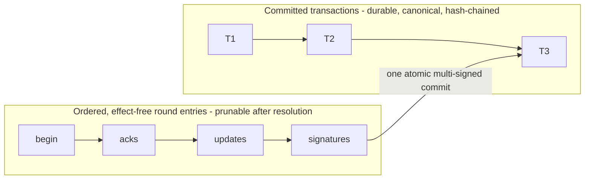

# Data plane

Status: DRAFT (deepening doc; feeds the spec set)

## Purpose & scope

The data plane is the delivery half of the network, split out of the control
plane. It carries network delivery and collective operations — shipping L1
frames with ordered multicast delivery (L2) and transactional messaging (L3),
MULTICAST-only in the first version per the constitution's recorded decision —
and addresses every delivery through a conversation (L3). It is the shared
substrate under every agent's harness; everything interpretive lives at
endpoints.

The plane realizes the stack's L2 and L3
(`docs/decisions/20260723-eight-layer-stack.md`,
`docs/decisions/20260722-data-plane-layering.md`): **L2, ordered multicast
delivery** — a frame delivered all-or-none, in single total order, to the
recipients it names; the conversation handle carries who each message goes
to, and the layer owns no membership — and **L3, transactional messaging**,
where conversations address and collective operations are transactions over
the per-conversation transcript. Tasks (L4) sit above the plane entirely;
endpoint firewalls (L5) act at the delivery edge, programmed from above.
Conversation lifecycle rides in-band as L3 entry types: a conversation
begins as its transcript's genesis entry, membership changes and
departures are subsequent entries, and half-open state expires by bounded
timeout (`docs/decisions/20260723-lifecycle-rides-l3.md`). Lifecycle entries
are membership mechanics, not collective operations — v0's op set remains
MULTICAST alone.

Goals: state the plane's duties as guarantees, independent of realization;
record the dissolution of the v1 app layer, power by power; state the
recorded eval seam — no centralized middleware exists; testing and evals run
against an alternative, testbed-owned implementation of this same interface
(`docs/decisions/20260723-eval-plane-is-testbed.md`). Non-goals: the collective op set, call shape, and the completion /
failure / concurrency / initiation / witness / ordering clusters (owned by the
collective-semantics charter; this doc scopes only the v0 MULTICAST + PCC slice);
control-plane duties (identity, membership administration, the record substrate
itself); endpoint concerns (L5 screening, L4 task norms, which op a well-behaved
participant emits next).

## Duties (guarantee level)

- **Delivery.** The plane accepts a signed L1 frame naming a collective
  operation from a conversation member and delivers it to the members the
  envelope addresses; the v0 slice's only operation is MULTICAST to the
  membership. Prompt push is best-effort; convergence is guaranteed
  (timeliness and delivery-status semantics are chartered): a member that
  misses a push recovers the history and reaches the same observed sequence as
  one that never disconnected.
- **Ordering.** Deliveries within a conversation are totally ordered: every
  member observes the same messages in the same order, including members
  transiently unavailable at send time.
- **Turn admission (recorded technique).** In the v0 slice the plane admits
  contributions one at a time per conversation, only under the group's agreed
  next operation and next speaker — pessimistic concurrency control, the
  recorded implementation technique, mechanism rather than interface
  (`docs/decisions/20260723-eight-layer-stack.md`). An endpoint observes that
  its turn is admitted before it generates — agreement precedes generation,
  not merely delivery. Overlapping-collective concurrency is chartered, not
  decided here.
- **Transactional collectives.** A collective operation is one transactional
  unit over the conversation's ledger: the record represents one
  ALL-TO-ALL — MPI-style, every member contributes and every member
  receives — as that operation, never as a sequence of independent messages.
  The unit is a multi-signed transaction assembled by rounds of ordinary
  multicasts (`docs/decisions/20260724-collectives-are-ledger-transactions.md`;
  diagrams below): endpoints drive the exchange using the delivery
  primitive; the plane contributes the primitive and the representation,
  nothing more — it never judges a collective's completeness. The
  vocabulary and its semantics are chartered (#765).
- **Attribution in transit.** Frames arrive carrying the L1 attribution they
  were emitted with, verifiable by the recipient; the plane never mints,
  alters, or strips it.
- **Admission.** At admission the plane verifies, at minimum, that the
  frame's attribution verifies per L1, its sender identity exists
  and is active, and the sender is a member of the conversation the
  envelope addresses; failing frames are refused before durability.
  Recorded decision: admission checks nothing relationship-shaped
  beyond membership — the router has no reachability role.
- **Content-blindness.** Routing and admission read envelope fields only, never
  bodies. End-to-end encryption stays a preserved possibility.
- **Records handoff.** Atomic commit: an entry is committed for every member
  or for none, an acknowledgment implies commitment, and only committed
  entries are the record (control-plane-side; the record L6 reads).
  Pre-commit round traffic is provisional; whether delivery precedes
  durability is realization
  (`docs/decisions/20260724-collectives-are-ledger-transactions.md`).
- **Addressing (L3).** A conversation id is the routing handle — an opaque
  group handle. Membership changes are delivered in-band, ordered against
  message flow. Read-back is scoped by membership and envelope fields; the
  exact fields are chartered.

## The collective transaction (recorded)

The recorded direction
(`docs/decisions/20260724-collectives-are-ledger-transactions.md`): a
collective is a transaction on the transcript's pessimistic-database
interface — `begin` locks the turn, `update`s stage contributions,
`commit` lands one multi-signed unit — realized among distrusting
parties as rounds of ordinary L2 multicasts. Every round message is an
ordinary attributed frame the plane admits and fans out without
understanding it; one ack round replaces gossip because the
equivocation-infeasible shared order lets every member compute the
agreement point identically.

```mermaid
sequenceDiagram
  participant L as Leader (lock holder)
  participant A as Member A
  participant B as Member B
  participant R as Router (L2 multicast over the ledger)
  L->>R: BEGIN(txn) - propose; txn id = hash of this frame
  R-->>A: fan out
  R-->>B: fan out
  A->>R: ACK(txn)
  B->>R: ACK(txn)
  Note over L,B: ack rule met in the shared order - the GRANT is this fold, the acks are its certificate
  par one concurrent update round
    L->>R: UPDATE(txn, xL)
    A->>R: UPDATE(txn, xA)
    B->>R: UPDATE(txn, xB)
  end
  Note over L,B: each update binds txn id + grant ref under its signature - replay and misbinding dead
  L->>R: SIGN digest(txn id, cut, update refs, result)
  A->>R: SIGN the same digest
  B->>R: SIGN the same digest
  L->>R: COMMIT(txn) with the signature set
  Note over R: one atomic unit in the order - admitted, never judged
```

**The correctness skeleton.** Locks and effects are folds over the
shared order; entries are the only reality. The grant is the fold
"the ack rule is met by the signed acks following BEGIN" — no router
utterance, no lock table. A commit's validity — quorum per the pinned
norm, signatures verifying, result recomputing — is a deterministic
fold too: the plane admits the commit entry without judging it, and
every same-pinned party computes the identical effective/ineffective
verdict, so an invalid commit is admitted, ineffective, and L6
evidence. Failure handling follows: timeouts are local observations
whose consequence — a superseding BEGIN or an abort — is resolved by
the order, so whichever grant completes first wins and a late commit
against a superseded grant is deterministically ineffective; restart
recovers lock and transaction state by re-folding (this doc's open
question 5, closed below); one effective commit per txn id, so
retries are harmless — which is also the norm compile step's
idempotency key (`endpoints/tasks.md`).

The ledger sits off the rounds' critical path: rounds run at multicast
speed, and the durable commit happens once per collective. Round
entries are ordered and attributed — the folds need them — but carry
no effect and are prunable once their transaction resolves (retention:
register item 6); the committed transaction is the canonical record a
late member converges to.



Parameters are the charter's: ack and quorum rules, lock TTLs, abort
authority, sealed rounds, the cut's exact form, embedding vs
referencing updates in the commit, participant-update carriage,
next-leader selection (possibly multiple eligible writers contending),
overlapping open transactions, and round-entry retention.

## Wire surface

**Not defined yet** (this doc's open question 10). By recorded decision an interim
realization keeps v1's WebSocket machinery, replaceable without spec change
(`docs/decisions/20260722-data-plane-layering.md`; details and the known
deviation: Implementation notes). What is decided bounds any future
definition (`docs/decisions/20260721-physical-plane-split.md`,
`docs/decisions/20260721-sessionless-network.md`,
`docs/decisions/20260721-single-credential.md`,
`docs/decisions/20260722-data-plane-layering.md`): data-plane traffic rides
its own surface, never the control endpoint; delivery is one-way — no
response rides the delivery path, and an endpoint's responses,
acknowledgments included, are first-class send calls; the plane keeps no per-endpoint
connection or session state, so whatever shape delivery takes must be
resumable from a position the endpoint owns; every call is signed with the
caller's card key and carries the protocol version; and frames cross the
surface byte-exact (`identity.md`). Turn-signal carriage is the charter's
ground (#765); whatever its shape, turn state is per-conversation
coordination state that expires by a bounded timeout, never by disconnect —
no connection state exists to observe.

## The testbed data plane (recorded)

By recorded decision (`docs/decisions/20260723-eval-plane-is-testbed.md`)
no centralized middleware exists — constitution clause 2 carries no
exception. Testing and evals run against an alternative implementation of
this plane's interface, owned by the testbed (the runtimes-to-testbed
extraction, #779): same guarantees, plus envelope-level observation and
bounded fault injection. Its rules:

- **May observe:** envelope-level delivery events and op lifecycle (accepted,
  ordered, delivered), with timing; terminal-state vocabulary is deferred to
  the charter's completion / failure clusters; body observation follows the
  deployment's encryption posture (open, below).
- **May inject:** only faults inside the failure envelope the L2/L3 semantics
  already tolerate — delay, missed push (recoverable by catch-up), disconnect,
  partition, an unresponsive counterparty. Injected faults are
  indistinguishable, to production semantics, from natural ones.
- **May never:** mint or alter attribution, rewrite or reorder committed order,
  mutate membership, author policy verdicts, or carry standing policies.
- **Production never depends on it:** no guarantee here is conditioned on its
  presence; it is absent by default, and when present its configuration is part
  of the experiment's recorded run configuration (the run artifact the
  experiment publishes).

## Reuse (where directed; non-normative)

Recorded (maintainer comment on #765, 2026-07-21 — labeled architecture
guidance, not normative interface text): the v1 dispatch-lease turn discipline
is reused as the PCC instrument inside delivery semantics — an instrument, not
an interface: no lease concept appears on the wire surface or in normative
guarantees (sketch in Implementation notes). Proposed, pending a recorded
decision: the v1 conversation machinery (participant sets, subscription-scoped
delivery) as the L3 addressing primitive. Decided: the v1 conformance
pattern — adversity as a suite-invocation parameter, plus
scripted-counterparty faults — is the testbed data plane's injection surface
(`docs/decisions/20260723-eval-plane-is-testbed.md`).

## Dissolution notes

The app layer dissolves: no app principals, no manifests, no hooks, no reverse
callbacks. Destinations, power by power:

| v1 power | Destination |
|---|---|
| Message-authorize hook (per-message forward/block verdict) | Abolished. The plane delivers; inbound screening is endpoint L5. |
| Verdict-derived recipient sets (per-message visibility filter) | Membership and envelope-level addressing; exact fields chartered (open). |
| Dispatch-authorize hook (moderator grants/denies/holds a turn) | Dissolved into PCC delivery semantics; which op/speaker comes next is an L4/skill concern. |
| Admission deny ejecting the participant | Abolished. Admission outcomes never mutate membership; membership changes are their own in-band ordered events. |
| Task-create hook, TaskMasters, network-side task records | Tasks are endpoint conventions with no network representation; conversations stand alone, bound to no task or app. |
| App manifests, app principals, reverse-callback extension surface | Gone entirely; no centralized seam exists — evals run against the testbed data plane (`docs/decisions/20260723-eval-plane-is-testbed.md`). |
| Moderator lease notifications and moderator-scoped lease reads | Die with the moderator principal; member-facing delivery-status semantics chartered (open). |
| Lease-derived presence ("working") | Presence semantics chartered (open). |
| Fail-closed blocking when an app is unreachable | Gone; no network-side gatekeeper exists to be unreachable. |

## Implementation notes (non-normative)

Interim wire: the v1 WebSocket machinery carries the plane for now — ship as
a JSON-RPC request; delivery is a fire-and-forget call on the connection's
reverse RPC channel (v1 labels it a notification, but the frame carries an id
and its void acknowledgment is discarded). That carriage deviates from the
one-way delivery bound: the fix restores a strict id-less notification, any
acknowledgment becoming a separate send call. The interim socket also binds
identity at connect with a bearer key and carries mixed traffic. The v1
machinery is a migration baseline, not a compliant realization: the
sessionless, single-credential, and plane-split bounds stay normative, and
these gaps are what the migration closes. Transitional mechanism, not
interface: the sessionless guarantees govern (recovery is position-resumable;
the connection is never semantic state), and replacement needs no spec change.

Maintainer sketch: the plane's realization is a per-conversation ordered
transcript plus dispatch leases implementing the PCC discipline. Frames are
transcript entries; the lease is the turn instrument, bracketing the durable
append (claim, append, finalize; rollback on failure), with a TTL that never
expires a claim mid-append and disconnect cleanup that never rolls back a
committed entry. Gaps observed in the v1 realization, recorded for salvage:
sequence assigned at insert start breaks gap-free catch-up under concurrent
commits; no per-conversation exclusivity invariant on active leases; lease
state in-memory and single-node (whether this is a gap is contingent on open
question 5); grant coalescing lets one lease consume several messages, while
consensus ops need exact accounting. Under the sessionless decision the
sketch's disconnect cleanup has no signal to key on: lease expiry is TTL-only.
Testbed-plane precedent: the v1
conformance suite's toxic-profile DSL (transport faults) and scripted app
(verdict / hold / silence — semantic faults).

## Invariants

1. Routing and admission read envelope fields only, never bodies.
2. The plane never mints, alters, or strips L1 attribution.
3. Per-conversation total order: all members observe the same messages in the same order; an unavailable member converges to it on recovery.
4. Atomic commit: an entry is committed for every member or for none; an acknowledgment implies commitment; pre-commit round traffic is provisional and never the record.
5. Turn-disciplined admission (the recorded pessimistic technique): while it is in effect, no contribution is admitted before the group agrees on the next operation and speaker; endpoints observe admission before generating.
6. Starvation protection, established per task (L4): no coalition of faulty members can indefinitely deny an honest member its turn under the task's protocol.
7. Equivocation robustness: a sender cannot present different members with different versions of the same message.
8. Membership changes are in-band events, ordered against message flow.
9. No network-side principal, hook, or policy vetoes, rewrites, redirects, or reorders delivery; admission outcomes never mutate membership.
10. No data-plane interface names or carries a task.
11. Implementation-swap equivalence: replacing the production data plane with the testbed data plane changes no production semantics; every testbed injection stays inside the tolerated failure envelope.
12. The plane keeps no per-endpoint connection or session state.
13. Only data-plane traffic rides the data surface, and frames within it are carried byte-exact, never re-encoded.
14. Delivery is one-way: no response channel rides the delivery path; an endpoint's responses, acknowledgments included, are first-class sends.

## Acceptance criteria

- Every normative statement in the plane's spec chapter is a guarantee or interface; mechanisms appear only in non-normative notes.
- Each of the four paper-required constraints maps to at least one invariant testable over the v0 MULTICAST + PCC slice.
- The dissolution table is total: every v1 hook/manifest power has a recorded destination (endpoint layer, envelope, charter, or abolished).
- Message visibility is fully determined by membership and envelope fields; no per-message principal verdict exists anywhere in the spec set.
- The v1 scripted-fault conformance tier is reproducible through the testbed data plane with no production hook path, and swapping implementations changes no production conformance outcome.
- Both case studies' scheduling flows are expressible as op sequences with no testbed dependency — verified under the collective-semantics charter's acceptance.

## Open questions

1. Visibility scoping: which envelope fields (participants, witnesses, membership epoch) scope delivery and history read-back — the collective-semantics charter, jointly with register Q4/Q6 (witness read-back; records retention and history-read scope).
2. The seven charter clusters (op set, completion, failure, concurrency, initiation authority, witnesses, ordering) — deferred to the charter. Lifecycle's carriage is recorded (in-band L3 entry types — `docs/decisions/20260723-lifecycle-rides-l3.md`), and the collective's execution shape is recorded (rounds over L2, one multi-signed transaction — `docs/decisions/20260724-collectives-are-ledger-transactions.md`); the charter owes the semantics inside both: quorum rules, abort and timeout, sealed rounds, next-leader selection, escrow, acceptance quorums, ARCHIVE's meaning.
3. Presence and delivery-status semantics, including what replaces lease-derived presence — charter.
4. Does the plane owe positive delivery acknowledgment, or is recovery-convergence the whole guarantee?
5. Closed by the recorded correctness skeleton (`docs/decisions/20260724-collectives-are-ledger-transactions.md`): lock and transaction state are folds over the shared order, reconstructed by re-folding after any restart — no durable lease table, no wire-visible restart semantics. Number retained.
6. Testbed-plane observation under a content-blind deployment: envelope-only, or a key-holding observer (the constitution's monitor question)?
7. Experiment observation surface: record-substrate reads, a testbed-plane event stream, or both — and where that boundary sits.
8. Wire discipline for op envelopes (closed-struct / excess-key rejection) — `v2/VISION.md` register item 9.
9. Closed by recorded decision (`docs/decisions/20260723-eval-plane-is-testbed.md`): no centralized middleware exists — the eval seam is the testbed data plane, and clause 2 carries no exception. Number retained so question 10's external citations stay valid.
10. The wire surface: the send call shape; the delivery model (endpoint-initiated reads, held-open responses, or another shape); the feed's scope (per-conversation vs endpoint-wide) and its resume semantics — bounded by the sessionless, plane-split, and single-credential decisions.

## References

- `v2/VISION.md` (constitution: clauses 1–3, 5–7, 13; open-question
  register); `docs/architecture/layers.md` (layer model, layering rules).
- `docs/decisions/20260721-physical-plane-split.md`,
  `docs/decisions/20260721-sessionless-network.md` — the wire-surface
  decisions; `docs/decisions/20260722-data-plane-layering.md` — plane
  layering and the interim wire.
- #765 — the collective-semantics charter: op clusters, four
  paper-required constraints, v0 MULTICAST + PCC decision, maintainer
  transcript-plus-leases sketch. #755 — v2 epic.
- `v2/inputs/v1-code-audit-20260717.md` (delivery-path and hook-machinery map);
  `v2/inputs/case-study-audits-20260718.md` (arena/bench evidence for the eval
  seam); `v2/inputs/debt-inventory-20260718.md` (eval-harness rebuild verdict).
