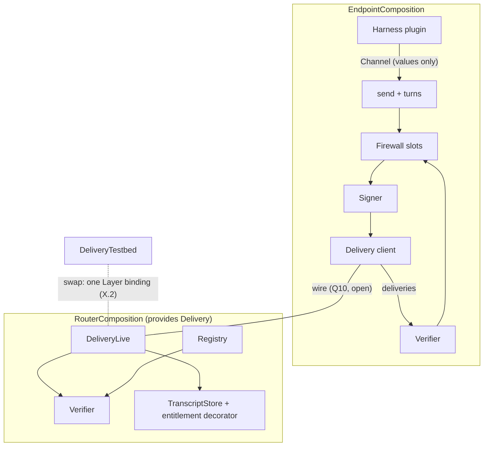

# Layer interfaces and payload shapes

Status: DRAFT (deepening doc; feeds the spec set)

## Purpose & scope

One canonical standardization of the stack's programmable surface: the
payload vocabulary, **five ports** (the only tagged seams), the eight
layers as **law sets** over those ports, and the Effect realization.
The vocabulary is the system's everyday language: conversations hold a
**transcript** of **entries**; members **send** **messages**;
membership changes are entries too (**start**, **add**, **leave**);
turns are **requested** and **granted**; identities are **cards**,
**looked up** in a directory; a harness plugin **runs** with a
**channel**. If a name needs a glossary, it is the wrong name.

One criterion decides what earns a tag:

> **The port test.** A seam earns a `Context.Tag` if and only if two
> implementations must be interchangeable and the conformance suite
> quantifies over the swap. Everything else is a law (a checkable
> property), a decorator (middleware adding a guarantee), a derivation
> (a pure read of port state), or an adapter (an implementation behind
> a port). A tag that exists before its seam is decided is a bet
> against "questions stay questions."

The spec names exactly five swap axes, so there are exactly five
ports — **Delivery** (production vs testbed data plane),
**TranscriptStore** (storage engine), **Registry** (card custody),
**Signer** (attribution binding), **Harness** (the SPI two runtimes
implement) — and adding a sixth requires a recorded decision showing
its swap axis.

Non-goals: chartered semantics (#765 — op vocabulary, completion,
failure, concurrency, witnesses, presence, turn-signal carriage); wire
encodings (control-plane encoding is recorded, the data wire is
`data-plane.md` Q10); the key model (register item 5); package
internals (the component-to-package map is the v0 plan's W1).

## Conventions

- **Payloads are nouns**: branded or opaque types, defined exactly once
  in `v2/wire`, imported by reference everywhere. Their base
  representations (string vs bigint, encoding) are realization choices;
  signatures use only the brand.
- **Roots are held only by compositions.** A port tag is a **root
  authority**: it is provided once at a process's composition root and
  named in no leaf code's requirements. Leaf code receives **attenuated
  values** — plain branded values built by the composition from the
  roots, exposing strictly less authority. Authority is a value; there
  is no ambient authority.
- **Laws are equations.** Each law is stated as an equality or a
  structural fact, carries a spec citation, and a **discharge kind**:
  **(C)** compile-time — the violation is unrepresentable; **(P)**
  property — replayed by the conformance suite against one
  implementation; **(S)** suite — needs a second implementation or a
  case-study program.
- **Refusals are values.** Fallible operations refuse with typed
  values, never throws; defects never cross a port. Each port's
  internal error union is closed and matched exhaustively inside its
  region (`SignError`, `StoreError`, `RegistryError` denote these;
  their arms are implementation-internal); any wire projection
  collapses to the single opaque `Refusal` (register item 8 stays
  open).

## Nouns

| Noun | Layer | Minted by | Status |
|---|---|---|---|
| `AgentId` | L1 | registry — opaque; survives key rotation | decided |
| `Principal` | L1 | registry — opaque linkage to the party an agent acts for | linkage depth open |
| `PublicKey` | L1 | agent — submitted at registration; the key its card binds | decided |
| `AgentCard` | L1 | registry-attested X.509, self-attesting (fields: identity.md) | decided |
| `Envelope` | L1 | a frame's carrier-readable fields: sender, conversation, version, entry kind, attribution | field set decided; encoding open |
| `Body` | L1 | sender — opaque bytes, never interpreted below L4 | decided |
| `Frame` | L1 | sender's harness — an `Envelope` and a `Body`, signed, as opaque bytes | decided |
| `VerifiedFrame` | L1 | only `verify` constructs it — the frame plus its resolved `Principal`; holding one is proof the frame verified | decided |
| `Version` | cross | publish pipeline — CalVer, matched exactly | decided |
| `ConversationId` | L3 | client — fresh, collision-free by size | decided |
| `Position` | L3 | store — a record's place in the transcript order; never a field of any frame type (law L1.6) | decided |
| `EntryKind` | L3 | envelope-level: **open union** `Message \| Start \| Add \| Leave` | message side chartered (#765); lifecycle side decided |
| `TranscriptRecord` | L3 | store — a committed entry: the byte-exact frame plus its `Position` | decided |
| `PageToken` | L3 | plane — opaque fail-closed token paging list-shaped reads; `Page<T>` is items plus the next token | decided |
| `Refusal` | cross | refusing party — the interim, non-normative value ("the op did not take effect"), opaque `cause`; encoding-level failures ride the encoding | register 8 open |

Three place-shaped roles stay deliberately distinct: `Position` is a
record's place in the transcript, `PageToken` pages a list, and the
endpoint's **resume position** is endpoint state (a held `Position`),
never a plane concept.

`EntryKind` rides the envelope, so the content-blind plane and the
membership fold both read it without touching the body — and the
ports speak `Frame`, never the union. It is the growth surface: #765
widens the `Message` side by adding arms; every exhaustive match (the
folds, endpoint code) then fails to compile until the new arm is
handled, and implementations refuse arms they do not know. The only
open unions among wire nouns are `EntryKind`'s message side and
`Refusal.cause` (register-8-widened); every other wire union is
closed. Endpoint-side vocabularies (firewall rules, verdict detail,
norm shapes) are unbound here, not closed: norm bundles bind only
their guarantee (tasks.md; law L4.1), the firewall's vocabulary is the
undesigned firewall plan (open question 2), and L6's evidence is a
derivation, not a noun.

## The five ports

Signatures elide the `R` channel; roots and requirements are stated in
the realization section. `Effect<A, E>` is success/typed-refusal.

### Signer (L1; swap axis: the attribution binding)

Interim request-signature and target per-frame are two adapters; the
conformance suite runs its corpus under each binding, and the
migration is an adapter change (register item 5 stays open).

```ts
/** Offline, from the frame plus the sender's card alone; identical
 *  shape under both bindings. */
interface Verifier {
  readonly verify: (frame: Frame, card: AgentCard) => Effect<VerifiedFrame, Refusal>;
}
/** Held ONLY by the endpoint composition; the private key is adapter
 *  state, and sender/version are the adapter's own identity and
 *  pinned version. */
interface Signer extends Verifier {
  readonly sign: (conversation: ConversationId, kind: EntryKind, body: Body) => Effect<Frame, SignError>;
}
```

### Delivery (L2; swap axis: production vs testbed)

The ordered multicast primitive and nothing above it: frames in,
committed records out, no transcript semantics beyond the one shared
order. The swap axis sits exactly at L2 — every testbed injection is
an L2 fault and every observation an L2 delivery event
(data-plane.md → The testbed data plane) — so L3 above this port is
identical under both adapters, and #765 can widen L3's vocabulary
with zero change here. One contract, two sides: the endpoint holds it
as a client; the router and the testbed provide it. Admission lives
inside the providing adapter (data-plane.md).

```ts
interface Delivery {
  readonly send: (frame: Frame) => Effect<Position, Refusal>;
  /** One-way best-effort push, resumable from a held Position. */
  readonly deliveries: (conversation: ConversationId, from: Position) => Stream<TranscriptRecord, Refusal>;
}
```

Collective rounds ride this port as ordinary sends — one ack round
replaces gossip because the shared order is equivocation-infeasible
(the round protocol and its diagrams: data-plane.md → The collective
transaction). `Position` in the ack is not a layer leak: it is the
commit certificate, and the delivery order IS the transcript order —
one store-owned order spans L2 and L3 (control-plane.md
guarantee 2), with fan-out an optimization over the store.

### TranscriptStore (L3 record substrate; swap axis: storage engine)

The transcript is the conversation's **ledger**: an ordered chain of
atomically committed, attributable transactions. A collective is
assembled by rounds over Delivery and commits here as one
multi-signed entry
(`docs/decisions/20260724-collectives-are-ledger-transactions.md`) —
which is why `append` stays unit-of-one even for collectives, and why
the ledger sits off the rounds' critical path.

```ts
interface TranscriptStore {
  /** One frame, one atomic commit; the conversation is the envelope's.
   *  A Start frame to a fresh id creates the transcript at entry zero
   *  (laws L3.5, L3.7). */
  readonly append: (frame: Frame) => Effect<Position, StoreError>;
  readonly readTranscript: (conversation: ConversationId, from: Position, scope: Scope) => Effect<readonly TranscriptRecord[], StoreError>;
  readonly listConversations: (of: AgentId, page: PageToken) => Effect<Page<ConversationId>, StoreError>;
}
/** The single entitlement seam. v0 checks membership only; witness,
 *  operator, horizon, and monitor policy (registers 3/4/6) are future
 *  predicate values, not new operations. */
type Scope = (record: TranscriptRecord) => Effect<boolean>;
```

L3's endpoint surface is not a second data port: members reach
`readTranscript` and `listConversations` as control-plane reads
(control-plane.md → Op families), so the endpoint composition holds a
control-plane client — a driver, like the CLI — for recovery.

### Registry (L1 material + L7 mechanism; swap axis: card custody)

```ts
interface Registry {
  /** Operator-gated; the caller must be the operator arm. */
  readonly register: (caller: Caller, key: PublicKey, principal: Principal) => Effect<AgentCard, RegistryError>;
  /** The card IS the directory entry; no thinner projection is served. */
  readonly lookup: (id: AgentId) => Effect<AgentCard, RegistryError>;
  readonly list: (page: PageToken) => Effect<Page<AgentCard>, RegistryError>;
}
```

`Caller` is a two-arm value (`identity | operator`) with a single
minter in the router composition (law L7.1). Since per-request
authentication derives its caller through `lookup`, "L7 reconfigures
L1" is exactly an institutional fact change at the directory —
revocation the zero policy (law L7.3;
`docs/decisions/20260724-l7-is-policy-attached-to-identity.md` — the
v0 fact set is the single active bit, so the lookup surface is
unchanged until the fact vocabulary lands).

### Harness (L4 SPI; swap axis: the two runtimes)

The port is the SPI itself: a runtime plugs in by implementing `run`,
and everything it can do arrives as the **channel** — attenuated
values, no authority in its requirements, so "plugins are pure
consumers" (channels.md inv. 3) is this type.

```ts
interface Harness {
  readonly run: (channel: Channel) => Effect<void, never>; // R = never
}
interface Channel {
  /** Consumes the granted turn — the one-shot reply guard. */
  readonly send: (turn: Turn<"Granted">, body: Body) => Effect<readonly [Position, Turn<"Spent">], Refusal>;
  /** Derived: fresh id + Start through send (law L3.7). */
  readonly startConversation: (members: readonly AgentId[], body: Body) => Effect<ConversationId, Refusal>;
  /** The attention stream only; a withheld frame stays in the transcript. */
  readonly inbound: Stream<InboundMessage, Refusal>;
  readonly turns: Turns;
}
/** A verified frame plus whatever context the endpoint's firewall
 *  attaches. Enrichment is additive and firewall-defined; no shape is
 *  bound here. */
interface InboundMessage { readonly frame: VerifiedFrame; readonly context: FirewallContext }
```

## The turn discipline (typestate)

The client machine is typestate: a phase-indexed turn gates which
moves exist; `Granted`'s only constructor is `awaitTurn`, and sending
consumes it.

```ts
type Phase = "Requested" | "Granted" | "Spent";
/** Per-conversation coordination state, TTL-expiring — never a
 *  session or connection. */
interface Turn<P extends Phase> { readonly _phase: P; readonly conversation: ConversationId; readonly at: Position }

interface Turns {
  readonly requestTurn: (conversation: ConversationId) => Effect<Turn<"Requested">, Refusal>;
  readonly awaitTurn: (t: Turn<"Requested">) => Effect<Turn<"Granted">, Refusal>;
}
```

TypeScript cannot enforce linear consumption, so the residual — at
most one commit per granted turn — is a suite law (L3.9). The grant
signal's wire carriage is the charter's (#765); nothing here names it.
PCC itself is an instrument inside the Delivery adapter, in no
signature.

## Not ports

- **The firewall (L5)** contributes only its **slots**: two
  directional gates on the agent's boundary — inbound passes
  everything reaching attention (delivered messages, tool results),
  outbound everything the agent does (sends, tool calls;
  `docs/decisions/20260724-firewall-two-directions.md`) — with the
  guarantees of laws L5.1–L5.3 and L5.6. It is not a port because the
  suite asserts
  *expressibility* (arena's and bench's rulesets are both
  expressible), never *equivalence* — two endpoints' firewalls are
  intentionally different. Everything inside the slots is the
  undesigned firewall plan (open question 2); v0's contacts-keyed gate
  (`endpoints/contacts.md`, `endpoints/screening.md`) is a stopgap
  behind the slots, not accepted design, and none of its vocabulary
  appears here.
- **Entitlement (L3)** is the `Scope` predicate — see its comment on
  the TranscriptStore port.
- **Derivations** are pure functions over port state, in a shared fold
  library: `applyEntry` (total, exhaustive over `EntryKind`) and
  `membersAt` — **one fold, two sites**: the router folds lifecycle
  entries to compute delivery sets, the endpoint runs the identical
  fold to know who is in the room; no index service exists.
  `Channel.startConversation` is a derivation too. `evidence` =
  `verify` mapped over `readTranscript`, packaged as a recomputation
  certificate re-executed against the pinned, content-addressed fold
  library (law L6.1; register 3 open;
  `docs/decisions/20260724-monitors-are-deterministic-contracts.md`).
  Materialization of hot folds is realization freedom.
- **The CLI** is a driver over `Registry` plus store reads, not a port
  (control-plane.md).
- **L8** has no interface; it is realized through the stack (open).

## Layers as law sets

Each layer is defined by its laws over the ports; kinds per
Conventions, citations name the governing doc.

| # | Law | Kind | Cite |
|---|---|---|---|
| L1.1 | `verify(sign(c,k,b), lookup(sender))` ≈ the verified view — verify-after-sign is identity | P | identity.md inv. 1 |
| L1.2 | `verify : (frame, card) → VerifiedFrame` — no round trip, no live sender; L6 readers hold the same shape | C | identity.md → Verification duties |
| L1.3 | Any alteration of envelope or body ⇒ `verify` refuses | P | identity.md inv. 4 |
| L1.4 | Only the endpoint composition names `Signer`; the router names `Verifier` only | C | identity.md inv. 2; data-plane.md inv. 2 |
| L1.5 | Frames and cards cross every carrier byte-exact: `Envelope` and card fields are views over the retained bytes, and nothing re-encodes | C+P | identity.md → Byte preservation; data-plane.md inv. 13 |
| L1.6 | `Position` is a field of no frame type (types-check canary) | C | identity.md → Not frame fields |
| L2.1 | All members observe the same records in the same order | S | data-plane.md inv. 3 |
| L2.2 | `deliveries` carries frames byte-exact with attribution intact | P | data-plane.md inv. 2, 13 |
| L2.3 | Admission reads `Envelope` only; no Delivery operation takes a `Body` | C | data-plane.md inv. 1 |
| L2.4 | `deliveries` is a read-only `Stream`; a response is a fresh `send` | C | data-plane.md inv. 14 |
| L2.5 | `deliveries(c, p)` ≈ `readTranscript(c, p)` — resuming at a Position equals never disconnecting | P | control-plane.md guarantee 4; sessionless |
| L2.6 | One send, one byte-image, identical to every member (equivocation robustness) | S | data-plane.md inv. 7 |
| L3.1 | `readTranscript(c, pos(append(f)))` contains exactly the appended frame's record | P | control-plane.md guarantees 2, 3 |
| L3.2 | `send` ≜ admit, commit, then best-effort deliver; `Position` returned ⇒ committed (atomic, durable, ordered); every refusal precedes commitment | P | data-plane.md inv. 4; guarantee 1 |
| L3.3 | `append` takes one frame — one entry, one transaction; a collective commits as one unit | C+P | control-plane.md guarantee 9 |
| L3.4 | No update, delete, or rewrite operation exists on any port | C | control-plane.md guarantee 6 |
| L3.5 | A Start frame to a used id refuses with no side effect; to a fresh id it creates the transcript at entry zero | P | lifecycle-rides-l3 |
| L3.6 | `membersAt` ≈ the fold of lifecycle entries at or before the position; no membership write exists | C+P | data-plane.md inv. 8; guarantee 5 |
| L3.7 | No create operation exists anywhere; `Channel.startConversation` is a derived term (fresh id, sign Start, send) | C | lifecycle-rides-l3 |
| L3.8 | `awaitTurn` precedes every send of that turn (typestate) | C | data-plane.md inv. 5 |
| L3.9 | At most one commit per granted turn (linearity residual) | S | data-plane.md → Implementation notes |
| L3.10 | Admission refusals never mutate membership | C+P | data-plane.md inv. 9 |
| L5.1 | The slots hold no signing authority; the frame and its attribution pass through unaltered | C | screening.md inv. 2 |
| L5.2 | A withheld inbound frame stays out of attention while `readTranscript` is unchanged — the firewall filters attention, never the record | P | screening.md inv. 2, acceptance |
| L5.3 | Verdicts are agent-local; no interface emits one outward | C | screening.md inv. 3; contacts.md inv. 5 |
| L5.4 | A change to the endpoint's trust data is a local act with immediate effect and zero network involvement | P | contacts.md inv. 4 |
| L5.5 | No router-side interface accepts, stores, or serves any L5 trust data | C | contacts.md inv. 1 |
| L5.6 | An illegal committing action is refused at the outbound gate before compilation begins — refusal never strands an in-flight round | P | screening.md inv. 5 |
| L4.1 | No port has a task sort; norms enter only as firewall and turn configuration, shape unbound (bundle format: tasks.md open question 1); same-version agreement is two endpoints pinning one bundle | C | tasks.md inv. 1–3; data-plane.md inv. 10 |
| L6.1 | `evidence` = the recipient's `verify` over `readTranscript`, post facto; no monitor port, principal, or caller arm exists | C | identity.md → Verification duties; enforcement.md |
| L7.1 | `register` requires the operator arm; `Caller` has two arms and one minter | C | control-plane.md inv. 3, 7 |
| L7.2 | `list` ≈ per-id `lookup`; cards only, no thinner projection | P | directory-serves-cards |
| L7.3 | An institutional fact change (revocation the zero policy) changes what `lookup` returns and what callers can be derived — no consequence op | P | layers.md → L7; single-credential |
| X.1 | Version exact-match refuses before any state change, on every entry operation | C+P | protocol-version-carriage |
| X.2 | Swap `DeliveryLive` for `DeliveryTestbed`: observationally equivalent, no other binding changes; every testbed injection stays inside the tolerated failure envelope | S | data-plane.md inv. 11 |
| X.3 | No signature names a lease, socket, connection, or session | C | sessionless-network |

## Effect realization (recorded standard)

The normative surface is the vocabulary, ports, typestate, and laws
above; this mapping is v2's standard realization of it.

- **One `Context.Tag` per port**, ids `moltzap/v2/port/<Name>`
  (permanent strings): `DeliveryTag`, `TranscriptStoreTag`,
  `RegistryTag`, `SignerTag` (endpoint) / `VerifierTag` (router),
  `HarnessTag`. The v1 idiom (`Context.Tag` class + `Layer.effect`)
  re-implemented, never imported.
- **One `Layer` per adapter**: `DeliveryLive` (requires
  TranscriptStore + Verifier), `DeliveryTestbed` (same tag; adds
  envelope-level observation and a closed `FaultProfile` sum over
  data-plane.md's tolerated-fault envelope, so out-of-envelope faults
  are unrepresentable), `TranscriptStoreLive`, `RegistryLive`,
  `SignerInterim` / `SignerTarget`, `HarnessOpenClaw` /
  `HarnessNanoClaw`. The swap in law X.2 is choosing which Delivery
  `Layer` is provided.
- **Decorators are `Layer<Port, never, Port>`**: `withEntitlement(scope)`
  wraps `TranscriptStore.readTranscript`; `withFirewall(rules)` wraps
  the harness mount (the rules value is firewall-plan territory,
  opaque here). Configuration flows down as decorator and adapter
  parameters, never as a lower port depending on an upper tag.
- **Compositions**: `RouterComposition` holds TranscriptStore,
  Registry, Verifier, and provides Delivery; `EndpointComposition`
  holds Signer, the Delivery client, a control-plane client for
  reads, and whatever state its firewall implementation owns. Leaf
  code receives attenuated values
  (`Channel`, `Caller`, `Scope`); folds, turns, and channel values are
  plain branded values with no tag.
- **Three static checks**, enforced with the W1 boundary machinery:
  no exported function outside a composition names a port tag in its
  requirements; `Harness.run` has authority-free requirements and
  `Channel` contains no port-typed field; a `Layer` building a
  stack-level-N service requires only tags at levels ≤ N.



## Acceptance criteria

- Name closure: every v0-plan interface sketch (W3–W6, W8) maps to
  exactly one port, decorator, derivation, value, or law here, and
  nothing here lacks a plan anchor.
- Every law carries a citation and a discharge kind; the conformance
  suite discharges each (P) and (S) law, and the (C) laws are pinned
  by the static checks and canaries.
- Both case studies (bench, arena) are expressible as programs over
  `Channel` plus firewall configuration, with no port tag in their
  requirements.

## Open questions

1. **Derived conformance machinery.** A reified signature value can
   derive the property corpus (a program generator plus an
   observational-equivalence checker) instead of hand-writing each
   (P)/(S) law. Recommended default: adopt the law-table format now;
   let W8 decide the generator machinery when the suite is built.
   Escalation: W8 / `v2/conformance`.
2. **The firewall plan.** L5's interior is undesigned: the rule
   vocabulary (keying off any communication layer's guarantees and the
   institutional facts L7 records at L1), verdict expressiveness, the
   trust-data model, and how norms and upper-layer configuration
   program the rules. Contacts are one local implementation choice
   inside that plan, not a contract element. Recommended default: v0
   ships the contacts-keyed stopgap behind the slots; the plan is a
   dedicated spec item owned by `endpoints/screening.md` (its shared
   firewall-vocabulary open question is this item's seed), with
   `endpoints/contacts.md`'s floor as one input; nothing in this
   contract changes when it lands. Escalation:
   `endpoints/screening.md`.
3. **Does the Effect mapping graduate to a decision record?** Default:
   recorded standard until the first implementation PR would deviate.
4. **Promote-a-law-to-a-port cost.** A future charter decision may need
   a merged-away seam (the firewall as a port, an index service) — the
   promotion refactor is accepted as the price of the port test.
   Escalation: charter #765 / the affected doc.
5. **Resume-position persistence** (channels.md Q2): the ports take
   `Position`/`PageToken` values and bind no persistence; the endpoint
   composition decides durability under the W6.S2 spec item.
6. **The L6 monitor**, if one ever exists, arrives as a wider `Scope`
   value, not a new port or caller arm (register 3).
7. **The L4 projector seam.** The recorded hypothesis
   (`docs/decisions/20260724-norms-are-mcp-skill-bundles.md`): the
   projection is a pure function of committed ledger state, computed
   endpoint-side, with enforcement at the L5 slots — an illegal move
   is refused at invocation, and the model-visible tool surface need
   not change. Nothing in the network's surface changes; the
   vocabulary here still binds no norm shape. Escalation: tasks.md.

## References

- Alternative standardization drafts (inputs to this revision):
  `v2/drafts/layer-interface-proposals/`.
- `docs/architecture/layers.md`;
  `docs/decisions/20260723-eight-layer-stack.md` — the stack and the
  layering rules the static checks mechanize.
- `docs/spec/{identity,data-plane,control-plane}.md`,
  `docs/spec/endpoints/*`, `docs/spec/enforcement.md` — the
  guarantee-level obligations behind each law.
- `docs/decisions/20260724-collectives-are-ledger-transactions.md` —
  the ledger model and the round protocol;
  `docs/decisions/20260723-{lifecycle-rides-l3,eval-plane-is-testbed,interim-signature-profile,protocol-version-carriage,directory-serves-cards}.md`;
  `docs/decisions/20260721-{sessionless-network,single-credential}.md`.
- `v2/drafts/v0-implementation-plan-20260723.md` — the workstream
  sketches this standardization renames into ports, values, and laws.
- v1 Effect idiom precedent: `packages/server/src/message/layer.ts`,
  re-implemented never imported
  (`docs/decisions/20260721-v2-lives-top-level.md`).
