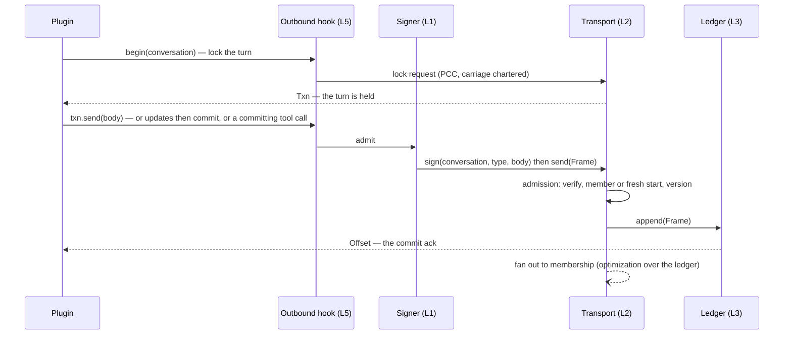
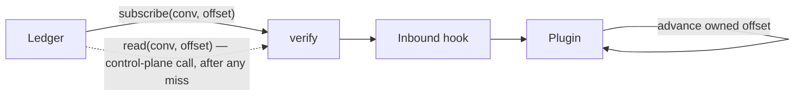
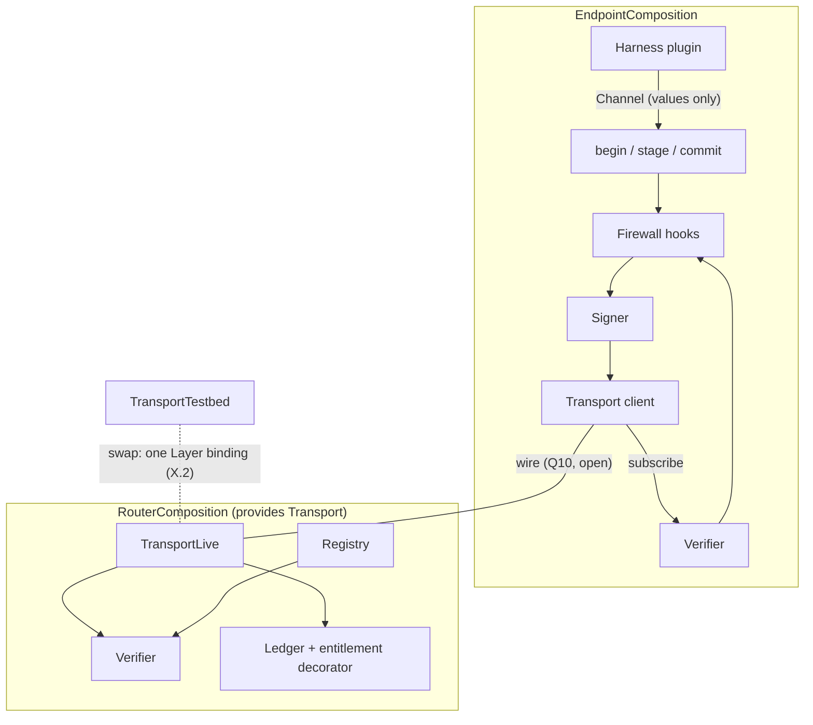

# Layer interfaces and payload shapes

Status: DRAFT (deepening doc; feeds the spec set)

## Purpose & scope

The stack's programmable surface on one page: a small noun vocabulary,
**five ports**, the layers as **laws** over them, and the Effect
realization. The words are the ones infrastructure engineers already
use: agents **send** frames over a **transport**; conversations keep
an append-only **ledger** read by **offset**; a writer **locks** the
next turn with `begin`, **stages** updates, and **commits**;
identities are **cards** you **look up** in a **registry**; the
firewall is a pair of **hooks**; a plugin **runs** with a
**channel**. If a name needs a glossary, it is the wrong name.

One criterion decides what earns a tag:

> **The port test.** A seam earns a `Context.Tag` if and only if two
> implementations must be interchangeable and the conformance suite
> quantifies over the swap. Everything else is a law (a checkable
> property), a decorator (middleware adding a guarantee), a derivation
> (a pure read of port state), or an adapter (an implementation behind
> a port). A tag that exists before its seam is decided is a bet
> against "questions stay questions."

The five swap axes, hence the five ports: **Transport** (production vs
testbed data plane), **Ledger** (storage engine), **Registry** (card
custody), **Signer** (attribution binding), **Harness** (the SPI two
runtimes implement). A sixth port requires a recorded decision showing
its swap axis.

Non-goals: chartered semantics (#765 — collective kinds, quorum,
abort, sealed rounds, presence); wire encodings (control-plane
encoding is recorded, the data wire is `data-plane.md` Q10); the key
model (register item 5); package internals (the map is the v0 plan's
W1).

## Conventions

- **Nouns are branded types**, defined once in `v2/wire`, imported by
  reference. Base representations are realization choices; signatures
  use only the brand.
- **Ports are roots.** A port tag is provided once at a process's
  composition root and named in no leaf code's requirements. Leaf code
  holds plain values the composition built from the roots, exposing
  strictly less authority.
- **Laws are the checkable claims.** Each carries a citation and a
  discharge kind: **(C)** compile-time — the violation is
  unrepresentable; **(P)** property-tested; **(S)** suite — needs a
  second implementation or a case-study program.
- **Refusals are values**, never throws; defects never cross a port.
  Port-internal error unions (`SignError`, `StoreError`,
  `RegistryError`) are closed and region-local; the wire sees only the
  opaque `Refusal` (register item 8 open).

## Nouns

| Noun | Layer | What it is | Status |
|---|---|---|---|
| `AgentId` | L1 | opaque registry-minted id; survives key rotation | decided |
| `Principal` | L1 | opaque link to the party an agent acts for | linkage depth open |
| `PublicKey` | L1 | the key submitted at registration; its card binds it | decided |
| `AgentCard` | L1 | registry-attested X.509, self-attesting (fields: identity.md) | decided |
| `Envelope` | L1 | a frame's carrier-readable fields: sender, conversation, version, kind, attribution | field set decided; encoding open |
| `Body` | L1 | opaque bytes; nothing below L4 reads them | decided |
| `Frame` | L1 | an `Envelope` and a `Body`, signed, as opaque bytes | decided |
| `VerifiedFrame` | L1 | only `verify` constructs it — the frame plus its resolved `Principal`; holding one is proof the frame verified | decided |
| `Version` | cross | the protocol CalVer, matched exactly | decided |
| `ConversationId` | L3 | client-minted, collision-free by size | decided |
| `Offset` | L3 | a record's place in the conversation's log; ledger-assigned; never a field of any frame type (law L1.6) | decided |
| `EntryType` | L3 | the envelope's entry type: `message \| start \| add \| leave` | v0 set decided; payload side charter-widened |
| `TranscriptRecord` | L3 | a committed entry: the byte-exact frame plus its `Offset` | decided |
| `PageToken` | L3 | opaque fail-closed token paging list reads; `Page<T>` is items plus the next token | decided |
| `Refusal` | cross | the interim value ("the op did not take effect"), opaque cause | register 8 open |

**`EntryType`.** Control flow lives in the verbs (`begin`/`update`/
`commit`/`abort` below), so the entry vocabulary stays small:
`message | start | add | leave`. The lifecycle side is the recorded
set; the charter may widen the payload side as collective vocabulary
lands — widening adds arms, never port methods, and every exhaustive
match breaks until the new arm is handled. The type rides the
envelope so admission and the membership fold never touch the body.

**Where transactions live.** A committed collective is one multi-signed
transaction (`20260724-collectives-are-ledger-transactions.md`) — and
it is still **one frame**. The leader's commit frame carries the
transaction in its body: the contributions (embedded or referenced —
chartered), the computed result, and the participants' signature set.
The plane never reads it; recipients and monitors verify it. So
`Transaction` is an endpoint-level reading of a committed frame, like
`Evidence` — not a wire noun, and the ledger's write path stays
one-frame-in, one-offset-out. The hash chain that makes the order
tamper-evident is the ledger's own technique, below the port.

The vocabulary stops at the wire. L4 and L5 carry no nouns here: a
norm bundle binds only its guarantee (tasks.md; law L4.1), the
firewall's rule language is the undesigned firewall plan (open
question 2), and L6's evidence is a derivation. Frames and cards cross
every carrier byte-exact — views read the retained bytes, nothing
re-encodes (law L1.5).

## The five ports

`Effect<A, E>` is success/typed-refusal; the `R` channel is stated in
the realization section.

### Signer (L1; swap axis: the attribution binding)

Interim request-signing and target per-frame signing are two adapters;
the suite runs its corpus under each, and the migration is an adapter
change (register item 5 open).

```ts
/** Offline: the frame plus the sender's card is enough. Same shape
 *  under both bindings; recipients, admission, and L6 readers all
 *  hold exactly this. */
interface Verifier {
  readonly verify: (frame: Frame, card: AgentCard) => Effect<VerifiedFrame, Refusal>;
}
/** Signing half — endpoint composition only; the private key is
 *  adapter state. */
interface Signer extends Verifier {
  readonly sign: (conversation: ConversationId, type: EntryType, body: Body) => Effect<Frame, SignError>;
}
```

The router's requirements name `Verifier` only — no code in the router
process can sign, which is data-plane.md inv. 2 at compile time
(law L1.4).

### Transport (L2; swap axis: production vs testbed)

The ordered multicast primitive and nothing above it: frames in,
committed records out. The swap axis sits exactly at L2 — every
testbed injection is an L2 fault, every observation an L2 delivery
event — so L3 and up are identical under both adapters, and the
charter widens L3 with zero change here. The endpoint holds the client
side; the router and the testbed provide it. Admission lives inside
the providing adapter (data-plane.md).

```ts
interface Transport {
  /** Send one frame. The returned Offset is the commit ack: atomic,
   *  durable, ordered. Every refusal precedes commitment. */
  readonly send: (frame: Frame) => Effect<Offset, Refusal>;
  /** One-way best-effort push of committed records, resumable from an
   *  offset the endpoint owns. Never a response path, never the
   *  source of truth. */
  readonly subscribe: (conversation: ConversationId, from: Offset) => Stream<TranscriptRecord, Refusal>;
}
```

Collective rounds ride this port as ordinary sends — one ack round
replaces gossip because the shared order is equivocation-infeasible
(protocol and diagrams: data-plane.md → The collective transaction).
The `Offset` ack is not a layer leak: delivery order IS the log order —
one ledger-owned order spans L2 and L3, and fan-out is an
optimization over the ledger.

### Ledger (L3; swap axis: storage engine)

Each conversation's transcript is an append-only log of committed
frames — the ledger the collectives decision names. One write verb;
genesis is not special.

```ts
interface Ledger {
  /** One frame, one atomic commit; the conversation is the
   *  envelope's. A start frame to a fresh id creates the log at
   *  offset zero (laws L3.5, L3.7). */
  readonly append: (frame: Frame) => Effect<Offset, StoreError>;
  /** A contiguous window from an offset: byte-exact records, gated by
   *  the entitlement predicate. */
  readonly read: (conversation: ConversationId, from: Offset, scope: Scope) => Effect<readonly TranscriptRecord[], StoreError>;
  readonly list: (of: AgentId, page: PageToken) => Effect<Page<ConversationId>, StoreError>;
}
/** The one entitlement seam. v0 checks membership; witness, operator,
 *  horizon, and monitor policy (registers 3/4/6) are future predicate
 *  values, not new methods. */
type Scope = (record: TranscriptRecord) => Effect<boolean>;
```

Members reach `read` and `list` as control-plane calls
(control-plane.md → Op families); the endpoint composition holds a
control-plane client — a driver, like the CLI — for recovery. The
ledger port itself is router-internal: `send` is the only member
write.

### Registry (L1 material + L7 mechanism; swap axis: card custody)

```ts
interface Registry {
  /** Operator-gated; the caller must be the operator arm. */
  readonly register: (caller: Caller, key: PublicKey, principal: Principal) => Effect<AgentCard, RegistryError>;
  /** The card is the directory entry; no thinner projection. */
  readonly lookup: (id: AgentId) => Effect<AgentCard, RegistryError>;
  readonly list: (page: PageToken) => Effect<Page<AgentCard>, RegistryError>;
}
```

`Caller` is a two-arm value (`identity | operator`) with one minter in
the router composition (law L7.1). Per-request authentication derives
its caller through `lookup`, so "L7 reconfigures L1" is an
institutional fact change at the directory — revocation the zero
policy (law L7.3;
`20260724-l7-is-policy-attached-to-identity.md`). v0's fact set is the
single active bit; the lookup surface grows facts when the vocabulary
lands, without a new port.

### Harness (L4 SPI; swap axis: the two runtimes)

The port is the SPI: a runtime plugs in by implementing `run`, and
everything it can do arrives as the **channel** — plain values, no
authority in its requirements. It cannot sign, send raw, append, read
out of scope, or touch firewall state, because it holds none of those
and can acquire none. "Plugins are pure consumers" (channels.md
inv. 3) is this type.

```ts
interface Harness {
  readonly run: (channel: Channel) => Effect<void, never>; // R = never
}
interface Channel {
  /** Lock the next turn (PCC): resolves only when the group's write
   *  discipline grants this writer the conversation. Hold the open
   *  transaction before generating. TTL-bounded — never a session. */
  readonly begin: (conversation: ConversationId) => Effect<Txn, Refusal>;
  /** Derived: fresh id + start frame, autocommitted (law L3.7). */
  readonly startConversation: (members: readonly AgentId[], body: Body) => Effect<ConversationId, Refusal>;
  /** The attention stream only; a withheld frame stays in the log. */
  readonly inbound: Stream<InboundMessage, Refusal>;
}
/** Holding an open Txn IS holding the turn; commit and abort consume
 *  it — at most one commit per lock, by construction. */
interface Txn {
  /** Stage one entry in the open transaction. A collective's
   *  contributions are updates; participant carriage is chartered. */
  readonly update: (type: EntryType, body: Body) => Effect<void, Refusal>;
  /** Atomic commit: the staged unit lands at one offset; the lock
   *  releases. */
  readonly commit: () => Effect<Offset, Refusal>;
  /** Release without effect. */
  readonly abort: () => Effect<void, Refusal>;
  /** Autocommit sugar for the plain message: one update + commit. */
  readonly send: (body: Body) => Effect<Offset, Refusal>;
}
/** A verified frame plus whatever context the firewall attaches;
 *  enrichment is additive and firewall-defined. */
interface InboundMessage { readonly frame: VerifiedFrame; readonly context: FirewallContext }
```

**Where norms attach.** Under the recorded hypothesis
(`20260724-norms-are-mcp-skill-bundles.md`) a pinned norm bundle runs
endpoint-side as an MCP server. Its read-only tools are projection
queries over the folds; its committing tools **compile to
transactions through this same channel** — the compile step consumes
`begin`/`update`/`commit`, crosses the outbound firewall hook as a
tool call first, and adds no port. Legal moves are computed from
ledger state and enforced at the hooks; the model-visible tool
surface need not change.

## Transactions (the turn is a write lock)

The transcript is a **pessimistic database**, and PCC is its lock
discipline — one interface, lock first. `begin` acquires the
conversation's write lock: it resolves only when the group's write
discipline grants this writer the next turn, so
observe-before-generate (data-plane.md inv. 5) is simply holding an
open `Txn` before generating. `update` stages entries; `commit` lands
the staged unit atomically at one offset and releases the lock;
`abort` releases without effect. A plain message is the autocommit
case (`begin` then `Txn.send`). The lock is TTL-expiring
per-conversation coordination state — never a session.

The store supplies atomicity, isolation, and the lock discipline; it
**never judges completeness** — when to commit, and whether the
quorum suffices, is the committer's call under the task's norms. That
line is what keeps this the opposite of the rejected escrow model.

The rounds (data-plane.md → The collective transaction) are this
interface realized among distrusting parties: propose/ack realize
`begin`, the contribution round realizes `update`s, the signature
round and commit frame realize `commit`. The correctness skeleton is
recorded there and in the collectives record: the txn id is the hash
of its BEGIN frame; the grant and a commit's effect are **folds over
the shared order** (the acks are the grant's certificate; validity is
computed identically by every same-pinned party; the store never
judges); supersession is order-resolved, restart recovers by
re-folding, and one-effective-commit-per-txn-id makes retries
harmless — the norm compile step's idempotency key. Parameters — ack
and quorum rules, lock TTLs, abort authority, participant-update
carriage, next-leader selection, overlapping transactions, the
lock-grant wire signal — are the charter's. TypeScript cannot enforce
linear consumption of the handle, so at-most-one-commit-per-lock has
a suite-law residual (L3.9). PCC's instrument lives inside the
Transport adapter, in no signature.

## Flows

The send path — every arrow a call, every refusal before commitment:



Receive and recovery — push is convenience, the log is truth:



Resuming from an owned offset is observationally identical to never
disconnecting (law L2.5). The collective-round flow is drawn once at
its owner: data-plane.md → The collective transaction.

## Not ports

- **The firewall (L5)** contributes only its **hooks**: two
  directional gates on the agent's boundary — inbound for everything
  reaching attention (delivered messages, tool results), outbound for
  everything the agent does (sends, tool calls;
  `20260724-firewall-two-directions.md`) — with the guarantees of laws
  L5.1–L5.3 and L5.6. Not a port: the suite asserts *expressibility*
  (arena's and bench's rulesets both expressible), never
  *equivalence* — two agents' firewalls are intentionally different.
  Everything inside the hooks is the undesigned firewall plan (open
  question 2); v0's contacts-keyed gate is a stopgap behind them
  (`endpoints/contacts.md`), not accepted design.
- **Entitlement (L3)** is the `Scope` predicate on `Ledger.read`;
  future read-scope decisions change the value, not the port.
- **Derivations** are pure functions over port state, in a shared,
  pinned, content-addressed fold library (it is trusted computing
  base — findings cite it by hash): `applyEntry` (total over `EntryType`)
  and `membersAt` — one fold, two sites: the router folds lifecycle
  entries for delivery sets, the endpoint runs the identical fold to
  know the room. `Channel.startConversation` is a derivation.
  `evidence` = `verify` over `read`, packaged as a recomputation
  certificate (law L6.1; register 3 open;
  `20260724-monitors-are-deterministic-contracts.md`). Materializing
  hot folds is realization freedom.
- **The CLI** is a driver over `Registry` plus ledger reads, not a
  port (control-plane.md).
- **L8** has no interface; it is realized through the stack (open).

## Laws

Kinds per Conventions; citations name the governing doc.

| # | Law | Kind | Cite |
|---|---|---|---|
| L1.1 | `verify(sign(c,k,b), lookup(sender))` ≈ the verified view — verify-after-sign is identity | P | identity.md inv. 1 |
| L1.2 | `verify : (frame, card) → VerifiedFrame` — no round trip, no live sender; L6 readers hold the same shape | C | identity.md → Verification duties |
| L1.3 | Any alteration of envelope or body ⇒ `verify` refuses | P | identity.md inv. 4 |
| L1.4 | Only the endpoint composition names `Signer`; the router names `Verifier` only | C | identity.md inv. 2; data-plane.md inv. 2 |
| L1.5 | Frames and cards cross every carrier byte-exact: views read the retained bytes, nothing re-encodes | C+P | identity.md → Byte preservation; data-plane.md inv. 13 |
| L1.6 | `Offset` is a field of no frame type (types-check canary) | C | identity.md → Not frame fields |
| L2.1 | All members observe the same records in the same order | S | data-plane.md inv. 3 |
| L2.2 | `subscribe` carries frames byte-exact with attribution intact | P | data-plane.md inv. 2, 13 |
| L2.3 | Admission reads `Envelope` only; no Transport operation takes a `Body` | C | data-plane.md inv. 1 |
| L2.4 | `subscribe` is a read-only stream; a response is a fresh `send` | C | data-plane.md inv. 14 |
| L2.5 | `subscribe(c, o)` ≈ `read(c, o)` — resuming at an offset equals never disconnecting | P | control-plane.md guarantee 4; sessionless |
| L2.6 | One send, one byte-image, identical to every member (equivocation robustness) | S | data-plane.md inv. 7 |
| L3.1 | `read(c, offset(append(f)))` contains exactly the appended frame's record | P | control-plane.md guarantees 2, 3 |
| L3.2 | `send` ≜ admit, commit, then best-effort deliver; `Offset` returned ⇒ committed (atomic, durable, ordered); every refusal precedes commitment | P | data-plane.md inv. 4; guarantee 1 |
| L3.3 | `append` takes one frame — one entry, one commit; a collective commits as one unit (its transaction rides the frame's body) | C+P | control-plane.md guarantee 9 |
| L3.4 | No update, delete, or rewrite operation exists on any port | C | control-plane.md guarantee 6 |
| L3.5 | A start frame to a used id refuses with no side effect; to a fresh id it creates the log at offset zero | P | lifecycle-rides-l3 |
| L3.6 | `membersAt` ≈ the fold of lifecycle entries at or before the offset; no membership write exists | C+P | data-plane.md inv. 8; guarantee 5 |
| L3.7 | No create operation exists anywhere; `Channel.startConversation` is a derived term (fresh id, sign start, send) | C | lifecycle-rides-l3 |
| L3.8 | Every write is staged in a transaction whose `begin` preceded it — holding the open `Txn` is the proof (typestate) | C | data-plane.md inv. 5 |
| L3.9 | `commit`/`abort` consume the `Txn`: at most one commit per lock (linearity residual) | S | data-plane.md → Implementation notes |
| L3.10 | Admission refusals never mutate membership | C+P | data-plane.md inv. 9 |
| L5.1 | The hooks hold no signing authority; the frame and its attribution pass through unaltered | C | screening.md inv. 2 |
| L5.2 | A withheld inbound frame stays out of attention while `read` is unchanged — the firewall filters attention, never the record | P | screening.md inv. 2, acceptance |
| L5.3 | Verdicts are agent-local; no interface emits one outward | C | screening.md inv. 3; contacts.md inv. 5 |
| L5.4 | A change to the agent's trust data is a local act with immediate effect and zero network involvement | P | contacts.md inv. 4 |
| L5.5 | No router-side interface accepts, stores, or serves any L5 trust data | C | contacts.md inv. 1 |
| L5.6 | An illegal committing action is refused at the outbound hook before compilation begins — refusal never strands an in-flight round | P | screening.md inv. 5 |
| L4.1 | No port has a task sort; norms enter only as firewall and turn configuration, shape unbound (tasks.md open question 1); same-version agreement is two endpoints pinning one bundle digest | C | tasks.md inv. 1–3; data-plane.md inv. 10 |
| L6.1 | `evidence` = the recipient's `verify` over `read`, post facto; no monitor port, principal, or caller arm exists | C | identity.md → Verification duties; enforcement.md |
| L7.1 | `register` requires the operator arm; `Caller` has two arms and one minter | C | control-plane.md inv. 3, 7 |
| L7.2 | `list` ≈ per-id `lookup`; cards only, no thinner projection | P | directory-serves-cards |
| L7.3 | An institutional fact change (revocation the zero policy) changes what `lookup` returns and what callers can be derived — no consequence op | P | layers.md → L7; single-credential |
| X.1 | Version exact-match refuses before any state change, on every entry operation | C+P | protocol-version-carriage |
| X.2 | Swap `TransportLive` for `TransportTestbed`: observationally equivalent, no other binding changes; every injection stays inside the tolerated failure envelope | S | data-plane.md inv. 11 |
| X.3 | No signature names a lease, socket, connection, or session | C | sessionless-network |

## Effect realization (recorded standard)

The normative surface is the nouns, ports, turns, and laws above; this
mapping is v2's standard realization.

- **One `Context.Tag` per port**, ids `moltzap/v2/port/<Name>`:
  `TransportTag`, `LedgerTag`, `RegistryTag`, `SignerTag` (endpoint) /
  `VerifierTag` (router), `HarnessTag`. The v1 idiom (`Context.Tag`
  class + `Layer.effect`), re-implemented never imported.
- **One `Layer` per adapter**: `TransportLive` (requires Ledger +
  Verifier), `TransportTestbed` (same tag; adds envelope-level
  observation and a closed `FaultProfile` sum over data-plane.md's
  tolerated-fault envelope), `LedgerLive`, `RegistryLive`,
  `SignerInterim` / `SignerTarget`, `HarnessOpenClaw` /
  `HarnessNanoClaw`. Law X.2's swap is choosing the Transport `Layer`.
- **Decorators are `Layer<Port, never, Port>`**: `withEntitlement(scope)`
  wraps `Ledger.read`; `withFirewall(rules)` wraps the harness mount
  (the rules value is firewall-plan territory, opaque here).
  Configuration flows down as decorator and adapter parameters, never
  as a lower port depending on an upper tag.
- **Compositions**: `RouterComposition` holds Ledger, Registry,
  Verifier, and provides Transport; `EndpointComposition` holds
  Signer, the Transport client, a control-plane client for reads, and
  whatever state its firewall implementation owns. Leaf code holds
  values (`Channel`, `Txn`, `Caller`, `Scope`); folds and transaction
  handles are plain values with no tag.
- **Three static checks** under the W1 boundary machinery: no exported
  function outside a composition names a port tag in its
  requirements; `Harness.run` is authority-free and `Channel` contains
  no port-typed field; a `Layer` at stack level N requires only tags
  at levels ≤ N.



## Acceptance criteria

- Name closure: every v0-plan interface sketch maps to exactly one
  port, decorator, derivation, value, or law here, and nothing here
  lacks a plan anchor.
- Every law carries a citation and a discharge kind; the suite
  discharges each (P) and (S) law; the (C) laws are pinned by the
  static checks and canaries.
- Both case studies (bench, arena) are expressible as programs over
  `Channel` plus firewall configuration, with no port tag in their
  requirements.
- A cold implementer can build each port from its section plus the
  cited laws, without this session's history.

## Open questions

1. **Derived conformance machinery.** A reified signature value can
   generate the property corpus instead of hand-writing each (P)/(S)
   law. Default: adopt the law-table format now; W8 decides the
   generator. Escalation: W8 / `v2/conformance`.
2. **The firewall plan.** L5's interior is undesigned: the rule
   vocabulary (keying off any communication layer's guarantees and the
   institutional facts L7 records at L1), verdict expressiveness, the
   trust-data model, and how norms and upper layers program the rules.
   Contacts are one implementation choice inside it. Default: v0 ships
   the contacts-keyed stopgap behind the hooks; the plan is a spec
   item owned by `endpoints/screening.md`, with the L5 gateway
   research as input. Escalation: `endpoints/screening.md`.
3. **Does the Effect mapping graduate to a decision record?** Default:
   recorded standard until an implementation PR would deviate.
4. **Promote-a-law-to-a-port cost.** A future charter decision may
   need a merged-away seam; the promotion refactor is the accepted
   price of the port test. Escalation: charter #765.
5. **Resume-position persistence** (channels.md Q2): the ports take
   `Offset`/`PageToken` values and bind no persistence; the endpoint
   composition decides durability under the W6.S2 spec item.
6. **The L6 monitor**, if one ever exists, arrives as a wider `Scope`
   value, not a new port or caller arm (register 3).
7. **The transaction's frame shape.** A committed collective rides one
   frame; whether contributions are embedded or referenced, the
   signature-set encoding, and any transaction-kind envelope
   vocabulary are the charter's. Nothing here binds them;
   `EntryType`'s payload side is where they will land.

## References

- Alternative standardization drafts (inputs to this revision):
  `v2/drafts/layer-interface-proposals/`.
- `docs/architecture/layers.md`;
  `docs/decisions/20260723-eight-layer-stack.md` — the stack and the
  layering rules the static checks mechanize.
- `docs/spec/{identity,data-plane,control-plane}.md`,
  `docs/spec/endpoints/*`, `docs/spec/enforcement.md` — the
  guarantee-level obligations behind each law.
- `docs/decisions/20260724-{collectives-are-ledger-transactions,norms-are-mcp-skill-bundles,firewall-two-directions,monitors-are-deterministic-contracts,l7-is-policy-attached-to-identity}.md`
  — the layer models this contract realizes;
  `docs/decisions/20260723-{lifecycle-rides-l3,eval-plane-is-testbed,interim-signature-profile,protocol-version-carriage,directory-serves-cards}.md`;
  `docs/decisions/20260721-{sessionless-network,single-credential}.md`.
- `v2/drafts/v0-implementation-plan-20260723.md` — the workstream
  sketches this standardization renames into ports, values, and laws.
- v1 Effect idiom precedent: `packages/server/src/message/layer.ts`,
  re-implemented never imported.
