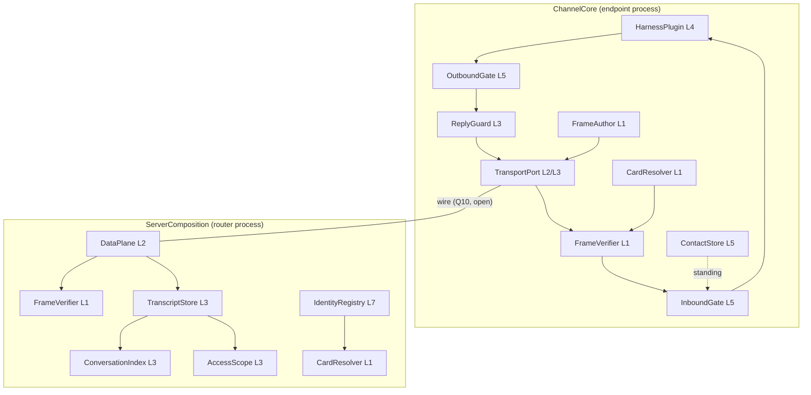

# Layer interfaces and payload shapes

Status: DRAFT (deepening doc; feeds the spec set)

## Purpose & scope

One canonical name for every payload that crosses a layer boundary and
every service a layer provides, standardized across the eight-layer
stack (`docs/architecture/layers.md`), plus the recorded Effect
realization: each service is an Effect `Context.Tag`, each realization
an Effect `Layer`, and the stack's layering rules become mechanical
properties of the Layer dependency graph. The service names are the v0
plan's interface sketches (`v2/drafts/v0-implementation-plan-20260723.md`),
gathered here by layer so the plan's workstreams and the spec docs stop
naming the same thing twice.

Two vocabularies collide on the word *layer*; this doc keeps them
apart. A **stack layer** (L1–L8) is a set of guarantees. An **Effect
`Layer`** is a constructor for a service in a process's composition.
One stack layer projects into several services across several
processes; no process implements a stack layer whole.

Non-goals: chartered semantics (#765 — op vocabulary, completion,
failure, concurrency, witnesses); wire encodings (control-plane
encoding is recorded, the data wire is `data-plane.md` Q10); the key
model (register item 5); package internals.

## Conventions

- **Payloads are nouns**: branded or opaque types, defined exactly
  once, in one home package, imported by reference everywhere else.
- **Services are per party.** The stack spans distributed parties, so
  each stack layer projects into services per process region — router,
  endpoint — listed separately below.
- **Signatures are guarantee-level.** A method appears here only if
  some spec doc obligates it; mechanisms (leases, sockets,
  connections) never appear in a signature.
- **Refusals are values.** Every fallible operation refuses with a
  typed value in the error channel, never a throw or defect; wire
  projection of refusals stays open (register item 8).

## Payload vocabulary

The nouns, each with its owning stack layer, who mints it, and its
home package (per the v0 plan's W1 component-to-package map).

| Payload | Layer | Minted by | Home | Status |
|---|---|---|---|---|
| `AgentId` | L1 | registry — opaque branded string; survives key rotation | `v2/wire` | decided |
| `PrincipalRef` | L1 | registry — opaque linkage | `v2/wire` | linkage depth open |
| `Card` | L1 | registry-attested; X.509 container | `v2/identity` | decided |
| `EncodedFrame` | L1 | sender's harness — the attributed unit as opaque bytes, byte-exact at every hop | `v2/wire` | decided |
| `Envelope` | L1 | parsed view of a frame's carrier-readable fields: sender `AgentId`, `ConversationId`, `ProtocolVersion`, attribution | `v2/wire` | field set decided; encoding open |
| `Body` | L1 | sender — opaque bytes, never interpreted below L4 | — | decided |
| `ProtocolVersion` | cross | publish pipeline — the protocol package's CalVer | `v2/wire` (sourced from `v2/protocol`) | decided |
| `ConversationId` | L3 | client — fresh, collision-free by size | `v2/wire` | decided |
| `Position` | L3 | store — branded, store-assigned; never inside the attributed unit | `v2/wire` | decided |
| `TranscriptRecord` | L3 | store — byte-exact `EncodedFrame` plus its `Position` | `v2/wire` | decided |
| `LifecycleEntry` | L3 | member — in-band entry types; v0: START, member-add, leave | `v2/wire` | types decided; semantics chartered |
| `CollectiveUnit` | L3 | members — one transactional transcript unit; v0: MULTICAST only | `v2/wire` | chartered |
| `Cursor` | L3 | plane — opaque fail-closed paging token for list-shaped reads | `v2/wire` | decided |
| `RecoveryCursor` | L3 | endpoint — the endpoint-owned resume position; never plane state | `v2/channel` | persistence obligations: channels.md Q2 |
| `Refusal` | cross | refusing party — one interim value: "the op did not take effect" | `v2/wire` | register item 8 open |
| `NormBundle` | L4 | marketplace — versioned skill bundle, pinned per binding | endpoint-owned | decided at guarantee level |
| `Standing` | L5 | endpoint — a contact's posture: allow / deny / limit | `v2/channel` | decided |
| `GateVerdict` | L5 | endpoint gate — admit / admit-under-limits / refuse; agent-local | `v2/channel` | decided |
| `Evidence` | L6 | derived, never minted: `TranscriptRecord`s re-verified under L1 | — | monitor access open (register item 3) |

Three position-shaped nouns are deliberately distinct: `Position` is
the store's order, `Cursor` pages a read, `RecoveryCursor` is the
endpoint's own resume state (it holds a `Position`; it is not one).

## Per-layer interfaces

Each table lists the layer's services by party. Signatures elide
`Effect` wrappers; the mapping section supplies them.

### L1 — identity

| Service | Party | Interface |
|---|---|---|
| `FrameAuthor` | endpoint | `attribute(envelope fields, body) → EncodedFrame` — frames leave the harness already attributable |
| `FrameVerifier` | endpoint, router | `verify(EncodedFrame) → Attributed<Envelope> \| Refusal` — identical interface under the interim and target bindings (identity.md → One shape, two attribution bindings) |
| `CardResolver` | endpoint, router | `resolve(AgentId) → Card \| Refusal` — issued-at cache, single refetch on verification failure |

Configured from above: L7's consequences arrive here — what
`CardResolver` can resolve, and whether the registry still vouches,
is L7 reconfiguring L1 (`docs/decisions/20260723-directory-serves-cards.md`).

### L2 — ordered multicast delivery

| Service | Party | Interface |
|---|---|---|
| `DataPlane` | router | `ship(EncodedFrame) → Ack \| Refusal` — ack only after durability; every refusal before durability. Fan-out to recipients is the plane's duty behind this seam, an optimization over the store, one-way, never a response path |
| `TransportPort` (delivery half) | endpoint | `ship(EncodedFrame) → Ack \| Refusal`; `deliveries → stream of TranscriptRecord` — one-way; plane refusals pass through as opaque typed values |

`DataPlane` is the seam with two implementations — production and
testbed (`docs/decisions/20260723-eval-plane-is-testbed.md`) — and is
the interface data-plane.md invariant 11 quantifies over. The wire
between `TransportPort` and `DataPlane` is data-plane.md Q10, open;
both interfaces here are in-process and bind no wire shape.

### L3 — transactional messaging

| Service | Party | Interface |
|---|---|---|
| `TranscriptStore` | router | `append(CollectiveUnit) → Position` — one unit, one transaction, commit-time contiguous position, returns after durability; `appendGenesis(EncodedFrame) → Position \| Refusal` — atomic iff the id is unused, reuse refuses with no side effects; `read(ConversationId, window) → TranscriptRecord[]` — contiguous, byte-exact, scoped through `AccessScope`; `listConversations(AgentId, Cursor) → page` |
| `ConversationIndex` | router | `membershipAt(ConversationId, Position) → AgentId[]` — membership derived from lifecycle entries at or before a position; determines delivery sets and read scope |
| `AccessScope` | router | the single entitlement seam over reads; v0 checks membership only; witness/operator/horizon policy plugs here without schema change |
| `TransportPort` (read half) | endpoint | `readTranscript(ConversationId, window)`, `listConversations(Cursor)` — recovery by reading |
| `ConversationInitiator` | endpoint | `initiate(members, body) → ConversationId` — mints a fresh id, emits CONVERSATION-START through the ordinary send path; no provisioning (`docs/decisions/20260723-lifecycle-rides-l3.md`) |
| `TurnObserver` | endpoint | `awaitAdmission(ConversationId) → AdmittedTurn` — agreement precedes generation (data-plane.md inv. 5); carriage is the charter's, the interim signal is mechanism |
| `ReplyGuard` | endpoint | one admitted turn → at most one send |

Turn admission itself (PCC) is a recorded technique inside the
plane — an instrument, never an interface — so no turn service appears
on the router's list.

### L4 — tasks

| Service | Party | Interface |
|---|---|---|
| `HarnessPlugin` | endpoint | the SPI a harness implements: consumes the enriched inbound stream; sends only via the channel core; owns prompt formatting and batching |

Tasks have no network representation and no router-side service, by
constitution. A task's norms — `NormBundle`s — are guarantees
published upward: their consumers are L5 gates, not a plane. The task
protocol vocabulary is chartered.

### L5 — personal trust

| Service | Party | Interface |
|---|---|---|
| `InboundGate` | endpoint | `screen(Attributed<Envelope>, Body, context) → GateVerdict` — mounted between verification and the agent; fail-closed; filters attention, never the record |
| `OutboundGate` | endpoint | `screen(outbound frame, context) → GateVerdict` — mounted between the agent and shipping |
| `ContactStore` | endpoint | `standing(AgentId) → Standing`; `set(AgentId, Standing)` — immediate effect, zero network involvement; default posture applies absent a record; optional TOFU pin |

Gate rules key off any lower layer's guarantees — identity, message
types, task state — and the institutional facts L7 records at L1.
That reach appears as inputs to `screen` (the enriched context),
never as a gate dependency on an upper-layer service.

### L6 — social oversight

No service is minted. An L6 reader is a consumer of what exists:
member-scoped transcript reads plus `FrameVerifier` over recorded
frames — `Evidence` is derived, and re-verification is the same
procedure recipients use (identity.md → Verification duties). How a
monitor obtains a global view over records — as an identity, via the
operator, or another shape — is open (register item 3), and this doc
mints nothing that would bind it.

### L7 — institutional trust

| Service | Party | Interface |
|---|---|---|
| `IdentityRegistry` | router | `register(publicKey, principal) → Card` — operator-gated minting; `resolve(AgentId) → Card`, `enumerate(Cursor) → page of Card` — the card is the directory entry |

Mechanism only: L7 executes what L8 determines, acting by
reconfiguring L1 — revocation is the registry ceasing to vouch,
observed by every verifier at next resolve. The registry's ops ride
the control plane (control-plane.md → Op families).

### L8 — governance

No interface. L8 is realized through the stack itself — credentialed
legislators (L7), legislation as tasks (L4), enforcement as armed
monitors (L6) — and stays open by constitution.

## Realization map

Stack layers are not packages; each realization unit carries slices
of several layers.

| Unit | Home | Carries |
|---|---|---|
| `ServerComposition` | `v2/server` | control-plane dispatch (op families over L3 reads and L7 ops), `TranscriptStore`, `ConversationIndex`, `AccessScope`, `IdentityRegistry`, router-side `FrameVerifier`/`CardResolver`, production `DataPlane` |
| `ChannelCore` | `v2/channel` | `TransportPort`, `FrameAuthor`/`FrameVerifier`/`CardResolver`, `InboundGate`/`OutboundGate`, `ContactStore`, `RecoveryCursor`, `TurnObserver`/`ReplyGuard`, `ConversationInitiator`, `Enricher`, the `HarnessPlugin` mount |
| testbed plane | `v2/testbed-plane` | the alternative `DataPlane` implementation: same guarantees plus envelope-level observation and bounded injection |
| CLI | `v2/cli` | a plain signing HTTP client over the control-plane op families; no service of its own |

## Effect mapping (recorded realization standard)

The normative surface is the payload and signature set above; the
mapping is v2's standard realization of it.

- **One `Context.Tag` per service**, the v1 idiom re-implemented:
  `class TranscriptStoreTag extends Context.Tag("moltzap/v2/TranscriptStore")<TranscriptStoreTag, TranscriptStore>() {}`.
  Tag identifiers are `moltzap/v2/<Service>`, permanent strings —
  they outlive the v1/v2 coexistence they disambiguate.
- **One live `Layer` per realization**: `<Service>Live`; the testbed
  plane ships `DataPlaneTestbed`. Construction is `Layer.effect` over
  the lower tags the service consumes.
- **Effect channels carry the convention**: success is the guarantee,
  the error channel is typed refusals (`Effect<A, Refusal, never>`
  shapes), and defects never cross a service boundary — subscriber
  registries isolate them (the W6 sketch).
- **The layering rules become graph properties.** *Guarantees flow
  up*: a Layer constructing a stack-level-N service may require tags
  only at levels ≤ N — never above. *Configuration flows down*: upper
  policy enters as construction input (gate rules into `ChannelCore`,
  the operator key into `ServerComposition`, L7's revocations into
  what `CardResolver` resolves), never as a lower service depending
  on an upper tag. Both are checkable over the import/dependency
  graph; the boundary script is the natural home for the check.
- **Implementation-swap equivalence is a Layer substitution.**
  data-plane.md invariant 11 becomes: the two compositions differing
  only in `DataPlaneLive` vs `DataPlaneTestbed` are observationally
  equivalent under the conformance suite. The swap is one binding in
  the composition — which is what makes the invariant testable.

Every arrow points at an equal or lower stack level: the diagram is
the guarantees-flow-up rule, drawn.

## Invariants

1. Every payload noun has exactly one definition, in its home
   package; all other packages import it by reference.
2. `EncodedFrame` crosses every service byte-exact; no interface
   accepts or returns a re-encoded frame.
3. No service signature names a mechanism: no lease, socket,
   connection, or session appears in any type above.
4. Tag dependencies never point up the stack; upper-layer policy
   reaches lower layers only as construction input.
5. Refusals are typed values in the error channel; no service
   signature binds a wire-visible refusal shape (register item 8).
6. Swapping `DataPlaneLive` for `DataPlaneTestbed` changes no other
   binding in either composition.
7. Store-assigned fields (`Position`) never appear inside the
   attributed unit's type.

## Acceptance criteria

- Name closure, both directions: every interface sketch in the v0
  plan's workstreams appears in exactly one per-layer table here, and
  every service named here traces to a plan sketch or is marked
  newly standardized (`DataPlane`, `IdentityRegistry` — named here;
  the rest are the plan's).
- The composition diagram contains no upward edge, checked against
  the layer assignments in the tables.
- The boundary check enforces invariant 4 over the v2 import graph.
- The conformance suite's swap-equivalence runner exercises
  invariant 6 as a one-binding change.

## Open questions

1. Router-side tag granularity: `DataPlane` as one seam versus
   per-stage tags inside the plane — realization freedom the
   conformance suite need not see; decided by W4/W5 in code review,
   not here.
2. Whether the Effect mapping graduates from recorded standard to a
   decision record binding v2 code idiom — raised when the first
   implementation PR would deviate from it.
3. The wire-facing delivery shape (data-plane.md Q10) — nothing here
   binds it; `TransportPort`/`DataPlane` are in-process seams.
4. The L6 monitor service, if one ever exists — register item 3;
   this doc deliberately mints none.

## References

- `docs/architecture/layers.md` — the stack;
  `docs/decisions/20260723-eight-layer-stack.md` — the layering rules
  this doc mechanizes.
- `v2/drafts/v0-implementation-plan-20260723.md` — the interface
  sketches gathered here (W3–W6, W8).
- `docs/spec/identity.md`, `docs/spec/data-plane.md`,
  `docs/spec/control-plane.md`, `docs/spec/endpoints/*` — the
  guarantee-level obligations behind each signature.
- `docs/decisions/20260723-eval-plane-is-testbed.md` — the two
  `DataPlane` implementations;
  `docs/decisions/20260723-lifecycle-rides-l3.md` — genesis and
  lifecycle entries; `docs/decisions/20260723-protocol-version-carriage.md`
  — `ProtocolVersion`.
- v1 Effect idiom precedent: `packages/server/src/message/layer.ts`
  (Context.Tag classes + `Layer.effect`), re-implemented never
  imported (`docs/decisions/20260721-v2-lives-top-level.md`).
