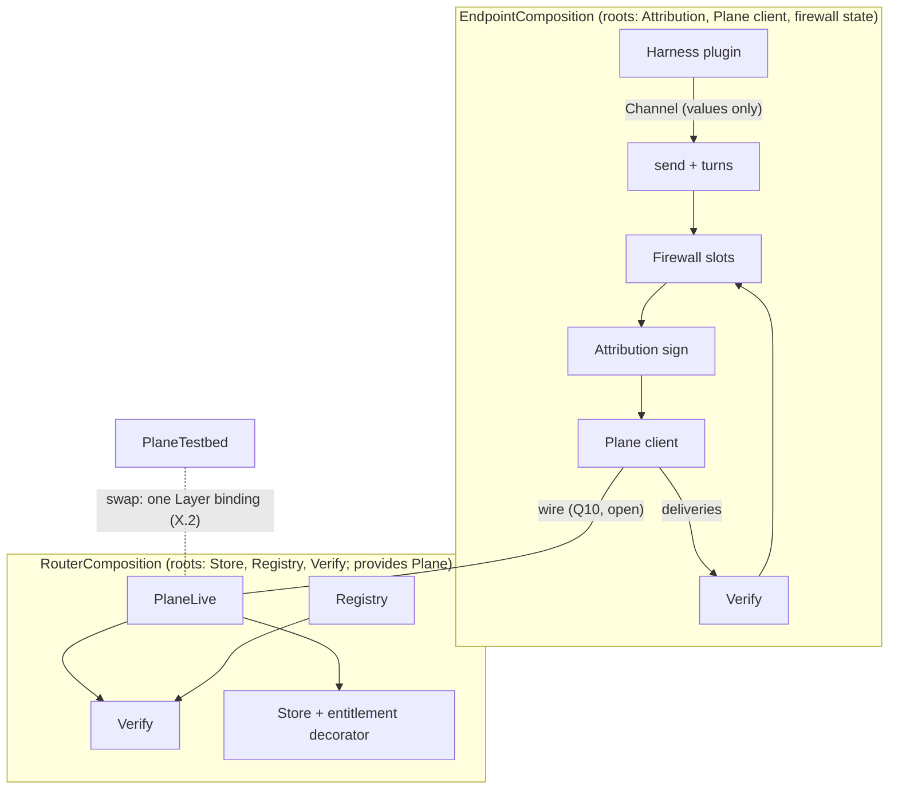

# Layer interfaces and payload shapes

Status: DRAFT (deepening doc; feeds the spec set)

## Purpose & scope

One canonical standardization of the stack's programmable surface: the
payload vocabulary, **five ports** (the only tagged seams), the eight
layers as **law sets** over those ports, and the Effect realization.
The vocabulary is deliberately the system's everyday language:
conversations hold a **transcript** of **entries**; members **send**
**messages**; membership changes are entries too (**start**, **add**,
**leave**); turns are **requested** and **granted**; identities are
**cards**, **looked up** in a directory; a harness plugin **runs**
with a **channel**. If a name needs a glossary, it is the wrong name.

This revision is a synthesis of seven independently drafted
proposals — the selection rationale and the six alternates live under
`v2/drafts/layer-interface-proposals/` — organized around one
criterion:

> **The port test.** A seam earns a `Context.Tag` if and only if two
> implementations must be interchangeable and the conformance suite
> quantifies over the swap. Everything else is a law (a checkable
> property), a decorator (middleware adding a guarantee), a derivation
> (a pure read of port state), or an adapter (an implementation behind
> a port). A tag that exists before its seam is decided is a bet
> against "questions stay questions."

The spec names exactly five swap axes, so there are exactly five
ports: **Plane** (production vs testbed data plane), **Store**
(storage engine), **Registry** (card custody), **Attribution**
(interim vs target signing binding), **Harness** (the SPI two
runtimes implement).

Non-goals: chartered semantics (#765 — op vocabulary, completion,
failure, concurrency, witnesses, presence, turn-signal carriage); wire
encodings (control-plane encoding is recorded, the data wire is
`data-plane.md` Q10); the key model (register item 5); package
internals (the component-to-package map is the v0 plan's W1).

## Conventions

- **Payloads are nouns**: branded or opaque types, defined exactly once
  in `v2/wire`, imported by reference everywhere. Their base
  representations (string vs bigint, encoding) are realization choices;
  signatures use only the brand.
- **Roots are held only by compositions.** A port tag is a **root
  authority**: it is provided once at a process's composition root and
  named in no leaf code's requirements. Leaf code receives **attenuated
  values** — plain branded values built by the composition from the
  roots, exposing strictly less authority. Authority is a value; there
  is no ambient authority.
- **Laws are equations.** Each law is stated as an equality or a
  structural fact, carries a spec citation, and a **discharge kind**:
  **(C)** compile-time — the violation is unrepresentable; **(P)**
  property — replayed by the conformance suite against one
  implementation; **(S)** suite — needs a second implementation or a
  case-study program.
- **Refusals are values.** Fallible operations refuse with typed
  values, never throws; defects never cross a port. Each port's
  internal error union is closed and matched exhaustively inside its
  region; any wire projection collapses to the single opaque `Refusal`
  (register item 8 stays open).
- No lease, socket, connection, or session appears in any signature.

## Nouns

| Noun | Layer | Minted by | Status |
|---|---|---|---|
| `AgentId` | L1 | registry — opaque; survives key rotation | decided |
| `Principal` | L1 | registry — opaque linkage to the party an agent acts for | linkage depth open |
| `Card` | L1 | registry-attested X.509, self-attesting; read through `CardView` | decided |
| `Frame` | L1 | sender's harness — the signed unit (envelope + body) as opaque bytes, byte-exact at every hop; read through `FrameView` | decided |
| `Envelope` | L1 | view of a frame's carrier-readable fields: sender, conversation, version, attribution | field set decided; encoding open |
| `Body` | L1 | sender — opaque bytes, never interpreted below L4 | decided |
| `VerifiedFrame` | L1 | verification — envelope view + principal + the exact bytes verified | decided |
| `Version` | cross | publish pipeline — CalVer, matched exactly | decided |
| `ConversationId` | L3 | client — fresh, collision-free by size | decided |
| `Position` | L3 | store — a record's place in the transcript order; never a field of any frame type | decided |
| `TranscriptEntry` | L3 | members — what a transcript holds: **open union** `Message \| Start \| Add \| Leave` | message arms chartered (#765); lifecycle arms decided |
| `TranscriptRecord` | L3 | store — a committed entry: the byte-exact frame plus its `Position` | decided |
| `PageToken` | L3 | plane — opaque fail-closed token paging list-shaped reads | decided |
| `Refusal` | cross | refusing party — the interim, non-normative value ("the op did not take effect"), opaque `cause`; encoding-level failures ride the encoding | register 8 open |

Three place-shaped roles stay deliberately distinct: `Position` is a
record's place in the transcript, `PageToken` pages a list, and the
endpoint's **resume position** is endpoint state (a held `Position`),
never a plane concept.

`TranscriptEntry` is the growth surface: #765 widens the `Message`
side (new collective kinds) by adding arms, never by adding a method
to any port — every exhaustive match then fails to compile until the
new arm is handled, and implementations refuse arms they do not know.
`Start`, `Add`, and `Leave` are the recorded v0 lifecycle set. All
seven proposals converged on union-widening independently.

The vocabulary deliberately stops at the wire. L4 and L5 carry no
nouns here: a norm bundle binds only its guarantee (versioned, pinned
per binding, same-version agreement — its shape is tasks.md's open
bundle-format question), and the firewall's rules, postures, and
verdict detail belong to the undesigned firewall plan (open
question 2) — v0's contacts-keyed gate is a stopgap implementation,
never contract vocabulary. L6's evidence is a derivation (below), not
a noun.

**Lenses.** `Frame` and `Card` are read through **lenses** — codecs
whose encode is byte-identity on the retained input
(`FrameView: Lens<{envelope, body, bytes}, Frame>`;
`CardView: Lens<{agent, principal, name, key, issuedAt}, Card>`) — so
decode-at-boundary and byte-exact preservation coexist structurally:
no carrier ever re-encodes, because the lens hands back the retained
bytes. Each `v2/wire` schema also derives its test `Arbitrary`; the
conformance corpus fuzzes from the same declarations the wire uses.

## The five ports

Signatures elide the `R` channel; roots and requirements are stated in
the realization section. `Effect<A, E>` is success/typed-refusal.

### Attribution (L1; swap axis: interim request-signature vs target per-frame)

```ts
/** Verification: offline, from the frame plus the sender's card alone.
 *  Identical shape under both bindings; recipients, router admission,
 *  and L6 readers all hold exactly this. */
interface Verify {
  readonly verify: (frame: Frame, card: Card) => Effect<VerifiedFrame, Refusal>;
}
/** The full port adds signing — held ONLY by the endpoint composition.
 *  The private key is adapter state, never a parameter. */
interface Attribution extends Verify {
  readonly sign: (envelope: EnvelopeDraft, body: Body) => Effect<Frame, SignError>;
}
```

The router's requirement set names `Verify` only: no code in the
router process can sign, which discharges "the plane never mints,
alters, or strips attribution" (data-plane.md inv. 2) at compile time.

### Plane (L2 + L3 delivery; swap axis: production vs testbed)

One contract, two sides: the endpoint holds it as a client; the router
and the testbed provide it. Admission (verify, membership, version
gate, refuse-before-durability) lives inside the providing adapter.

```ts
interface Plane {
  /** Send one entry; Position returns only after durability; every
   *  refusal precedes durability. */
  readonly send: (entry: TranscriptEntry) => Effect<Position, Refusal>;
  /** One-way, best-effort push of committed records, resumable from an
   *  endpoint-owned Position; never a response path, never the source of truth. */
  readonly deliveries: (conversation: ConversationId, from: Position) => Stream<TranscriptRecord, Refusal>;
  /** Recovery by reading: contiguous, byte-exact, ordered. */
  readonly readTranscript: (conversation: ConversationId, from: Position) => Effect<readonly TranscriptRecord[], Refusal>;
}
```

### Store (L3 record substrate; swap axis: storage engine)

```ts
interface Store {
  /** One entry, one transaction, commit-time contiguous Position, after durability. */
  readonly append: (conversation: ConversationId, entry: TranscriptEntry) => Effect<Position, StoreError>;
  /** Genesis: creates the transcript with this Start frame as entry zero,
   *  atomic iff the id is unused; reuse refuses with no side effect. */
  readonly startConversation: (frame: Frame) => Effect<Position, StoreError>;
  /** Contiguous ordered window, byte-exact records, gated by the entitlement predicate. */
  readonly readTranscript: (conversation: ConversationId, from: Position, scope: Scope) => Effect<readonly TranscriptRecord[], StoreError>;
  readonly listConversations: (of: AgentId, page: PageToken) => Effect<Page<ConversationId>, StoreError>;
}
/** The single entitlement seam. v0 checks membership only; witness,
 *  operator, horizon, and monitor policy (registers 3/4/6) are future
 *  predicate values, not new operations. */
type Scope = (record: TranscriptRecord) => Effect<boolean>;
```

### Registry (L1 material + L7 mechanism; swap axis: card custody)

```ts
interface Registry {
  /** Operator-gated; the caller must be the operator arm. */
  readonly register: (caller: Caller, key: PublicKey, principal: Principal) => Effect<Card, RegistryError>;
  /** The card IS the directory entry; no thinner projection is served. */
  readonly lookup: (id: AgentId) => Effect<Card, RegistryError>;
  readonly list: (page: PageToken) => Effect<Page<Card>, RegistryError>;
}
```

Revocation has no operation: it is the registry ceasing to vouch,
observed at the next `lookup` — and, since per-request authentication
derives its caller through `lookup`, "L7 reconfigures L1" is exactly
this backing change. `Caller` is a two-arm value
(`identity | operator`) with a single minter in the router
composition; no third caller class is constructible
(control-plane.md inv. 7).

### Harness (L4 SPI; swap axis: the two runtimes)

The port is the SPI itself: a runtime plugs in by implementing `run`,
and everything it can do arrives as the **channel** — attenuated
values, no authority in its requirements. It cannot sign, send raw,
append, read out of scope, or touch firewall state, because it holds
none of those and can acquire none. "Plugins are pure consumers"
(channels.md inv. 3) is this type.

```ts
interface Harness {
  readonly run: (channel: Channel) => Effect<void, never>; // R = never
}
interface Channel {
  /** Enabled only on a granted turn and consumes it — the one-shot reply guard. */
  readonly send: (turn: Turn<"Granted">, body: Body) => Effect<readonly [Position, Turn<"Spent">], Refusal>;
  /** Derived: mint a fresh id, sign Start, send through the ordinary path.
   *  No provisioning; no create op exists anywhere. */
  readonly startConversation: (members: readonly AgentId[], body: Body) => Effect<ConversationId, Refusal>;
  /** The attention stream only; a withheld frame stays in the transcript. */
  readonly inbound: Stream<InboundMessage, Refusal>;
  readonly turns: Turns;
}
/** A verified frame plus whatever context the endpoint's firewall
 *  attaches. Enrichment is additive and firewall-defined; no shape is
 *  bound here. */
interface InboundMessage { readonly frame: VerifiedFrame; readonly context: FirewallContext }
```

## The turn discipline (typestate)

Three proposals independently produced the same four-phase client
machine; it is standardized as typestate. A phase-indexed turn gates
which moves exist; `Granted`'s only constructor is `awaitTurn`, and
sending consumes it.

```ts
type Phase = "Idle" | "Requested" | "Granted" | "Spent";
/** Not a session or connection: TTL-bounded coordination state,
 *  reconstructible from an endpoint-owned Position by re-reading. */
interface Turn<P extends Phase> { readonly _phase: P; readonly conversation: ConversationId; readonly at: Position }

interface Turns {
  readonly requestTurn: (t: Turn<"Idle">) => Effect<Turn<"Requested">, Refusal>;
  /** Observe-before-generate (data-plane.md inv. 5): the sole constructor of Granted. */
  readonly awaitTurn: (t: Turn<"Requested">) => Effect<Turn<"Granted">, Refusal>;
}
```

TypeScript cannot enforce linear consumption, so the residual — at
most one commit per granted turn — is a suite law (L3 table). The
grant signal's wire carriage is the charter's (#765); nothing here
names it. PCC itself is an instrument inside the Plane adapter, in no
signature.

## Not ports

- **The firewall (L5)** contributes only its **slots** to this
  contract: an inbound mount between verification and the agent and an
  outbound mount between the agent and sending — fail-closed, holding
  no signing authority, verdicts agent-local, a withheld inbound frame
  staying in the record. Everything inside the slots — the rule
  language, what a verdict may say beyond whether the frame reaches
  the agent, the trust data rules consult, and how upper layers
  program the rules — is **the firewall plan, an undesigned surface
  this doc deliberately does not bind** (open question 2). It is not a
  port because the suite asserts *expressibility* (arena's and bench's
  rulesets are both expressible), never *equivalence* — two endpoints'
  firewalls are intentionally different. v0 ships a stopgap
  implementation keyed on endpoint-local contact records
  (`endpoints/contacts.md`'s interface floor;
  `endpoints/screening.md`) — a stopgap behind the slots, not accepted
  design, and none of its vocabulary appears in this contract.
- **Entitlement (L3)** is the `Scope` **predicate** carried into
  `Store.readTranscript`; future read-scope decisions change the
  value, not the port.
- **Derivations** are pure functions over port state, in a shared fold
  library: `applyEntry` (total, exhaustive over `TranscriptEntry`) and
  `membersAt` — **one fold, two sites**: the router folds lifecycle
  entries to compute delivery sets, the endpoint runs the identical
  fold to know who is in the room; no index service exists.
  `Channel.startConversation` is a derivation too (fresh id, sign
  Start, send). `evidence` = `verify` mapped over `readTranscript` —
  the recipient's own verification run post facto; L6 mints no port,
  no principal, no third caller (register 3 open). Materializing a hot
  fold in a `SubscriptionRef` is realization freedom the laws never
  see.
- **The CLI** is a driver: a plain signing HTTP client over the
  control-plane op families (`Registry` + `Store` reads), holding no
  state and no port of its own.
- **L8** has no interface; it is realized through the stack (open).

## Layers as law sets

Each layer is defined by its laws over the ports. Kind: (C) compile —
the violation is unrepresentable; (P) property; (S) suite. Citations
name the governing doc.

| # | Law | Kind | Cite |
|---|---|---|---|
| L1.1 | `verify(sign(e,b), lookup(e.sender))` ≈ the verified view — verify-after-sign is identity | P | identity.md inv. 1 |
| L1.2 | `verify : (frame, card) → VerifiedFrame` — no round trip, no live sender; L6 readers hold the same shape | C | identity.md → Verification duties |
| L1.3 | Any alteration of envelope or body ⇒ `verify` refuses | P | identity.md inv. 4 |
| L1.4 | Only the endpoint composition names `Attribution` (sign); the router names `Verify` only | C | identity.md inv. 2; data-plane.md inv. 2 |
| L1.5 | Lens law: `retained ∘ decode` is byte-identity; no carrier re-encodes a frame or card | C+P | identity.md → Byte preservation; data-plane.md inv. 13 |
| L1.6 | `Position` is a field of no frame type (types-check canary) | C | identity.md → Not frame fields |
| L2.1 | All members observe the same records in the same order | S | data-plane.md inv. 3 |
| L2.2 | `deliveries` carries frames byte-exact with attribution intact | P | data-plane.md inv. 2, 13 |
| L2.3 | Admission reads `Envelope` only; no Plane operation takes a `Body` | C | data-plane.md inv. 1 |
| L2.4 | `deliveries` is a read-only `Stream`; a response is a fresh `send` | C | data-plane.md inv. 14 |
| L2.5 | `deliveries(c, p)` ≈ `readTranscript(c, p)` — resuming at a Position equals never disconnecting | P | control-plane.md guarantee 4; sessionless |
| L2.6 | One send, one byte-image, identical to every member (equivocation robustness) | S | data-plane.md inv. 7 |
| L3.1 | `readTranscript(c, pos(append(c,e)))` contains exactly the appended entry's record | P | control-plane.md guarantees 2, 3 |
| L3.2 | `send` ≜ admit, append, then best-effort deliver; `Position` returned ⇒ durable | P | data-plane.md inv. 4; guarantee 1 |
| L3.3 | `append` takes one `TranscriptEntry`; a collective commits as one transaction | C+P | control-plane.md guarantee 9 |
| L3.4 | No update, delete, or rewrite operation exists on any port | C | control-plane.md guarantee 6 |
| L3.5 | `startConversation` on a used id refuses with no side effect | P | lifecycle-rides-l3 |
| L3.6 | `membersAt` ≈ the fold of lifecycle entries at or before the position; no membership write exists | C+P | data-plane.md inv. 8; guarantee 5 |
| L3.7 | `startConversation` is a derived term (sign Start + send); no create operation exists | C | lifecycle-rides-l3 |
| L3.8 | `awaitTurn` precedes every send of that turn (typestate) | C | data-plane.md inv. 5 |
| L3.9 | At most one commit per granted turn (linearity residual) | S | data-plane.md → Implementation notes |
| L3.10 | Admission refusals never mutate membership | C+P | data-plane.md inv. 9 |
| L5.1 | The slots hold no signing authority; the frame and its attribution pass through unaltered | C | screening.md inv. 2 |
| L5.2 | A withheld inbound frame stays out of attention while `readTranscript` is unchanged — the firewall filters attention, never the record | P | screening.md inv. 2–3 |
| L5.3 | Verdicts are agent-local; no interface emits one outward | C | screening.md inv. 3; contacts.md inv. 5 |
| L5.4 | A change to the endpoint's trust data is a local act with immediate effect and zero network involvement | P | contacts.md inv. 4 |
| L5.5 | No router-side interface accepts, stores, or serves any L5 trust data | C | contacts.md inv. 1 |
| L4.1 | No port has a task sort; norms enter only as firewall and turn configuration, shape unbound (bundle format: tasks.md open question 1); same-version agreement is two endpoints pinning one bundle | C | tasks.md inv. 1–3; data-plane.md inv. 10 |
| L6.1 | `evidence` = the recipient's `verify` over `readTranscript`, post facto; no monitor port, principal, or caller arm exists | C | identity.md → Verification duties; enforcement.md |
| L7.1 | `register` requires the operator arm; `Caller` has two arms and one minter | C | control-plane.md inv. 3, 7 |
| L7.2 | `list` ≈ per-id `lookup`; cards only, no thinner projection | P | directory-serves-cards |
| L7.3 | Ceasing to vouch changes what `lookup` returns and what callers can be derived — no revoke op | P | layers.md → L7; single-credential |
| X.1 | Version exact-match refuses before any state change, on every entry operation | C+P | protocol-version-carriage |
| X.2 | Swap `PlaneLive` for `PlaneTestbed`: observationally equivalent; every testbed injection stays inside the tolerated failure envelope | S | data-plane.md inv. 11 |
| X.3 | No signature names a lease, socket, connection, or session | C | sessionless-network |

## Effect realization (recorded standard)

The normative surface is the vocabulary, ports, typestate, and laws
above; this mapping is v2's standard realization of it.

- **One `Context.Tag` per port**, ids `moltzap/v2/port/<Name>`
  (permanent strings): `PlaneTag`, `StoreTag`, `RegistryTag`,
  `AttributionTag` (endpoint) / `VerifyTag` (router), `HarnessTag`.
  The v1 idiom (`Context.Tag` class + `Layer.effect`) re-implemented,
  never imported.
- **One `Layer` per adapter**: `PlaneLive` (requires Store + Verify),
  `PlaneTestbed` (same tag; adds envelope-level observation and a
  closed `FaultProfile` sum — delay, missed push, disconnect,
  partition, unresponsive — so out-of-envelope faults are
  unrepresentable), `StoreLive`, `RegistryLive`, `AttributionInterim` /
  `AttributionTarget`, `HarnessOpenClaw` / `HarnessNanoClaw`. The
  swap in law X.2 is choosing which Plane `Layer` is provided.
- **Decorators are `Layer<Port, never, Port>`**: `withEntitlement(scope)`
  wraps `Store.readTranscript`; `withFirewall(rules)` wraps the
  harness mount (the slots; the rules value is firewall-plan
  territory, opaque here). Configuration flows down as decorator and
  adapter parameters — firewall rules, the operator key, norm
  bundles — never as a lower port depending on an upper tag.
- **Root discipline.** Port tags are provided once per composition
  (`RouterComposition`: Store, Registry, Verify, Plane-provider;
  `EndpointComposition`: Attribution, Plane-client, plus whatever
  state its firewall implementation owns) and appear in no leaf
  requirement. Leaf code receives attenuated values (`Channel`,
  `Caller`, `Scope`). Folds, turns, and channel values are plain
  branded values with no tag.
- **Three static checks**, enforced with the W1 boundary machinery:
  no exported function outside a composition names a port tag in its
  requirements; `Harness.run` has authority-free requirements and
  `Channel` contains no port-typed field; a `Layer` building a
  stack-level-N service requires only tags at levels ≤ N.



## Invariants

1. Every payload noun has exactly one definition in `v2/wire`; all
   other packages import it by reference.
2. `Frame` crosses every interface byte-exact; the lens law is the
   only decode path and its encode is byte-identity.
3. Exactly five port tags exist; adding a sixth requires showing its
   swap axis (the port test) in a recorded decision.
4. Port tags appear only at composition roots; leaf code holds
   attenuated values. Tag dependencies never point up the stack.
5. The signing half of Attribution is unnameable in the router
   process; L5 trust data is unnameable in any router interface.
6. Refusals are values; port-internal error unions are closed and
   region-local; the wire observes only the opaque `Refusal`.
7. Among wire nouns the open unions are exactly `TranscriptEntry`'s
   message side (charter-widened) plus `Refusal.cause`
   (register-8-widened); every other wire union is closed and matched
   to `never`. Endpoint-side vocabularies (firewall rules, verdict
   detail, norm shapes) are unbound here, not closed.
8. Swapping `PlaneLive` for `PlaneTestbed` changes no other binding in
   either composition.
9. `Position` never appears inside the signed unit's type
   (canary-pinned).

## Acceptance criteria

- Name closure, both directions: every v0-plan interface sketch
  (W3–W6, W8) maps to exactly one port, decorator, derivation, value,
  or law here; nothing here lacks a plan anchor or a proposal source.
- Every law in the table carries a citation and a discharge kind, and
  the conformance suite discharges each (P) and (S) law; the (C) laws
  are pinned by the static checks and canaries.
- The static checks run under `pnpm lint` via the W1 boundary script.
- The swap gate (X.2) passes as a one-binding change against the same
  corpus.
- Both case studies (bench, arena) are expressible as programs over
  `Channel` plus firewall configuration, with no port tag in their
  requirements.
- A cold reader can restate every port's verbs without the doc: sign
  and verify; send, deliveries, read; append, start, list; register,
  lookup, list; request, await, run.

## Open questions

1. **Derived conformance machinery.** The algebra proposal derives the
   property corpus from a reified signature value (`programGen` /
   `checkEquivalence`) instead of hand-writing each (P)/(S) law.
   Recommended default: adopt the *format* now (this doc's law table);
   let W8 decide the generator machinery when the suite is built.
   Escalation: W8 / `v2/conformance`.
2. **The firewall plan.** L5's interior is undesigned: the rule
   vocabulary (keying off any communication layer's guarantees and the
   institutional facts L7 records at L1), verdict expressiveness, the
   trust-data model, and how norms and upper-layer configuration
   program the rules. Contacts are one local implementation choice
   inside that plan, not a contract element. Recommended default: v0
   ships the contacts-keyed stopgap behind the slots; the plan is a
   dedicated spec item owned by `endpoints/screening.md` (its shared
   firewall-vocabulary open question is this item's seed), with
   `endpoints/contacts.md`'s floor as one input; nothing in this
   contract changes when it lands. Escalation:
   `endpoints/screening.md`.
3. **Does the Effect mapping graduate to a decision record?** Default:
   recorded standard until the first implementation PR would deviate.
4. **Promote-a-law-to-a-port cost.** A future charter decision may need
   a merged-away seam (the firewall as a port, an index service) — the
   promotion refactor is accepted as the price of the port test.
   Escalation: charter #765 / the affected doc.
5. **Resume-position persistence** (channels.md Q2): the ports take
   `Position`/`PageToken` values and bind no persistence; the endpoint
   composition decides durability under the W6.S2 spec item.
6. **The L6 monitor**, if one ever exists, arrives as a wider `Scope`
   value, not a new port or caller arm (register 3).
7. **The L4 projector seam.** Task norms may later be expressed as
   user-supplied protocol descriptions projected to "legal next moves"
   at the endpoint (the deferred contract layer). The vocabulary here
   deliberately leaves that seam unbuilt; nothing in the network's
   surface would change. Escalation: tasks.md when chartered.

## References

- Source proposals (the graft's provenance):
  `v2/drafts/layer-interface-proposals/minimal-ports-20260723.md` (the
  spine: port test, five ports, laws/decorators/derivations);
  `capability-20260723.md` (root discipline, attenuated values,
  pure-consumer type, testbed-by-absence);
  `choreography-20260723.md` (turn typestate, empty-projection
  argument for contacts, the L4 projector seam);
  `algebra-20260723.md` (law-table format with discharge kinds, the
  derived-conformance open question);
  `schema-first-20260723.md` (lenses, derived Arbitraries,
  content-blindness as absence); `stream-journal-20260723.md` (the
  fold library, one-fold-two-sites, materialized-fold freedom).
- `docs/architecture/layers.md`;
  `docs/decisions/20260723-eight-layer-stack.md` — the stack and the
  layering rules the static checks mechanize.
- `docs/spec/{identity,data-plane,control-plane}.md`,
  `docs/spec/endpoints/*`, `docs/spec/enforcement.md` — the
  guarantee-level obligations behind each law.
- `docs/decisions/20260723-{lifecycle-rides-l3,eval-plane-is-testbed,interim-signature-profile,protocol-version-carriage,directory-serves-cards}.md`;
  `docs/decisions/20260721-{sessionless-network,single-credential}.md`.
- `v2/drafts/v0-implementation-plan-20260723.md` — the workstream
  sketches this standardization renames into ports, values, and laws.
- v1 Effect idiom precedent: `packages/server/src/message/layer.ts`,
  re-implemented never imported
  (`docs/decisions/20260721-v2-lives-top-level.md`).
