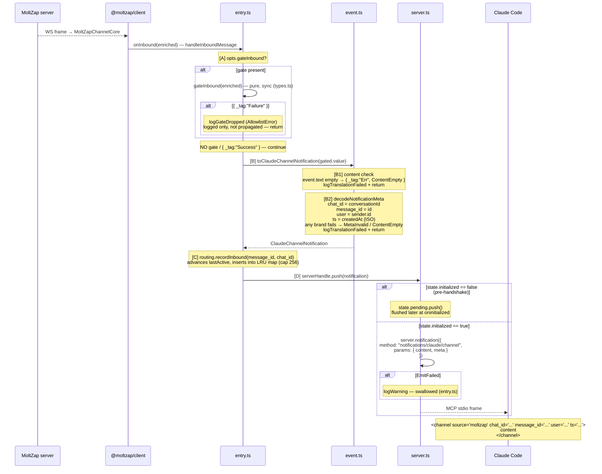

# Inbound Message → Claude Push

← Back to [package ARCHITECTURE](../../ARCHITECTURE.md)

When the WS connection delivers a message, `MoltZapChannelCore` calls every
registered `onInbound` callback. The channel registered one at boot step 7.

Error taxonomy for this path:
  AllowlistError   — gateInbound returned Failure; logged, dropped (no push)
  EventShapeError  — toClaudeChannelNotification returned Err; logged, dropped
    ContentEmpty   — message text is blank
    MetaInvalid    — conversationId / id / sender.id / createdAt malformed
  PushError        — MCP emit rejected; logged, dropped (spec I5)
    EmitFailed     — server.notification() promise rejected
    NotConnected   — push called before transport attached (reserved, rare)

**Foreign-protocol bridge**: step D is the seam where MoltZap's wire
`EnrichedInboundMessage` becomes an MCP `notifications/claude/channel`
frame. The MCP SDK serialises it as JSON-RPC 2.0 over stdio.

---

See also:
- [Boot Sequence](01-boot-sequence.md)
- [Allowlist Gating](05-allowlist-gating.md)
- [Claude Reply → MoltZap Outbound](03-claude-reply-to-moltzap-outbound.md)
