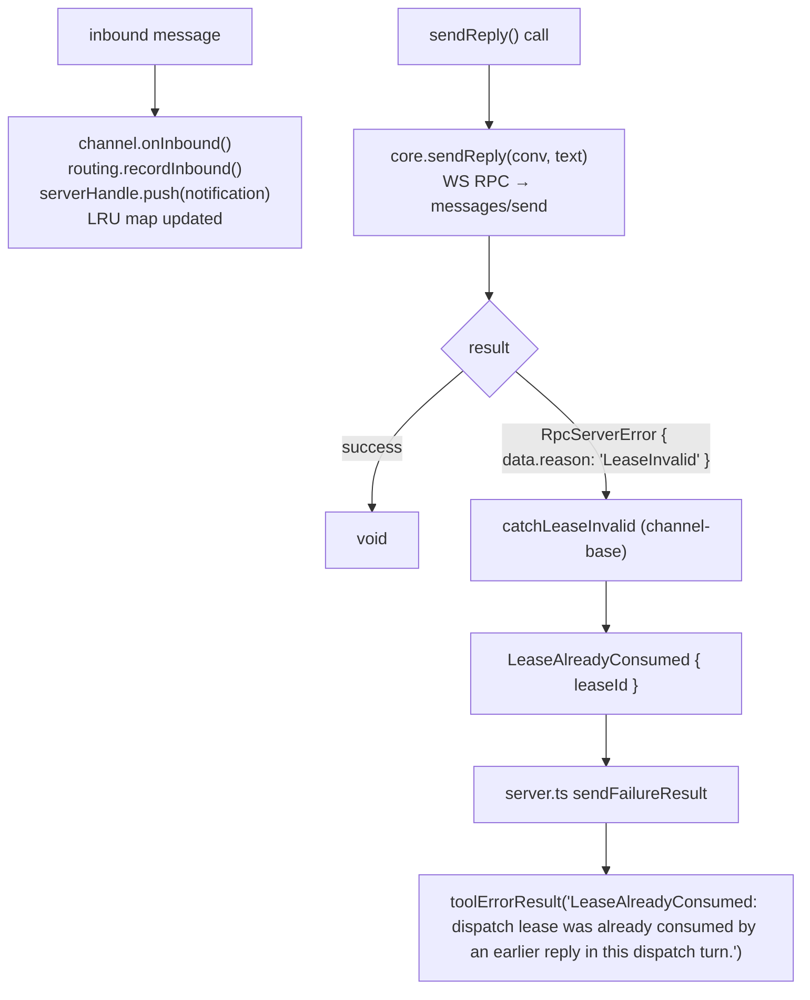

# Channel projection of the dispatch lease

← Back to [package ARCHITECTURE](../../ARCHITECTURE.md)

The dispatch lease FSM lives on the MoltZap server — see
[`server/06-lease-lifecycle.md`](../../../server/docs/architecture/06-lease-lifecycle.md)
for the authoritative state machine
(`PENDING → GRANTED → CLAIMED → CONSUMED/EXPIRED/...`). This page covers
only the channel-local concerns: how the channel projects the server's
typed rejection onto a `ReplyError` Claude can see, and what local state
the channel tracks.

## 1. Server rejection → channel `ReplyError` projection



The server enforces the single-use lease constraint. This package only
projects the typed rejection into a `ReplyError` arm.

## 2. Channel-local state — the routing LRU map

The channel does NOT track lease tokens at all. It tracks message-id →
conversation-id for `reply_to` resolution:

```text
routing.ts:
  Map<MessageId, ConversationId>   bounded LRU, cap=256
  lastActive: ConversationId | undefined

  recordInbound(messageId, conversationId):
    1. delete(messageId) if present  — refresh LRU position
    2. map.set(messageId, conversationId)
    3. while map.size > cap: evict oldest (Map insertion-order)
    4. lastActive = conversationId
```

Eviction: when `map.size` exceeds 256, the oldest `MessageId` is dropped.
A `reply_to` referencing an evicted message-id surfaces as
`ReplyToUnknown`.

## 3. Cleanup

The channel holds no lease tokens — there's nothing to clean up when a
dispatch ends or the WS connection drops. The server holds and expires
leases independently (see the server doc linked above).

---

See also:
- [Claude Reply → MoltZap Outbound](03-claude-reply-to-moltzap-outbound.md) — where the rejection projection runs
- [Inbound Message → Claude Push](02-inbound-message-to-claude-push.md) — where `routing.recordInbound` is called
- [Server lease lifecycle](../../../server/docs/architecture/06-lease-lifecycle.md) — the authoritative state machine
