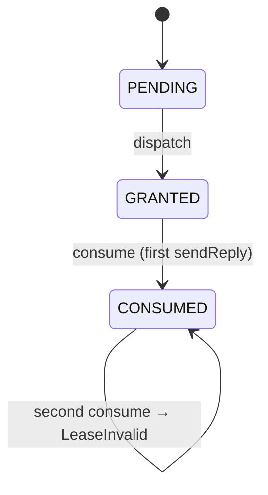
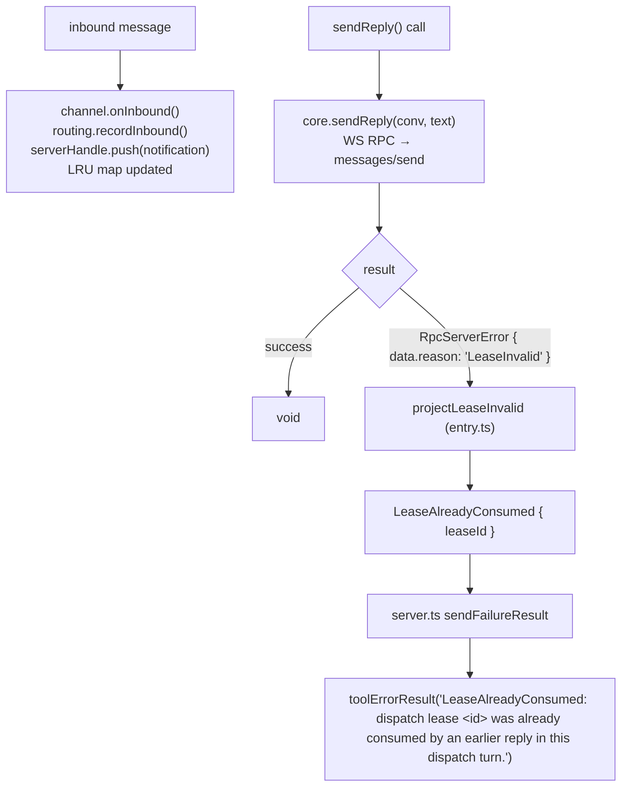

# Lease State Machine

← Back to [package ARCHITECTURE](../../ARCHITECTURE.md)

The server-side single-use lease semantics are enforced by the MoltZap
server, not by a local state machine in this package. The channel's job
is to project the server's typed rejection onto a structured `ReplyError`
before it reaches Claude's tool result.

**MoltZap server — lease state machine:**

**Channel projection of the lease (entry.ts + server.ts):**

Annotations:
- The server enforces the single-use lease constraint; this package only projects the typed rejection.
- The channel's local `routing.ts` LRU map (`Map<MessageId, ConversationId>`, cap=256) is separate from the lease and tracks conversation targets for `reply_to` resolution.

Local routing state (routing.ts) — what the channel DOES track:
  Map<MessageId, ConversationId>   bounded LRU, cap=256
  lastActive: ConversationId | undefined

  recordInbound(messageId, conversationId):
    1. delete(messageId) if present  — refresh LRU position
    2. map.set(messageId, conversationId)
    3. while map.size > cap: evict oldest (Map insertion-order)
    4. lastActive = conversationId

  Eviction: when map.size exceeds 256, oldest MessageId is dropped.
  A reply_to referencing an evicted message_id → ReplyToUnknown.

Lease cleanup: the channel holds no lease tokens. When a dispatch ends
(or the WS connection drops), no local cleanup is needed — the server
holds and expires leases independently.

---

See also:
- [Claude Reply → MoltZap Outbound](03-claude-reply-to-moltzap-outbound.md)
- [Inbound Message → Claude Push](02-inbound-message-to-claude-push.md)
