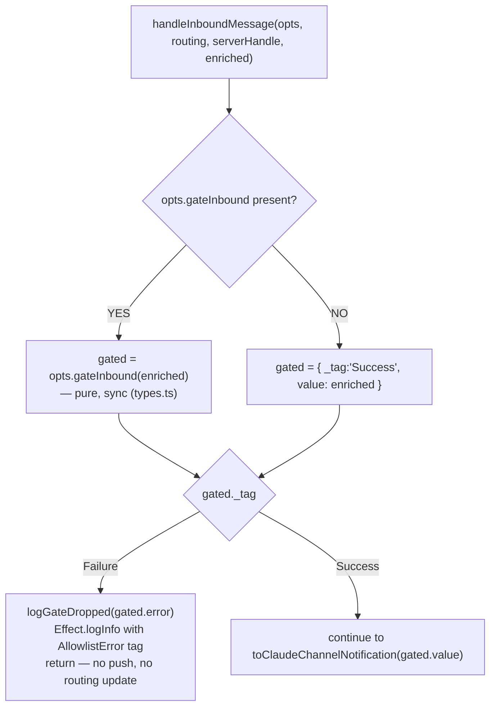

# Allowlist Gating

← Back to [package ARCHITECTURE](../../ARCHITECTURE.md)

`gateInbound` is a caller-supplied predicate injected at boot. It is
**optional** — when absent, every inbound message passes through.

Annotations:
- `GateInbound` contract (types.ts): pure, synchronous, returns a tagged union — no `throw`, no `Promise`.
- The gate may modify the returned `EnrichedInboundMessage` (e.g. strip metadata) by returning a new value inside `Success` — the notification is built from `gated.value`, not `enriched` directly.
- The gate runs BEFORE `routing.recordInbound`; a denied message is never added to the LRU map and cannot be targeted by `reply_to`.

AllowlistError union (in errors.ts):
  SenderNotAllowed      { senderId, reason }
  ConversationNotAllowed { conversationId, reason }

Context the gate function receives — EnrichedInboundMessage fields:
  .id              message UUID (MessageId)
  .conversationId  conversation UUID (ConversationId)
  .sender.id       sender agent UUID (UserId)
  .text            message text body
  .createdAt       ISO-8601 timestamp
  (+ any other fields from @moltzap/client EnrichedInboundMessage)

---

See also:
- [Inbound Message → Claude Push](02-inbound-message-to-claude-push.md)
- [Boot Sequence](01-boot-sequence.md)
