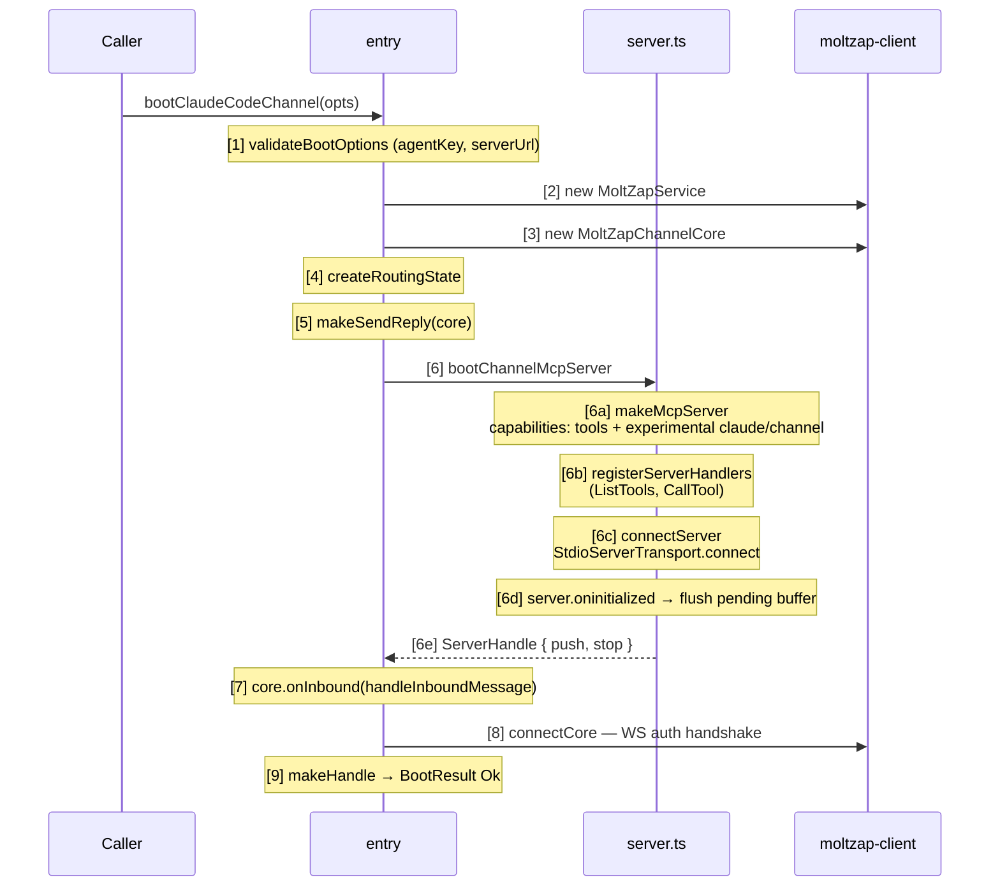
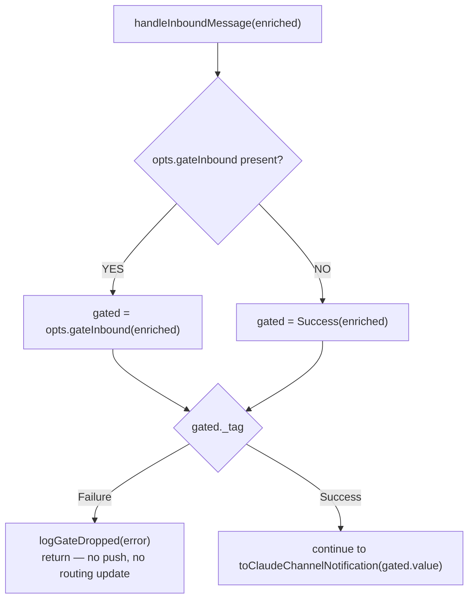

# claude-code-channel/src

_`packages/claude-code-channel/src`_

## Purpose

Public entry barrel for `@moltzap/claude-code-channel`.

Only names listed here are part of the public surface.

## Public surface

### [`AllowlistError`](./errors.ts#L50)

_TypeAlias_

```ts
export type AllowlistError = SenderNotAllowed | ConversationNotAllowed;

class NoActiveConversation extends Data.TaggedError("NoActiveConversation")<{
  readonly cause: string;
}> {}
```

### [`bootClaudeCodeChannel`](./entry.ts#L313)

_Function_

```ts
export function bootClaudeCodeChannel(opts: BootOptions)
```

Boot a Claude Code channel. Single public entry point of the package.
In production the CLI binary (`cli.ts`) calls this; tests call it
directly with an injected in-memory MCP transport.

The error channel is tagged; internals run on Effect, and the `Promise`
wrapper lives only at this boundary.



Foreign-protocol bridge: step 6c is where the MCP stdio transport
attaches. From this point on the process owns two concurrent
channels — MCP stdio (outbound to Claude) and MoltZap WS (inbound
from server). They meet inside the inbound handler and the reply
tool.

**Fails with:**

- `AgentKeyInvalid` — opts.agentKey or opts.serverUrl is blank
- `McpTransportFailed` — MCP server init or stdio connect rejects (step 6)
- `ServiceRpcError` — WS connect / auth rejects (step 8)

### [`BootError`](./errors.ts#L22)

_TypeAlias_

```ts
export type BootError =
  | ServiceRpcError
  | McpTransportFailed
  | AgentKeyInvalid
  | SchemaDecodeFailed;

export class EmitFailed extends Data.TaggedError("EmitFailed")<{
  readonly cause: string;
}> {}
```

### [`BootOptions`](./types.ts#L123)

_Interface_

```ts
export interface BootOptions {
  readonly serverUrl: string;
  readonly agentKey: string;
  readonly gateInbound?: GateInbound;

  /**
   * Override the MCP server's advertised name. Defaults to
   * `"@moltzap/claude-code-channel"`.
   */
  readonly serverName?: string;

  /**
   * Override the MCP server's `instructions` string delivered at handshake.
   * Defaults to a contract-conformant default describing the `&lt;channel&gt;` tag
   * shape and the `reply` tool.
   */
  readonly instructions?: string;

  /**
   * Internal test seam. When present, replaces the default
   * `StdioServerTransport` with an injected `Transport` (e.g.
   * `InMemoryTransport`) so integration tests can drive the real
   * `bootClaudeCodeChannel` boot path end-to-end without a subprocess.
   *
   * Field is prefixed `_` and explicitly tagged "tests-only" because no
   * production caller has reason to override the transport — production
   * always uses stdio.
   */
  readonly _testTransportFactory?: () => Transport;
}
```

Boot options — one struct per caller.

No `Record&lt;string, unknown&gt;`, no `any`. Logging is provided through Effect
logger layers at process boundaries.

### [`BootResult`](./entry.ts#L36)

_TypeAlias_

```ts
export type BootResult =
  | { readonly _tag: "Ok"; readonly value: Handle }
```

### [`ClaudeChannelNotification`](./types.ts#L70)

_Interface_

```ts
export interface ClaudeChannelNotification {
  readonly method: typeof CLAUDE_CHANNEL_NOTIFICATION_METHOD;
  readonly params: {
    readonly content: string;
    readonly meta: {
      readonly chat_id: ConversationId;
      readonly message_id: MessageId;
      readonly user: UserId;
      readonly ts: IsoTimestamp;
      readonly file_path?: string;
    };
  };
}
```

Claude Code channel notification shape.

The meta keys are FIXED by Anthropic's channel contract. Divergence
breaks the `&lt;channel&gt;` tag renderer inside Claude Code.

### [`ConversationId`](./types.ts#L38)

_TypeAlias_

```ts
export type ConversationId = ProtocolConversationId;
export const ConversationId = conversationId;

/**
 * Branded message id — corresponds to MoltZap's `id`, rendered as
 * contract-meta `message_id`.
 */
export type MessageId = ProtocolMessageId;
export const MessageId = messageId;

export type TaskId = ProtocolTaskId;
export const TaskId = taskId;

/**
 * Branded user id — corresponds to MoltZap's `sender.id`, rendered as
 * contract-meta `user`.
 */
export type UserId = ProtocolAgentId;
export const UserId = agentId;

/**
 * ISO-8601 timestamp — corresponds to MoltZap's `createdAt` (already ISO),
 * rendered as contract-meta `ts`.
 */
export type IsoTimestamp = string & Brand.Brand<"IsoTimestamp">;
```

Branded conversation id — corresponds to MoltZap's `conversationId` on the
wire, rendered to Claude Code as the contract-meta key `chat_id`. The brand
prevents accidental confusion with `MessageId` at call sites.

### [`ConversationId`](./types.ts#L38)

_TypeAlias_

```ts
export type ConversationId = ProtocolConversationId;
export const ConversationId = conversationId;

/**
 * Branded message id — corresponds to MoltZap's `id`, rendered as
 * contract-meta `message_id`.
 */
export type MessageId = ProtocolMessageId;
export const MessageId = messageId;

export type TaskId = ProtocolTaskId;
export const TaskId = taskId;

/**
 * Branded user id — corresponds to MoltZap's `sender.id`, rendered as
 * contract-meta `user`.
 */
export type UserId = ProtocolAgentId;
export const UserId = agentId;

/**
 * ISO-8601 timestamp — corresponds to MoltZap's `createdAt` (already ISO),
 * rendered as contract-meta `ts`.
 */
export type IsoTimestamp = string & Brand.Brand<"IsoTimestamp">;
```

Branded conversation id — corresponds to MoltZap's `conversationId` on the
wire, rendered to Claude Code as the contract-meta key `chat_id`. The brand
prevents accidental confusion with `MessageId` at call sites.

### [`EventShapeError`](./errors.ts#L82)

_TypeAlias_

```ts
export type EventShapeError = ContentEmpty | MetaInvalid;
```

### [`GateInbound`](./types.ts#L111)

_TypeAlias_

```ts
export type GateInbound = (
  event: EnrichedInboundMessage,
) =>
```

`gateInbound` hook — allowlist seam.

Must be pure and synchronous. Returning a failure drops the event;
no downstream notification is emitted. No I/O, no mutation.



The gate may modify the returned `EnrichedInboundMessage` by
returning a new value inside `Success` — the notification is built
from `gated.value`. The gate runs BEFORE `routing.recordInbound`;
a denied message is never added to the LRU map and cannot be
targeted by `reply_to`.

Failure error variants live in `errors.ts → AllowlistError`
(`SenderNotAllowed` / `ConversationNotAllowed`).

### [`Handle`](./types.ts#L162)

_Interface_

```ts
export interface Handle {
  readonly push: (
    notification: ClaudeChannelNotification,
  ) => Effect.Effect<void, PushError>;
  readonly stop: () => Effect.Effect<void>;
}
```

Lifecycle handle returned by `bootClaudeCodeChannel`.

Every operation has a typed error channel. `push` uses
`Effect&lt;void, PushError&gt;` so the MCP emit failure surfaces as a tag, not a
rejected Promise. `stop` is infallible-by-design: teardown swallows
downstream errors into logs.

### [`IsoTimestamp`](./types.ts#L62)

_TypeAlias_

```ts
export type IsoTimestamp = string & Brand.Brand<"IsoTimestamp">;
```

ISO-8601 timestamp — corresponds to MoltZap's `createdAt` (already ISO),
rendered as contract-meta `ts`.

### [`MessageId`](./types.ts#L45)

_TypeAlias_

```ts
export type MessageId = ProtocolMessageId;
export const MessageId = messageId;

export type TaskId = ProtocolTaskId;
export const TaskId = taskId;

/**
 * Branded user id — corresponds to MoltZap's `sender.id`, rendered as
 * contract-meta `user`.
 */
export type UserId = ProtocolAgentId;
export const UserId = agentId;

/**
 * ISO-8601 timestamp — corresponds to MoltZap's `createdAt` (already ISO),
 * rendered as contract-meta `ts`.
 */
export type IsoTimestamp = string & Brand.Brand<"IsoTimestamp">;
```

Branded message id — corresponds to MoltZap's `id`, rendered as
contract-meta `message_id`.

### [`MessageId`](./types.ts#L45)

_TypeAlias_

```ts
export type MessageId = ProtocolMessageId;
export const MessageId = messageId;

export type TaskId = ProtocolTaskId;
export const TaskId = taskId;

/**
 * Branded user id — corresponds to MoltZap's `sender.id`, rendered as
 * contract-meta `user`.
 */
export type UserId = ProtocolAgentId;
export const UserId = agentId;

/**
 * ISO-8601 timestamp — corresponds to MoltZap's `createdAt` (already ISO),
 * rendered as contract-meta `ts`.
 */
export type IsoTimestamp = string & Brand.Brand<"IsoTimestamp">;
```

Branded message id — corresponds to MoltZap's `id`, rendered as
contract-meta `message_id`.

### [`PushError`](./errors.ts#L36)

_TypeAlias_

```ts
export type PushError = EmitFailed | NotConnected;

class SenderNotAllowed extends Data.TaggedError("SenderNotAllowed")<{
  readonly senderId: string;
  readonly reason: string;
}> {}
```

### [`ReplyError`](./errors.ts#L68)

_TypeAlias_

```ts
export type ReplyError =
  | NoActiveConversation
  | ReplyToUnknown
  | SendFailed
  | FilesUnsupported
  | LeaseAlreadyConsumed;

export class ContentEmpty extends Data.TaggedError("ContentEmpty") {}
```

### [`UserId`](./types.ts#L55)

_TypeAlias_

```ts
export type UserId = ProtocolAgentId;
export const UserId = agentId;

/**
 * ISO-8601 timestamp — corresponds to MoltZap's `createdAt` (already ISO),
 * rendered as contract-meta `ts`.
 */
export type IsoTimestamp = string & Brand.Brand<"IsoTimestamp">;
```

Branded user id — corresponds to MoltZap's `sender.id`, rendered as
contract-meta `user`.

### [`UserId`](./types.ts#L55)

_TypeAlias_

```ts
export type UserId = ProtocolAgentId;
export const UserId = agentId;

/**
 * ISO-8601 timestamp — corresponds to MoltZap's `createdAt` (already ISO),
 * rendered as contract-meta `ts`.
 */
export type IsoTimestamp = string & Brand.Brand<"IsoTimestamp">;
```

Branded user id — corresponds to MoltZap's `sender.id`, rendered as
contract-meta `user`.

## Files

- `entry.ts`
- `errors.ts`
- `types.ts`
