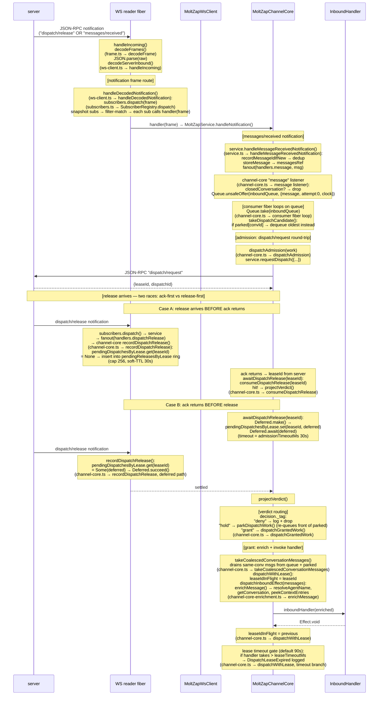

# Inbound Dispatch Sequence

← Back to [package ARCHITECTURE](../../ARCHITECTURE.md)

Full path from raw wire bytes to `InboundHandler` invocation, including the
lease admission state machine and the ack/release race buffer.

**parkedByConversation logic**: when a `hold` verdict is issued,
`parkDispatchWork()` in `channel-core.ts` inserts the item at the front of
the `parked[convId]` queue. `takeDispatchCandidate` prioritises parked items
for that conversation so backpressure within one conversation does not starve
others.

See also:
- [Notification Subscription Flow](./04-notification-subscription.md) — how
  the `subscribers.dispatch` call above routes to registered handlers.
- [State Machines](./07-state-machines.md) — the dispatch lease state machine
  that formalises the PENDING → AWAITING_RELEASE → GRANTED/DENIED/HELD →
  IN_FLIGHT → CONSUMED/EXPIRED transitions.
- [Error Taxonomy](./05-error-taxonomy.md) — `DispatchAdmissionTimedOut` and
  `DispatchLeaseExpired` error types.
