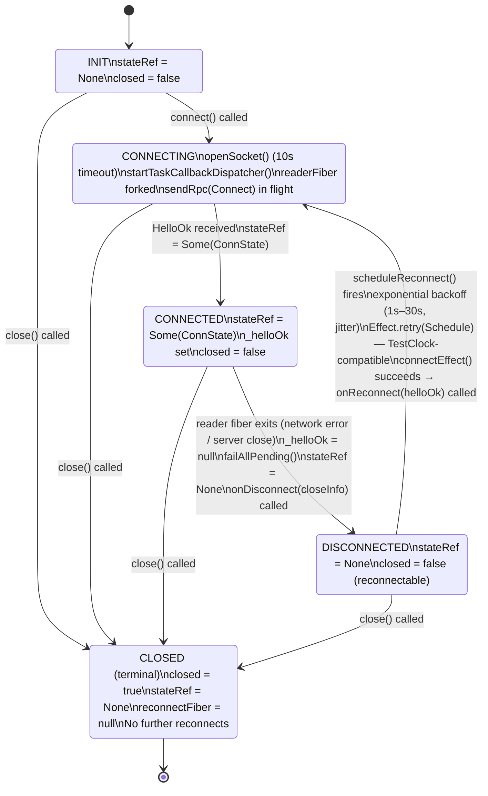

# State Machines

← Back to [package ARCHITECTURE](../../ARCHITECTURE.md)

## Dispatch Lease State Machine

One lease per `dispatch/request` call. Managed jointly by server
(LeaseRegistry) and `MoltZapChannelCore` on the client side.

```mermaid
stateDiagram-v2
    [*] --> PENDING

    PENDING : PENDING\ndispatch/request sent\n(channel-core.ts → dispatchAdmission)\nserver minting lease

    PENDING --> AWAITING_RELEASE : dispatch/request ack returns {leaseId}

    AWAITING_RELEASE : AWAITING_RELEASE\nDeferred registered (or ring-buffered entry consumed)\n(channel-core.ts → awaitDispatchRelease)

    AWAITING_RELEASE --> GRANTED : dispatch/release arrives\nverdict.decision = "grant"
    AWAITING_RELEASE --> DENIED : dispatch/release arrives\nverdict.decision = "deny"
    AWAITING_RELEASE --> HELD : dispatch/release arrives\nverdict.decision = "hold"

    GRANTED : GRANTED\nproceed to enrichment
    DENIED : DENIED\ndrop message; log;\nconsumer fiber continues
    HELD : HELD\nparkDispatchWork();\nre-queued at front of parked[convId]

    GRANTED --> IN_FLIGHT : dispatchGrantedWork()

    IN_FLIGHT : IN_FLIGHT\nleaseIdInFlight = leaseId\n(channel-core.ts → dispatchWithLease)\nInboundHandler executing\n(lease authorizes one messages/send call)

    IN_FLIGHT --> CONSUMED : handler completes within leaseTimeoutMs (90s default)\nserver marks via dispatchLeaseId in messages/send params
    IN_FLIGHT --> EXPIRED : handler exceeds leaseTimeoutMs\nDispatchLeaseExpired logged;\nserver-side lease times out independently

    CONSUMED --> [*]
    DENIED --> [*]
    EXPIRED --> [*]
```

**Annotations:**
- `HELD` re-enters the queue: `takeDispatchCandidate` prioritises the `parked[convId]` front so the same conversation gets another dispatch attempt without starving other conversations.

See also: [Inbound Dispatch Sequence](./03-inbound-dispatch.md) for the full
sequence that drives these state transitions, including the ack/release race
(Cases A and B).

## Connection State Machine

`MoltZapWsClient` transitions, driven by `stateRef` and the `closed` flag.



**Annotations:**
- `close()` actions (any state): `closed = true`, reconnectFiber interrupted, `failAllPending()`, `failAllNotificationWaiters()`, `subscribers.closeAll`, `write(CloseEvent(1000))` if handshake completed, `Scope.close(scope)`, `Scope.close(dispatcherScope)` [via runFork], `runtime.dispose()`.

See also: [Connection Lifecycle](./01-connection-lifecycle.md) for the
bootstrap sequence and reconnect arm that drive these transitions.
