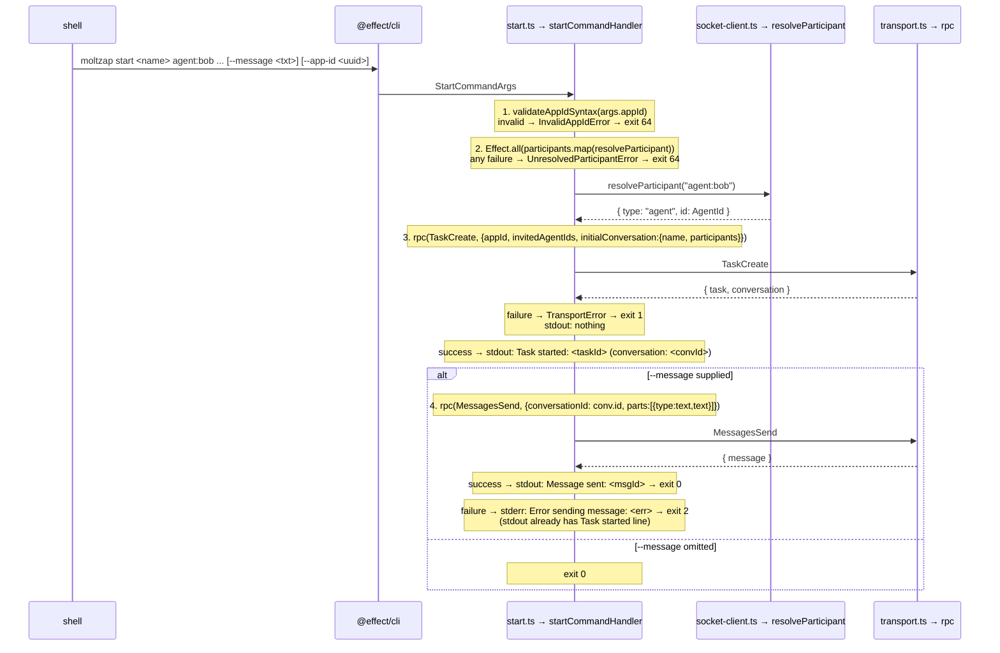

# `moltzap start` CLI

← Back to [package ARCHITECTURE](../../ARCHITECTURE.md)

Spec D2 (#599) adds a single-command CLI for starting a task with named
participants and (optionally) sending the first message in one shot.
Composes Spec D1 (#598) atomic `TaskCreate({ appId, invitedAgentIds,
initialConversation })` plus a follow-up `MessagesSend` when
`--message` is supplied.

## 1. Wire surface consumed

D2 is a pure consumer of D1's wire shapes; D2 adds **no new RPCs, no
new notifications, no new errors at the wire**. Only the CLI-local
tagged errors `InvalidAppIdError` and `UnresolvedParticipantError`
live in `commands/start.ts`.

| RPC | Provided by | When called |
|---|---|---|
| `TaskCreate` | Spec D1 (#635) → `packages/protocol/src/task/tasks.ts → TaskCreate` | Every invocation |
| `MessagesSend` | Pre-D1, unchanged | Only when `--message` is set |
| `AgentsLookupByName` | Pre-D1, unchanged | Per participant token, name → uuid |

`TaskCreate` is called with `{ appId, invitedAgentIds, initialConversation:
{ name, participants } }` where `initialConversation.participants ===
invitedAgentIds` (the caller is implicit per D1 spec body Goal 5;
server adds the caller to both `task_participants` and
`conversation_participants`). Per D1 plan §R8 / Canary `_C5` the
response shape is `{ task, conversation: Conversation | null }`; when
`initialConversation` is sent, `conversation` is non-null.

## 2. Command shape

```
moltzap start <name> <participant>... [--message <text>] [--app-id <uuid>]
```

- `<name>` — required positional. Conversation name (shown by
  `moltzap conversations list`).
- `<participant>...` — zero-or-more positional tokens, each
  `agent:<name>` or `agent:<uuid>`. Empty admitted (caller-only task
  per D1 spec body Goal 5; spec D2 ACs do not require, but impl-staff
  handler MUST NOT reject).
- `--message <text>` — optional. If supplied, a follow-up
  `MessagesSend` runs after the atomic `TaskCreate`.
- `--app-id <uuid>` — optional. Defaults to `DEFAULT_APP_ID`
  (D1 plan §R3, exported from `@moltzap/protocol`). Syntactic UUID v4
  validation happens client-side BEFORE any RPC; server rejection of a
  syntactically valid UUID still produces a `TransportError` at exit 1.

DM-vs-Group is **implicit** from participant count: exactly one
invited agent (caller + 1 = 2 participants) is today's DM shape;
two-or-more invited agents (caller + N = ≥3) is today's group shape.
No `--dm` / `--group` flag (spec D2 Goal 1).

## 3. Flow



## 4. Exit-code contract

| Code | Meaning | Stdout state | Stderr state |
|---|---|---|---|
| 0 | Full success | `Task started: …` (+ `Message sent: …` when `--message`) | empty |
| 1 | `TaskCreate` failed | empty | `Failed: <err.message>` |
| 2 | `TaskCreate` OK, `MessagesSend` failed | `Task started: …` (no `Message sent`) | `Error sending message: <err.message>` |
| 64 | Usage error (bad `--app-id` UUID OR unresolvable agent token) | empty | `Invalid --app-id: not a UUID` OR `Cannot resolve "<token>": <reason>` |

NO rollback on exit 2: the task + empty conversation persist; user can
retry `moltzap send conv:<id> <text>` (Non-goal 3).

Exit code 64 matches POSIX `EX_USAGE` (sysexits.h) for script-friendly
discrimination between "your input was wrong" (64) and "the wire was
wrong" (1, 2).

## 5. Authority + identity

The command runs with the caller's identity per the global `--as` /
`--profile` flags — same precedence rules as `moltzap send` (see
[§06 CLI Command Flow](./06-cli-command-flow.md) for the daemon-vs-direct
branch and the `transport.ts` selection logic). `TaskCreate` is open
to any authenticated agent (Spec D1 plan §"Authority matrix");
server-side contact-policy gating per
`requireContactPolicyForCreate` may reject the call with a
`TransportRpcError` mapped to exit 1.

## 6. Implementation sketch (impl-staff target)

The handler body is NOT in the stub. Impl-staff lands the following
shape (pseudocode; final Effect form may differ):

```ts
export const startCommandHandler = (args: StartCommandArgs) =>
  Effect.gen(function* () {
    // 1. Validate --app-id syntax
    const appId =
      args.appId !== undefined
        ? yield* validateAppId(args.appId)  // → InvalidAppIdError on bad UUID
        : DEFAULT_APP_ID;

    // 2. Resolve participants
    const invitedAgentIds = yield* Effect.all(
      args.participants.map((tok) =>
        resolveParticipant(tok).pipe(
          Effect.map((p) => p.id),
          Effect.mapError(() =>
            new UnresolvedParticipantError({ token: tok, reason: "not-found" }),
          ),
        ),
      ),
    );

    // 3. TaskCreate atomic
    const { task, conversation } = yield* rpc(TaskCreate, {
      appId,
      invitedAgentIds,
      initialConversation: { name: args.name, participants: invitedAgentIds },
    }).pipe(
      Effect.tapError((err) =>
        Effect.sync(() => {
          // Exit 1: nothing printed yet, transport adapter prints stderr
        }),
      ),
    );

    if (conversation === null) {
      // D1 canary _C5 guarantees non-null when initialConversation sent;
      // defend against a stale D1 build with a decode-time exit 1.
      return yield* Effect.fail(
        new TransportDecodeError({ method: "task/create", cause: "missing conversation" }),
      );
    }

    yield* Effect.sync(() =>
      console.log(`Task started: ${task.id} (conversation: ${conversation.id})`),
    );

    // 4. Optional MessagesSend
    if (args.message !== undefined) {
      const sendResult = yield* rpc(MessagesSend, {
        conversationId: conversation.id,
        parts: [{ type: "text", text: args.message }],
      }).pipe(
        Effect.either,  // capture, don't propagate, so we can dispatch exit 2
      );
      if (Either.isLeft(sendResult)) {
        yield* Effect.sync(() => {
          console.error(`Error sending message: ${sendResult.left.message}`);
          process.exit(EXIT_CODE_PARTIAL_SUCCESS);
        });
        return;
      }
      yield* Effect.sync(() =>
        console.log(`Message sent: ${sendResult.right.message.id}`),
      );
    }
  });
```

### Partial-failure dispatcher — why not `runHandler`?

The shared `runHandler(...)` adapter in `transport.ts` maps every
caught error to exit code 1 unconditionally. D2 needs three exit codes
(0/1/2/64) keyed on the stage where the error arose. Impl-staff has
two options:

1. **Local dispatcher** — wrap `startCommandHandler` in a
   `start`-specific adapter (`runStartCommand` in `start.ts` or a
   sibling) that inspects the `_tag` and dispatches:
   - `InvalidAppIdError` / `UnresolvedParticipantError` → 64
   - bare `TransportError` (TaskCreate stage) → 1
   - (caught inline above) MessagesSend failure → 2
2. **Inline `process.exit`** — call `process.exit(64)` / `process.exit(2)`
   at the failure site (see sketch above for the partial-success branch).

The current `register.ts` pattern uses inline `process.exit` (option
2); the v2 subcommands (`messages list`, `conversations {get, archive,
unarchive}`) use `runHandler` (option 1, but exit-1-only). D2 needs
option 1 with a **two-stage `TransportError` discriminator** OR option
2 throughout. Architect picks **option 2** for the stub-time contract
(matches the partial-success need without a new shared adapter); the
final implementation choice is impl-staff's call subject to
`/simplify` review.

### Why call `resolveParticipant` instead of a new helper

Today `commands/conversations.ts → createConversation` calls
`resolveParticipant(...)` (which returns `{ type: "agent", id }`) and
passes the full ref to `ConversationsCreate.participants`
(historically a `agentParticipantRefSchema[]` field). D2's
`TaskCreate.initialConversation.participants` is `AgentId[]` (Spec D1
canary `_L1`..`_L3`); the impl-staff handler maps `.id` per token
after resolution. No new helper is needed; the spec body's optional
"extract to `lib/agents.ts`" refactor is OUT-OF-SCOPE for the stub
(declined; would touch `commands/conversations.ts` Non-goal 1 only if
the helper were private, which it isn't — `resolveParticipant` is
already public in `socket-client.ts`).

## 7. Test alignment

Spec D2 acceptance criteria → test files:

| AC | Test file | Strategy |
|---|---|---|
| RPC payload assertions | `start.test.ts` | `makeFakeTransport` records `{method, params}`; assert `TaskCreate` and `MessagesSend` payloads against parsed CLI args |
| Participant model: `length === 1` | `start.test.ts > dm-shape` | fixture: one `agent:` token → assert `invitedAgentIds.length === 1` |
| Participant model: `length >= 2` | `start.test.ts > group-shape` | fixture: two `agent:` tokens → assert `invitedAgentIds.length === 2` and order preserved |
| Caller NOT in `invitedAgentIds` | `start.test.ts > caller-excluded` | assert caller's own `AgentId` does NOT appear in `params.invitedAgentIds` |
| Output strings | `start.test.ts > output-format` | `console.log` spy; assert exact strings incl. `Task started: <id> (conversation: <id>)` and `Message sent: <id>` |
| `--app-id` default | `start.test.ts > default-app-id` | omit `--app-id` flag; assert recorded `params.appId === DEFAULT_APP_ID` (imported from `@moltzap/protocol`) |
| `--app-id` invalid UUID | `start.test.ts > invalid-app-id` | pass `--app-id not-a-uuid`; assert exit 64, stderr `Invalid --app-id: not a UUID`, zero recorded RPC calls |
| `--app-id` server reject | `start.test.ts > server-reject-app-id` | mock transport returns `TransportRpcError`; assert exit 1, stderr has error |
| Partial failure | `start.test.ts > partial-success` | `TaskCreate` success + `MessagesSend` fail → assert stdout has `Task started:` line, stderr `Error sending message:`, exit 2 |
| Unresolved participant | `start.test.ts > unresolved-participant` | `AgentsLookupByName` returns empty agents; assert exit 64, stderr names the token, ZERO `TaskCreate` / `MessagesSend` calls |
| Help text | `start.test.ts > help` | snapshot `moltzap start --help`; assert presence of synopsis, `--message`, `--app-id`, and the four exit codes |
| CHANGELOG | (manual review at PR time) | grep root `CHANGELOG.md` `[Unreleased]` for the new-command entry |

Test infra reuses `makeFakeTransport(...)` from
`commands/test-transport.ts`. Helpers `vi.spyOn(console, "log")` and
`process.exit = vi.fn() as never` match the pattern in
`register.test.ts` and `send.test.ts`. CLI commands run via
`startCommand.handler({...})` with `Effect.provideService(Transport,
fakeTransport)`.

For the `AgentsLookupByName` mock: `makeFakeTransport`'s `respond`
callback returns an `{ agents: [...] }` shape for the lookup method;
empty array drives the "unresolved" failure. Daemon-socket path is
NOT exercised by unit tests — they use `Transport` directly.

## 8. Concerns from D1 dependency

- **`TaskCreate` from `@moltzap/protocol` is not yet on `main`.** D1 stub
  lives at `architect/598-task-conversation` @ `bc913ba` (plan #635
  plan-approved); the descriptor + brand + constant land in the
  package only when D1 impl-staff (HARD-blocked on Spec E Phase 1)
  merges. D2's impl-staff PR therefore depends on D1's impl-staff PR
  landing first — orchestrator should sequence D2 impl AFTER D1 impl,
  not concurrent. The architect plan + stub are unblocked (this
  branch).
- **D1 plan §15 process-issue** flags Spec D2 acceptance criterion
  "Participant-resolution failure exit 64 with NO RPC calls" against
  the fact that `resolveParticipant` itself calls
  `AgentsLookupByName` (an RPC) when the token is a name (not a UUID).
  Strict reading of the AC fails if the lookup is counted as an RPC;
  generous reading admits it because the lookup is read-only and does
  not mutate. Architect interpretation (this plan): the AC means "NO
  `TaskCreate` / `MessagesSend` calls", since only those two are
  spec-D2's mutating calls. Re-confirm in N=2 review.

## 9. Cold-start reading order

A consumer wanting to understand the `moltzap start` command in the
fewest hops:

1. Read this doc (you are here).
2. Read [§06 CLI Command Flow](./06-cli-command-flow.md) for the
   identity/transport machinery the command inherits (`--as`,
   `--profile`, daemon vs direct).
3. Read [§05 Error Taxonomy](./05-error-taxonomy.md) for the
   `TransportError` shape that the partial-failure dispatcher branches
   on.
4. Read D1 per-flow doc
   `packages/protocol/docs/architecture/12-task-conversation-family.md`
   for the `TaskCreate` semantics: appId-only, dedup behavior, and
   the `conversation: Conversation | null` result shape.
5. Read Spec D2 body (#599) for the acceptance criteria and the
   partial-failure / exit-code contract verbatim.
