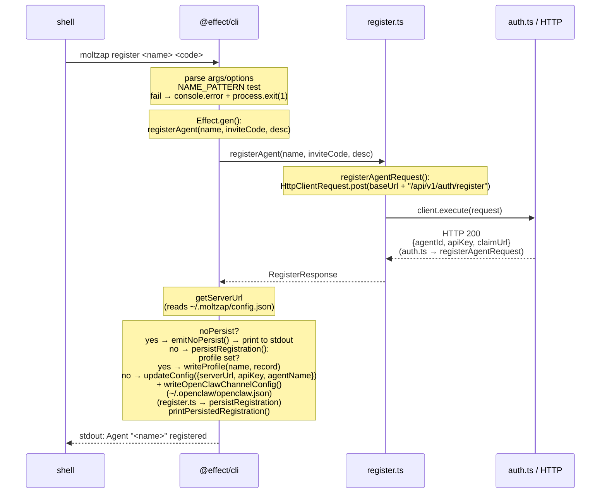
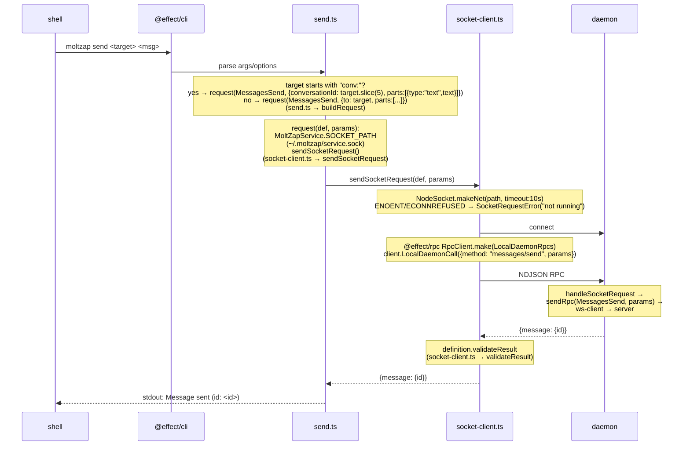

# CLI Command Flow

← Back to [package ARCHITECTURE](../../ARCHITECTURE.md)

## `moltzap register <name> <invite-code>`

## `moltzap send <target> <message>`

`moltzap send` routes through the local daemon socket — it does NOT
create its own `MoltZapAgentClient`; it delegates to the running
channel-plugin daemon via a Unix socket RPC call.

See also: [Error Taxonomy](./error-taxonomy.md) for `SocketRequestError`
and `ServiceInputError` which are raised in these flows.
