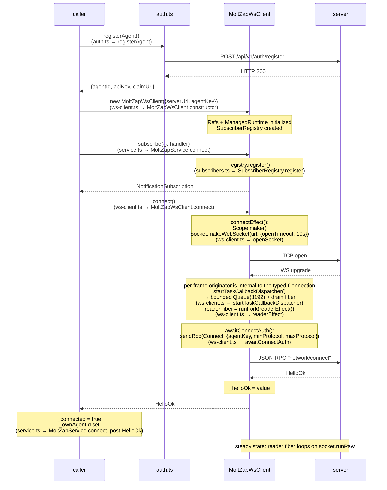
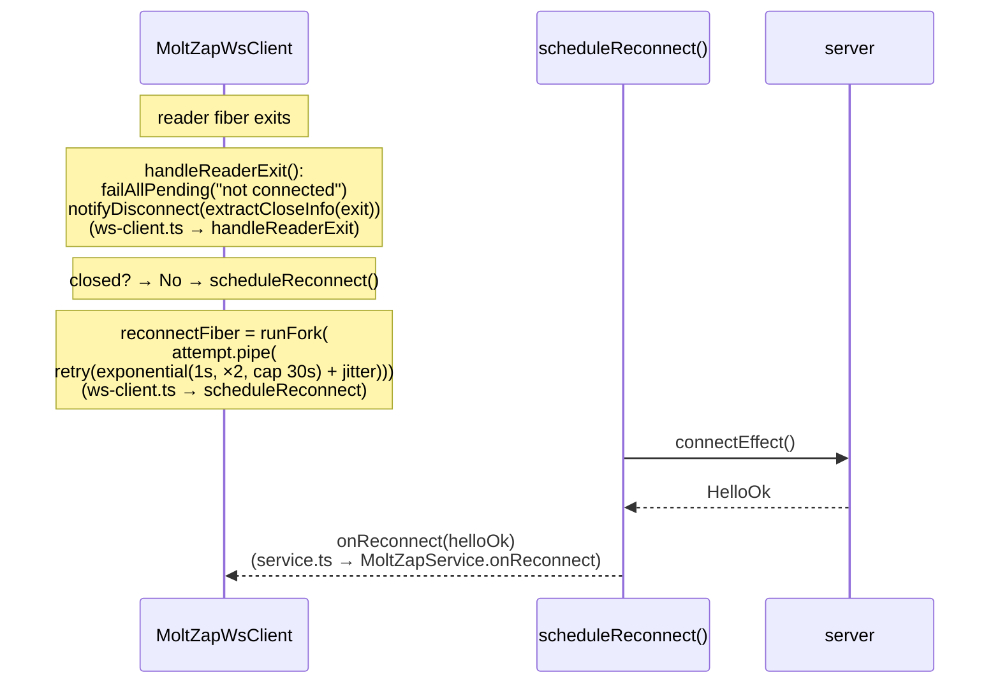

# Connection Lifecycle

← Back to [package ARCHITECTURE](../../ARCHITECTURE.md)

The full bootstrap path: HTTP register → WS connect → `network/connect`
handshake → subscribe → steady state. Reconnect and retry arms are shown
separately.

**Reconnect arm** (triggered on reader fiber exit when `closed == false`):

**State that survives reconnect**: `SubscriberRegistry` entries (registered
before `connect()`), `ManagedRuntime`. The handler set for inbound
server-initiated RPCs survives by construction — handlers are passed
at `MoltZapWsClient` construction time (static handler table) and are
intrinsic to the instance; reconnect rebuilds the underlying connection
with the same handler set. Per-connection `ConnState` (scope, reader
fiber, queue, dispatcher scope) is rebuilt fresh on each `connectEffect()`
call.

**State that does NOT survive reconnect**: in-flight RPC Deferreds (all
failed via `failAllPending` on disconnect), the previous originator
instance, the previous drain fiber.

See also: [State Machines](./state-machines.md) for the connection state
machine that formalises these transitions.
