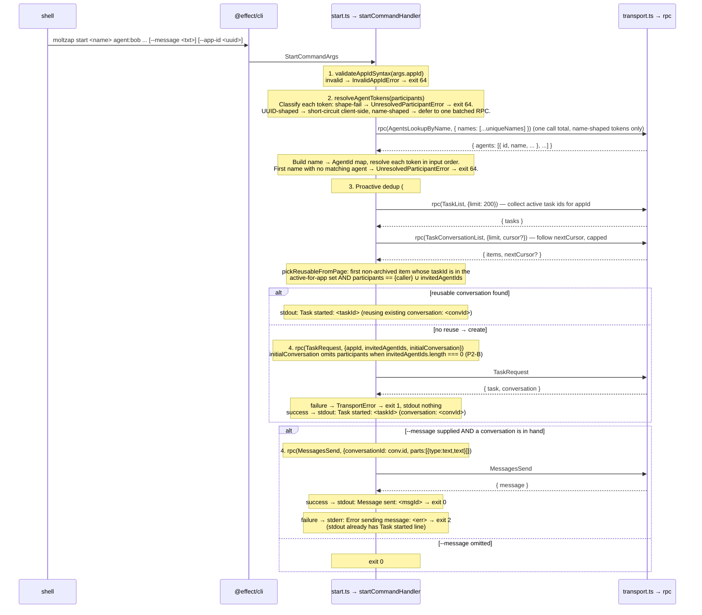

# `moltzap start` CLI

← Back to [package ARCHITECTURE](../../ARCHITECTURE.md)

Spec D2 (#599) adds a single-command CLI for starting a task with named
participants and (optionally) sending the first message in one shot.
Composes Spec D1 (#598) atomic `TaskRequest({ appId, invitedAgentIds,
initialConversation })` plus a follow-up `MessagesSend` when
`--message` is supplied.

## 1. Wire surface consumed

D2 is a pure consumer of D1's wire shapes; D2 adds **no new RPCs, no
new notifications, no new errors at the wire**. Only the CLI-local
tagged errors `InvalidAppIdError` and `UnresolvedParticipantError`
live in `commands/start.ts`.

| RPC | Provided by | When called |
|---|---|---|
| `TaskRequest` | Spec D1 (#635) → `packages/protocol/src/task/tasks.ts → TaskRequest` | Only when the proactive dedup scan finds no reusable conversation |
| `MessagesSend` | Pre-D1, unchanged | Only when `--message` is set |
| `AgentsLookupByName` | Pre-D1, unchanged | Per name-shaped participant token (uuid-shaped tokens skip the lookup) |
| `TaskList` | Spec D1 → `packages/protocol/src/task/tasks.ts → TaskList` | Proactive DM dedup (#685): one call to collect the caller's active task ids under `appId` (skipped for zero-participant `start`s) |
| `TaskConversationList` | Spec D1 (#598) → `packages/protocol/src/task/tasks.ts → TaskConversationList` | Proactive DM dedup (#685): paginated scan to find a non-archived conversation whose task participant set matches `{caller} ∪ invitedAgentIds` |

**All three RPCs go through `transport.ts → rpc(...)` (the CLI
`Transport` service), NOT `socket-client.ts → request(...)` (the
daemon-socket helper). D2 deliberately does not reuse
`socket-client.ts → resolveParticipant` because that helper hard-wires
the daemon-socket path — it would break `--as` direct-WS invocations
and would not be mockable via `commands/test-transport.ts →
makeFakeTransport`. Architect plan §R1 explains the divergence; the
local resolver `start.ts → resolveAgentTokens` is the new helper that
covers D2's testability + transport-uniformity needs.**

`TaskRequest` is called with `{ appId, invitedAgentIds, initialConversation
}` where `initialConversation` carries `participants: invitedAgentIds`
ONLY when `invitedAgentIds.length > 0` — the caller-only path
(`invitedAgentIds === []`) MUST omit the `participants` field entirely
because `InitialConversationSchema.participants` is
`Type.Optional(Type.Array(AgentId, { minItems: 1 }))` (P2-B carve-out
named in spec D2 amendment N7; pinned by `start.test.ts →
zeroParticipants`). The server adds the caller to both
`task_participants` and `conversation_participants` implicitly.

### Proactive "one DM per pair" dedup (#685)

Server-side `DEFAULT_APP_ID` dedup was retired in #677; the D3 server
always mints + returns a conversation when `task/request` is accepted
with an `initialConversation` (the `conversation: null` arm only fires
when no `initialConversation` was supplied — which `start` never does).
The "one DM per pair" UX therefore runs **client-side and BEFORE**
`TaskRequest`:

1. `findReusableDmConversation(appId, invitedAgentIds)` — skipped
   entirely for zero-participant (solo) `start`s.
2. `TaskList` (one call) collects the caller's `active` task ids under
   `appId`. `TaskConversationListItem` carries no `appId`, so this is
   how the scan is scoped to the requested app.
3. `TaskConversationList` (paginated, capped at `DEDUP_SCAN_MAX_PAGES`)
   is scanned for the first non-archived conversation whose `taskId` is
   in that active set AND whose task participant set matches
   `{caller} ∪ invitedAgentIds`. The caller is implicitly in every
   listed task, so the match is `invited ⊆ participants` and
   `|participants| === |unique(invited)| + 1` — no need to know the
   caller's own agent id.
4. On a hit → reuse that conversation, print the `Task started:` line
   with a `reusing existing conversation:` label, and skip `TaskRequest`.
   On a miss (or a transient scan failure — the scan is best-effort) →
   fall through to `TaskRequest` and create a fresh task.

## 2. Command shape

```
moltzap start <name> <participant>... [--message <text>] [--app-id <uuid>]
```

- `<name>` — required positional. Conversation name (shown by
  `moltzap conversations list`).
- `<participant>...` — zero-or-more positional tokens, each
  `agent:<name>` or `agent:<uuid>`. Empty admitted (caller-only task
  per D1 spec body Goal 5; spec D2 ACs do not require, but impl-staff
  handler MUST NOT reject).
- `--message <text>` — optional. If supplied, a follow-up
  `MessagesSend` runs after the atomic `TaskRequest`.
- `--app-id <uuid>` — optional. Defaults to `DEFAULT_APP_ID`
  (D1 plan §R3, exported from `@moltzap/protocol`). Syntactic UUID v4
  validation happens client-side BEFORE any RPC; server rejection of a
  syntactically valid UUID still produces a `TransportError` at exit 1.

DM-vs-Group is **implicit** from participant count: exactly one
invited agent (caller + 1 = 2 participants) is today's DM shape;
two-or-more invited agents (caller + N = ≥3) is today's group shape.
No `--dm` / `--group` flag (spec D2 Goal 1).

## 3. Flow



## 4. Exit-code contract

| Code | Meaning | Stdout state | Stderr state |
|---|---|---|---|
| 0 | Full success (reused existing DM OR fresh create) | `Task started: …` (+ `Message sent: …` when `--message`) | empty |
| 1 | `TaskRequest` wire failure | empty | `Failed: <err.message>` |
| 2 | Reuse or create OK, `MessagesSend` failed | `Task started: …` (no `Message sent`) | `Error sending message: <err.message>` |
| 64 | Usage error (bad `--app-id` UUID OR unresolvable agent token OR >100 distinct name-shaped tokens) | empty | `Invalid --app-id: not a UUID` OR `Cannot resolve "<token>": <reason>` OR `Too many distinct agent names: <count> (max <max>)` |

NO rollback on exit 2: the task + empty conversation persist; user can
retry `moltzap send task:<taskId>:<conversationId> <text>` (Non-goal 3).

Exit code 64 matches POSIX `EX_USAGE` (sysexits.h) for script-friendly
discrimination between "your input was wrong" (64) and "the wire was
wrong" (1, 2).

## 5. Authority + identity

The command runs with the caller's identity per the global `--as` /
`--profile` flags — same precedence rules as `moltzap send` (see
[CLI Command Flow](./cli-command-flow.md) for the daemon-vs-direct
branch and the `transport.ts` selection logic). `TaskRequest` is open
to any authenticated agent (Spec D1 plan §"Authority matrix");
server-side contact-policy gating per
`requireContactPolicyForCreate` may reject the call with a
`TransportRpcError` mapped to exit 1.

## 6. Implementation sketch

The handler body lives in `commands/start.ts → startCommandHandler`.
Sketch matches the current code shape (proactive #685 dedup + P2-B
carve-out + P3-2 batched lookup all landed):

```ts
export const startCommandHandler = (args: StartCommandArgs) =>
  Effect.gen(function* () {
    // 1. Validate --app-id syntax (defaults to DEFAULT_APP_ID).
    const appId = yield* resolveAppId(args.appId);

    // 2. Resolve participants via the local Transport-routed helper.
    //    `resolveAgentTokens` coalesces all name-shaped tokens into ONE
    //    batched `rpc(AgentsLookupByName, { names: [...uniqueNames] })`
    //    call (P3-2); UUID-shaped tokens short-circuit client-side. The
    //    helper maps shape failures + lookup-empty results to
    //    `UnresolvedParticipantError` and returns bare `AgentId[]`
    //    matching `TaskRequest.params.invitedAgentIds` directly.
    const invitedAgentIds = yield* resolveAgentTokens(args.participants);
    const messageOpt = Option.fromNullable(args.message);

    // 3. Proactive "one DM per pair" dedup (#685), BEFORE create. Reuse an
    //    existing live conversation for this exact participant set under
    //    this app instead of minting a duplicate. Best-effort: a transient
    //    list-scan failure falls through to create. Skipped for zero
    //    participants (mirrors the P2-B / amendment N7 carve-out).
    const reuse = yield* findReusableDmConversation(appId, invitedAgentIds).pipe(
      Effect.orElseSucceed(() => null),
    );
    if (reuse !== null) {
      yield* printTaskReused(reuse.taskId, reuse.conversation);
      yield* Option.match(messageOpt, {
        onNone: () => Effect.void,
        onSome: (m) => sendFirstMessage(reuse.taskId, reuse.conversation.id, m),
      });
      return;
    }

    // 4. TaskRequest atomic. P2-B carve-out: when `invitedAgentIds` is
    //    empty, omit `participants` from `initialConversation` entirely
    //    (the schema's `Type.Array(AgentId, { minItems: 1 })` rejects
    //    `[]`; the server adds the caller to participants implicitly).
    const { task, conversation } = yield* createTaskAtomic(
      appId,
      invitedAgentIds,
      args.name,
    );
    yield* printTaskCreated(task, conversation);

    // 5. Optional MessagesSend. Wrapped in `Effect.either` so a wire
    //    failure surfaces as inline `process.exit(2)` (preserves the
    //    already-printed `Task started:` stdout line) rather than
    //    routing through `runStartCommand`'s catchAll.
    yield* Option.match(messageOpt, {
      onNone: () => Effect.void,
      onSome: (m) => sendFirstMessage(task.id, conversation.id, m),
    });
  });
```

### Partial-failure dispatcher — canonical contract

The shared `runHandler(...)` adapter in `transport.ts` maps every
caught error to exit code 1 unconditionally. D2 needs three non-default
exit codes (2, 64, plus 0/1) keyed on the stage where the error
arose. Architect picks a **hybrid two-stage dispatcher**, codified in
the stub (`start.ts → runStartCommand` + `start.ts →
startCommandHandler`):

- **`runStartCommand(effect)`** is the outer adapter (replaces
  `runHandler` in the `Command.make` wrapper). It pattern-matches the
  caught `StartCommandError` on `_tag` and dispatches:
  - `InvalidAppIdError` → `process.exit(EXIT_CODES.USAGE_ERROR)` + stderr `Invalid --app-id: not a UUID`
  - `UnresolvedParticipantError` → `process.exit(EXIT_CODES.USAGE_ERROR)` + stderr `Cannot resolve "<token>": <reason>`
  - any other `StartCommandError` (the `TransportError` union from
    `transport.ts`, including `TransportRpcError`,
    `TransportDecodeError`, `ServiceUnreachableError`, etc.) →
    `process.exit(EXIT_CODES.TASK_CREATE_FAILED)` + stderr
    `Failed: <err.message>`
- **Inline `process.exit(EXIT_CODES.PARTIAL_SUCCESS)`** inside the
  handler body for the post-`TaskRequest` `MessagesSend` failure. This
  path cannot route through `runStartCommand` because the stdout
  `Task started: ...` line has already been printed; re-throwing the
  error and letting `runStartCommand` dispatch would discard the
  successful task creation from the user's view. The handler uses
  `Effect.either(rpc(MessagesSend, ...))` to catch in-band, then
  `Effect.sync(() => { console.error(...); process.exit(2); })`.

This split is the architect-locked contract. Impl-staff implements
both halves (the `Effect.catchAll` body of `runStartCommand` and the
`Effect.either` branch of the handler); `/simplify` review may
re-examine the partition but the exit-code-by-stage contract is fixed
by the spec D2 ACs.

Test-side: `process.exit = vi.fn() as never` (per `register.test.ts`
pattern); assert `expect(process.exit).toHaveBeenCalledWith(64)` /
`...(2)` / `...(1)` per scenario.

### Resolving `agent:` tokens

`start.ts → resolveAgentTokens` classifies each token (shape-fail /
UUID-shaped / name-shaped) and coalesces all name-shaped tokens into
ONE batched `rpc(AgentsLookupByName, { names: [...uniqueNames] })`
call; UUID-shaped tokens short-circuit client-side. Names with no
matching agent → `UnresolvedParticipantError({ token, reason:
"not-found" })`. Shape failures (no `agent:` prefix, etc.) →
`UnresolvedParticipantError({ token, reason: "shape" })`.

The resolver is transport-routed (uses the `Transport` Effect
service selected by `cli/index.ts → moltzapBase`), so unit tests
can intercept via `commands/test-transport.ts → makeFakeTransport`.

## 7. Test alignment

Spec D2 acceptance criteria → test files:

| AC | Test file | Strategy |
|---|---|---|
| RPC payload assertions | `start.test.ts` | `makeFakeTransport` records `{method, params}`; assert `TaskRequest` and `MessagesSend` payloads against parsed CLI args |
| Participant model: `length === 1` | `start.test.ts > dm-shape` | fixture: one `agent:` token → assert `invitedAgentIds.length === 1` |
| Participant model: `length >= 2` | `start.test.ts > group-shape` | fixture: two `agent:` tokens → assert `invitedAgentIds.length === 2` and order preserved |
| Caller NOT in `invitedAgentIds` | `start.test.ts > caller-excluded` | assert caller's own `AgentId` does NOT appear in `params.invitedAgentIds` |
| Output strings | `start.test.ts > output-format` | `console.log` spy; assert exact strings incl. `Task started: <id> (conversation: <id>)` and `Message sent: <id>` |
| `--app-id` default | `start.test.ts > default-app-id` | omit `--app-id` flag; assert recorded `params.appId === DEFAULT_APP_ID` (imported from `@moltzap/protocol`) |
| `--app-id` invalid UUID | `start.test.ts > invalid-app-id` | pass `--app-id not-a-uuid`; assert exit 64, stderr `Invalid --app-id: not a UUID`, zero recorded RPC calls |
| `--app-id` server reject | `start.test.ts > server-reject-app-id` | mock transport returns `TransportRpcError`; assert exit 1, stderr has error |
| Partial failure | `start.test.ts > partial-success` | `TaskRequest` success + `MessagesSend` fail → assert stdout has `Task started:` line, stderr `Error sending message:`, exit 2 |
| Unresolved participant | `start.test.ts > unresolved-participant` | `AgentsLookupByName` returns empty agents; assert exit 64, stderr names the token, ZERO `TaskRequest` / `MessagesSend` calls |
| Help text | `start.test.ts > help` | snapshot `moltzap start --help`; assert presence of synopsis, `--message`, `--app-id`, and the four exit codes |
| **Proactive dedup, reuse active DM** (#685) | `start.test.ts > dedupReusesActiveDm` | `TaskList` returns the active task; `TaskConversationList` one matching item; assert reuse stdout + NO `TaskRequest` call |
| **Proactive dedup, tie-break** (#685) | `start.test.ts > dedupPicksFirstActivityOrder` | first match in activity-desc order wins |
| **Proactive dedup + `--message`** (#685) | `start.test.ts > dedupReuseWithMessage` | `MessagesSend.params.conversationId === reused conversation id`; no `TaskRequest` |
| **Proactive dedup, filtering** (#685) | `start.test.ts > dedupFiltersArchivedAndOtherTask` | out-of-app-scope tasks AND `archivedAt !== undefined` items skipped |
| **Proactive dedup, app scoping** (#685) | `start.test.ts > dedupScopesToRequestedApp` | a match under another app is NOT reused → create |
| **Proactive dedup, participant exactness** (#685) | `start.test.ts > dedupParticipantSetMustMatchExactly` | group request does not reuse a smaller DM → create |
| **Proactive dedup, zero-participant carve-out** (#685) | `start.test.ts > dedupSkippedForZeroParticipants` | solo `start` makes NO `TaskList`/`TaskConversationList` call → create |
| **Proactive dedup, best-effort scan** (#685) | `start.test.ts > dedupBestEffortOnScanFailure` | a `TaskList` failure falls through to create, exit 0 |
| **Proactive dedup, pagination** (#685) | `start.test.ts > dedupPaginatesConversationList` | first page misses → follow `nextCursor` until match |
| **Proactive dedup, scan cap** (#685) | `start.test.ts > dedupCapsScanAndFallsThroughToCreate` | caps at `DEDUP_SCAN_MAX_PAGES`, then creates |
| **Zero-participant wire shape** (P2-B carve-out) | `start.test.ts > zeroParticipants` | `TaskRequest.params.initialConversation` deep-equals `{ name }` (no `participants` key) |
| CHANGELOG | (manual review at PR time) | grep root `CHANGELOG.md` `[Unreleased]` for the new-command entry |

Test infra reuses `makeFakeTransport(...)` from
`commands/test-transport.ts`. Helpers `vi.spyOn(console, "log")` and
`process.exit = vi.fn() as never` match the pattern in
`register.test.ts` and `send.test.ts`. CLI commands run via
`startCommand.handler({...})` with `Effect.provideService(Transport,
fakeTransport)`.

For the `AgentsLookupByName` mock: `makeFakeTransport`'s `respond`
callback returns an `{ agents: [...] }` shape for the lookup method;
empty array drives the "unresolved" failure. Daemon-socket path is
NOT exercised by unit tests — they use `Transport` directly.

## 8. Concerns from D1 dependency

- **`TaskRequest` from `@moltzap/protocol` is not yet on `main`.** D1 stub
  lives at `architect/598-task-conversation` @ `bc913ba` (plan #635
  plan-approved); the descriptor + brand + constant land in the
  package only when D1 impl-staff (HARD-blocked on Spec E Phase 1)
  merges. D2's impl-staff PR therefore depends on D1's impl-staff PR
  landing first — orchestrator should sequence D2 impl AFTER D1 impl,
  not concurrent. The architect plan + stub are unblocked (this
  branch).
- **Spec D2 AC interpretation: "NO RPC calls" reads as "no mutating
  RPC calls".** `start.ts → resolveAgentTokens` calls
  `rpc(AgentsLookupByName, ...)` (batched, one call total) for
  name-shaped tokens (a server RPC), which the strict reading of the
  AC would prohibit. Architect
  interpretation: the AC means "NO `TaskRequest` / `MessagesSend`
  calls", since only those two are spec-D2's mutating calls. The
  read-only lookup is intentional + necessary (UUID-only tokens are
  the only alternative and would break the `agent:&lt;name>`
  shorthand). Re-confirmed in r2 N=2 review.

## 9. Cold-start reading order

A consumer wanting to understand the `moltzap start` command in the
fewest hops:

1. Read this doc (you are here).
2. Read [CLI Command Flow](./cli-command-flow.md) for the
   identity/transport machinery the command inherits (`--as`,
   `--profile`, daemon vs direct).
3. Read [Error Taxonomy](./error-taxonomy.md) for the
   `TransportError` shape that the partial-failure dispatcher branches
   on.
4. Read D1 per-flow doc
   `packages/protocol/docs/architecture/12-task-conversation-family.md`
   for the `TaskRequest` semantics: appId-only, dedup behavior, and
   the `conversation: Conversation | null` result shape.
5. Read Spec D2 body (#599) for the acceptance criteria and the
   partial-failure / exit-code contract verbatim.
