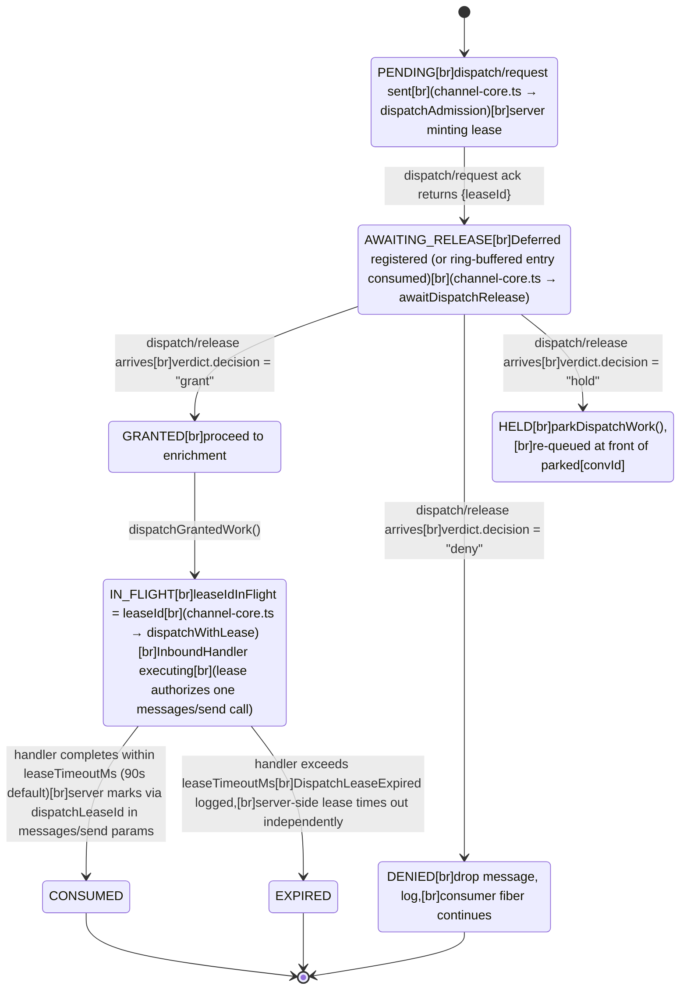
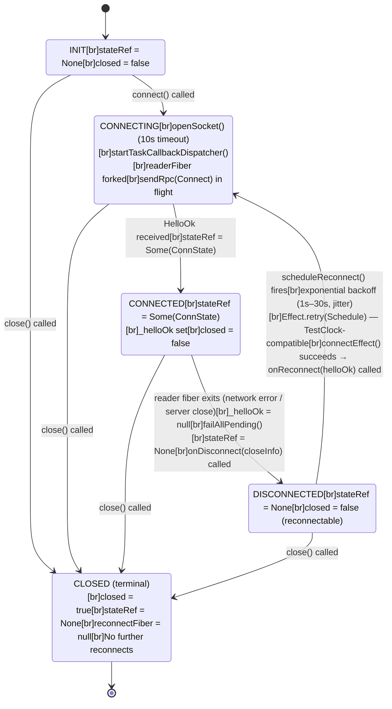

# State Machines

← Back to [package ARCHITECTURE](../../ARCHITECTURE.md)

## Dispatch Lease State Machine

One lease per `dispatch/request` call. Managed jointly by server
(LeaseRegistry) and `MoltZapChannelCore` on the client side.

**Annotations:**
- `HELD` re-enters the queue: `takeDispatchCandidate` prioritises the `parked[convId]` front so the same conversation gets another dispatch attempt without starving other conversations.

See also: [Inbound Dispatch Sequence](./inbound-dispatch.md) for the full
sequence that drives these state transitions, including the ack/release race
(Cases A and B).

## Connection State Machine

`MoltZapWsClient` transitions, driven by `stateRef` and the `closed` flag.

**Annotations:**
- `close()` actions (any state): `closed = true`, reconnectFiber interrupted, `failAllPending()`, `failAllNotificationWaiters()`, `subscribers.closeAll`, `write(CloseEvent(1000))` if handshake completed, `Scope.close(scope)`, `Scope.close(dispatcherScope)` [via runFork], `runtime.dispose()`.

See also: [Connection Lifecycle](./connection-lifecycle.md) for the
bootstrap sequence and reconnect arm that drive these transitions.
