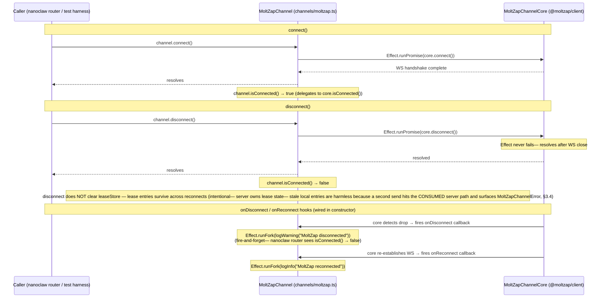

# connect / disconnect Lifecycle

← Back to [package ARCHITECTURE](../../ARCHITECTURE.md)

`connect()` and `disconnect()` are Promise-boundary adapters — they wrap
Effect values to satisfy nanoclaw's `Channel` interface (see `ownsJid` in
`types.ts`). The channel does not own any WS socket directly; all transport
is in `MoltZapChannelCore` (from `@moltzap/client`).

---

Previous: [01 — Channel Construction + registerChannel Hook](./01-construction-and-registry.md)
Next: [03 — Inbound Flow](./03-inbound-flow.md)
