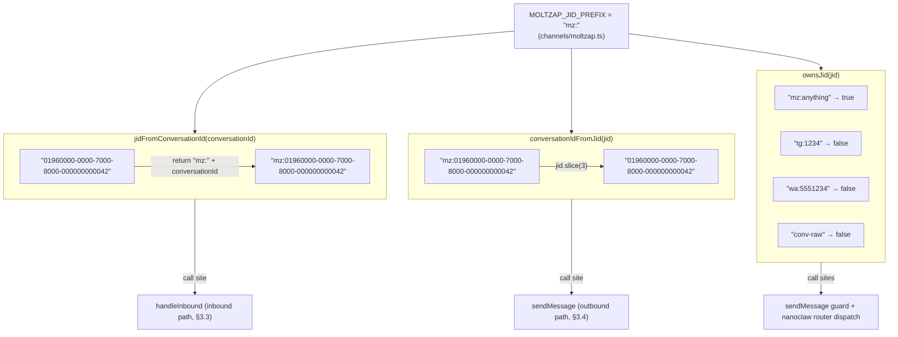

# JID ↔ ConversationId Conversions

← Back to [package ARCHITECTURE](../../ARCHITECTURE.md)

The channel uses a lightweight prefix scheme. There is no registry lookup
or validation — conversions are pure string operations.

**Why no regex?** The conversationId is a server-issued UUID. Slice is O(1), the prefix
is fixed, and there is no ambiguity — no other channel registered in
this package uses the `"mz:"` prefix. openclaw-channel uses the same
scheme; the smoke-test package intentionally mirrors it to catch
prefix-collision regressions.

---

Previous: [04 — Outbound sendMessage Flow](./04-outbound-send-message.md)
Next: [06 — Chat Metadata + Auto-Register](./06-chat-metadata-auto-register.md)
