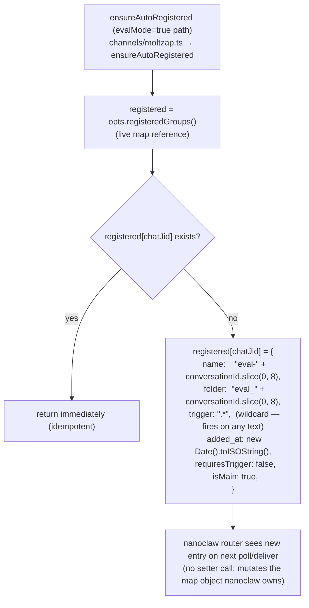
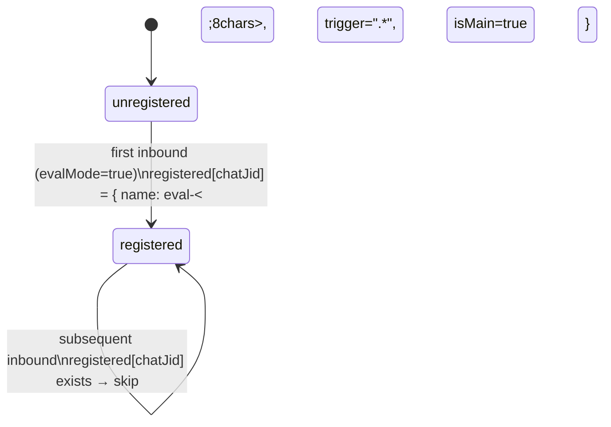

# emitChatMetadata + ensureAutoRegistered

← Back to [package ARCHITECTURE](../../ARCHITECTURE.md)

`emitChatMetadata` fires on every inbound message, always before
`onMessage` (enforced by call order in `handleInbound`, §3.3).
`ensureAutoRegistered` is an eval-mode-only side effect that mutates
nanoclaw's live `registeredGroups` map.

```mermaid
sequenceDiagram
    participant Handler as handleInbound (channels/moltzap.ts)
    participant Router as nanoclaw router

    Note over Handler: emitChatMetadata(chatJid, enriched)
    Handler->>Router: opts.onChatMetadata({<br/>  chatJid,           e.g. "mz:&lt;uuid&gt;"<br/>  timestamp: enriched.createdAt,     ISO-8601 string<br/>  name: enriched.conversationMeta?.name,   undefined for DMs<br/>  channel: "moltzap",<br/>  isGroup: enriched.conversationMeta?.type === "group"<br/>})
    Note over Router: indexes the chat record;<br/>subsequent message delivery uses this metadata for routing
```



**Registration state machine:**



**What nanoclaw does NOT do here (smoke-test minimalism):**
- No API call to fetch conversation membership.
- No persistent registration store — lives only in the in-process map.
- `evalMode=false` → `registeredGroups()` is never called; zero coupling to nanoclaw's group system in normal (non-eval) use.

**Constant:** `EVAL_GROUP_NAME_ID_CHARS = 8` (in `channels/moltzap.ts`)

---

Previous: [05 — JID Conversions](./05-jid-conversions.md)
Next: [07 — toNewMessage Projection](./07-to-new-message-projection.md)
