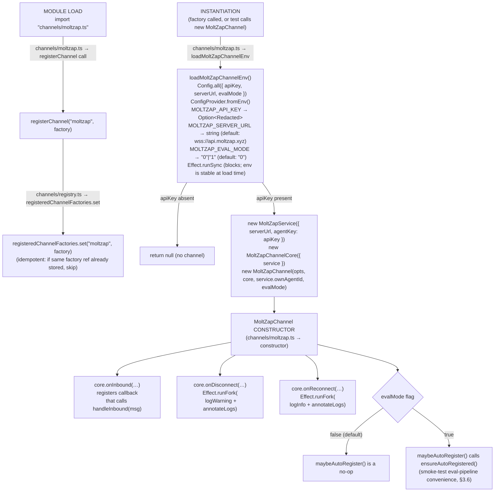

# Channel Construction + registerChannel Hook

← Back to [package ARCHITECTURE](../../ARCHITECTURE.md)

The module-load side effect and constructor wiring happen in two distinct
phases: import time (registry registration) and instantiation time
(hook wiring inside `MoltZapChannel`).

**What nanoclaw does NOT have here vs openclaw-channel:**
- No persistence layer — no SQLite or event-log writes on connect.
- No group-sync RPC — `syncGroups()` is not implemented (method absent
  from the `Channel` interface stub in `types.ts`).
- No `setTyping()` implementation.
- The registry is a minimal stub (`channels/registry.ts`), not nanoclaw's
  real channel registry; `registeredChannelFactories` is only used in
  tests — the factory is never invoked by nanoclaw's router in this
  package.

---

Next: [connect / disconnect Lifecycle](./connect-disconnect-lifecycle.md)
