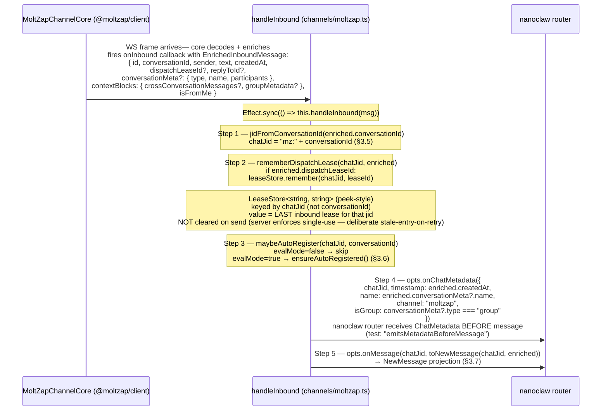

# Inbound Flow

← Back to [package ARCHITECTURE](../../ARCHITECTURE.md)

Inbound messages arrive from `MoltZapChannelCore` as
`EnrichedInboundMessage` objects (enriched by `@moltzap/client` with
conversation metadata and context blocks). The channel's callback,
registered in the constructor via `core.onInbound`, runs the full
inbound pipeline synchronously.

---

Previous: [connect / disconnect Lifecycle](./connect-disconnect-lifecycle.md)
Next: [Outbound sendMessage Flow](./outbound-send-message.md)
