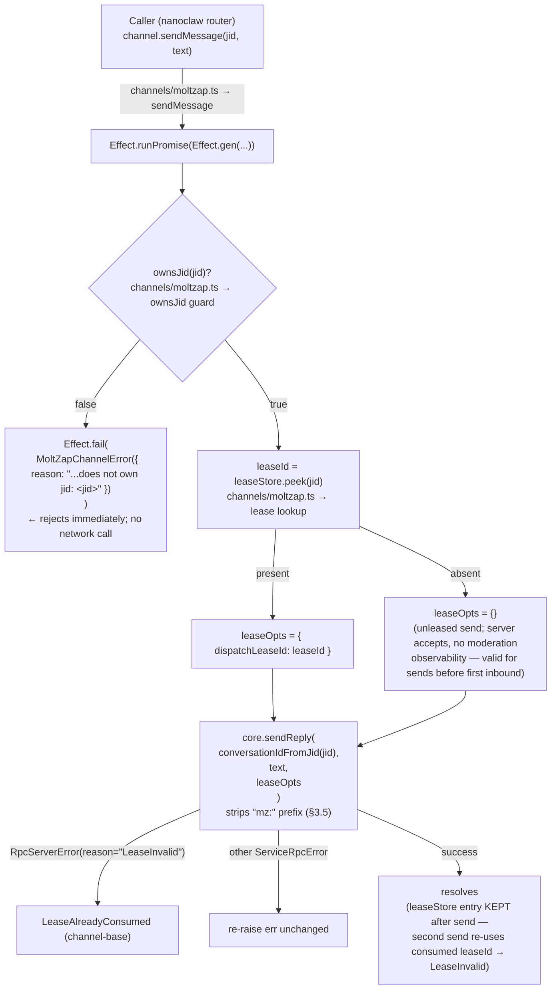

# Outbound sendMessage Flow

← Back to [package ARCHITECTURE](../../ARCHITECTURE.md)

`sendMessage` is the reply path. It enforces JID ownership, looks up the
most recent dispatch lease for the JID, and calls `core.sendReply`.
Single-use lease semantics are enforced server-side (cutover #533).

**Error taxonomy:**

- `MoltZapChannelError("...does not own jid...")` — `ownsJid()` returned false (wrong channel prefix)
- `LeaseAlreadyConsumed (channel-base)` — server returned `RpcServerError(reason="LeaseInvalid")`
- `ServiceRpcError` (other) — transport / auth / network errors; propagated as-is

---

Previous: [Inbound Flow](./inbound-flow.md)
Next: [JID Conversions](./jid-conversions.md)
