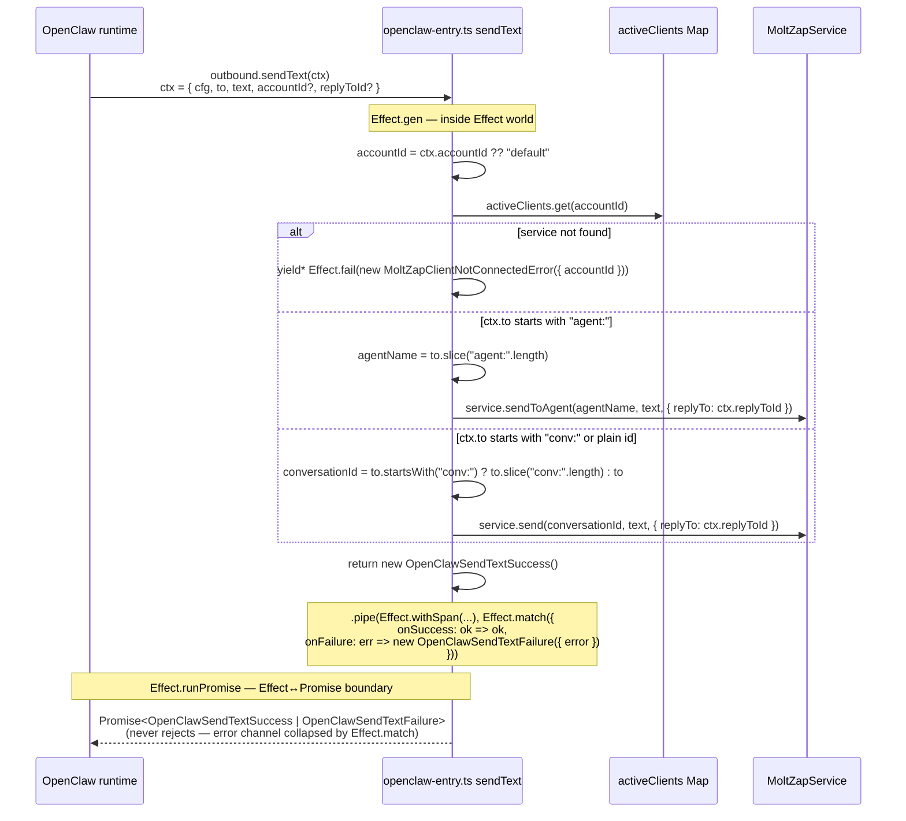

# Outbound `sendText` — Promise Boundary

← Back to [package ARCHITECTURE](../../ARCHITECTURE.md)

**Key invariants:**
- `Effect.match` collapses the error channel — `runPromise` never rejects.
- `MoltZapClientNotConnectedError` is the only typed failure; all others
  (`ServiceRpcError` from `service.send`) propagate through `Effect.match`'s
  `onFailure` arm and become `OpenClawSendTextFailure`.
- The `"conv:"` strip + fallback-to-plain-id is backward compat for
  callers that pass a raw conversation UUID.

---

See also:
- [07-resolve-target.md](07-resolve-target.md) — `outbound.resolveTarget` validation runs before sendText
- [05-deliver-error-handling.md](05-deliver-error-handling.md) — the deliver callback that sends replies via the inbound path
