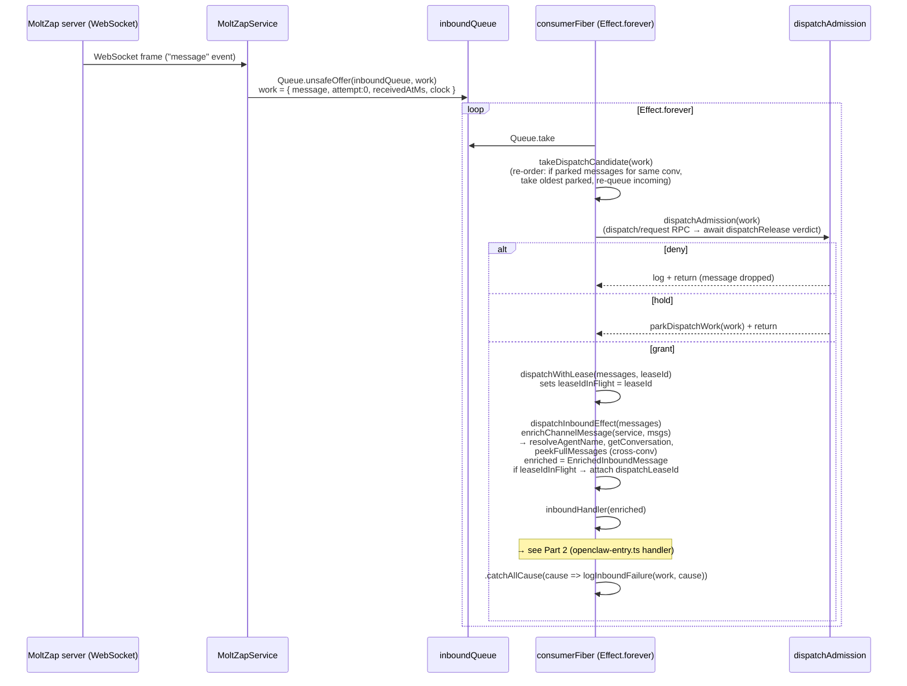
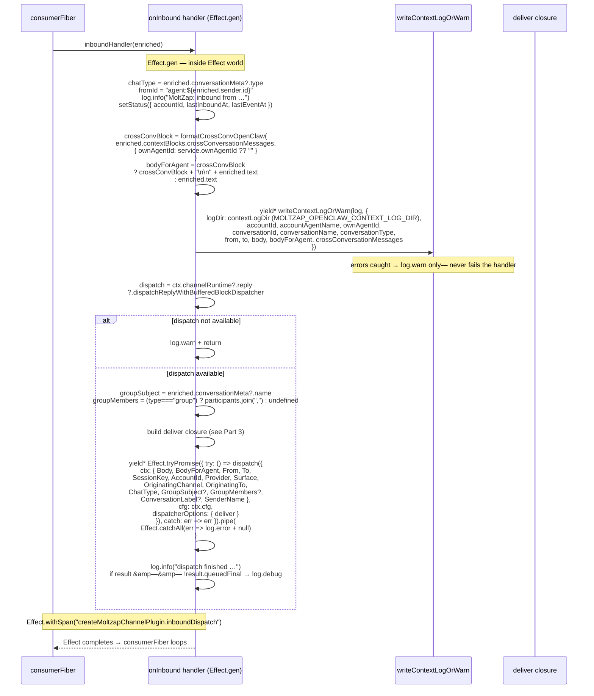
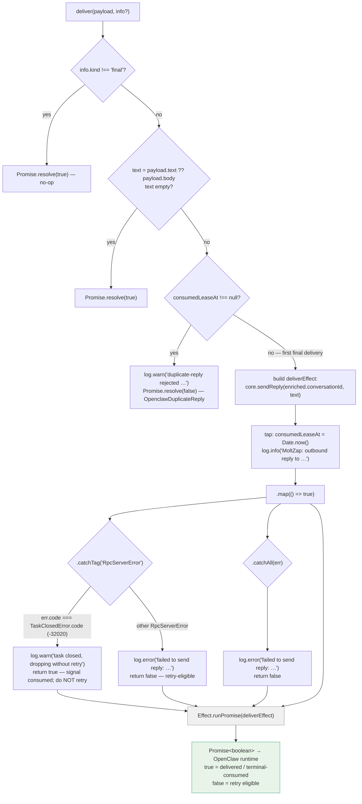
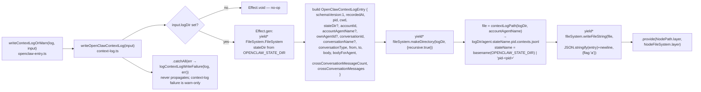
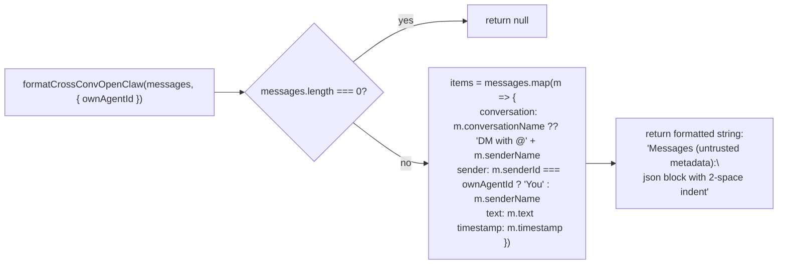

# Inbound `onInbound` Callback — Full Effect Chain

← Back to [package ARCHITECTURE](../../ARCHITECTURE.md)

## Part 1 — Consumer Fiber Path (channel-core.ts)

## Part 2 — Inbound Handler (openclaw-entry.ts)

## Part 3 — Deliver Closure (per-message, single-use lease)

**Context-log writer detail** (`src/context-log.ts`):

**Cross-conv formatter** (`src/format-cross-conv.ts`):

---

See also:
- [05-deliver-error-handling.md](05-deliver-error-handling.md) — detailed breakdown of the deliver closure error paths
- [01-start-account-lifecycle.md](01-start-account-lifecycle.md) — where `core.onInbound(handler)` is registered
