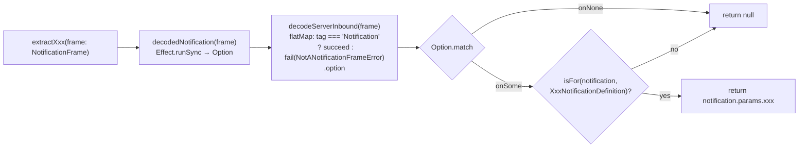
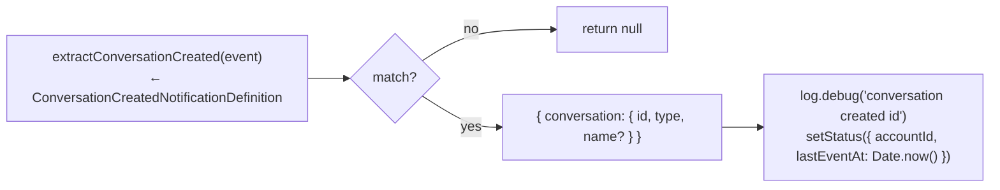
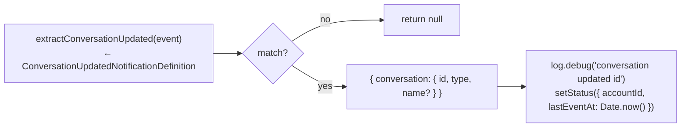
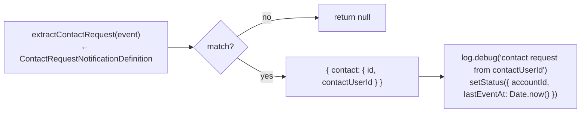
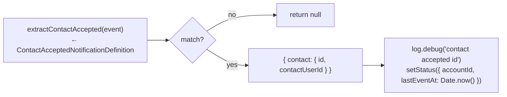
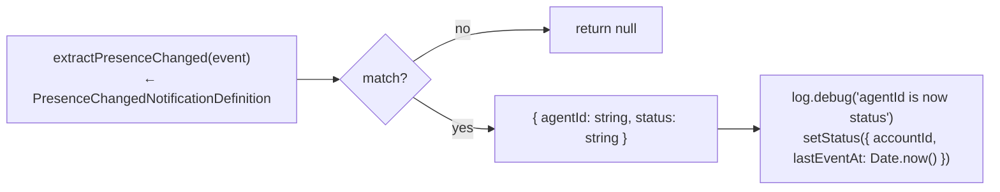

# Notification Extractors (`mapping.ts`)

← Back to [package ARCHITECTURE](../../ARCHITECTURE.md)

The `service.on("rawNotification", …)` handler (registered in `openclaw-entry.ts →
startAccount`) runs a sequential dispatch chain. Each arm calls a pure extractor from
`src/mapping.ts` (now deleted; logic lives in the compiled dist —
the source was deleted in commit dabad82 but the extractor shapes are
preserved below from the last source revision).

Each extractor follows the same pattern:

**arm 1 — conversationCreated**

**arm 2 — conversationUpdated**

**arm 3 — contactRequest**

**arm 4 — contactAccepted**

**arm 5 — presenceChanged**

All five arms are tried in order for every rawNotification frame. The
first matching arm executes, calls `return`, and subsequent arms are
skipped. The rawNotification handler is sync — it does NOT enter the
Effect runtime. setStatus is a direct call into OpenClaw's status API.

---

See also:
- [01-start-account-lifecycle.md](01-start-account-lifecycle.md) — where `service.on("rawNotification", …)` is registered
- [03-inbound-on-inbound.md](03-inbound-on-inbound.md) — the separate inbound message path (messages/received, not notifications)
