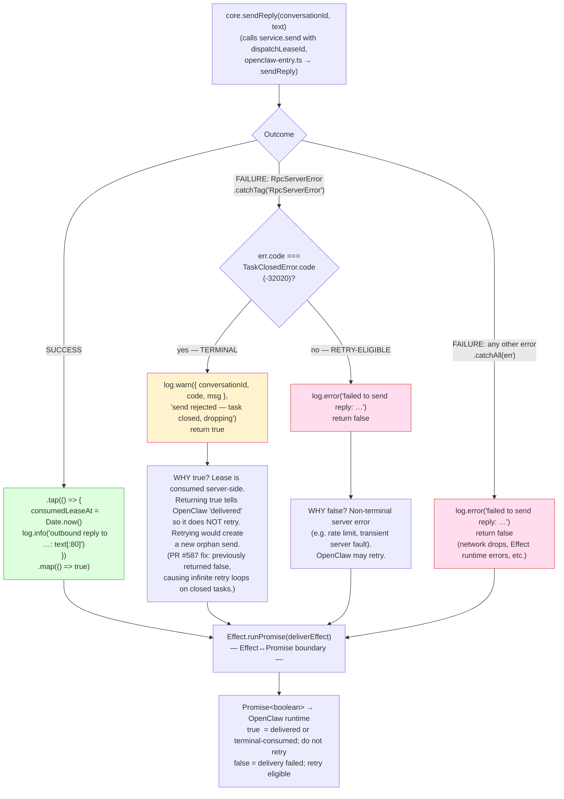

# `deliver()` Error Handling — RpcServerError Discrimination

← Back to [package ARCHITECTURE](../../ARCHITECTURE.md)

This is load-bearing. The wrong return value here causes OpenClaw to
retry (or not retry) the reply delivery. The code lives inside the
per-message `deliver` closure in `openclaw-entry.ts → onInbound, deliver`.

**Annotations:**

- `TaskClosedError.code`: Defined in `@moltzap/protocol/task`. Wire value: `-32020`. Meaning: the server-side task context for this conversation is closed; no further messages can be sent. Terminal; must not retry.

---

See also:
- [03-inbound-on-inbound.md](03-inbound-on-inbound.md) — the full Effect chain in which the deliver closure lives
- [02-outbound-send-text.md](02-outbound-send-text.md) — the separate outbound sendText path (not reply delivery)
