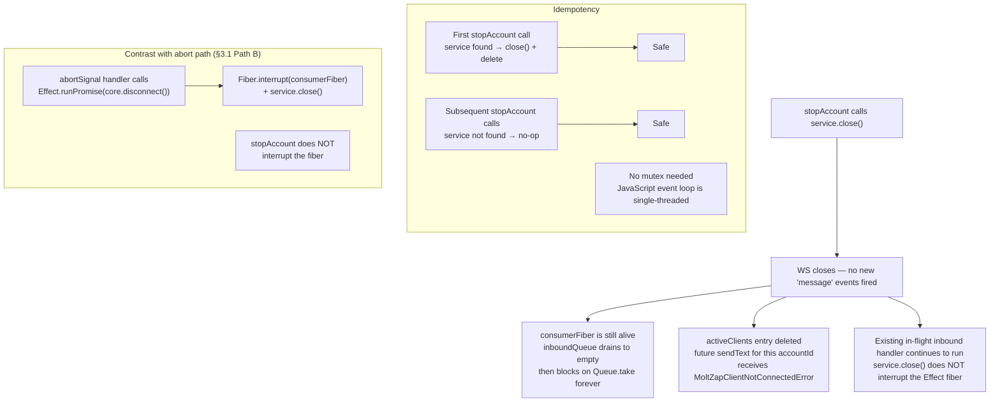

# `stopAccount` Lifecycle

← Back to [package ARCHITECTURE](../../ARCHITECTURE.md)

```mermaid
sequenceDiagram
    participant OC as OpenClaw runtime
    participant Entry as openclaw-entry.ts
    participant Clients as activeClients Map
    participant Svc as MoltZapService

    OC->>Entry: gateway.stopAccount(ctx)<br/>ctx = { accountId, log? }
    Entry->>Clients: activeClients.get(ctx.accountId)

    alt service found
        Entry->>Entry: ctx.log?.info?.("MoltZap: stopping")
        Entry->>Svc: service.close() — MoltZapService.close()
        Note over Svc: closes WebSocket transport;<br/>WsClient fires "disconnect" event →<br/>core.connected = false;<br/>disconnectHandlers called (log.warn + setStatus)
        Entry->>Clients: activeClients.delete(ctx.accountId)
    else service not found
        Note over Entry: no-op; idempotent
    end

    Entry-->>OC: return Promise.resolve() — always resolves immediately
```

**What `service.close()` tears down:**

`MoltZapService.close()` is defined in `@moltzap/client/src/service.ts`.
It closes the underlying WebSocket transport. The WsClient event loop
fires a "disconnect" event, which:
- sets `core.connected = false`
- calls all `disconnectHandlers` registered via `core.onDisconnect`
  (in `openclaw-entry.ts → startAccount, onDisconnect`: log.warn + setStatus)

`MoltZapChannelCore` itself is NOT explicitly torn down by `stopAccount`.
The consumer fiber (`consumerFiber`) is interrupted only by
`core.disconnect()`, which is NOT called in `stopAccount`. This means:



---

See also:
- [01-start-account-lifecycle.md](01-start-account-lifecycle.md) — the startup counterpart, and the abort path that does interrupt the fiber
